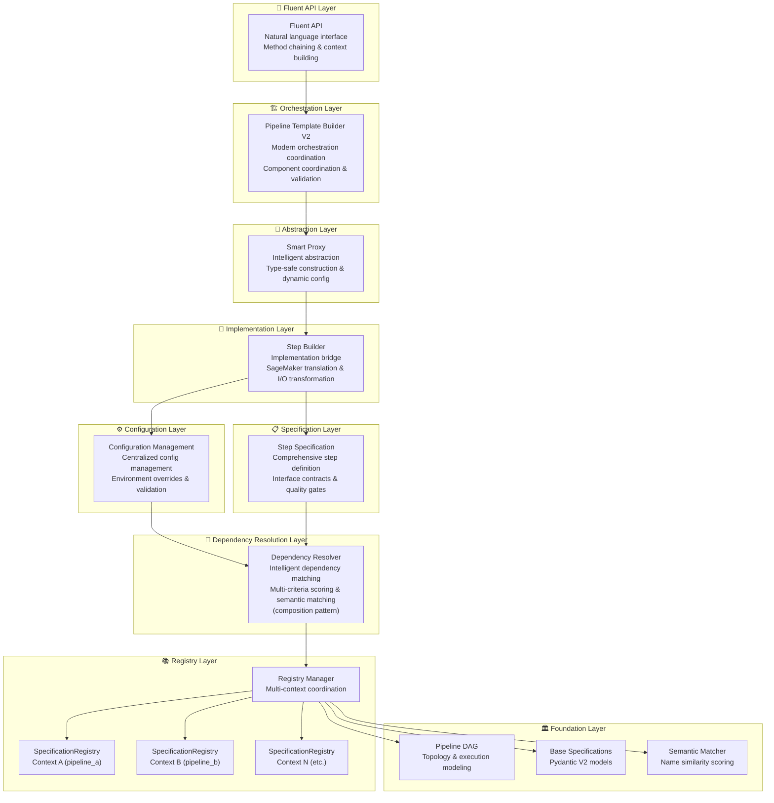
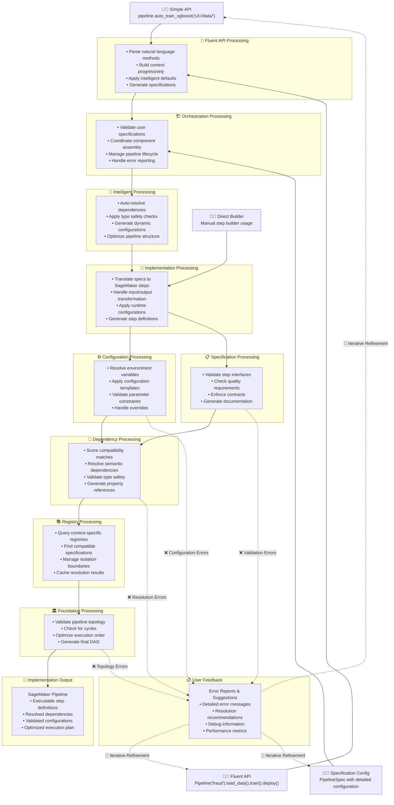

# Pipeline Design Documentation

This directory contains comprehensive documentation for the ML pipeline architecture design components that emerged from our extensive dialogue on pipeline system evolution.

## Overview

The pipeline design represents a sophisticated, multi-layered architecture that transforms complex ML pipeline construction from imperative, error-prone manual processes into declarative, intelligent, and maintainable systems. The architecture combines specification-driven dependency resolution with robust configuration management and adaptive user interfaces to serve users from beginners to experts.

## Major Design Documents Summary

### 🏗️ Core Architecture Approaches

#### **[Hybrid Design](hybrid_design.md)** - The Implemented Architecture
- **Purpose**: Combines specification-driven dependency resolution with config-driven step implementation
- **Key Innovation**: Clean separation between "what steps connect" (specifications) and "how steps work" (configurations)
- **Benefits**: Zero breaking changes, progressive enhancement, universal dependency resolution
- **Strategic Value**: Best of both worlds - declarative simplicity with production robustness

#### **[Specification-Driven Design](specification_driven_design.md)** - Declarative Foundation
- **Purpose**: Pure declarative approach where users express intent and system resolves dependencies automatically
- **Key Features**: Step specifications, script contracts, semantic dependency matching, runtime validation
- **Benefits**: Rapid prototyping, automatic pipeline assembly, early error detection
- **Strategic Value**: Enables intelligent automation and reduces cognitive load

#### **[Config-Driven Design](config_driven_design.md)** - Production Implementation Base
- **Purpose**: Detailed configuration control with explicit step definitions and manual dependency management
- **Key Features**: Pydantic validation, comprehensive parameter control, production-ready infrastructure
- **Benefits**: Full control, battle-tested reliability, extensive customization
- **Strategic Value**: Proven foundation that hybrid approach builds upon

### 🧠 Adaptive Configuration Management

#### **[Adaptive Configuration Management System](adaptive_configuration_management_system_revised.md)** - Unified Intelligence Architecture
- **Purpose**: Four-layer system that minimizes user input while maximizing automation and flexibility
- **Key Innovation**: Adaptive complexity management that adjusts to user expertise and context
- **Architecture**: Intent Capture → Intelligence → Storage & Representation → Execution layers
- **Benefits**: 80%+ reduction in user inputs, intelligent defaults, progressive disclosure
- **Strategic Value**: Transforms configuration from burden to enabler

#### **[Config Field Categorization Refactored](config_field_categorization_refactored.md)** - Sophisticated Field Management
- **Purpose**: Streamlined architecture for managing configuration fields across multiple configurations
- **Key Features**: Three-tier field classification, type-safe serialization, circular reference handling
- **Benefits**: Single source of truth, declarative categorization rules, enhanced maintainability
- **Strategic Value**: Robust foundation for configuration management with clear separation of concerns

### 🎯 Essential User Input Architecture (Alternative Design)

This alternative design approach focuses on minimizing user input by providing only essential configuration fields while automating everything else through intelligent components:

#### **[Essential Inputs Notebook Design](essential_inputs_notebook_design_revised.md)** - User-Centric Configuration
- **Purpose**: Streamlined approach focusing only on essential user inputs while automating everything else
- **Key Innovation**: Three-tier architecture (Essential User Inputs → System Inputs → Derived Inputs)
- **Benefits**: 70%+ reduction in required inputs, feature group management, smart defaults
- **Strategic Value**: Dramatically improves user experience while maintaining full functionality

#### **[Essential Inputs Field Dependency Analysis](essential_inputs_field_dependency_analysis.md)** - Detailed Field Analysis
- **Purpose**: Comprehensive analysis of XGBoost pipeline configuration fields and their dependencies
- **Key Features**: Three-tier field categorization, dependency mapping, derivation rules
- **Benefits**: Clear understanding of which fields are essential vs. derivable, foundation for automation
- **Strategic Value**: Enables informed decisions about configuration simplification and automation

#### **[Feature Group Registry](feature_group_registry_revised.md)** - Organized Field Management
- **Purpose**: Registry system for organizing configuration fields into logical business groups
- **Key Features**: Business-meaningful field groupings, region-specific field naming, categorical field identification
- **Benefits**: Simplified field selection, better user experience, maintainable field organization
- **Strategic Value**: Enables feature group-based configuration instead of individual field selection

#### **[Field Derivation Engine](field_derivation_engine_revised.md)** - Automated Field Generation
- **Purpose**: Engine for automatically deriving configuration fields from essential inputs
- **Key Features**: Rule-based field derivation, dependency resolution, validation integration
- **Benefits**: Reduces user input requirements, ensures consistency, eliminates manual errors
- **Strategic Value**: Core component enabling automated configuration generation

#### **[Default Values Provider Design](default_values_provider_revised.md)** - Intelligent Defaults
- **Purpose**: System for providing intelligent default values based on context and best practices
- **Key Features**: Context-aware defaults, machine learning integration, best practice application
- **Benefits**: Reduces user burden while maintaining quality
- **Strategic Value**: Core component of essential user input architecture

### 🔗 Dependency Resolution & Registry Systems

#### **[Dependency Resolver](dependency_resolver.md)** - Intelligent Connection Engine
- **Purpose**: Automatically connect pipeline steps through semantic compatibility analysis
- **Key Features**: Multi-criteria scoring, type safety validation, context-scoped resolution, caching
- **Benefits**: Eliminates manual dependency wiring, ensures compatibility, provides clear error messages
- **Strategic Value**: Core intelligence that enables automatic pipeline assembly

#### **[Registry Manager](registry_manager.md)** - Multi-Registry Coordination
- **Purpose**: Centralized orchestration of multiple specification registries with lifecycle management
- **Key Features**: Multi-context management, simplified API, backward compatibility, global coordination
- **Benefits**: Sophisticated multi-registry architectures while maintaining simplicity
- **Strategic Value**: Enables scalable registry systems with proper isolation

#### **[Specification Registry](specification_registry.md)** - Context-Aware Storage
- **Purpose**: Isolated, testable specification management with built-in compatibility analysis
- **Key Features**: Context isolation, specification validation, compatibility checking, testable architecture
- **Benefits**: Atomized, maintainable dependency management with perfect test isolation
- **Strategic Value**: Foundation for reliable specification-based systems

### 🏛️ Foundation Components

#### **[Pipeline DAG](pipeline_dag.md)** - Structural Foundation
- **Purpose**: Mathematical framework for pipeline topology and execution
- **Key Features**: Cycle detection, execution optimization, dependency modeling, topological sorting
- **Benefits**: Computational backbone for all higher-level abstractions
- **Strategic Value**: Provides reliable foundation for complex pipeline orchestration

#### **[Step Specification](step_specification.md)** - Comprehensive Step Definition
- **Purpose**: Define complete step interface including structure, behavior, and quality requirements
- **Key Features**: Node type classification, semantic dependency matching, automatic validation, quality gates
- **Benefits**: Single source of truth for step definitions enabling intelligent automation
- **Strategic Value**: Enables specification-driven architecture with quality assurance

#### **[Step Builder](step_builder.md)** - Implementation Bridge
- **Purpose**: Translate specifications and configurations into executable SageMaker steps
- **Key Features**: Input/output transformation, configuration integration, SageMaker abstraction
- **Benefits**: Separates implementation details from logical structure
- **Strategic Value**: Clean abstraction layer that enables multiple interface approaches

#### **[Script Contract](script_contract.md)** - Implementation Contracts
- **Purpose**: Define and enforce contracts between step specifications and their script implementations
- **Key Features**: Entry point validation, input/output path contracts, environment variable requirements
- **Benefits**: Ensures implementation aligns with specification promises
- **Strategic Value**: Bridge between declarative specifications and imperative implementations

#### **[Environment Variable Contract Enforcement](environment_variable_contract_enforcement.md)** - Runtime Contract Validation
- **Purpose**: System for enforcing environment variable contracts at runtime (extends Script Contract design)
- **Key Features**: Contract validation, environment setup verification, error reporting
- **Benefits**: Ensures proper environment configuration, prevents runtime failures
- **Strategic Value**: Robust foundation for reliable pipeline execution with script contract integration

### 🎯 User Interface & Experience

#### **[Fluent API](fluent_api.md)** - Natural Language Interface
- **Purpose**: Transform pipeline construction into intuitive, readable experience
- **Key Features**: Method chaining, context-aware configuration, progressive complexity disclosure
- **Benefits**: Dramatically improves developer experience and reduces learning curve
- **Strategic Value**: Makes complex pipeline construction accessible to broader audience

#### **[Smart Proxy](smart_proxy.md)** - Intelligent Abstraction
- **Purpose**: Bridge between specifications and pipeline construction reality
- **Key Features**: Intelligent dependency resolution, type-safe construction, dynamic configuration
- **Benefits**: Eliminates entire classes of errors while enabling rapid prototyping
- **Strategic Value**: Provides intelligent automation without sacrificing control

#### **[DAG to Template](pipeline_compiler.md)** - Visual & Programmatic Pipeline Creation
- **Purpose**: Convert DAG representations into executable pipeline templates
- **Key Features**: Visual DAG editing, programmatic API, template auto-generation, configuration inference
- **Benefits**: Intuitive graphical interface and developer API for pipeline creation
- **Strategic Value**: Makes pipeline creation accessible to both non-programmers and developers

### 🏗️ Pipeline Assembly & Orchestration

#### **[Dynamic Template](dynamic_template.md)** - Flexible, Configuration-Driven Template
- **Purpose**: Enable flexible pipeline creation without requiring custom template classes
- **Key Features**: Automatic config resolution, step builder mapping, comprehensive validation
- **Benefits**: Code reuse, simplified maintenance, dynamic configuration support
- **Strategic Value**: Universal adapter between specifications and execution environment

#### **[Dynamic Template Resolution](dynamic_template_resolution.md)** - Intelligent Node-to-Config-to-Builder Mapping
- **Purpose**: Automatically match DAG nodes to configurations and step builders
- **Key Features**: Multi-strategy resolution, semantic matching, central registry integration
- **Benefits**: Elimination of custom template classes, intelligent name resolution
- **Strategic Value**: Core mechanism that enables the dynamic template to adapt to any DAG structure

#### **[Pipeline Template Builder V2](pipeline_template_builder_v2.md)** - Modern Orchestration
- **Purpose**: Transform declarative specifications into executable SageMaker pipelines
- **Key Features**: Component coordination, dependency resolution, specification validation
- **Benefits**: 90% code reduction while maintaining quality assurance and extensibility
- **Strategic Value**: Lightweight, maintainable orchestration for specification-driven pipelines

#### **[Pipeline Template Builder V1](pipeline_template_builder_v1.md)** - Current Production System
- **Purpose**: Build SageMaker pipelines through imperative step instantiation and manual dependency resolution
- **Key Features**: DAG-based ordering, manual property resolution, pattern matching, comprehensive error handling
- **Benefits**: Production-ready, battle-tested, comprehensive error handling
- **Strategic Value**: Proven foundation that V2 builds upon with lessons learned

#### **[Pipeline Assembler](pipeline_assembler.md)** - Component Coordination
- **Purpose**: Coordinate the assembly of pipeline components into executable SageMaker pipelines
- **Key Features**: Step coordination, dependency validation, resource management
- **Benefits**: Centralized assembly logic with proper error handling
- **Strategic Value**: Clean separation between pipeline structure and assembly mechanics

### ⚙️ Configuration Management Components

#### **[Config Merger](config_merger.md)** - Configuration Integration
- **Purpose**: Handle merging of multiple configuration objects into unified structures
- **Key Features**: Shared/specific field categorization, type-safe serialization, conflict resolution
- **Benefits**: Robust configuration combination with proper validation
- **Strategic Value**: Enables complex configuration scenarios with maintainable logic

#### **[Config Registry](config_registry.md)** - Configuration Discovery
- **Purpose**: Centralized registration system for configuration classes
- **Key Features**: Single source of truth for config classes, easy discovery, consistent usage
- **Benefits**: Eliminates redundant class lookups and references
- **Strategic Value**: Foundation for configuration management systems

#### **[Config Field Categorization](config_field_categorization.md)** - Streamlined Field Classification System
- **Purpose**: Simplified approach to configuration field categorization with flattened architecture
- **Key Features**: Two-tier structure (shared/specific), explicit 5-rule categorization, type-aware serialization
- **Benefits**: Reduced complexity, improved maintainability, easier mental model, better performance
- **Strategic Value**: Current implementation foundation for configuration management systems

#### **[Config Tiered Design](config_tiered_design.md)** - Hierarchical Configuration Architecture
- **Purpose**: Multi-tier configuration system with clear separation of concerns
- **Key Features**: Hierarchical structure, tier-based validation, configuration inheritance
- **Benefits**: Scalable configuration management, clear separation of concerns, flexible overrides
- **Strategic Value**: Robust architecture for complex configuration scenarios

#### **[Type-Aware Serializer](type_aware_serializer.md)** - Robust Serialization
- **Purpose**: Serialize and deserialize complex types with complete type information preservation
- **Key Features**: Type metadata preservation, complex object handling, validation integration
- **Benefits**: Configurations can be correctly reconstructed during loading
- **Strategic Value**: Foundation for reliable configuration persistence

#### **[Circular Reference Tracker](circular_reference_tracker.md)** - Advanced Cycle Detection
- **Purpose**: Sophisticated tracking and resolution of circular references in configurations
- **Key Features**: Advanced cycle detection, resolution strategies, diagnostic reporting
- **Benefits**: Robust handling of complex configuration scenarios with circular dependencies
- **Strategic Value**: Enables safe handling of complex configuration relationships

#### **[Circular Reference Necessity Analysis](circular_reference_necessity_analysis.md)** - Architectural Decision Analysis
- **Purpose**: Analysis of whether circular reference detection is needed in the 3-tiered configuration design
- **Key Features**: Comprehensive analysis of circular reference scenarios, performance impact assessment, implementation recommendations
- **Benefits**: Informed architectural decisions about safety mechanisms and system robustness
- **Strategic Value**: Ensures optimal balance between performance and system reliability

### 📋 Governance & Quality

#### **[Design Principles](design_principles.md)** - Architectural Philosophy
- **Purpose**: Guide system development and evolution decisions
- **Key Features**: Declarative over imperative, composition over inheritance, fail fast, single source of truth
- **Benefits**: Ensures architectural consistency and quality over time
- **Strategic Value**: Foundation for maintainable, scalable system evolution

#### **[Standardization Rules](standardization_rules.md)** - Quality Enforcement
- **Purpose**: Enforce universal patterns and consistency across all components
- **Key Features**: Automated validation, quality gates, evolution governance, compliance checking
- **Benefits**: Maintains system-wide coherence while enabling controlled growth
- **Strategic Value**: Ensures quality and consistency as system scales

### 🔄 System Evolution & Analysis

#### **[Design Evolution](design_evolution.md)** - Historical Context
- **Purpose**: Document the evolution of pipeline design approaches and lessons learned
- **Key Features**: Historical analysis, decision rationale, evolution patterns
- **Benefits**: Understanding of why current architecture exists and future directions
- **Strategic Value**: Provides context for architectural decisions and future planning

### 🔬 Advanced Configuration & Analysis

#### **[Dependency Resolution Explained](dependency_resolution_explained.md)** - Deep Dive Analysis
- **Purpose**: Comprehensive explanation of dependency resolution mechanisms and algorithms
- **Key Features**: Algorithm analysis, resolution strategies, performance considerations
- **Benefits**: Deep understanding of dependency resolution for advanced users
- **Strategic Value**: Enables optimization and troubleshooting of complex dependency scenarios

#### **[Enhanced Property Reference](enhanced_property_reference.md)** - Advanced Property Management
- **Purpose**: Enhanced system for managing property references across pipeline components
- **Key Features**: Advanced property resolution, cross-component references, validation
- **Benefits**: Robust property management for complex pipeline scenarios
- **Strategic Value**: Foundation for sophisticated pipeline property handling

### 🏗️ Implementation & Integration

#### **[Adaptive Fluent Proxy Integration](adaptive_fluent_proxy_integration.md)** - Advanced Integration
- **Purpose**: Integration patterns for adaptive fluent proxy systems
- **Key Features**: Integration strategies, adaptation patterns, proxy coordination
- **Benefits**: Seamless integration of fluent APIs with adaptive systems
- **Strategic Value**: Enables sophisticated user interface adaptations

#### **[Pipeline Registry](pipeline_registry.md)** - Pipeline Management
- **Purpose**: Centralized registry system for managing pipeline definitions and metadata
- **Key Features**: Pipeline discovery, versioning, metadata management, lifecycle tracking
- **Benefits**: Centralized pipeline management, version control, discovery mechanisms
- **Strategic Value**: Foundation for enterprise pipeline governance and management

#### **[Pipeline Template Base](pipeline_template_base.md)** - Template Foundation
- **Purpose**: Base template system for pipeline construction and standardization
- **Key Features**: Template inheritance, standardization patterns, reusable components
- **Benefits**: Consistent pipeline structure, reusable templates, standardized patterns
- **Strategic Value**: Foundation for scalable pipeline template systems


## Architecture Components

### Core Foundation Components

1. **[Step Specification](step_specification.md)** - Comprehensive step definition layer
   - **Purpose**: Define complete step interface including structure, behavior, and quality requirements
   - **Key Features**: Node type classification, semantic dependency matching, automatic validation, quality gates, runtime enforcement
   - **Strategic Value**: Single source of truth for step definitions enabling intelligent automation and quality assurance

2. **[Step Builder](step_builder.md)** - Implementation bridge layer
   - **Purpose**: Translate specifications into executable SageMaker steps
   - **Key Features**: Input/output transformation, configuration integration, SageMaker abstraction
   - **Strategic Value**: Separates implementation details from logical structure

3. **[Config](config.md)** - Configuration management layer
   - **Purpose**: Centralized, validated configuration with hierarchical structure
   - **Key Features**: Environment-specific overrides, templating, validation rules
   - **Strategic Value**: Reduces configuration complexity while maintaining flexibility

### Advanced Abstraction Components

4. **[Smart Proxy](smart_proxy.md)** - Intelligent abstraction layer
   - **Purpose**: Bridge between specifications and pipeline construction reality
   - **Key Features**: Intelligent dependency resolution, type-safe construction, dynamic configuration
   - **Strategic Value**: Eliminates entire classes of errors while enabling rapid prototyping

5. **[Fluent API](fluent_api.md)** - Natural language interface layer
   - **Purpose**: Transform pipeline construction into intuitive, readable experience
   - **Key Features**: Method chaining, context-aware configuration, progressive complexity disclosure
   - **Strategic Value**: Dramatically improves developer experience and reduces learning curve

### Orchestration Components

6. **[Pipeline Template Builder V1](pipeline_template_builder_v1.md)** - Current monolithic orchestration layer
   - **Purpose**: Build SageMaker pipelines through imperative step instantiation and manual dependency resolution
   - **Key Features**: DAG-based ordering, manual property resolution, pattern matching, comprehensive error handling
   - **Strategic Value**: Production-ready but complex (600+ lines) with maintenance overhead

7. **[Pipeline Template Builder V2](pipeline_template_builder_v2.md)** - Modern lightweight orchestration layer
   - **Purpose**: Transform declarative specifications into executable SageMaker pipelines
   - **Key Features**: Component coordination, dependency resolution, specification validation
   - **Strategic Value**: 90% code reduction while maintaining quality assurance and extensibility

### Infrastructure Components

8. **[Pipeline DAG](pipeline_dag.md)** - Structural foundation layer
    - **Purpose**: Mathematical framework for pipeline topology and execution
    - **Key Features**: Cycle detection, execution optimization, dependency modeling
    - **Strategic Value**: Provides computational backbone for all higher-level abstractions

9. **[Specification Registry](specification_registry.md)** - Context-aware specification storage layer
    - **Purpose**: Isolated, testable specification management with built-in compatibility analysis
    - **Key Features**: Context isolation, specification validation, compatibility checking, testable architecture
    - **Strategic Value**: Enables atomized, maintainable dependency management with perfect test isolation

10. **[Registry Manager](registry_manager.md)** - Multi-registry coordination layer
    - **Purpose**: Centralized orchestration of multiple specification registries with lifecycle management
    - **Key Features**: Multi-context management, simplified API, backward compatibility, global coordination
    - **Strategic Value**: Enables sophisticated multi-registry architectures while maintaining simplicity

11. **[Dependency Resolver](dependency_resolver.md)** - Intelligent matching engine layer
    - **Purpose**: Automatically connect pipeline steps through semantic compatibility analysis using composition pattern
    - **Key Features**: Multi-criteria scoring, type safety validation, context-scoped resolution, performance optimization, caching
    - **Strategic Value**: Eliminates manual dependency wiring while ensuring type safety and semantic correctness through intelligent automation

### Governance Components

12. **[Design Principles](design_principles.md)** - Architectural philosophy layer
    - **Purpose**: Guide system development and evolution decisions
    - **Key Features**: Declarative over imperative, composition over inheritance, fail fast
    - **Strategic Value**: Ensures architectural consistency and quality over time

13. **[Standardization Rules](standardization_rules.md)** - Enhanced constraint enforcement layer
    - **Purpose**: Enforce universal patterns and consistency across all components
    - **Key Features**: Automated validation, quality gates, evolution governance
    - **Strategic Value**: Maintains system-wide coherence while enabling controlled growth

## Architectural Evolution

The design represents an evolution through several key phases:

### Phase 1: Manual Pipeline Construction
- Imperative step creation
- Manual property path wiring
- Error-prone configuration
- Limited reusability

### Phase 2: Specification-Driven Foundation
- Declarative step specifications
- Automatic validation
- Semantic dependency matching
- Registry-based discovery

### Phase 3: Intelligent Abstraction
- Smart proxies with auto-resolution
- Fluent APIs for natural construction
- Type-safe interfaces
- Progressive complexity disclosure

### Phase 4: Enterprise Governance
- Formal contracts with quality gates
- Comprehensive standardization rules
- Automated compliance checking
- Evolution governance

## Key Design Insights

### 1. Declarative Over Imperative
The architecture favors declarative specifications that describe "what" rather than imperative code that describes "how". This enables:
- Intelligent automation and tooling
- Early validation and error detection
- Multiple implementation strategies
- Better maintainability

### 2. Layered Abstraction
Components are organized in clear layers with defined responsibilities:



### 3. User Input to Implementation Flow
The architecture supports a natural flow from user intent to executable SageMaker pipelines:



### 4. Specification-Driven Intelligence
All intelligent behavior stems from rich, declarative specifications:
- Automatic dependency resolution
- Compatibility checking
- Validation and error prevention
- Documentation generation

### 5. Progressive Disclosure
The system supports multiple levels of abstraction:
- **Simple**: One-liner pipeline creation for prototyping
- **Configured**: Basic configuration for common use cases
- **Advanced**: Full control with custom configurations
- **Expert**: Complete customization for specialized needs

## Strategic Benefits

### For Developers
- **Reduced Cognitive Load**: Focus on business logic, not SageMaker complexity
- **Error Prevention**: Catch errors at design time, not runtime
- **Rapid Prototyping**: Quick construction of complex pipelines
- **IntelliSense Support**: Full IDE support with type safety

### For Teams
- **Consistency**: Standardized patterns across all pipelines
- **Collaboration**: Clear contracts enable parallel development
- **Knowledge Sharing**: Self-documenting interfaces
- **Quality Assurance**: Built-in validation and testing standards

### For Organizations
- **Maintainability**: Clean architecture that scales with complexity
- **Governance**: Enforceable standards and quality gates
- **Evolution**: Controlled growth without architectural debt
- **Productivity**: Dramatic reduction in pipeline development time

## Implementation Roadmap

### Phase 1: Foundation (Weeks 1-4)
1. Implement core specification system
2. Create basic step builders
3. Establish configuration hierarchy
4. Build registry and validation framework

### Phase 2: Intelligence (Weeks 5-8)
1. Develop smart proxy system
2. Implement dependency resolution
3. Create fluent API foundation
4. Add type safety and validation

### Phase 3: Contracts (Weeks 9-12)
1. Implement step contract system
2. Add quality gates and validation
3. Create automatic documentation
4. Establish testing standards

### Phase 4: Governance (Weeks 13-16)
1. Implement standardization rules
2. Create automated compliance checking
3. Establish CI/CD integration
4. Add evolution governance

## Usage Examples

### Simple Pipeline Creation
```python
# One-liner for quick prototyping
pipeline = Pipeline("fraud-detection").auto_train_xgboost("s3://data/")
```

### Fluent Pipeline Construction
```python
# Natural language-like construction
pipeline = (Pipeline("fraud-detection")
    .load_data("s3://fraud-data/")
    .preprocess_with_defaults()
    .train_xgboost(max_depth=6, eta=0.3)
    .evaluate_performance()
    .deploy_if_threshold_met(min_auc=0.85))
```

### Specification-Driven Configuration
```python
# Define complete pipeline specification
fraud_pipeline_spec = PipelineSpec(
    name="fraud_detection_production_v2",
    description="Production fraud detection pipeline with quality gates",
    version="2.0",
    
    # Step configuration using existing config classes
    step_configs={
        "data_loading": CradleDataLoadingStepConfig(
            s3_bucket="fraud-data-prod",
            data_source="transactions",
            validation_enabled=True
        ),
        "feature_engineering": TabularPreprocessingStepConfig(
            job_type="training",
            instance_type="ml.m5.2xlarge",
            feature_selection_enabled=True
        ),
        "model_training": XGBoostTrainingStepConfig(
            instance_type="ml.m5.4xlarge",
            max_depth=8,
            n_estimators=200,
            early_stopping_rounds=10
        )
    },
    
    # Type safety through step specifications
    step_specifications={
        "data_loading": CRADLE_DATA_LOADING_SPEC,
        "feature_engineering": TABULAR_PREPROCESSING_SPEC,
        "model_training": XGBOOST_TRAINING_SPEC
    },
    
    # Quality requirements embedded in specifications
    quality_requirements={
        "data_loading": {
            "min_data_quality_score": 0.95,
            "required_columns": ["transaction_id", "amount", "merchant_id"]
        },
        "model_training": {
            "min_auc": 0.88,
            "max_false_positive_rate": 0.05,
            "max_training_time": "4 hours"
        }
    }
)

# Build pipeline using modern template builder
builder = ModernPipelineTemplateBuilder(fraud_pipeline_spec)
pipeline = builder.build_pipeline()

# Get build report for monitoring
build_report = builder.get_build_report()
print(f"Built pipeline with {build_report['steps_count']} steps")
```

## Future Directions

### Near Term (Next 6 months)
- Complete core implementation
- Add support for PyTorch and TensorFlow
- Implement advanced optimization algorithms
- Create comprehensive test suite

### Medium Term (6-12 months)
- Add multi-cloud support (Azure, GCP)
- Implement pipeline versioning and rollback
- Create visual pipeline designer
- Add real-time monitoring and alerting

### Long Term (1-2 years)
- AI-powered pipeline optimization
- Automatic hyperparameter tuning
- Cross-pipeline dependency management
- Enterprise governance dashboard

## Contributing

When contributing to this architecture:

1. **Follow Design Principles**: Adhere to the established design principles
2. **Maintain Specifications**: Update specifications for any new components
3. **Add Comprehensive Tests**: Follow standardization rules for testing
4. **Document Thoroughly**: Use standard documentation templates
5. **Validate Compliance**: Ensure all components pass standardization checks

## Related Documentation

- [Pipeline Examples](../pipeline_examples/) - Concrete implementation examples
- [Pipeline Builder](../pipeline_builder/) - Core builder implementation
- [Pipeline Steps](../pipeline_steps/) - Individual step documentation

---

This design documentation represents the culmination of extensive architectural thinking about how to transform ML pipeline development from a complex, error-prone manual process into an intelligent, maintainable, and scalable system that enables teams to focus on business value rather than infrastructure complexity.
