# Pipeline Design Documentation

This directory contains comprehensive documentation for the ML pipeline architecture design components that emerged from our extensive dialogue on pipeline system evolution.

## Overview

The pipeline design represents a sophisticated, specification-driven architecture that transforms complex ML pipeline construction from imperative, error-prone manual processes into declarative, intelligent, and maintainable systems.

## Architecture Components

### Core Foundation Components

1. **[Step Specification](step_specification.md)** - Comprehensive step definition layer
   - **Purpose**: Define complete step interface including structure, behavior, and quality requirements
   - **Key Features**: Node type classification, semantic dependency matching, automatic validation, quality gates, runtime enforcement
   - **Strategic Value**: Single source of truth for step definitions enabling intelligent automation and quality assurance

2. **[Step Builder](step_builder.md)** - Implementation bridge layer
   - **Purpose**: Translate specifications into executable SageMaker steps
   - **Key Features**: Input/output transformation, configuration integration, SageMaker abstraction
   - **Strategic Value**: Separates implementation details from logical structure

3. **[Config](config.md)** - Configuration management layer
   - **Purpose**: Centralized, validated configuration with hierarchical structure
   - **Key Features**: Environment-specific overrides, templating, validation rules
   - **Strategic Value**: Reduces configuration complexity while maintaining flexibility

### Advanced Abstraction Components

4. **[Smart Proxy](smart_proxy.md)** - Intelligent abstraction layer
   - **Purpose**: Bridge between specifications and pipeline construction reality
   - **Key Features**: Intelligent dependency resolution, type-safe construction, dynamic configuration
   - **Strategic Value**: Eliminates entire classes of errors while enabling rapid prototyping

5. **[Fluent API](fluent_api.md)** - Natural language interface layer
   - **Purpose**: Transform pipeline construction into intuitive, readable experience
   - **Key Features**: Method chaining, context-aware configuration, progressive complexity disclosure
   - **Strategic Value**: Dramatically improves developer experience and reduces learning curve

### Orchestration Components

6. **[Pipeline Template Builder V1](pipeline_template_builder_v1.md)** - Current monolithic orchestration layer
   - **Purpose**: Build SageMaker pipelines through imperative step instantiation and manual dependency resolution
   - **Key Features**: DAG-based ordering, manual property resolution, pattern matching, comprehensive error handling
   - **Strategic Value**: Production-ready but complex (600+ lines) with maintenance overhead

7. **[Pipeline Template Builder V2](pipeline_template_builder_v2.md)** - Modern lightweight orchestration layer
   - **Purpose**: Transform declarative specifications into executable SageMaker pipelines
   - **Key Features**: Component coordination, dependency resolution, specification validation
   - **Strategic Value**: 90% code reduction while maintaining quality assurance and extensibility

### Infrastructure Components

8. **[Pipeline DAG](pipeline_dag.md)** - Structural foundation layer
    - **Purpose**: Mathematical framework for pipeline topology and execution
    - **Key Features**: Cycle detection, execution optimization, dependency modeling
    - **Strategic Value**: Provides computational backbone for all higher-level abstractions

9. **[Specification Registry](specification_registry.md)** - Context-aware specification storage layer
    - **Purpose**: Isolated, testable specification management with built-in compatibility analysis
    - **Key Features**: Context isolation, specification validation, compatibility checking, testable architecture
    - **Strategic Value**: Enables atomized, maintainable dependency management with perfect test isolation

10. **[Registry Manager](registry_manager.md)** - Multi-registry coordination layer
    - **Purpose**: Centralized orchestration of multiple specification registries with lifecycle management
    - **Key Features**: Multi-context management, simplified API, backward compatibility, global coordination
    - **Strategic Value**: Enables sophisticated multi-registry architectures while maintaining simplicity

11. **[Dependency Resolver](dependency_resolver.md)** - Intelligent matching engine layer
    - **Purpose**: Automatically connect pipeline steps through semantic compatibility analysis using composition pattern
    - **Key Features**: Multi-criteria scoring, type safety validation, context-scoped resolution, performance optimization, caching
    - **Strategic Value**: Eliminates manual dependency wiring while ensuring type safety and semantic correctness through intelligent automation

### Governance Components

13. **[Design Principles](design_principles.md)** - Architectural philosophy layer
    - **Purpose**: Guide system development and evolution decisions
    - **Key Features**: Declarative over imperative, composition over inheritance, fail fast
    - **Strategic Value**: Ensures architectural consistency and quality over time

14. **[Standardization Rules](standardization_rules.md)** - Enhanced constraint enforcement layer
    - **Purpose**: Enforce universal patterns and consistency across all components
    - **Key Features**: Automated validation, quality gates, evolution governance
    - **Strategic Value**: Maintains system-wide coherence while enabling controlled growth

## Architectural Evolution

The design represents an evolution through several key phases:

### Phase 1: Manual Pipeline Construction
- Imperative step creation
- Manual property path wiring
- Error-prone configuration
- Limited reusability

### Phase 2: Specification-Driven Foundation
- Declarative step specifications
- Automatic validation
- Semantic dependency matching
- Registry-based discovery

### Phase 3: Intelligent Abstraction
- Smart proxies with auto-resolution
- Fluent APIs for natural construction
- Type-safe interfaces
- Progressive complexity disclosure

### Phase 4: Enterprise Governance
- Formal contracts with quality gates
- Comprehensive standardization rules
- Automated compliance checking
- Evolution governance

## Key Design Insights

### 1. Declarative Over Imperative
The architecture favors declarative specifications that describe "what" rather than imperative code that describes "how". This enables:
- Intelligent automation and tooling
- Early validation and error detection
- Multiple implementation strategies
- Better maintainability

### 2. Layered Abstraction
Components are organized in clear layers with defined responsibilities:

```mermaid
flowchart TD
    subgraph "🎯 Fluent API Layer"
        FluentAPI["Fluent API<br/>Natural language interface<br/>Method chaining & context building"]
    end
    
    subgraph "🏗️ Orchestration Layer"
        PipelineBuilder["Pipeline Template Builder V2<br/>Modern orchestration coordination<br/>Component coordination & validation"]
    end
    
    subgraph "🧠 Abstraction Layer"
        SmartProxy["Smart Proxy<br/>Intelligent abstraction<br/>Type-safe construction & dynamic config"]
    end
    
    subgraph "🔧 Implementation Layer"
        StepBuilder["Step Builder<br/>Implementation bridge<br/>SageMaker translation & I/O transformation"]
    end
    
    subgraph "⚙️ Configuration Layer"
        Config["Configuration Management<br/>Centralized config management<br/>Environment overrides & validation"]
    end
    
    subgraph "📋 Specification Layer"
        StepSpec["Step Specification<br/>Comprehensive step definition<br/>Interface contracts & quality gates"]
    end
    
    subgraph "🔗 Dependency Resolution Layer"
        DependencyResolver["Dependency Resolver<br/>Intelligent dependency matching<br/>Multi-criteria scoring & semantic matching<br/>(composition pattern)"]
    end
    
    subgraph "📚 Registry Layer"
        RegistryManager["Registry Manager<br/>Multi-context coordination"]
        SpecReg1["SpecificationRegistry<br/>Context A (pipeline_a)"]
        SpecReg2["SpecificationRegistry<br/>Context B (pipeline_b)"]
        SpecRegN["SpecificationRegistry<br/>Context N (etc.)"]
        
        RegistryManager --> SpecReg1
        RegistryManager --> SpecReg2
        RegistryManager --> SpecRegN
    end
    
    subgraph "🏛️ Foundation Layer"
        PipelineDAG["Pipeline DAG<br/>Topology & execution modeling"]
        BaseSpecs["Base Specifications<br/>Pydantic V2 models"]
        SemanticMatcher["Semantic Matcher<br/>Name similarity scoring"]
    end
    
    FluentAPI --> PipelineBuilder
    PipelineBuilder --> SmartProxy
    SmartProxy --> StepBuilder
    StepBuilder --> Config
    StepBuilder --> StepSpec
    Config --> DependencyResolver
    StepSpec --> DependencyResolver
    DependencyResolver --> RegistryManager
    RegistryManager --> PipelineDAG
    RegistryManager --> BaseSpecs
    RegistryManager --> SemanticMatcher
```



### 3. User Input to Implementation Flow
The architecture supports a natural flow from user intent to executable SageMaker pipelines:


### 4. Specification-Driven Intelligence
All intelligent behavior stems from rich, declarative specifications:
- Automatic dependency resolution
- Compatibility checking
- Validation and error prevention
- Documentation generation

### 5. Progressive Disclosure
The system supports multiple levels of abstraction:
- **Simple**: One-liner pipeline creation for prototyping
- **Configured**: Basic configuration for common use cases
- **Advanced**: Full control with custom configurations
- **Expert**: Complete customization for specialized needs

## Strategic Benefits

### For Developers
- **Reduced Cognitive Load**: Focus on business logic, not SageMaker complexity
- **Error Prevention**: Catch errors at design time, not runtime
- **Rapid Prototyping**: Quick construction of complex pipelines
- **IntelliSense Support**: Full IDE support with type safety

### For Teams
- **Consistency**: Standardized patterns across all pipelines
- **Collaboration**: Clear contracts enable parallel development
- **Knowledge Sharing**: Self-documenting interfaces
- **Quality Assurance**: Built-in validation and testing standards

### For Organizations
- **Maintainability**: Clean architecture that scales with complexity
- **Governance**: Enforceable standards and quality gates
- **Evolution**: Controlled growth without architectural debt
- **Productivity**: Dramatic reduction in pipeline development time

## Implementation Roadmap

### Phase 1: Foundation (Weeks 1-4)
1. Implement core specification system
2. Create basic step builders
3. Establish configuration hierarchy
4. Build registry and validation framework

### Phase 2: Intelligence (Weeks 5-8)
1. Develop smart proxy system
2. Implement dependency resolution
3. Create fluent API foundation
4. Add type safety and validation

### Phase 3: Contracts (Weeks 9-12)
1. Implement step contract system
2. Add quality gates and validation
3. Create automatic documentation
4. Establish testing standards

### Phase 4: Governance (Weeks 13-16)
1. Implement standardization rules
2. Create automated compliance checking
3. Establish CI/CD integration
4. Add evolution governance

## Usage Examples

### Simple Pipeline Creation
```python
# One-liner for quick prototyping
pipeline = Pipeline("fraud-detection").auto_train_xgboost("s3://data/")
```

### Fluent Pipeline Construction
```python
# Natural language-like construction
pipeline = (Pipeline("fraud-detection")
    .load_data("s3://fraud-data/")
    .preprocess_with_defaults()
    .train_xgboost(max_depth=6, eta=0.3)
    .evaluate_performance()
    .deploy_if_threshold_met(min_auc=0.85))
```

### Specification-Driven Configuration
```python
# Define complete pipeline specification
fraud_pipeline_spec = PipelineSpec(
    name="fraud_detection_production_v2",
    description="Production fraud detection pipeline with quality gates",
    version="2.0",
    
    # Step configuration using existing config classes
    step_configs={
        "data_loading": CradleDataLoadingStepConfig(
            s3_bucket="fraud-data-prod",
            data_source="transactions",
            validation_enabled=True
        ),
        "feature_engineering": TabularPreprocessingStepConfig(
            job_type="training",
            instance_type="ml.m5.2xlarge",
            feature_selection_enabled=True
        ),
        "model_training": XGBoostTrainingStepConfig(
            instance_type="ml.m5.4xlarge",
            max_depth=8,
            n_estimators=200,
            early_stopping_rounds=10
        )
    },
    
    # Type safety through step specifications
    step_specifications={
        "data_loading": CRADLE_DATA_LOADING_SPEC,
        "feature_engineering": TABULAR_PREPROCESSING_SPEC,
        "model_training": XGBOOST_TRAINING_SPEC
    },
    
    # Quality requirements embedded in specifications
    quality_requirements={
        "data_loading": {
            "min_data_quality_score": 0.95,
            "required_columns": ["transaction_id", "amount", "merchant_id"]
        },
        "model_training": {
            "min_auc": 0.88,
            "max_false_positive_rate": 0.05,
            "max_training_time": "4 hours"
        }
    }
)

# Build pipeline using modern template builder
builder = ModernPipelineTemplateBuilder(fraud_pipeline_spec)
pipeline = builder.build_pipeline()

# Get build report for monitoring
build_report = builder.get_build_report()
print(f"Built pipeline with {build_report['steps_count']} steps")
```

## Future Directions

### Near Term (Next 6 months)
- Complete core implementation
- Add support for PyTorch and TensorFlow
- Implement advanced optimization algorithms
- Create comprehensive test suite

### Medium Term (6-12 months)
- Add multi-cloud support (Azure, GCP)
- Implement pipeline versioning and rollback
- Create visual pipeline designer
- Add real-time monitoring and alerting

### Long Term (1-2 years)
- AI-powered pipeline optimization
- Automatic hyperparameter tuning
- Cross-pipeline dependency management
- Enterprise governance dashboard

## Contributing

When contributing to this architecture:

1. **Follow Design Principles**: Adhere to the established design principles
2. **Maintain Specifications**: Update specifications for any new components
3. **Add Comprehensive Tests**: Follow standardization rules for testing
4. **Document Thoroughly**: Use standard documentation templates
5. **Validate Compliance**: Ensure all components pass standardization checks

## Related Documentation

- [Pipeline Examples](../pipeline_examples/) - Concrete implementation examples
- [Pipeline Builder](../pipeline_builder/) - Core builder implementation
- [Pipeline Steps](../pipeline_steps/) - Individual step documentation

---

This design documentation represents the culmination of extensive architectural thinking about how to transform ML pipeline development from a complex, error-prone manual process into an intelligent, maintainable, and scalable system that enables teams to focus on business value rather than infrastructure complexity.
