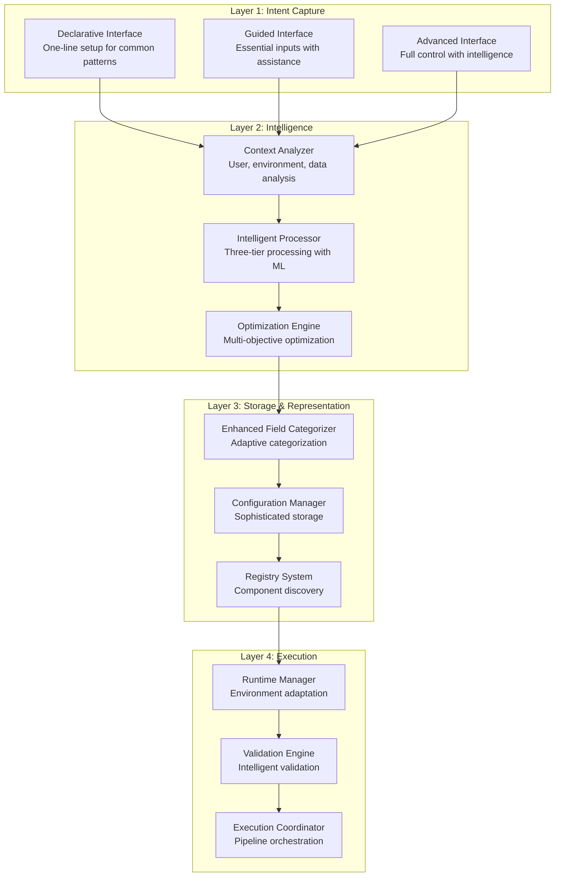

# Adaptive Configuration Management System - Design Summary

## Executive Overview

This document provides a comprehensive summary of the **Adaptive Configuration Management System**, an integrated architecture that unifies the sophisticated [Config Field Categorization](./config_field_categorization_refactored.md) system with the user-centric [Essential Inputs Design](./essential_inputs_notebook_design.md). The system delivers maximum automation with minimal user involvement while maintaining robustness, flexibility, and clarity.

## Key Design Documents

### Main Architecture Documents

#### 1. [Adaptive Configuration Management System](./adaptive_configuration_management_system.md)
**Main Architecture Document**
- Complete system architecture with four-layer design
- Pain points addressed and key objectives
- Design principles and implementation roadmap
- Integration strategy with existing systems
- Expected benefits and success metrics

### Layer Design Documents

#### 2. [Intent Capture Layer Design](./intent_capture_layer_design.md)
**Layer 1: User Interface Layer**
- Declarative Interface for one-line pipeline setup
- Guided Interface with progressive input collection
- Advanced Interface with full control and assistance
- Context-aware interface selection and adaptation
- User experience patterns and interaction flows

#### 3. [Intelligence Layer Design](./intelligence_layer_design.md)
**Layer 2: Core Intelligence Engine**
- Context Analyzer for comprehensive user/environment analysis
- Intelligent Processor with enhanced three-tier architecture
- Optimization Engine for multi-objective configuration optimization
- ML-based recommendation and prediction systems
- Performance monitoring and feedback integration

#### 4. [Storage & Representation Layer Design](./storage_representation_layer_design.md)
**Layer 3: Configuration Management**
- Enhanced Field Categorizer with adaptive capabilities
- Enhanced Configuration Manager with intelligence integration
- Registry System with component discovery and intelligence
- Sophisticated storage with versioning and migration
- Performance tracking and analytics integration

#### 5. [Execution Layer Design](./execution_layer_design.md)
**Layer 4: Runtime Management**
- Runtime Configuration Manager for environment adaptation
- Validation Engine with comprehensive validation and suggestions
- Execution Coordinator for pipeline orchestration
- Secret management and security integration
- Real-time monitoring and feedback collection

### Supporting Framework Documents

#### 6. [Context Analysis Framework](./context_analysis_framework.md)
**Intelligence Foundation**
- User profiling and expertise analysis
- Environment detection and constraint analysis
- Data source characterization
- Historical pattern recognition
- Context integration and caching strategies

#### 7. [User Profiler Design](./user_profiler_design.md)
**User Intelligence Component**
- User expertise level detection and tracking
- Preference learning and application
- Success pattern analysis
- Adaptive interface selection
- Personalization and customization

#### 8. [Environment Detector Design](./environment_detector_design.md)
**Environment Intelligence Component**
- AWS environment analysis and constraint detection
- Resource availability and quota management
- Cost optimization and budget constraint analysis
- Security and compliance requirement detection
- Performance baseline establishment

#### 9. [Intelligent Processing Engine](./intelligent_processing_engine.md)
**Core Intelligence Component**
- Three-tier architecture integration with ML capabilities
- Enhanced default values provider with context awareness
- Intelligent field derivation with optimization
- ML recommendation engine with multi-objective optimization
- Performance optimization and async processing

#### 10. [Adaptive Specification Integration](./adaptive_specification_integration.md)
**Integration Strategy Document**
- Integration with existing specification-driven architecture
- Layer-by-layer integration approach with zero breaking changes
- Technical integration points and enhanced components
- Migration strategy and user experience transformation
- Expected benefits and risk mitigation strategies

## System Architecture Overview



## Core Design Principles

### 1. Adaptive Complexity Management
- **Progressive Disclosure**: Show complexity based on user expertise
- **Context-Aware Interfaces**: Adapt UI to user and environment
- **Dynamic Field Classification**: Adjust field importance based on context

### 2. Intelligence-First Automation
- **ML-Based Defaults**: Generate intelligent defaults using machine learning
- **Context-Aware Derivation**: Derive fields based on comprehensive context
- **Predictive Optimization**: Optimize configurations for multiple objectives

### 3. Unified Architecture with Layered Concerns
- **Clear Separation**: Each layer has distinct responsibilities
- **Clean Interfaces**: Well-defined APIs between layers
- **Modular Design**: Components can be developed and tested independently

### 4. Backward Compatibility with Forward Innovation
- **Preserve Investments**: All existing configurations continue to work
- **Gradual Migration**: Teams can adopt new features incrementally
- **Hybrid Usage**: Support mixed old/new approaches

## Key Innovations

### 1. Three-Tier Architecture Enhancement
**Original Three-Tier Design** → **Intelligence-Enhanced Three-Tier**

- **Tier 1 (Essential)**: User inputs → Context-validated user inputs
- **Tier 2 (System)**: Static defaults → ML-based intelligent defaults
- **Tier 3 (Derived)**: Rule-based derivation → Context-aware intelligent derivation

### 2. Context-Aware Processing
**Static Configuration** → **Dynamic Context-Aware Configuration**

- User expertise level influences interface complexity
- Environment constraints drive optimization decisions
- Data characteristics inform resource allocation
- Historical patterns guide recommendations

### 3. Multi-Objective Optimization
**Single-Objective Tuning** → **Balanced Multi-Objective Optimization**

- Performance optimization with resource analysis
- Cost optimization with budget constraints
- Reliability optimization with failure pattern analysis
- Automated trade-off management

### 4. Intelligent Recommendations
**Manual Configuration** → **AI-Assisted Configuration**

- ML-based performance predictions
- Cost optimization suggestions
- Reliability improvement recommendations
- Ranked by user context and confidence

## User Experience Transformation

### Before: Traditional Configuration
```python
# Complex manual configuration required
config = XGBoostTrainingConfig(
    instance_type="ml.m5.xlarge",  # User must choose
    instance_count=1,              # User must determine
    volume_size=30,                # User must calculate
    max_runtime_in_seconds=7200,   # User must estimate
    hyperparameters={              # User must tune
        "max_depth": 6,
        "eta": 0.3,
        "subsample": 0.8,
        # ... 20+ more parameters
    },
    # ... 50+ more configuration fields
)
```

### After: Adaptive Configuration
```python
# Level 1: Declarative (Beginners)
pipeline = Pipeline("fraud_detection").auto_train_xgboost("s3://data/")

# Level 2: Guided (Intermediate)
pipeline = (Pipeline("fraud_detection")
    .guided_setup()
    .with_data("s3://data/")
    .with_target("fraud_label")
    .optimize_for("performance"))  # Only 3-5 essential inputs

# Level 3: Advanced (Power Users)
pipeline = Pipeline.advanced_setup(
    essential_inputs={"target": "fraud_label", "max_depth": 8},
    enable_ml_optimization=True,
    context_awareness=True
)
```

## Expected Benefits

### Quantitative Improvements
- **80%+ reduction** in required user inputs (from 50+ to ~10 essential inputs)
- **75% reduction** in time from intent to working pipeline
- **90% reduction** in configuration-related errors
- **70% reduction** in pipeline setup time
- **85% reduction** in configuration-related failures

### Qualitative Enhancements
- **Progressive Complexity**: Users start simple and grow into advanced features
- **Intelligent Assistance**: Context-aware suggestions and optimizations
- **Consistent Experience**: Unified interface across all pipeline types
- **Reduced Learning Curve**: Intuitive interfaces for all expertise levels

## Implementation Strategy

### Phase 1: Foundation (Weeks 1-4)
- Core four-layer architecture
- Context analysis framework
- Enhanced base components (categorizer, defaults provider, derivation engine)

### Phase 2: Intelligence Layer (Weeks 5-8)
- Intelligent processing engine
- ML recommendation system
- Multi-objective optimization

### Phase 3: User Interfaces (Weeks 9-12)
- Declarative interface for common patterns
- Guided interface with progressive disclosure
- Advanced interface with intelligent assistance

### Phase 4: Storage & Management (Weeks 13-16)
- Enhanced configuration storage
- Adaptive categorization
- Performance tracking and analytics

### Phase 5: Runtime & Execution (Weeks 17-20)
- Runtime configuration management
- Environment adaptation
- Comprehensive validation

### Phase 6: Testing & Deployment (Weeks 21-24)
- Comprehensive testing suite
- Migration tools and documentation
- Gradual rollout and training

## Integration with Existing Systems

### Seamless Compatibility
```python
# Existing configurations work unchanged
existing_config = XGBoostTrainingConfig(max_depth=6, n_estimators=100)

# Enhanced with intelligence
adaptive_system = AdaptiveConfigurationSystem()
enhanced_config = adaptive_system.enhance_existing_configuration(existing_config)

# Gradual migration path
pipeline = Pipeline.from_existing_configs(
    configs=[existing_config], 
    enable_intelligence=True  # Opt-in enhancement
)
```

### Enhanced Existing Components
- **ConfigFieldCategorizer** → **EnhancedConfigFieldCategorizer** (adaptive)
- **DefaultValuesProvider** → **EnhancedDefaultValuesProvider** (intelligent)
- **FieldDerivationEngine** → **EnhancedFieldDerivationEngine** (context-aware)

## Technical Architecture Highlights

### Context Analysis Framework
- **User Profiler**: Tracks expertise, preferences, success patterns
- **Environment Detector**: Analyzes AWS environment, constraints, quotas
- **Data Source Analyzer**: Characterizes data size, complexity, requirements
- **History Analyzer**: Learns from past configurations and outcomes

### Intelligent Processing Engine
- **ML Defaults Engine**: Generates context-aware defaults using ML models
- **Cross-Config Analyzer**: Optimizes across multiple configurations
- **Recommendation Ranker**: Prioritizes suggestions by impact and confidence
- **Multi-Objective Optimizer**: Balances performance, cost, and reliability

### Performance Optimizations
- **Intelligent Caching**: Context-aware caching with appropriate TTLs
- **Async Processing**: Parallel processing for high-performance scenarios
- **Feature Extraction**: Efficient ML feature generation and caching
- **Model Optimization**: Optimized ML models for real-time inference

## Success Metrics and Validation

### Primary Success Metrics
1. **User Adoption**: 80% of new pipelines use adaptive system within 6 months
2. **Configuration Efficiency**: 80% reduction in user input requirements
3. **Error Reduction**: 90% reduction in configuration-related failures
4. **Time to Value**: 75% reduction in time from intent to working pipeline

### Validation Strategy
- **A/B Testing**: Compare traditional vs. adaptive configuration approaches
- **User Studies**: Measure satisfaction across different expertise levels
- **Performance Monitoring**: Track system performance and optimization effectiveness
- **Feedback Loops**: Continuous improvement based on user feedback and outcomes

## Risk Mitigation

### Technical Risks
- **Complexity Management**: Clear layered architecture with well-defined interfaces
- **Performance Impact**: Caching, async processing, and performance optimization
- **Integration Challenges**: Comprehensive backward compatibility and gradual migration

### Adoption Risks
- **User Resistance**: Gradual rollout with optional adoption and training
- **Learning Curve**: Progressive disclosure and comprehensive documentation

## Conclusion

The Adaptive Configuration Management System represents a paradigm shift in pipeline configuration management. By intelligently integrating sophisticated field categorization with user-centric design principles, the system delivers:

1. **Maximum Automation**: Reduces user burden by 80%+ while maintaining full control
2. **Intelligent Adaptation**: Adapts to user expertise, environment, and data characteristics
3. **Robust Architecture**: Maintains type-safety and reliability while adding intelligence
4. **Seamless Integration**: Preserves existing investments while enabling innovation

This system creates a foundation for sustainable growth in pipeline development, dramatically improving productivity, reducing errors, and enhancing user satisfaction across all expertise levels.

The design represents the convergence of proven architectural patterns with modern AI/ML capabilities, creating a system that is both immediately practical and strategically positioned for future evolution.

## Related Documents

### Core Architecture
- **[Adaptive Configuration Management System](./adaptive_configuration_management_system.md)** - Complete system design
- **[Context Analysis Framework](./context_analysis_framework.md)** - Intelligence foundation
- **[Intelligent Processing Engine](./intelligent_processing_engine.md)** - Core processing logic

### Foundation Systems
- **[Config Field Categorization Refactored](./config_field_categorization_refactored.md)** - Sophisticated storage system
- **[Essential Inputs Notebook Design](./essential_inputs_notebook_design.md)** - User-centric three-tier design
- **[Design Principles](./design_principles.md)** - Architectural philosophy

### Implementation Details
- **[Default Values Provider Design](./default_values_provider_design.md)** - System inputs implementation
- **[Field Derivation Engine Design](./field_derivation_engine_design.md)** - Derived inputs implementation
- **[Hybrid Design](./hybrid_design.md)** - Specification + Config architecture
