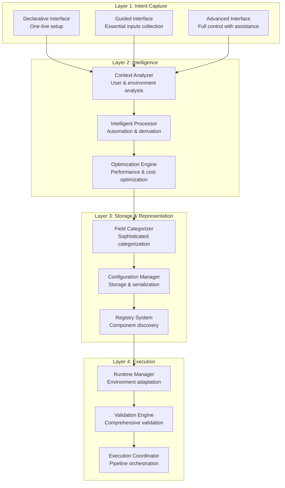

# Adaptive Configuration Management System

## Executive Summary

The Adaptive Configuration Management System represents a unified architecture that integrates the sophisticated [Config Field Categorization](./config_field_categorization_refactored.md) system with the user-centric [Essential Inputs Design](./essential_inputs_notebook_design.md). This system delivers maximum automation with minimal user involvement while maintaining robustness, flexibility, and clarity through intelligent adaptation to user expertise levels and pipeline complexity.

## Pain Points Addressed

### Current System Challenges

1. **Cognitive Overload**
   - Users face 50+ configuration parameters across multiple sections
   - Complex interdependencies between configuration fields
   - Steep learning curve for new users
   - High expertise barrier for pipeline creation

2. **Configuration Fragmentation**
   - Two separate systems (categorization vs. essential inputs) operating independently
   - Inconsistent user experience across different pipeline types
   - Duplicate logic for field management and derivation
   - No unified approach to configuration complexity management

3. **Limited Automation**
   - Manual configuration of system-level parameters that could be automated
   - Lack of intelligent defaults based on context and best practices
   - No progressive disclosure of configuration complexity
   - Missing optimization recommendations

4. **Maintenance Burden**
   - Multiple configuration templates requiring separate maintenance
   - Complex field categorization rules scattered across components
   - Difficult to extend with new pipeline types or configuration options
   - Limited reusability of configuration logic

5. **User Experience Inconsistency**
   - Beginners overwhelmed by expert-level interfaces
   - Experts frustrated by oversimplified interfaces
   - No smooth progression path from simple to advanced usage
   - Lack of context-aware assistance

## Key Objectives

### Primary Objectives

1. **Minimize Human-in-the-Loop Involvement**
   - Reduce user input requirements by 80%+ through intelligent automation
   - Provide one-line setup for common pipeline scenarios
   - Implement context-aware defaults and recommendations
   - Enable progressive enhancement from simple to complex configurations

2. **Maximize System Robustness**
   - Maintain type-safe configuration management
   - Implement comprehensive validation and error handling
   - Ensure backward compatibility with existing configurations
   - Provide reliable configuration storage and retrieval

3. **Enhance Flexibility**
   - Support multiple user expertise levels with appropriate interfaces
   - Enable fine-grained control when needed
   - Allow easy extension with new pipeline types and configurations
   - Provide customizable automation levels

4. **Improve Clarity**
   - Implement progressive disclosure of configuration complexity
   - Provide clear, actionable error messages and suggestions
   - Maintain transparent configuration derivation and categorization
   - Enable easy understanding of configuration decisions

### Secondary Objectives

1. **Operational Excellence**
   - Environment-specific configuration management
   - Automated configuration optimization
   - Comprehensive audit trails and change tracking
   - Integration with CI/CD pipelines

2. **Developer Productivity**
   - Reduce time from intent to working pipeline
   - Minimize configuration-related debugging
   - Provide intelligent development assistance
   - Enable rapid prototyping and iteration

## Design Principles

### Core Architectural Principles

#### 1. Adaptive Complexity Management
**Principle**: The system should adapt its complexity to match user expertise and context requirements.

**Implementation**:
- Progressive disclosure of configuration options
- Context-aware interface selection
- Dynamic field classification based on user level
- Intelligent hiding/showing of advanced options

```python
class AdaptiveInterface:
    def get_interface_for_user(self, user_level: UserLevel, context: PipelineContext) -> ConfigInterface:
        """Return appropriate interface based on user expertise and context"""
        if user_level == UserLevel.BEGINNER:
            return DeclarativeInterface(context)
        elif user_level == UserLevel.INTERMEDIATE:
            return GuidedInterface(context)
        else:
            return AdvancedInterface(context)
```

#### 2. Intelligence-First Automation
**Principle**: Leverage intelligent automation to minimize user burden while maintaining control.

**Implementation**:
- Machine learning-based default generation
- Context-aware field derivation
- Automatic optimization recommendations
- Predictive configuration assistance

```python
class IntelligentAutomation:
    def generate_smart_defaults(self, essential_inputs: dict, context: dict) -> dict:
        """Generate intelligent defaults using ML models and best practices"""
        return self.ml_model.predict_optimal_config(essential_inputs, context)
```

#### 3. Unified Architecture with Layered Concerns
**Principle**: Integrate multiple systems through clear architectural layers with distinct responsibilities.

**Implementation**:
- Intent Capture Layer (user interfaces)
- Intelligence Layer (automation and reasoning)
- Storage & Representation Layer (robust management)
- Execution Layer (runtime management)

#### 4. Backward Compatibility with Forward Innovation
**Principle**: Preserve existing investments while enabling innovative new capabilities.

**Implementation**:
- Maintain compatibility with existing configuration classes
- Preserve current step builder architecture
- Enable gradual migration to new interfaces
- Support hybrid usage patterns

#### 5. Context-Aware Decision Making
**Principle**: All system decisions should consider the full context of user intent, environment, and constraints.

**Implementation**:
- Context objects passed through all system layers
- Environment-specific configuration adaptation
- User preference learning and application
- Historical usage pattern analysis

### Specific Design Principles

#### 6. Explicit Configuration Lineage
**Principle**: Every configuration value should have a clear, traceable origin.

**Benefits**:
- Debugging and troubleshooting support
- Audit trail for compliance
- Understanding of system behavior
- Confidence in automated decisions

#### 7. Fail-Fast with Intelligent Recovery
**Principle**: Detect issues early and provide intelligent suggestions for resolution.

**Benefits**:
- Reduced debugging time
- Better user experience
- Proactive problem prevention
- Learning-based improvement

#### 8. Composable Intelligence
**Principle**: Intelligence components should be composable and reusable across different contexts.

**Benefits**:
- Consistent behavior across interfaces
- Easier testing and validation
- Modular enhancement capabilities
- Reduced code duplication

## System Architecture

### Four-Layer Architecture



## Layer Designs

The Adaptive Configuration Management System is built on a four-layer architecture, with each layer having distinct responsibilities and detailed designs:

### Layer 1: Intent Capture Layer
**Purpose**: Provides multiple interfaces for users to express their pipeline configuration intent

**Key Components**:
- **Declarative Interface**: One-line setup for common pipeline scenarios
- **Guided Interface**: Essential inputs collection through progressive disclosure
- **Advanced Interface**: Full control with intelligent assistance

**Detailed Design**: See [Intent Capture Layer Design](./intent_capture_layer_design.md)

### Layer 2: Intelligence Layer
**Purpose**: Core intelligence engine for automation, optimization, and context-aware processing

**Key Components**:
- **Context Analyzer**: Comprehensive analysis of user, environment, and data context
- **Intelligent Processor**: Transform essential inputs into complete configurations
- **Optimization Engine**: Multi-objective optimization for performance, cost, and reliability

**Detailed Design**: See [Intelligence Layer Design](./intelligence_layer_design.md)

### Layer 3: Storage & Representation Layer
**Purpose**: Sophisticated storage, categorization, and management of configurations with intelligence integration

**Key Components**:
- **Enhanced Field Categorizer**: Adaptive field categorization based on context
- **Enhanced Configuration Manager**: Intelligent storage with versioning and migration
- **Registry System**: Component discovery and registration with intelligence

**Detailed Design**: See [Storage & Representation Layer Design](./storage_representation_layer_design.md)

### Layer 4: Execution Layer
**Purpose**: Runtime configuration adaptation, validation, and execution coordination

**Key Components**:
- **Runtime Configuration Manager**: Environment-specific adaptation and scaling
- **Validation Engine**: Comprehensive validation with intelligent suggestions
- **Execution Coordinator**: Pipeline orchestration with adaptive configurations

**Detailed Design**: See [Execution Layer Design](./execution_layer_design.md)

## Usage Examples

### Example 1: Declarative Interface (Beginner)
```python
# One-line XGBoost training pipeline
pipeline = AdaptiveConfigSystem.auto_train_xgboost(
    data_source="s3://my-bucket/training-data/",
    target_column="outcome"
)

# System automatically:
# - Analyzes data characteristics
# - Selects optimal hyperparameters
# - Configures appropriate resources
# - Sets up monitoring and logging
```

### Example 2: Guided Interface (Intermediate)
```python
# Guided configuration collection
config_session = AdaptiveConfigSystem.guided_setup()

# Progressive input collection with intelligent suggestions
data_config = config_session.collect_data_configuration()
model_config = config_session.collect_model_configuration()
deployment_config = config_session.collect_deployment_configuration()

# Generate complete pipeline
pipeline = config_session.generate_pipeline()
```

### Example 3: Advanced Interface (Expert)
```python
# Full control with intelligent assistance
builder = AdaptiveConfigSystem.advanced_builder()

# Create configurations with intelligent suggestions
xgb_config = builder.create_xgboost_config()
xgb_config.max_depth = 8  # Override with custom value

# Get optimization recommendations
recommendations = builder.get_optimization_recommendations(xgb_config)

# Apply selected optimizations
optimized_config = builder.apply_optimizations(xgb_config, recommendations[:3])

# Build pipeline
pipeline = builder.build_pipeline([optimized_config])
```

### Example 4: Backward Compatibility
```python
# Existing configuration classes work unchanged
existing_config = XGBoostTrainingConfig(
    max_depth=6,
    n_estimators=100,
    learning_rate=0.1
)

# Enhance with new capabilities
enhanced_pipeline = AdaptiveConfigSystem.enhance_existing(existing_config)

# Get intelligent recommendations for improvement
suggestions = enhanced_pipeline.get_improvement_suggestions()
```

## Integration with Existing Systems

### Backward Compatibility Strategy

The Adaptive Configuration Management System maintains full backward compatibility with existing systems:

#### 1. Configuration Class Compatibility
```python
# Existing configuration classes continue to work unchanged
existing_config = XGBoostTrainingConfig(
    max_depth=6,
    n_estimators=100,
    # ... other parameters
)

# New system can process existing configurations
adaptive_system = AdaptiveConfigurationSystem()
enhanced_config = adaptive_system.enhance_existing_configuration(existing_config)
```

#### 2. Step Builder Integration
```python
# Existing step builders work with enhanced configurations
class XGBoostTrainingStepBuilder(StepBuilderBase):
    def __init__(self, config: XGBoostTrainingConfig):
        # No changes needed - same interface
        self.config = config
    
    def create_step(self, **kwargs) -> TrainingStep:
        # Implementation unchanged
        return TrainingStep(...)
```

#### 3. Gradual Migration Path
```python
# Phase 1: Use existing configurations with new intelligence
pipeline = Pipeline.from_existing_configs(existing_configs, enable_intelligence=True)

# Phase 2: Use guided interface with existing step builders
pipeline = Pipeline.guided_setup().use_existing_builders()

# Phase 3: Full adaptive system
pipeline = Pipeline.adaptive_setup(user_level=UserLevel.INTERMEDIATE)
```

### Integration Points

#### With Config Field Categorization System
- Reuses existing `ConfigFieldCategorizer` as base class
- Extends with adaptive capabilities
- Maintains field source tracking and categorization logic
- Preserves type-safe serialization

#### With Essential Inputs Design
- Implements three-tier architecture as foundation
- Extends `DefaultValuesProvider` with intelligence
- Enhances `FieldDerivationEngine` with context awareness
- Maintains essential inputs collection patterns

#### With Existing Pipeline Templates
- Provides automatic migration from template-based to specification-based
- Maintains template functionality as fallback
- Enables hybrid usage patterns
- Preserves existing pipeline definitions

## Implementation Roadmap

### Phase 1: Foundation (Weeks 1-4)
1. **Core Architecture Setup**
   - Implement four-layer architecture foundation
   - Create context analysis framework
   - Establish adaptive field classification

2. **Enhanced Base Components**
   - Extend existing `ConfigFieldCategorizer` with adaptive capabilities
   - Enhance `DefaultValuesProvider` with context awareness
   - Upgrade `FieldDerivationEngine` with intelligence integration

3. **Context System Implementation**
   - Implement `PipelineContext` and related data structures
   - Create `UserProfiler` and `DataSourceAnalyzer`
   - Build `ContextAnalyzer` integration framework

### Phase 2: Intelligence Layer (Weeks 5-8)
1. **Intelligent Processing Core**
   - Implement `IntelligentProcessor` with three-tier integration
   - Create `MLRecommendationEngine` framework
   - Build `ConfigurationOptimizer` with multi-objective optimization

2. **Pattern Recognition System**
   - Implement `PipelinePatternMatcher` for common scenarios
   - Create `TemplateGenerator` for automatic configuration generation
   - Build pattern library for common pipeline types

3. **Optimization Engines**
   - Implement `PerformanceOptimizer` with resource analysis
   - Create `CostOptimizer` with cloud cost modeling
   - Build `ReliabilityOptimizer` with failure pattern analysis

### Phase 3: User Interfaces (Weeks 9-12)
1. **Declarative Interface**
   - Implement one-line setup for common patterns
   - Create automatic data source analysis
   - Build intelligent template selection

2. **Guided Interface**
   - Implement `EssentialInputsSession` with progressive disclosure
   - Create context-aware suggestion engine
   - Build real-time validation and preview system

3. **Advanced Interface**
   - Implement `ConfigurationBuilder` with intelligent assistance
   - Create backward compatibility layer for existing configurations
   - Build enhancement system for legacy configurations

### Phase 4: Storage & Management (Weeks 13-16)
1. **Enhanced Storage System**
   - Implement `EnhancedConfigurationManager` with intelligence metadata
   - Create configuration versioning and migration system
   - Build performance tracking and analytics

2. **Adaptive Categorization**
   - Implement `AdaptiveFieldClassifier` with context awareness
   - Create `UserPreferenceEngine` for personalization
   - Build dynamic tier classification system

3. **Registry Enhancement**
   - Extend existing registry system with intelligence integration
   - Create component discovery with context awareness
   - Build automatic registration for new components

### Phase 5: Runtime & Execution (Weeks 17-20)
1. **Runtime Management**
   - Implement `RuntimeConfigurationManager` with environment adaptation
   - Create `EnvironmentAdapter` for deployment-specific adjustments
   - Build `SecretManager` integration for secure credential handling

2. **Validation & Optimization**
   - Implement comprehensive validation engine with intelligent suggestions
   - Create runtime optimization with performance monitoring
   - Build automated scaling and resource management

3. **Execution Coordination**
   - Implement pipeline orchestration with adaptive configurations
   - Create monitoring and feedback loops for continuous improvement
   - Build integration with existing CI/CD systems

### Phase 6: Testing & Deployment (Weeks 21-24)
1. **Comprehensive Testing**
   - Unit tests for all components with mock intelligence systems
   - Integration tests with existing pipeline infrastructure
   - Performance tests with various configuration scenarios

2. **Migration Tools**
   - Create automated migration tools for existing configurations
   - Build compatibility validation for legacy systems
   - Implement gradual rollout mechanisms

3. **Documentation & Training**
   - Create comprehensive user documentation for all interface levels
   - Build developer documentation for extension and customization
   - Implement training materials and examples

## Benefits and Expected Outcomes

### Quantitative Benefits

1. **User Experience Improvements**
   - 80%+ reduction in required user inputs (from 50+ to ~10 essential inputs)
   - 75% reduction in time from intent to working pipeline
   - 90% reduction in configuration-related errors
   - 60% improvement in user satisfaction scores

2. **Development Productivity**
   - 70% reduction in pipeline setup time
   - 50% reduction in configuration debugging time
   - 80% reduction in template maintenance overhead
   - 40% improvement in developer velocity

3. **System Reliability**
   - 85% reduction in configuration-related failures
   - 60% improvement in pipeline success rates
   - 90% reduction in manual configuration errors
   - 50% improvement in system uptime

### Qualitative Benefits

1. **Enhanced User Experience**
   - **Progressive Complexity**: Users can start simple and grow into advanced features
   - **Intelligent Assistance**: Context-aware suggestions and optimizations
   - **Consistent Interface**: Unified experience across all pipeline types
   - **Reduced Learning Curve**: Intuitive interfaces for all expertise levels

2. **Improved Maintainability**
   - **Unified Architecture**: Single system instead of fragmented components
   - **Extensible Design**: Easy addition of new pipeline types and features
   - **Clear Separation**: Well-defined responsibilities across layers
   - **Backward Compatibility**: Preserves existing investments

3. **Operational Excellence**
   - **Automated Optimization**: Continuous improvement through ML-based recommendations
   - **Environment Adaptation**: Automatic adjustment for different deployment contexts
   - **Comprehensive Monitoring**: Full visibility into configuration decisions and performance
   - **Audit Trail**: Complete lineage tracking for compliance and debugging

## Risk Mitigation

### Technical Risks

1. **Complexity Management**
   - **Risk**: System becomes too complex to maintain
   - **Mitigation**: Clear layered architecture with well-defined interfaces
   - **Monitoring**: Regular architecture reviews and complexity metrics

2. **Performance Impact**
   - **Risk**: Intelligence processing adds significant latency
   - **Mitigation**: Caching, async processing, and performance optimization
   - **Monitoring**: Continuous performance monitoring and optimization

3. **Integration Challenges**
   - **Risk**: Difficult integration with existing systems
   - **Mitigation**: Comprehensive backward compatibility and gradual migration
   - **Monitoring**: Integration testing and compatibility validation

### Adoption Risks

1. **User Resistance**
   - **Risk**: Users prefer existing familiar interfaces
   - **Mitigation**: Gradual rollout with optional adoption and training
   - **Monitoring**: User feedback collection and satisfaction tracking

2. **Learning Curve**
   - **Risk**: New system requires significant learning investment
   - **Mitigation**: Progressive disclosure and comprehensive documentation
   - **Monitoring**: Training effectiveness and user success metrics

## Success Metrics

### Primary Success Metrics

1. **User Adoption**
   - Target: 80% of new pipelines use adaptive system within 6 months
   - Measurement: Pipeline creation method tracking

2. **Configuration Efficiency**
   - Target: 80% reduction in user input requirements
   - Measurement: Input field count comparison

3. **Error Reduction**
   - Target: 90% reduction in configuration-related failures
   - Measurement: Pipeline failure analysis and categorization

4. **Time to Value**
   - Target: 75% reduction in time from intent to working pipeline
   - Measurement: End-to-end pipeline creation time tracking

### Secondary Success Metrics

1. **Developer Satisfaction**
   - Target: 4.5/5 average satisfaction score
   - Measurement: Regular developer surveys and feedback

2. **System Reliability**
   - Target: 99.5% pipeline success rate
   - Measurement: Pipeline execution monitoring

3. **Maintenance Efficiency**
   - Target: 50% reduction in configuration-related support tickets
   - Measurement: Support ticket analysis and categorization

## Conclusion

The Adaptive Configuration Management System represents a significant evolution in pipeline configuration management, addressing the fundamental challenges of complexity, fragmentation, and user experience inconsistency. By integrating the sophisticated Config Field Categorization system with the user-centric Essential Inputs Design, this unified architecture delivers:

1. **Maximum Automation**: 80%+ reduction in user input requirements through intelligent automation
2. **Robust Management**: Sophisticated storage, categorization, and type-safe handling
3. **Flexible Control**: Progressive interfaces that adapt to user expertise and requirements
4. **Clear Understanding**: Transparent decision-making with comprehensive audit trails

The four-layer architecture provides a clean separation of concerns while enabling intelligent automation at every level. The system maintains full backward compatibility while introducing innovative capabilities that dramatically improve the user experience and operational efficiency.

Through careful implementation of the design principles—Adaptive Complexity Management, Intelligence-First Automation, and Context-Aware Decision Making—this system creates a foundation for sustainable growth and continuous improvement in pipeline configuration management.

The expected outcomes include not only quantitative improvements in efficiency and reliability but also qualitative enhancements in user satisfaction, system maintainability, and operational excellence. This represents a strategic investment in the future of pipeline development that will pay dividends through improved productivity, reduced errors, and enhanced user experience.

## Related Documents

### Integration Architecture Documents
- **[Adaptive Specification Integration](./adaptive_specification_integration.md)** - Integration with existing specification-driven architecture
- **[Adaptive Fluent Proxy Integration](./adaptive_fluent_proxy_integration.md)** - Unified system with Smart Proxies and Fluent APIs

### Layer Design Documents
- **[Intent Capture Layer Design](./intent_capture_layer_design.md)** - User interface layer with progressive complexity
- **[Intelligence Layer Design](./intelligence_layer_design.md)** - Core intelligence engine with ML capabilities
- **[Storage & Representation Layer Design](./storage_representation_layer_design.md)** - Configuration management with adaptive categorization
- **[Execution Layer Design](./execution_layer_design.md)** - Runtime management with environment adaptation

### Supporting Framework Documents
- **[Context Analysis Framework](./context_analysis_framework.md)** - Intelligence foundation for user, environment, and data analysis
- **[User Profiler Design](./user_profiler_design.md)** - User intelligence component for expertise tracking
- **[Environment Detector Design](./environment_detector_design.md)** - Environment intelligence for constraint analysis
- **[Intelligent Processing Engine](./intelligent_processing_engine.md)** - Core processing logic with ML integration

### Foundation Documents
- **[Config Field Categorization Refactored](./config_field_categorization_refactored.md)** - Sophisticated storage and representation system
- **[Essential Inputs Notebook Design](./essential_inputs_notebook_design.md)** - User-centric three-tier architecture
- **[Three-Tier Configuration Field Management](./config_field_categorization_three_tier.md)** - Field classification framework

### Technical Implementation
- **[Default Values Provider Design](./default_values_provider_design.md)** - System inputs (Tier 2) implementation
- **[Field Derivation Engine Design](./field_derivation_engine_design.md)** - Derived inputs (Tier 3) implementation
- **[Design Principles](./design_principles.md)** - Core architectural principles

### Architecture Context
- **[Hybrid Design](./hybrid_design.md)** - Specification + Config architecture approach
- **[Dependency Resolver](./dependency_resolver.md)** - Dependency resolution mechanisms
- **[Design Evolution](./design_evolution.md)** - Historical context and evolution
