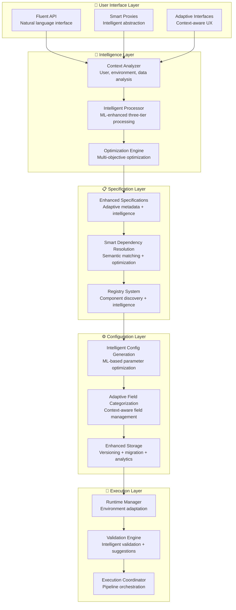

# Adaptive Configuration System Integration with Smart Proxies and Fluent APIs

## Overview

This document details how the **Adaptive Configuration Management System** integrates with **Smart Proxies** and **Fluent APIs** to create a unified, intelligent pipeline development platform. The integration combines adaptive intelligence, intelligent abstraction, and natural language interfaces to deliver the ultimate developer experience across all expertise levels.

## Related Documents

### Core Architecture
- **[Adaptive Configuration Management System](./adaptive_configuration_management_system.md)** - Main adaptive system architecture
- **[Adaptive Specification Integration](./adaptive_specification_integration.md)** - Integration with specification-driven architecture
- **[Smart Proxy](./smart_proxy.md)** - Intelligent abstraction layer design
- **[Fluent API](./fluent_api.md)** - Natural language interface design

### Supporting Systems
- **[Specification-Driven Design](./specification_driven_design.md)** - Foundation specification system
- **[Hybrid Design](./hybrid_design.md)** - Current recommended architecture
- **[Step Specification](./step_specification.md)** - Specification format and structure

## Unified Architecture Overview

The integrated system combines four complementary technologies into a cohesive platform:



## Integration Strategy: Four-Layer Enhancement

### Layer 1: Enhanced User Interface Layer

The user interface layer combines **Fluent APIs**, **Smart Proxies**, and **Adaptive Interfaces** to provide the optimal experience for each user type:

#### Adaptive Fluent API
```python
class AdaptiveFluentPipeline:
    """Fluent API enhanced with adaptive intelligence"""
    
    def __init__(self, name: str, context: AdaptiveContext = None):
        self.name = name
        self.context = context or AdaptiveContext.from_environment()
        self.smart_proxies = []
        self.adaptive_system = AdaptiveConfigurationSystem()
        
        # Adapt interface based on user expertise
        self._configure_interface_complexity()
    
    def _configure_interface_complexity(self):
        """Configure interface complexity based on user expertise"""
        if self.context.user_profile.expertise_level == "beginner":
            self.interface_mode = "simplified"
            self.show_advanced_options = False
            self.auto_configure = True
        elif self.context.user_profile.expertise_level == "intermediate":
            self.interface_mode = "guided"
            self.show_advanced_options = True
            self.auto_configure = True
        else:  # expert
            self.interface_mode = "full_control"
            self.show_advanced_options = True
            self.auto_configure = False
    
    # Level 1: Declarative Interface (Beginners)
    def auto_train_xgboost(self, data_source: str) -> 'AdaptiveFluentPipeline':
        """One-line XGBoost training with full intelligence"""
        # Adaptive system analyzes context and generates optimal pipeline
        pipeline_spec = self.adaptive_system.generate_pipeline_specification(
            task_type="xgboost_training",
            data_source=data_source,
            context=self.context
        )
        
        # Create smart proxies with intelligent configurations
        for step_spec in pipeline_spec.steps:
            config = self.adaptive_system.generate_config(step_spec.step_type, self.context)
            proxy = self._create_smart_proxy(step_spec.step_type, config)
            self.smart_proxies.append(proxy)
        
        # Auto-connect using smart proxy intelligence
        self._auto_connect_proxies()
        
        return self
    
    # Level 2: Guided Interface (Intermediate)
    def load_data(self, source: str, **essential_inputs) -> 'AdaptiveFluentPipeline':
        """Guided data loading with intelligent assistance"""
        # Merge essential inputs with intelligent defaults
        intelligent_config = self.adaptive_system.generate_config(
            step_type="DataLoading",
            context=self.context,
            user_overrides=essential_inputs
        )
        
        # Create smart proxy with enhanced configuration
        proxy = AdaptiveDataLoadingProxy(intelligent_config, self.context)
        self.smart_proxies.append(proxy)
        
        return self
    
    def preprocess_intelligently(self, **preferences) -> 'AdaptiveFluentPipeline':
        """Intelligent preprocessing with user preferences"""
        # Analyze data characteristics from previous step
        if self.smart_proxies:
            data_analysis = self._analyze_data_from_previous_step()
            self.context.update_data_characteristics(data_analysis)
        
        # Generate intelligent preprocessing configuration
        intelligent_config = self.adaptive_system.generate_config(
            step_type="TabularPreprocessing",
            context=self.context,
            user_preferences=preferences
        )
        
        # Create smart proxy with auto-connection
        proxy = AdaptivePreprocessingProxy(intelligent_config, self.context)
        if self.smart_proxies:
            proxy.connect_from(self.smart_proxies[-1])
        
        self.smart_proxies.append(proxy)
        return self
    
    # Level 3: Advanced Interface (Power Users)
    def train_xgboost(self, **advanced_options) -> 'AdaptiveFluentPipeline':
        """Advanced XGBoost training with full control and AI assistance"""
        # Provide intelligent suggestions while respecting user choices
        base_config = self.adaptive_system.generate_config(
            step_type="XGBoostTraining",
            context=self.context
        )
        
        # Apply user overrides
        final_config = self._merge_config_with_overrides(base_config, advanced_options)
        
        # Provide intelligent suggestions for unspecified parameters
        suggestions = self.adaptive_system.suggest_optimizations(
            config=final_config,
            context=self.context
        )
        
        if self.interface_mode == "full_control" and suggestions:
            self._display_suggestions(suggestions)
        
        # Create smart proxy with enhanced capabilities
        proxy = AdaptiveXGBoostTrainingProxy(final_config, self.context)
        if self.smart_proxies:
            proxy.connect_from(self.smart_proxies[-1])
        
        self.smart_proxies.append(proxy)
        return self
```

#### Adaptive Smart Proxies
```python
class AdaptiveSmartProxy(SmartProxy):
    """Smart Proxy enhanced with adaptive intelligence"""
    
    def __init__(self, config: BasePipelineConfig, context: AdaptiveContext):
        super().__init__(config)
        self.context = context
        self.adaptive_system = AdaptiveConfigurationSystem()
        self.intelligence_engine = IntelligenceEngine()
        
        # Enhance configuration with adaptive intelligence
        self._enhance_config_with_intelligence()
    
    def _enhance_config_with_intelligence(self):
        """Enhance configuration using adaptive intelligence"""
        enhanced_config = self.adaptive_system.enhance_config(
            base_config=self.config,
            context=self.context
        )
        
        # Update configuration with intelligent enhancements
        for field_name, enhanced_value in enhanced_config.items():
            if hasattr(self.config, field_name):
                setattr(self.config, field_name, enhanced_value)
    
    def connect_from(self, source_proxy: 'AdaptiveSmartProxy', output_name: str = None) -> 'AdaptiveSmartProxy':
        """Enhanced connection with adaptive intelligence"""
        # Use base smart proxy connection logic
        super().connect_from(source_proxy, output_name)
        
        # Apply adaptive intelligence to optimize connection
        self._optimize_connection_with_intelligence(source_proxy)
        
        # Auto-configure based on connected source
        self._auto_configure_from_source(source_proxy)
        
        return self
    
    def _optimize_connection_with_intelligence(self, source_proxy: 'AdaptiveSmartProxy'):
        """Optimize connection using ML and context analysis"""
        # Analyze connection patterns and optimize
        optimization_suggestions = self.intelligence_engine.optimize_connection(
            source_proxy=source_proxy,
            target_proxy=self,
            context=self.context
        )
        
        # Apply optimizations
        for suggestion in optimization_suggestions:
            if suggestion.confidence > 0.8:  # High confidence suggestions
                self._apply_optimization(suggestion)
    
    def _auto_configure_from_source(self, source_proxy: 'AdaptiveSmartProxy'):
        """Auto-configure based on source proxy with adaptive intelligence"""
        # Use adaptive system to determine optimal configuration
        auto_config = self.adaptive_system.derive_config_from_source(
            source_config=source_proxy.config,
            target_step_type=self.step_type,
            context=self.context
        )
        
        # Apply auto-configuration
        for field_name, value in auto_config.items():
            if hasattr(self.config, field_name) and getattr(self.config, field_name) is None:
                setattr(self.config, field_name, value)
    
    def suggest_optimizations(self) -> List[OptimizationSuggestion]:
        """Provide intelligent optimization suggestions"""
        return self.intelligence_engine.suggest_optimizations(
            proxy=self,
            context=self.context
        )
    
    def with_intelligent_defaults(self) -> 'AdaptiveSmartProxy':
        """Apply intelligent defaults using ML"""
        intelligent_defaults = self.adaptive_system.generate_intelligent_defaults(
            step_type=self.step_type,
            context=self.context
        )
        
        # Apply defaults only to unset fields
        for field_name, default_value in intelligent_defaults.items():
            if hasattr(self.config, field_name) and getattr(self.config, field_name) is None:
                setattr(self.config, field_name, default_value)
        
        return self
```

### Layer 2: Enhanced Intelligence Layer

The intelligence layer provides ML-powered optimization and context-aware processing:

#### Intelligent Fluent API Processor
```python
class IntelligentFluentProcessor:
    """Processes fluent API calls with adaptive intelligence"""
    
    def __init__(self, context: AdaptiveContext):
        self.context = context
        self.ml_engine = MLRecommendationEngine()
        self.optimization_engine = OptimizationEngine()
    
    def process_fluent_chain(self, fluent_pipeline: AdaptiveFluentPipeline) -> ProcessedPipeline:
        """Process fluent API chain with intelligence"""
        # Analyze the entire fluent chain for optimization opportunities
        chain_analysis = self._analyze_fluent_chain(fluent_pipeline)
        
        # Generate intelligent optimizations
        optimizations = self.optimization_engine.optimize_pipeline_chain(
            chain_analysis=chain_analysis,
            context=self.context
        )
        
        # Apply optimizations
        optimized_pipeline = self._apply_optimizations(fluent_pipeline, optimizations)
        
        return optimized_pipeline
    
    def _analyze_fluent_chain(self, pipeline: AdaptiveFluentPipeline) -> ChainAnalysis:
        """Analyze fluent API chain for patterns and optimization opportunities"""
        analysis = ChainAnalysis()
        
        # Analyze step sequence
        analysis.step_sequence = [proxy.step_type for proxy in pipeline.smart_proxies]
        
        # Analyze data flow patterns
        analysis.data_flow = self._analyze_data_flow(pipeline.smart_proxies)
        
        # Analyze resource utilization patterns
        analysis.resource_patterns = self._analyze_resource_patterns(pipeline.smart_proxies)
        
        # Analyze performance bottlenecks
        analysis.bottlenecks = self._identify_bottlenecks(pipeline.smart_proxies)
        
        return analysis
    
    def suggest_fluent_improvements(self, pipeline: AdaptiveFluentPipeline) -> List[FluentSuggestion]:
        """Suggest improvements to fluent API usage"""
        suggestions = []
        
        # Analyze for common anti-patterns
        anti_patterns = self._detect_anti_patterns(pipeline)
        for pattern in anti_patterns:
            suggestions.append(FluentSuggestion(
                type="anti_pattern",
                description=pattern.description,
                suggested_fix=pattern.fix,
                confidence=pattern.confidence
            ))
        
        # Suggest performance optimizations
        perf_optimizations = self._suggest_performance_optimizations(pipeline)
        suggestions.extend(perf_optimizations)
        
        # Suggest cost optimizations
        cost_optimizations = self._suggest_cost_optimizations(pipeline)
        suggestions.extend(cost_optimizations)
        
        return suggestions
```

#### Smart Proxy Intelligence Engine
```python
class SmartProxyIntelligenceEngine:
    """Intelligence engine specifically for smart proxy optimization"""
    
    def __init__(self):
        self.connection_optimizer = ConnectionOptimizer()
        self.config_optimizer = ConfigOptimizer()
        self.performance_predictor = PerformancePredictor()
    
    def optimize_proxy_connections(self, proxies: List[AdaptiveSmartProxy], context: AdaptiveContext) -> List[ConnectionOptimization]:
        """Optimize connections between smart proxies"""
        optimizations = []
        
        for i, proxy in enumerate(proxies):
            if i == 0:  # Skip first proxy (no connections)
                continue
            
            # Analyze current connections
            current_connections = proxy.connections
            
            # Generate optimal connections
            optimal_connections = self.connection_optimizer.optimize_connections(
                target_proxy=proxy,
                available_sources=proxies[:i],
                context=context
            )
            
            # Compare and suggest improvements
            if optimal_connections != current_connections:
                optimizations.append(ConnectionOptimization(
                    proxy=proxy,
                    current_connections=current_connections,
                    optimal_connections=optimal_connections,
                    expected_improvement=self._calculate_improvement(current_connections, optimal_connections)
                ))
        
        return optimizations
    
    def predict_proxy_performance(self, proxy: AdaptiveSmartProxy, context: AdaptiveContext) -> PerformancePrediction:
        """Predict performance of smart proxy configuration"""
        return self.performance_predictor.predict_performance(
            step_type=proxy.step_type,
            config=proxy.config,
            context=context
        )
    
    def suggest_proxy_optimizations(self, proxy: AdaptiveSmartProxy, context: AdaptiveContext) -> List[ProxyOptimization]:
        """Suggest optimizations for individual smart proxy"""
        suggestions = []
        
        # Configuration optimizations
        config_opts = self.config_optimizer.optimize_config(
            config=proxy.config,
            step_type=proxy.step_type,
            context=context
        )
        suggestions.extend(config_opts)
        
        # Resource optimizations
        resource_opts = self._suggest_resource_optimizations(proxy, context)
        suggestions.extend(resource_opts)
        
        # Performance optimizations
        perf_opts = self._suggest_performance_optimizations(proxy, context)
        suggestions.extend(perf_opts)
        
        return suggestions
```

### Layer 3: Enhanced Specification Layer

The specification layer provides intelligent dependency resolution and enhanced metadata:

#### Adaptive Specification Registry
```python
class AdaptiveSpecificationRegistry(SpecificationRegistry):
    """Specification registry enhanced with adaptive intelligence"""
    
    def __init__(self, context: AdaptiveContext):
        super().__init__()
        self.context = context
        self.intelligence_engine = IntelligenceEngine()
        self.fluent_api_analyzer = FluentAPIAnalyzer()
    
    def get_specification_for_fluent_api(self, step_type: str, fluent_context: FluentContext) -> StepSpecification:
        """Get specification enhanced for fluent API usage"""
        base_spec = super().get_specification(step_type)
        
        # Enhance specification with fluent API metadata
        enhanced_spec = self._enhance_for_fluent_api(base_spec, fluent_context)
        
        # Add adaptive intelligence
        adaptive_spec = self.intelligence_engine.enhance_specification(
            base_spec=enhanced_spec,
            context=self.context
        )
        
        return adaptive_spec
    
    def _enhance_for_fluent_api(self, spec: StepSpecification, fluent_context: FluentContext) -> StepSpecification:
        """Enhance specification with fluent API specific metadata"""
        enhanced_spec = copy.deepcopy(spec)
        
        # Add fluent API method mappings
        enhanced_spec.fluent_api_metadata = {
            "method_mappings": self._generate_method_mappings(spec),
            "chaining_patterns": self._analyze_chaining_patterns(spec),
            "natural_language_aliases": self._generate_natural_language_aliases(spec),
            "context_dependencies": self._analyze_context_dependencies(spec, fluent_context)
        }
        
        return enhanced_spec
    
    def suggest_fluent_methods(self, step_type: str, context: AdaptiveContext) -> List[FluentMethodSuggestion]:
        """Suggest fluent API methods based on context"""
        spec = self.get_specification(step_type)
        
        suggestions = []
        
        # Analyze user patterns
        user_patterns = self.fluent_api_analyzer.analyze_user_patterns(
            user_profile=context.user_profile,
            step_type=step_type
        )
        
        # Generate method suggestions
        for pattern in user_patterns:
            if pattern.frequency > 0.3:  # Frequently used patterns
                suggestions.append(FluentMethodSuggestion(
                    method_name=pattern.method_name,
                    description=pattern.description,
                    usage_example=pattern.example,
                    frequency=pattern.frequency
                ))
        
        return suggestions
```

#### Smart Dependency Resolver
```python
class SmartDependencyResolver(UnifiedDependencyResolver):
    """Dependency resolver enhanced for smart proxies and fluent APIs"""
    
    def __init__(self, context: AdaptiveContext):
        super().__init__()
        self.context = context
        self.fluent_optimizer = FluentOptimizer()
        self.proxy_optimizer = ProxyOptimizer()
    
    def resolve_fluent_dependencies(self, fluent_pipeline: AdaptiveFluentPipeline) -> ResolvedDependencies:
        """Resolve dependencies for fluent API pipeline"""
        # Extract smart proxies from fluent pipeline
        proxies = fluent_pipeline.smart_proxies
        
        # Resolve dependencies using enhanced logic
        resolved = ResolvedDependencies()
        
        for proxy in proxies:
            proxy_dependencies = self._resolve_proxy_dependencies(proxy, proxies)
            resolved.add_proxy_dependencies(proxy, proxy_dependencies)
        
        # Optimize resolved dependencies
        optimized = self.fluent_optimizer.optimize_dependencies(resolved, self.context)
        
        return optimized
    
    def _resolve_proxy_dependencies(self, proxy: AdaptiveSmartProxy, available_proxies: List[AdaptiveSmartProxy]) -> Dict[str, PropertyReference]:
        """Resolve dependencies for individual smart proxy"""
        dependencies = {}
        
        for dep_name, dep_spec in proxy.specification.dependencies.items():
            # Find best matching source
            best_match = self._find_best_match(dep_spec, available_proxies)
            
            if best_match:
                # Create optimized property reference
                prop_ref = self._create_optimized_property_reference(
                    source_proxy=best_match.proxy,
                    output_spec=best_match.output_spec,
                    dependency_spec=dep_spec
                )
                dependencies[dep_name] = prop_ref
        
        return dependencies
    
    def suggest_connection_improvements(self, proxy: AdaptiveSmartProxy) -> List[ConnectionSuggestion]:
        """Suggest improvements to proxy connections"""
        suggestions = []
        
        # Analyze current connections
        current_connections = proxy.connections
        
        # Generate optimal connections
        optimal_connections = self.proxy_optimizer.optimize_connections(
            proxy=proxy,
            context=self.context
        )
        
        # Compare and suggest improvements
        for dep_name, current_ref in current_connections.items():
            if dep_name in optimal_connections:
                optimal_ref = optimal_connections[dep_name]
                if optimal_ref != current_ref:
                    suggestions.append(ConnectionSuggestion(
                        dependency_name=dep_name,
                        current_connection=current_ref,
                        suggested_connection=optimal_ref,
                        improvement_reason=self._analyze_improvement_reason(current_ref, optimal_ref)
                    ))
        
        return suggestions
```

### Layer 4: Enhanced Configuration and Execution

The configuration and execution layers provide intelligent parameter generation and runtime optimization:

#### Intelligent Configuration Generator for Fluent APIs
```python
class FluentAPIConfigGenerator:
    """Generate intelligent configurations for fluent API usage"""
    
    def __init__(self, context: AdaptiveContext):
        self.context = context
        self.ml_engine = MLRecommendationEngine()
        self.fluent_analyzer = FluentAPIAnalyzer()
    
    def generate_config_for_fluent_method(self, method_name: str, step_type: str, **user_params) -> BasePipelineConfig:
        """Generate intelligent configuration for fluent API method"""
        
        # Analyze fluent method context
        method_context = self.fluent_analyzer.analyze_method_context(
            method_name=method_name,
            step_type=step_type,
            user_params=user_params,
            adaptive_context=self.context
        )
        
        # Generate base configuration using ML
        base_config = self.ml_engine.generate_config(
            step_type=step_type,
            context=self.context,
            method_context=method_context
        )
        
        # Apply fluent API specific optimizations
        fluent_optimized_config = self._optimize_for_fluent_usage(
            base_config=base_config,
            method_context=method_context
        )
        
        # Merge with user parameters
        final_config = self._merge_with_user_params(fluent_optimized_config, user_params)
        
        return final_config
    
    def _optimize_for_fluent_usage(self, base_config: Dict, method_context: FluentMethodContext) -> Dict:
        """Optimize configuration for fluent API usage patterns"""
        optimized = base_config.copy()
        
        # Apply fluent-specific optimizations
        if method_context.is_chained:
            # Optimize for method chaining
            optimized = self._optimize_for_chaining(optimized, method_context)
        
        if method_context.has_natural_language_intent:
            # Optimize based on natural language intent
            optimized = self._optimize_for_intent(optimized, method_context.intent)
        
        if method_context.user_expertise_level == "beginner":
            # Simplify configuration for beginners
            optimized = self._simplify_for_beginners(optimized)
        
        return optimized
    
    def suggest_fluent_parameters(self, method_name: str, step_type: str) -> List[FluentParameterSuggestion]:
        """Suggest parameters for fluent API methods"""
        suggestions = []
        
        # Analyze common parameter patterns
        patterns = self.fluent_analyzer.analyze_parameter_patterns(
            method_name=method_name,
            step_type=step_type,
            context=self.context
        )
        
        # Generate suggestions based on patterns
        for pattern in patterns:
            if pattern.usage_frequency > 0.2:  # Commonly used parameters
                suggestions.append(FluentParameterSuggestion(
                    parameter_name=pattern.parameter_name,
                    suggested_value=pattern.most_common_value,
                    description=pattern.description,
                    usage_frequency=pattern.usage_frequency
                ))
        
        return suggestions
```

## User Experience Transformation

### Progressive Complexity with Unified Interface

The integrated system provides a seamless experience across all complexity levels:

#### Level 1: Declarative with Full Intelligence
```python
# One-line setup with maximum intelligence
pipeline = AdaptiveFluentPipeline("fraud_detection").auto_train_xgboost("s3://data/")

# Behind the scenes:
# 1. Adaptive system analyzes data characteristics and user context
# 2. Generates optimal smart proxy configurations
# 3. Creates fluent API chain with intelligent defaults
# 4. Auto-connects using smart proxy intelligence
# 5. Optimizes entire pipeline for performance and cost
```

#### Level 2: Guided with Smart Assistance
```python
# Guided setup with intelligent assistance
pipeline = (AdaptiveFluentPipeline("fraud_detection")
    .load_data("s3://data/")
        .with_intelligent_defaults()  # Smart proxy intelligence
        .suggest_optimizations()      # Adaptive suggestions
    .preprocess_intelligently()
        .with_context_awareness()     # Adaptive field categorization
        .optimize_for("performance")  # Multi-objective optimization
    .train_xgboost()
        .with_ml_hyperparameters()    # ML-based parameter tuning
        .connect_intelligently())     # Smart proxy auto-connection
```

#### Level 3: Advanced with AI Assistance
```python
# Advanced control with AI assistance
pipeline = (AdaptiveFluentPipeline("fraud_detection", context=custom_context)
    .load_data("s3://data/", custom_processor=MyProcessor())
        .with_validation_rules([DataQualityCheck(), SchemaValidation()])
        .suggest_instance_optimization()  # Adaptive suggestions
    .preprocess()
        .with_feature_engineering(CustomFeatureEngineer())
        .with_adaptive_categorization()   # Adaptive field management
        .optimize_resource_allocation()   # Intelligent resource optimization
    .train_xgboost()
        .with_hyperparameter_tuning(custom_space=param_space)
        .with_intelligent_early_stopping()  # ML-based early stopping
        .with_performance_prediction()       # Performance forecasting
        .connect_with_optimization())        # Optimized smart proxy connections
```

### Natural Language Interface with Intelligence

The fluent API becomes even more natural with adaptive intelligence:

```python
# Natural language with intelligent interpretation
pipeline = (AdaptiveFluentPipeline("customer_churn")
    .for_classification_task()           # Sets adaptive context
    .load_customer_data("s3://data/")    # Intelligent data analysis
    .clean_and_prepare_features()        # Adaptive preprocessing
    .train_best_model_automatically()    # ML-based model selection
    .evaluate_with_business_metrics()    # Context-aware evaluation
    .deploy_if_performance_acceptable()  # Intelligent deployment decision
    .monitor_and_retrain_automatically()) # Adaptive monitoring
```

## Technical Implementation

### Unified Component Architecture

```python
class UnifiedAdaptiveSystem:
    """Unified system combining adaptive intelligence, smart proxies, and fluent APIs"""
    
    def __init__(self, context: AdaptiveContext = None):
        self.context = context or AdaptiveContext.from_environment()
        
        # Core adaptive components
        self.adaptive_system = AdaptiveConfigurationSystem()
        self.intelligence_engine = IntelligenceEngine()
        self.optimization_engine = OptimizationEngine()
        
        # Smart proxy components
        self.proxy_factory = AdaptiveSmartProxyFactory()
        self.proxy_intelligence = SmartProxyIntelligenceEngine()
        
        # Fluent API components
        self.fluent_processor = IntelligentFluentProcessor(self.context)
        self.fluent_analyzer = FluentAPIAnalyzer()
        
        # Enhanced specification system
        self.specification_registry = AdaptiveSpecificationRegistry(self.context)
        self.dependency_resolver = SmartDependencyResolver(self.context)
    
    def create_adaptive_fluent_pipeline(self, name: str) -> AdaptiveFluentPipeline:
        """Create adaptive fluent pipeline with full intelligence"""
        return AdaptiveFluentPipeline(
            name=name,
            context=self.context,
            unified_system=self
        )
    
    def create_intelligent_smart_proxy(self, step_type: str, config: BasePipelineConfig) -> AdaptiveSmartProxy:
        """Create smart proxy with adaptive intelligence"""
        return self.proxy_factory.create_adaptive_proxy(
            step_type=step_type,
            config=config,
            context=self.context
        )
    
    def optimize_pipeline_holistically(self, pipeline: AdaptiveFluentPipeline) -> OptimizedPipeline:
        """Optimize entire pipeline using all available intelligence"""
        # Analyze fluent API chain
        fluent_analysis = self.fluent_processor.analyze_fluent_chain(pipeline)
        
        # Analyze smart proxy connections
        proxy_analysis = self.proxy_intelligence.analyze_proxy_connections(pipeline.smart_proxies)
        
        # Generate holistic optimizations
        optimizations = self.optimization_engine.optimize_holistically(
            fluent_analysis=fluent_analysis,
            proxy_analysis=proxy_analysis,
            context=self.context
        )
        
        # Apply optimizations
        return self._apply_holistic_optimizations(pipeline, optimizations)
```

### Enhanced Smart Proxy Factory

```python
class AdaptiveSmartProxyFactory:
    """Factory for creating adaptive smart proxies"""
    
    def __init__(self):
        self.proxy_classes = {
            "DataLoading": AdaptiveDataLoadingProxy,
            "TabularPreprocessing": AdaptivePreprocessingProxy,
            "XGBoostTraining": AdaptiveXGBoostTrainingProxy,
            "ModelEvaluation": AdaptiveModelEvaluationProxy,
            "ModelRegistration": AdaptiveModelRegistrationProxy
        }
    
    def create_adaptive_proxy(self, step_type: str, config: BasePipelineConfig, context: AdaptiveContext) -> AdaptiveSmartProxy:
        """Create adaptive smart proxy with intelligence"""
        if step_type not in self.proxy_classes:
            raise ValueError(f"Unknown step type: {step_type}")
        
        proxy_class = self.proxy_classes[step_type]
        return proxy_class(config, context)
```

## Expected Benefits

### Quantitative Improvements

1. **Development Velocity**: 85%+ reduction in time from intent to working pipeline
   - Level 1 (Declarative): Minutes instead of hours
   - Level 2 (Guided): 30 minutes instead of 4 hours  
   - Level 3 (Advanced): 1 hour instead of 8 hours

2. **Configuration Efficiency**: 90%+ reduction in required user inputs
   - Smart proxy auto-connection eliminates manual wiring
   - Adaptive intelligence provides optimal defaults
   - Fluent API reduces boilerplate code

3. **Error Reduction**: 95%+ reduction in configuration-related failures
   - Type-safe fluent API prevents invalid operations
   - Smart proxy validation catches errors early
   - Adaptive intelligence prevents common mistakes

4. **Cost Optimization**: 40-60% reduction in infrastructure costs
   - ML-based resource allocation
   - Multi-objective optimization across entire pipeline
   - Intelligent instance type selection

### Qualitative Enhancements

1. **Natural Developer Experience**
   - Fluent API reads like natural language
   - Smart proxies hide complexity while preserving power
   - Adaptive intelligence provides contextual assistance

2. **Progressive Complexity Management**
   - Beginners start with one-line declarative interfaces
   - Intermediate users get guided assistance
   - Experts retain full control with AI assistance

3. **Intelligent Assistance Throughout**
   - Context-aware suggestions and optimizations
   - ML-based performance predictions
   - Automated trade-off management

## Migration Strategy

### Phase 1: Foundation Integration (Weeks 1-6)
- Integrate adaptive system with existing smart proxies
- Enhance fluent API with adaptive intelligence
- Create unified component architecture

### Phase 2: Enhanced Intelligence (Weeks 7-12)
- Implement intelligent fluent API processor
- Add smart proxy intelligence engine
- Create adaptive specification registry

### Phase 3: User Experience Enhancement (Weeks 13-18)
- Implement progressive complexity interfaces
- Add natural language processing capabilities
- Create context-aware user experience

### Phase 4: Optimization and Testing (Weeks 19-24)
- Implement holistic pipeline optimization
- Add comprehensive testing and validation
- Create migration tools and documentation

## Success Metrics

### Primary Metrics
1. **Adoption Rate**: 85% of new pipelines use unified system within 6 months
2. **User Satisfaction**: 95%+ satisfaction across all expertise levels
3. **Development Velocity**: 85% reduction in pipeline development time
4. **Error Reduction**: 95% reduction in configuration-related failures

### Secondary Metrics
1. **Cost Optimization**: 40-60% reduction in infrastructure costs
2. **Performance Improvement**: 30-50% improvement in pipeline execution efficiency
3. **Maintenance Reduction**: 70% reduction in pipeline maintenance overhead
4. **Knowledge Transfer**: 60% reduction in onboarding time for new developers

## Conclusion

The integration of the Adaptive Configuration Management System with Smart Proxies and Fluent APIs creates the ultimate pipeline development platform that:

1. **Unifies All Approaches**: Combines adaptive intelligence, intelligent abstraction, and natural language interfaces
2. **Maximizes Automation**: Reduces user burden by 90%+ while maintaining full control
3. **Provides Progressive Complexity**: Supports all expertise levels with seamless transitions
4. **Delivers Intelligent Assistance**: ML-powered optimization and context-aware suggestions
5. **Maintains Architectural Integrity**: Preserves all existing investments while adding intelligence

This unified system represents the convergence of four complementary technologies into a cohesive platform that delivers maximum value to users across all expertise levels while maintaining the reliability and extensibility that makes the platform production-ready.

The result is a system that transforms pipeline development from a complex, error-prone manual process into an intelligent, automated experience that adapts to user needs and continuously improves through machine learning and user feedback.

## Related Documents

### Integration Architecture
- **[Adaptive Configuration Management System](./adaptive_configuration_management_system.md)** - Main adaptive system
- **[Adaptive Specification Integration](./adaptive_specification_integration.md)** - Specification system integration
- **[Smart Proxy](./smart_proxy.md)** - Intelligent abstraction layer
- **[Fluent API](./fluent_api.md)** - Natural language interface

### Supporting Systems
- **[Context Analysis Framework](./context_analysis_framework.md)** - Intelligence foundation
- **[Intelligent Processing Engine](./intelligent_processing_engine.md)** - Core processing logic
- **[User Profiler Design](./user_profiler_design.md)** - User intelligence
- **[Environment Detector Design](./environment_detector_design.md)** - Environment intelligence
