# Adaptive Configuration System Integration with Specification-Driven Architecture

## Overview

This document details how the **Adaptive Configuration Management System** integrates with the existing **Specification-Driven Architecture** to create a unified, intelligent pipeline development platform. The integration strategy leverages the proven specification-driven foundation while adding adaptive intelligence as an enhancement layer, ensuring zero breaking changes and maximum value from existing investments.

## Related Documents

### Adaptive Configuration System
- **[Adaptive Configuration Management System](./adaptive_configuration_management_system.md)** - Main adaptive system architecture
- **[Intent Capture Layer Design](./intent_capture_layer_design.md)** - User interface layer
- **[Intelligence Layer Design](./intelligence_layer_design.md)** - Core intelligence engine
- **[Storage & Representation Layer Design](./storage_representation_layer_design.md)** - Configuration management
- **[Execution Layer Design](./execution_layer_design.md)** - Runtime management

### Specification-Driven Architecture
- **[Specification-Driven Design](./specification_driven_design.md)** - Pure declarative approach
- **[Hybrid Design](./hybrid_design.md)** - Current recommended approach
- **[Step Specification](./step_specification.md)** - Specification format and structure
- **[Dependency Resolver](./dependency_resolver.md)** - Core dependency resolution

## Current Architecture Analysis

### Existing Specification-Driven System

The current system implements a **hybrid specification + config architecture** with clear separation of concerns:

```mermaid
flowchart TD
    subgraph "Current System"
        subgraph "🎯 User Interface"
            UI1["High-Level Interface<br/>Pipeline('fraud').auto_train_xgboost()"]
            UI2["Progressive Interface<br/>pipeline.preprocess_tabular(config=custom)"]
            UI3["Power User Interface<br/>Pipeline.from_configs(configs)"]
        end
        
        subgraph "📋 Specification Layer"
            SPEC["StepSpecification Registry<br/>• Dependency contracts<br/>• Compatibility rules<br/>• NO implementation details"]
            RESOLVER["Specification Resolver<br/>• Intent → step sequence<br/>• Dependency graph generation<br/>• Universal resolution logic"]
        end
        
        subgraph "⚙️ Configuration Layer"
            CONFIG["Configuration Objects<br/>• Pydantic configs<br/>• Implementation details<br/>• SageMaker parameters"]
        end
        
        subgraph "🔧 Step Building Layer"
            BUILDER["Step Builders<br/>• Config → SageMaker step<br/>• Existing builder classes<br/>• Pure implementation focus"]
        end
        
        UI1 --> SPEC
        UI2 --> SPEC
        UI3 --> SPEC
        SPEC --> RESOLVER
        RESOLVER --> CONFIG
        CONFIG --> BUILDER
    end
```



### Key Strengths of Current System

1. **Clean Separation of Concerns**: Specifications handle "what", configs handle "how"
2. **Proven Architecture**: Battle-tested in production environments
3. **Universal Dependency Resolution**: One resolver works for all pipeline types
4. **Backward Compatibility**: All existing configs and builders continue to work
5. **Extensibility**: Easy to add new step types through specifications

### Current Limitations

1. **Static Intelligence**: No context awareness or adaptive behavior
2. **Manual Configuration**: Users must still provide detailed implementation parameters
3. **Limited Optimization**: No automatic performance or cost optimization
4. **Fixed Defaults**: Static default values regardless of context
5. **No Learning**: System doesn't improve based on usage patterns

## Integration Architecture

### Adaptive System as Intelligence Enhancement Layer

The Adaptive Configuration Management System integrates as an **intelligence enhancement layer** that sits between the user interface and the existing specification-driven system:

```mermaid
flowchart TD
    subgraph "Integrated Architecture"
        subgraph "🎯 Enhanced User Interface (Adaptive Layer 1)"
            A1["Declarative Interface<br/>One-line setup with intelligence"]
            A2["Guided Interface<br/>Context-aware progressive input"]
            A3["Advanced Interface<br/>Full control with AI assistance"]
        end
        
        subgraph "🧠 Intelligence Layer (Adaptive Layer 2)"
            B1["Context Analyzer<br/>User, environment, data analysis"]
            B2["Intelligent Processor<br/>Enhanced three-tier with ML"]
            B3["Optimization Engine<br/>Multi-objective optimization"]
        end
        
        subgraph "📋 Enhanced Specification Layer (Adaptive Layer 3)"
            C1["Enhanced Field Categorizer<br/>Adaptive categorization"]
            C2["Intelligent Config Generator<br/>Context-aware config creation"]
            C3["Enhanced Registry<br/>Specification + intelligence"]
        end
        
        subgraph "⚙️ Existing Configuration Layer (Preserved)"
            D1["Configuration Objects<br/>• Existing Pydantic configs<br/>• All implementation details<br/>• UNCHANGED"]
        end
        
        subgraph "🔧 Existing Step Building Layer (Preserved)"
            E1["Step Builders<br/>• Existing builder classes<br/>• Config → SageMaker step<br/>• UNCHANGED"]
        end
        
        subgraph "🚀 Enhanced Execution Layer (Adaptive Layer 4)"
            F1["Runtime Manager<br/>Environment adaptation"]
            F2["Validation Engine<br/>Intelligent validation"]
            F3["Execution Coordinator<br/>Enhanced orchestration"]
        end
        
        A1 --> B1
        A2 --> B1
        A3 --> B1
        
        B1 --> B2
        B2 --> B3
        
        B3 --> C1
        C1 --> C2
        C2 --> C3
        
        C3 --> D1
        D1 --> E1
        
        E1 --> F1
        F1 --> F2
        F2 --> F3
    end
```



## Layer-by-Layer Integration Strategy

### Layer 1: Intent Capture → Specification Enhancement

The adaptive system's **Intent Capture Layer** enhances the existing specification system by generating appropriate **StepSpecifications** based on intelligent user intent analysis:

#### Before (Current System)
```python
# User must know step types and dependencies
specs = [
    DATA_LOADING_SPEC,
    TABULAR_PREPROCESSING_SPEC,
    XGBOOST_TRAINING_SPEC,
    MODEL_EVALUATION_SPEC
]

# Manual dependency resolution
resolved_dag = specification_resolver.resolve_dependencies(specs)
```

#### After (Adaptive Enhancement)
```python
# User declares high-level intent
pipeline = Pipeline("fraud_detection").auto_train_xgboost("s3://data/")

# Adaptive system intelligently generates specifications
class AdaptiveIntentProcessor:
    def process_intent(self, intent: UserIntent) -> List[StepSpecification]:
        # Analyze user intent and context
        context = self.context_analyzer.analyze(intent)
        
        # Generate appropriate specifications based on intelligence
        if intent.task_type == "fraud_detection" and intent.algorithm == "xgboost":
            specs = [
                self.enhance_specification(DATA_LOADING_SPEC, context),
                self.enhance_specification(TABULAR_PREPROCESSING_SPEC, context),
                self.enhance_specification(XGBOOST_TRAINING_SPEC, context),
                self.enhance_specification(MODEL_EVALUATION_SPEC, context)
            ]
        
        # Existing specification resolver handles enhanced specs
        return specs
    
    def enhance_specification(self, base_spec: StepSpecification, context: AdaptiveContext) -> StepSpecification:
        """Enhance existing specification with adaptive intelligence"""
        enhanced_spec = copy.deepcopy(base_spec)
        
        # Add context-aware dependency preferences
        for dependency in enhanced_spec.dependencies:
            if context.data_characteristics.size == "large":
                dependency.preferred_instance_types = ["ml.m5.2xlarge", "ml.m5.4xlarge"]
            elif context.data_characteristics.size == "small":
                dependency.preferred_instance_types = ["ml.m5.large", "ml.m5.xlarge"]
        
        # Add intelligent compatibility rules
        enhanced_spec.adaptive_metadata = {
            "context_preferences": context.user_preferences,
            "optimization_objectives": context.optimization_objectives,
            "environment_constraints": context.environment_constraints
        }
        
        return enhanced_spec
```

### Layer 2: Intelligence → Configuration Generation

The **Intelligence Layer** generates intelligent **Configuration objects** that the existing system already knows how to handle:

#### Before (Current System)
```python
# Manual configuration creation
config = XGBoostTrainingConfig(
    instance_type="ml.m5.xlarge",  # User must choose
    max_depth=6,                   # User must tune
    n_estimators=100,              # User must optimize
    learning_rate=0.1              # User must experiment
)
```

#### After (Adaptive Enhancement)
```python
# Intelligent configuration generation
class AdaptiveConfigGenerator:
    def generate_config(self, step_type: str, context: AdaptiveContext) -> BasePipelineConfig:
        """Generate intelligent configuration using ML and context analysis"""
        
        # Get specification for the step
        spec = self.registry.get_specification(step_type)
        
        # Analyze context for intelligent defaults
        data_analysis = context.data_characteristics
        user_profile = context.user_profile
        environment = context.environment_constraints
        
        # Use ML models to generate optimal parameters
        if step_type == "XGBoostTraining":
            # ML-based hyperparameter optimization
            hyperparams = self.ml_engine.optimize_hyperparameters(
                algorithm="xgboost",
                data_characteristics=data_analysis,
                performance_objectives=context.optimization_objectives
            )
            
            # Cost-aware resource allocation
            instance_config = self.cost_optimizer.select_instance(
                workload_characteristics=data_analysis,
                budget_constraints=environment.budget_limits,
                performance_requirements=context.performance_targets
            )
            
            # Generate standard config object that existing builders understand
            return XGBoostTrainingConfig(
                # Intelligent hyperparameters
                max_depth=hyperparams.max_depth,
                n_estimators=hyperparams.n_estimators,
                learning_rate=hyperparams.learning_rate,
                subsample=hyperparams.subsample,
                
                # Intelligent resource allocation
                instance_type=instance_config.instance_type,
                instance_count=instance_config.instance_count,
                volume_size=instance_config.volume_size,
                
                # Context-aware settings
                max_runtime_in_seconds=self.estimate_runtime(data_analysis, hyperparams),
                enable_spot_instances=environment.cost_optimization_enabled,
                
                # All other existing config fields with intelligent defaults
                **self.generate_remaining_defaults(spec, context)
            )
```

### Layer 3: Storage & Representation → Enhanced Config Management

The **Enhanced Field Categorizer** works with the existing **StepSpecification** system to provide intelligent field management:

#### Integration with Existing Specifications
```python
class EnhancedConfigFieldCategorizer:
    def __init__(self, specification_registry: SpecificationRegistry):
        self.specification_registry = specification_registry
        self.base_categorizer = ConfigFieldCategorizer()  # Existing categorizer
    
    def categorize_fields(self, step_type: str, context: AdaptiveContext) -> FieldCategorizationResult:
        """Enhanced categorization using specification metadata and context"""
        
        # Get existing specification
        spec = self.specification_registry.get_specification(step_type)
        
        # Start with base categorization
        base_result = self.base_categorizer.categorize_fields(step_type)
        
        # Enhance with specification-driven intelligence
        enhanced_result = FieldCategorizationResult()
        
        # Use specification dependencies for intelligent categorization
        for dependency in spec.dependencies:
            if dependency.required:
                # Required dependencies become essential inputs
                enhanced_result.essential_inputs.add(dependency.logical_name)
            else:
                # Optional dependencies can be system-derived
                enhanced_result.system_derivable.add(dependency.logical_name)
        
        # Use context for adaptive categorization
        for field_name, field_info in base_result.all_fields.items():
            if context.user_profile.expertise_level == "beginner":
                # Hide complex fields for beginners
                if field_info.complexity_level > 3:
                    enhanced_result.system_derivable.add(field_name)
                else:
                    enhanced_result.essential_inputs.add(field_name)
            elif context.user_profile.expertise_level == "expert":
                # Show all fields for experts
                enhanced_result.user_configurable.add(field_name)
        
        # Use historical patterns for intelligent defaults
        historical_patterns = self.analyze_historical_usage(step_type, context)
        for field_name, usage_pattern in historical_patterns.items():
            if usage_pattern.rarely_changed:
                enhanced_result.system_derivable.add(field_name)
            elif usage_pattern.frequently_customized:
                enhanced_result.essential_inputs.add(field_name)
        
        return enhanced_result
```

### Layer 4: Execution → Runtime Enhancement

The **Runtime Configuration Manager** enhances the existing pipeline execution with adaptive capabilities:

#### Enhanced Pipeline Templates
```python
class AdaptiveXGBoostPipeline(PipelineTemplateBase):
    """Enhanced pipeline template with adaptive intelligence"""
    
    def __init__(self, adaptive_context: AdaptiveContext, **kwargs):
        # Use adaptive system to generate intelligent configs
        self.adaptive_system = AdaptiveConfigurationSystem()
        self.adaptive_context = adaptive_context
        
        # Generate intelligent configurations
        intelligent_configs = self.adaptive_system.generate_configs(
            pipeline_type="xgboost_training",
            context=adaptive_context
        )
        
        # Existing specification-driven pipeline creation (UNCHANGED)
        super().__init__(configs=intelligent_configs, **kwargs)
    
    def _create_pipeline_dag(self) -> PipelineDAG:
        """Use existing specification-based DAG creation (UNCHANGED)"""
        return self.specification_resolver.resolve_dependencies(
            self.get_step_types()
        )
    
    def _create_config_map(self) -> Dict[str, BasePipelineConfig]:
        """Enhanced config mapping with adaptive intelligence"""
        base_config_map = super()._create_config_map()
        
        # Enhance configs with runtime intelligence
        enhanced_configs = {}
        for step_name, config in base_config_map.items():
            enhanced_configs[step_name] = self.adaptive_system.enhance_config_at_runtime(
                config=config,
                context=self.adaptive_context,
                runtime_environment=self.get_runtime_environment()
            )
        
        return enhanced_configs
    
    def _create_step_builder_map(self) -> Dict[str, Type[StepBuilderBase]]:
        """Use existing step builder mapping (UNCHANGED)"""
        return super()._create_step_builder_map()
```

## Technical Integration Points

### 1. Enhanced Specification Registry

```python
class AdaptiveSpecificationRegistry(SpecificationRegistry):
    """Enhanced registry with adaptive capabilities"""
    
    def __init__(self, adaptive_context: AdaptiveContext):
        super().__init__()
        self.adaptive_context = adaptive_context
        self.intelligence_engine = IntelligenceEngine()
    
    def get_specification(self, step_type: str) -> StepSpecification:
        """Get specification enhanced with adaptive intelligence"""
        base_spec = super().get_specification(step_type)
        
        # Enhance specification with context-aware intelligence
        enhanced_spec = self.intelligence_engine.enhance_specification(
            base_spec=base_spec,
            context=self.adaptive_context
        )
        
        return enhanced_spec
    
    def find_compatible_outputs(self, dependency_spec: DependencySpec) -> List[OutputSpec]:
        """Enhanced compatibility matching with intelligent ranking"""
        base_outputs = super().find_compatible_outputs(dependency_spec)
        
        # Rank outputs by intelligent compatibility scoring
        ranked_outputs = self.intelligence_engine.rank_compatibility(
            outputs=base_outputs,
            dependency=dependency_spec,
            context=self.adaptive_context
        )
        
        return ranked_outputs
```

### 2. Enhanced Dependency Resolver

```python
class AdaptiveDependencyResolver(UnifiedDependencyResolver):
    """Enhanced resolver with context awareness and optimization"""
    
    def __init__(self, adaptive_context: AdaptiveContext):
        super().__init__()
        self.adaptive_context = adaptive_context
        self.optimization_engine = OptimizationEngine()
    
    def resolve_step_dependencies(self, step_name: str, available_steps: List[Step]) -> Dict[str, PropertyReference]:
        """Enhanced dependency resolution with intelligent optimization"""
        
        # Use existing resolution logic (UNCHANGED)
        base_resolution = super().resolve_step_dependencies(step_name, available_steps)
        
        # Enhance with adaptive intelligence
        optimized_resolution = self.optimization_engine.optimize_dependencies(
            base_resolution=base_resolution,
            context=self.adaptive_context,
            performance_objectives=self.adaptive_context.optimization_objectives
        )
        
        return optimized_resolution
    
    def validate_dependencies(self, step_name: str, dependencies: Dict[str, PropertyReference]) -> ValidationResult:
        """Enhanced validation with intelligent suggestions"""
        base_validation = super().validate_dependencies(step_name, dependencies)
        
        if not base_validation.is_valid:
            # Generate intelligent suggestions for fixing issues
            suggestions = self.intelligence_engine.generate_fix_suggestions(
                validation_errors=base_validation.errors,
                context=self.adaptive_context
            )
            base_validation.suggestions = suggestions
        
        return base_validation
```

### 3. Intelligent Config Generation Integration

```python
class AdaptiveConfigGenerator:
    """Generates intelligent configurations compatible with existing builders"""
    
    def __init__(self, specification_registry: SpecificationRegistry):
        self.specification_registry = specification_registry
        self.ml_engine = MLRecommendationEngine()
        self.cost_optimizer = CostOptimizer()
        self.performance_predictor = PerformancePredictor()
    
    def generate_config(self, step_type: str, context: AdaptiveContext) -> BasePipelineConfig:
        """Generate intelligent config using ML and context analysis"""
        
        # Get specification for the step
        spec = self.specification_registry.get_specification(step_type)
        
        # Get the appropriate config class (existing pattern)
        config_class = self.get_config_class(step_type)
        
        # Generate intelligent parameters using ML
        intelligent_params = self.ml_engine.generate_parameters(
            step_type=step_type,
            specification=spec,
            context=context
        )
        
        # Optimize for multiple objectives
        optimized_params = self.optimize_parameters(
            base_params=intelligent_params,
            objectives=context.optimization_objectives,
            constraints=context.environment_constraints
        )
        
        # Return standard config object that existing builders understand
        return config_class(**optimized_params)
    
    def get_config_class(self, step_type: str) -> Type[BasePipelineConfig]:
        """Map step types to config classes (existing pattern)"""
        config_mapping = {
            "XGBoostTraining": XGBoostTrainingConfig,
            "TabularPreprocessing": TabularPreprocessingConfig,
            "CradleDataLoading": CradleDataLoadingConfig,
            "ModelEvaluation": ModelEvaluationConfig,
            # ... all existing mappings
        }
        return config_mapping[step_type]
    
    def optimize_parameters(self, base_params: Dict, objectives: List[str], constraints: Dict) -> Dict:
        """Multi-objective parameter optimization"""
        optimized = {}
        
        for param_name, param_value in base_params.items():
            if "performance" in objectives:
                param_value = self.performance_predictor.optimize_for_performance(param_name, param_value)
            
            if "cost" in objectives:
                param_value = self.cost_optimizer.optimize_for_cost(param_name, param_value, constraints)
            
            if "reliability" in objectives:
                param_value = self.reliability_optimizer.optimize_for_reliability(param_name, param_value)
            
            optimized[param_name] = param_value
        
        return optimized
```

## User Experience Transformation

### Progressive Enhancement Levels

#### Level 1: Declarative Interface (Beginners)
```python
# Before: Complex manual setup required
config = XGBoostTrainingConfig(
    instance_type="ml.m5.xlarge",  # User must choose
    instance_count=1,              # User must determine
    volume_size=30,                # User must calculate
    max_runtime_in_seconds=7200,   # User must estimate
    hyperparameters={              # User must tune
        "max_depth": 6,
        "eta": 0.3,
        "subsample": 0.8,
        # ... 20+ more parameters
    },
    # ... 50+ more configuration fields
)

# After: One-line intelligent setup
pipeline = Pipeline("fraud_detection").auto_train_xgboost("s3://data/")

# Behind the scenes:
# 1. Adaptive system analyzes data characteristics
# 2. Generates intelligent XGBoostTrainingConfig with optimal parameters
# 3. Existing specification system handles dependencies
# 4. Existing step builders create SageMaker steps
# 5. All existing infrastructure works unchanged
```

#### Level 2: Guided Interface (Intermediate)
```python
# Adaptive system provides intelligent guidance
pipeline = (Pipeline("fraud_detection")
    .guided_setup()
    .with_data("s3://data/")                    # Essential input
    .with_target("fraud_label")                 # Essential input
    .optimize_for("performance", "cost")        # Essential preference
    .with_custom_preprocessing(                 # Optional customization
        TabularPreprocessingConfig(
            instance_type="ml.m5.4xlarge",     # User override
            custom_transformations=["log_transform"]
        )
    )
    .auto_configure_training())                 # Intelligent defaults for rest

# Adaptive system:
# 1. Uses essential inputs for context analysis
# 2. Respects user overrides where provided
# 3. Generates intelligent defaults for remaining fields
# 4. Existing specification system handles all dependencies
```

#### Level 3: Advanced Interface (Power Users)
```python
# Full control with intelligent assistance
pipeline = Pipeline.advanced_setup(
    essential_inputs={
        "target": "fraud_label",
        "optimization_objectives": ["performance", "cost"],
        "max_budget": 1000
    },
    custom_configs={
        "preprocessing": custom_preprocessing_config  # User-provided
    },
    enable_ml_optimization=True,                      # AI assistance
    context_awareness=True,                           # Adaptive behavior
    preserve_existing_patterns=True                   # Backward compatibility
)

# Adaptive system:
# 1. Generates intelligent configs for non-custom steps
# 2. Optimizes custom configs with ML recommendations
# 3. Maintains full compatibility with existing specification system
# 4. Provides intelligent validation and suggestions
```

## Migration Strategy

### Phase 1: Non-Breaking Integration (Weeks 1-4)

**Objective**: Add adaptive system as optional enhancement layer

```python
# Existing code continues to work unchanged
existing_pipeline = XGBoostPipelineTemplate(
    config_path="configs/pipeline_config.json",
    sagemaker_session=sagemaker_session,
    role=role
)

# New adaptive capabilities available alongside
adaptive_pipeline = AdaptiveXGBoostPipeline(
    adaptive_context=AdaptiveContext.from_user_intent("fraud_detection"),
    sagemaker_session=sagemaker_session,
    role=role
)

# Both use the same underlying specification system
```

**Implementation Steps**:
1. Create `AdaptiveConfigurationSystem` class
2. Implement `AdaptiveContext` and context analysis
3. Create `AdaptiveConfigGenerator` that produces existing config types
4. Add adaptive pipeline templates alongside existing ones
5. Ensure zero impact on existing pipelines

### Phase 2: Enhanced Specifications (Weeks 5-8)

**Objective**: Enhance existing StepSpecifications with adaptive metadata

```python
# Enhanced specifications with adaptive intelligence
ENHANCED_XGBOOST_SPEC = StepSpecification(
    # All existing specification fields (UNCHANGED)
    step_type="XGBoostTraining",
    node_type=NodeType.INTERNAL,
    dependencies=[...],  # Existing dependencies
    outputs=[...],       # Existing outputs
    
    # New adaptive enhancements (OPTIONAL)
    adaptive_metadata={
        "context_preferences": {
            "data_size_thresholds": {"small": 1e6, "large": 1e9},
            "instance_recommendations": {
                "small_data": ["ml.m5.large", "ml.m5.xlarge"],
                "large_data": ["ml.m5.2xlarge", "ml.m5.4xlarge"]
            }
        },
        "optimization_hints": {
            "performance_critical_params": ["max_depth", "n_estimators"],
            "cost_sensitive_params": ["instance_type", "instance_count"]
        }
    }
)

# Existing code works with enhanced specs (backward compatible)
# New adaptive code can use enhanced metadata
```

**Implementation Steps**:
1. Add optional `adaptive_metadata` field to `StepSpecification`
2. Enhance existing specifications with adaptive metadata
3. Create `AdaptiveSpecificationRegistry` that extends existing registry
4. Implement context-aware specification enhancement
5. Maintain full backward compatibility

### Phase 3: Intelligent Defaults (Weeks 9-12)

**Objective**: Replace static defaults with adaptive intelligence

```python
# Before: Static defaults in config classes
@dataclass
class XGBoostTrainingConfig(BasePipelineConfig):
    max_depth: int = 6                    # Static default
    n_estimators: int = 100               # Static default
    instance_type: str = "ml.m5.xlarge"   # Static default

# After: Intelligent defaults with fallback
@dataclass
class XGBoostTrainingConfig(BasePipelineConfig):
    max_depth: int = field(default_factory=lambda: AdaptiveDefaults.get_max_depth())
    n_estimators: int = field(default_factory=lambda: AdaptiveDefaults.get_n_estimators())
    instance_type: str = field(default_factory=lambda: AdaptiveDefaults.get_instance_type())
    
    # Fallback to static defaults if adaptive system unavailable
    def __post_init__(self):
        if self.max_depth is None:
            self.max_depth = 6  # Static fallback
        if self.n_estimators is None:
            self.n_estimators = 100  # Static fallback
```

**Implementation Steps**:
1. Create `AdaptiveDefaults` system
2. Implement ML-based default generation
3. Add intelligent defaults to existing config classes
4. Provide static fallbacks for reliability
5. Add migration tools for existing configurations

### Phase 4: Full Integration (Weeks 13-16)

**Objective**: Complete integration with comprehensive testing

```python
# Unified system with multiple interface levels
class UnifiedPipelineSystem:
    def __init__(self):
        # Existing components (preserved)
        self.specification_registry = SpecificationRegistry()
        self.dependency_resolver = UnifiedDependencyResolver()
        
        # Enhanced components (new)
        self.adaptive_system = AdaptiveConfigurationSystem()
        self.intelligence_engine = IntelligenceEngine()
    
    # Level 1: Declarative interface
    def create_declarative_pipeline(self, intent: str, data_source: str) -> Pipeline:
        return Pipeline(intent).auto_train_xgboost(data_source)
    
    # Level 2: Guided interface
    def create_guided_pipeline(self, **essential_inputs) -> GuidedPipelineBuilder:
        return Pipeline.guided_setup(**essential_inputs)
    
    # Level 3: Advanced interface
    def create_advanced_pipeline(self, configs: List[BasePipelineConfig], **options) -> Pipeline:
        return Pipeline.from_configs(configs, **options)
    
    # Level 4: Expert interface (existing, unchanged)
    def create_expert_pipeline(self, template_class: Type[PipelineTemplateBase], **kwargs) -> Pipeline:
        return template_class(**kwargs).generate_pipeline()
```

**Implementation Steps**:
1. Create unified pipeline interface
2. Implement comprehensive testing suite
3. Add performance monitoring and optimization
4. Create migration documentation and tools
5. Conduct user acceptance testing

## Expected Benefits

### Quantitative Improvements

1. **Configuration Efficiency**: 80%+ reduction in required user inputs
   - Before: 50+ configuration parameters for XGBoost pipeline
   - After: 3-5 essential inputs with intelligent defaults

2. **Development Velocity**: 75% reduction in time from intent to working pipeline
   - Before: Days to weeks for complete pipeline setup
   - After: Minutes to hours with adaptive intelligence

3. **Error Reduction**: 90% reduction in configuration-related failures
   - Intelligent validation and suggestions
   - Context-aware compatibility checking

4. **Cost Optimization**: 30-50% reduction in infrastructure costs
   - ML-based resource allocation
   - Multi-objective optimization

### Qualitative Enhancements

1. **Progressive Complexity Management**
   - Beginners start with one-line setup
   - Experts retain full control
   - Smooth transition between complexity levels

2. **Intelligent Assistance**
   - Context-aware suggestions and optimizations
   - ML-based performance predictions
   - Automated trade-off management

3. **Consistent Experience**
   - Unified interface across all pipeline types
   - Consistent patterns and conventions
   - Seamless integration with existing tools

4. **Reduced Learning Curve**
   - Intuitive interfaces for all expertise levels
   - Intelligent guidance and suggestions
   - Comprehensive documentation and examples

## Risk Mitigation

### Technical Risks

1. **Integration Complexity**
   - **Mitigation**: Layered integration approach with clear interfaces
   - **Validation**: Comprehensive testing at each integration layer

2. **Performance Impact**
   - **Mitigation**: Intelligent caching and async processing
   - **Validation**: Performance benchmarking and optimization

3. **Backward Compatibility**
   - **Mitigation**: Zero breaking changes policy
   - **Validation**: Comprehensive regression testing

### Adoption Risks

1. **User Resistance to Change**
   - **Mitigation**: Optional adoption with gradual migration
   - **Validation**: User studies and feedback collection

2. **Learning Curve for New Features**
   - **Mitigation**: Progressive disclosure and comprehensive training
   - **Validation**: User experience testing and documentation

## Success Metrics

### Primary Metrics

1. **Adoption Rate**: 80% of new pipelines use adaptive features within 6 months
2. **User Satisfaction**: 90%+ satisfaction rating across all expertise levels
3. **Error Reduction**: 90% reduction in configuration-related pipeline failures
4. **Development Velocity**: 75% reduction in time from intent to working pipeline

### Secondary Metrics

1. **Cost Optimization**: 30-50% reduction in infrastructure costs
2. **Performance Improvement**: 20-40% improvement in pipeline execution efficiency
3. **Maintenance Reduction**: 60% reduction in pipeline maintenance overhead
4. **Knowledge Transfer**: 50% reduction in onboarding time for new team members

## Conclusion

The integration of the Adaptive Configuration Management System with the existing Specification-Driven Architecture creates a powerful, intelligent pipeline development platform that:

1. **Preserves All Investments**: Zero breaking changes to existing specifications, configs, and builders
2. **Adds Intelligence**: ML-based optimization, context awareness, and adaptive behavior
3. **Improves User Experience**: Progressive complexity management and intelligent assistance
4. **Maintains Architectural Integrity**: Clean separation of concerns and proven patterns
5. **Enables Future Growth**: Extensible foundation for continued innovation

This integration strategy leverages the proven specification-driven foundation while adding adaptive intelligence as an enhancement layer, ensuring maximum value from existing investments while dramatically improving productivity, reducing errors, and enhancing user satisfaction across all expertise levels.

The result is a unified system that combines the best of both worlds: the proven reliability and extensibility of the specification-driven architecture with the intelligent automation and user-centric design of the adaptive configuration system.

## Future Evolution

### Continuous Learning and Improvement

The integrated system provides a foundation for continuous evolution:

1. **ML Model Refinement**: Recommendation models improve based on user feedback and pipeline outcomes
2. **Context Analysis Enhancement**: Better understanding of user patterns and environment characteristics
3. **Optimization Algorithm Evolution**: More sophisticated multi-objective optimization techniques
4. **Domain-Specific Intelligence**: Specialized knowledge for different ML domains and use cases

### Extensibility and Ecosystem Growth

The architecture supports natural ecosystem expansion:

1. **New Step Types**: Easy integration of new pipeline steps through enhanced specifications
2. **Custom Intelligence Modules**: Domain-specific intelligence engines for specialized workflows
3. **Third-Party Integrations**: Plugin architecture for external tools and services
4. **Community Contributions**: Open framework for community-driven enhancements

This integration represents a significant step forward in ML pipeline development, creating a system that is both immediately practical and strategically positioned for future innovation. By preserving existing investments while adding intelligent automation, the system delivers maximum value to users across all expertise levels while maintaining the architectural integrity that makes the platform reliable and maintainable.
