# Config-Driven Pipeline Design (Current Implementation)

## Overview

Config-driven design is the current approach used in the NLP pipeline system, where Pydantic configuration objects serve as the primary interface for defining pipeline steps. This approach provides detailed control over step implementation while requiring manual coordination of dependencies and pipeline structure.

## Related Documents
- **[Hybrid Design](./hybrid_design.md)** - **RECOMMENDED**: Evolutionary approach that builds upon this implementation while adding specification-driven dependency resolution
- **[Specification-Driven Design](./specification_driven_design.md)** - Alternative approach that prioritizes ease of use over detailed control
- **[Step Builder](./step_builder.md)** - Technical details on the step builder architecture used in this approach
- **[Pipeline Template Builder](./pipeline_template_builder_v2.md)** - Implementation details of the template-based orchestration system

> **💡 Evolution Path**: This config-driven approach is production-ready and battle-tested. The **[Hybrid Design](./hybrid_design.md)** provides a path to enhance this system with specification-driven capabilities while preserving all existing investments.

## Core Principles

### Configuration-Centric Architecture
- **Pydantic Config Objects**: Primary interface for defining step behavior
- **Detailed Implementation Control**: Fine-grained control over SageMaker parameters
- **Explicit Dependency Management**: Manual specification of step dependencies and connections

### Template-Based Orchestration
- **Pipeline Templates**: Manual creation of pipeline-specific template files
- **Explicit DAG Definition**: Manual specification of nodes and edges
- **Builder Mapping**: Explicit mapping of config types to step builder classes

### Production-Ready Infrastructure
- **Battle-Tested Components**: Proven in production environments
- **Comprehensive Validation**: Pydantic validation ensures configuration correctness
- **Robust Error Handling**: Detailed error reporting and debugging capabilities

## Architecture Overview

```mermaid
flowchart TD
    subgraph "📓 Configuration Development Phase"
        NotebookSetup["Setup Development Environment<br/>• Create Jupyter notebook<br/>• Plan pipeline architecture<br/>• Identify required step types"]
        
        ConfigCreation["Step-by-Step Config Creation<br/>• Create config objects for each pipeline step<br/>• Configure step-specific parameters<br/>• Handle job_type variations (training/testing/calibration)<br/>• Validate individual configurations"]
        
        ConfigCollection["Manual Config Aggregation<br/>all_configs = [step1_config, step2_config, ...]<br/>• Collect all step configurations<br/>• Ensure completeness<br/>• Manual list creation"]
    end
    
    subgraph "💾 Configuration Persistence Phase"
        ConfigPersistence["merge_and_save_configs()<br/>• Serialize all Pydantic config objects<br/>• Intelligent field categorization<br/>• Handle cross-type field detection<br/>• Generate unified JSON structure"]
        
        UnifiedStorage["Unified Configuration Storage<br/>• shared: common fields across all configs<br/>• processing_shared: common processing fields<br/>• processing_specific: step-specific processing<br/>• specific: step-specific non-processing<br/>• metadata: config types & creation info"]
    end
    
    subgraph "🏗️ Pipeline Template Creation Phase"
        PipelineTemplateCreation["Pipeline Template Development<br/>• Create template_pipeline_*.py file<br/>• Define pipeline-specific logic<br/>• Import required config & builder classes"]
        
        ConfigLoading["load_configs()<br/>• Read unified configuration JSON<br/>• Apply priority hierarchy resolution<br/>• Reconstruct Pydantic objects<br/>• Validate all configurations"]
        
        ConfigMapping["Config Discovery & Mapping<br/>• _find_config_key() by type & attributes<br/>• _find_config_by_type() for unique configs<br/>• Create step_name → config_instance mapping<br/>• Handle job_type suffixes"]
        
        DAGDefinition["Manual DAG Structure Definition<br/>nodes = [step1, step2, step3, ...]<br/>edges = [(step1, step2), (step2, step3), ...]<br/>• Define pipeline topology<br/>• Specify step dependencies"]
        
        BuilderMapping["Step Builder Class Mapping<br/>BUILDER_MAP = {<br/>  'StepType1': StepBuilder1,<br/>  'StepType2': StepBuilder2<br/>}<br/>• Map config types to builder classes"]
    end
    
    subgraph "🎯 Template Orchestration Phase"
        TemplateInstantiation["PipelineBuilderTemplate()<br/>• Initialize with DAG, config_map, builder_map<br/>• Validate inputs & dependencies<br/>• Initialize step builders<br/>• Prepare for pipeline generation"]
        
        StepBuilderInit["Step Builder Initialization<br/>• _initialize_step_builders()<br/>• Create builder instance for each step<br/>• Pass config, session, role to builders<br/>• Validate builder creation"]
    end
    
    subgraph "🚀 Pipeline Generation Phase"
        PipelineGeneration["generate_pipeline()<br/>• Collect step I/O requirements<br/>• Propagate messages between steps<br/>• Instantiate steps in topological order<br/>• Handle dependency resolution<br/>• Create SageMaker Pipeline object"]
        
        IOCollection["I/O Requirements Collection<br/>• _collect_step_io_requirements()<br/>• Query each builder for input requirements<br/>• Query each builder for output properties<br/>• Store requirements for dependency resolution"]
        
        MessagePropagation["Message Propagation<br/>• _propagate_messages()<br/>• Match logical names (input_names ↔ output_names)<br/>• Apply pattern matching fallbacks<br/>• Create step connection messages"]
    end
    
    subgraph "🔧 Step Builder Execution Phase"
        StepBuilding["Step Instantiation Loop<br/>• _instantiate_step() for each step in topological order<br/>• Extract inputs from dependency steps<br/>• Apply resolved messages<br/>• Handle step-specific logic"]
        
        IndividualBuilders["Individual Step Builders<br/>• builder.create_step(**kwargs)<br/>• Translate config to SageMaker step<br/>• Handle input/output transformation<br/>• Apply step-specific configurations<br/>• Generate step definitions"]
        
        PropertyResolution["Property Path Resolution<br/>• _resolve_property_path()<br/>• Extract from SageMaker step properties<br/>• Handle ProcessingOutputConfig.Outputs<br/>• Apply custom property matching<br/>• Generate fallback outputs"]
    end
    
    subgraph "🔗 Dependency Resolution Phase"
        DependencyResolution["Automated Dependency Resolution<br/>• Connect step outputs to next step inputs<br/>• Validate property paths<br/>• Handle complex SageMaker objects<br/>• Apply timeout protection"]
        
        StepCollection["Step Collection & Validation<br/>• Collect all instantiated steps<br/>• Validate step dependencies<br/>• Ensure proper connection order<br/>• Prepare for pipeline creation"]
    end
    
    NotebookSetup --> ConfigCreation
    ConfigCreation --> ConfigCollection
    ConfigCollection --> ConfigPersistence
    ConfigPersistence --> UnifiedStorage
    UnifiedStorage --> PipelineTemplateCreation
    PipelineTemplateCreation --> ConfigLoading
    ConfigLoading --> ConfigMapping
    ConfigMapping --> DAGDefinition
    DAGDefinition --> BuilderMapping
    BuilderMapping --> TemplateInstantiation
    TemplateInstantiation --> StepBuilderInit
    StepBuilderInit --> PipelineGeneration
    PipelineGeneration --> IOCollection
    IOCollection --> MessagePropagation
    MessagePropagation --> StepBuilding
    StepBuilding --> IndividualBuilders
    IndividualBuilders --> PropertyResolution
    PropertyResolution --> DependencyResolution
    DependencyResolution --> StepCollection
```



## User Experience & Development Flow

### Notebook-Based Development
```python
# Phase 1: Manual Config Creation (Notebook-based)
# Section 1: Data Loading Configuration
cradle_train_config = CradleDataLoadConfig(
    s3_bucket="fraud-data",
    job_type="training",
    data_source="transactions",
    output_format="parquet"
)

# Section 2: Preprocessing Configuration
prep_config = TabularPreprocessingConfig(
    job_type="training",
    instance_type="ml.m5.2xlarge",
    transformations=["normalize", "encode_categorical"],
    feature_columns=["amount", "merchant", "category"]
)

# Section 3: Training Configuration
train_config = XGBoostTrainingConfig(
    max_depth=8,
    n_estimators=200,
    learning_rate=0.1,
    instance_type="ml.m5.4xlarge",
    volume_size=30
)

# ... Continue for all 10+ step configurations
```

### Configuration Aggregation & Persistence
```python
# Phase 2: Manual Aggregation & Persistence
all_configs = [
    cradle_train_config,
    prep_config,
    train_config,
    model_config,
    package_config,
    payload_config,
    registration_config,
    cradle_test_config,
    prep_test_config,
    eval_config
]

# Sophisticated field categorization and serialization
merge_and_save_configs(all_configs, "pipeline_config.json")
```

### Pipeline Template Creation
```python
# Phase 3: Manual Template Creation (template_pipeline_fraud_detection.py)
def create_pipeline_from_template(
    config_path: str,
    sagemaker_session: PipelineSession = None,
    role: str = None,
    notebook_root: Path = None
) -> Pipeline:
    
    # Load and validate configurations
    configs = load_configs(config_path, config_classes)
    
    # Manual config discovery and mapping
    cradle_train_key = _find_config_key(configs, 'CradleDataLoadConfig', job_type='training')
    prep_train_key = _find_config_key(configs, 'TabularPreprocessingConfig', job_type='training')
    # ... find all required configs
    
    # Manual config mapping
    config_map = {
        "CradleDataLoading_Training": configs[cradle_train_key],
        "TabularPreprocessing_Training": configs[prep_train_key],
        "XGBoostTraining": xgb_train_config,
        # ... map all steps
    }
    
    # Manual DAG definition
    nodes = [
        "CradleDataLoading_Training",
        "TabularPreprocessing_Training", 
        "XGBoostTraining",
        "XGBoostModel",
        # ... all pipeline steps
    ]
    
    edges = [
        ("CradleDataLoading_Training", "TabularPreprocessing_Training"),
        ("TabularPreprocessing_Training", "XGBoostTraining"),
        ("XGBoostTraining", "XGBoostModel"),
        # ... all dependencies
    ]
    
    # Manual builder mapping
    BUILDER_MAP = {
        "CradleDataLoading": CradleDataLoadingStepBuilder,
        "TabularPreprocessing": TabularPreprocessingStepBuilder,
        "XGBoostTraining": XGBoostTrainingStepBuilder,
        # ... all builder mappings
    }
    
    # Create and use template
    template = PipelineBuilderTemplate(
        dag=PipelineDAG(nodes=nodes, edges=edges),
        config_map=config_map,
        step_builder_map=BUILDER_MAP,
        # ... other parameters
    )
    
    return template.generate_pipeline(pipeline_name)
```

## Configuration Management

### Sophisticated Field Categorization
```python
# Complex logic in merge_and_save_configs()
def merge_and_save_configs(config_list: List[BasePipelineConfig], output_file: str):
    """
    Intelligent field categorization with 200+ lines of complex logic:
    - shared: Fields common across ALL configs
    - processing_shared: Fields common across processing configs
    - processing_specific: Step-specific processing fields
    - specific: Step-specific non-processing fields
    """
    
    # Cross-type field detection
    processing_configs = [c for c in config_list if is_processing_config(c)]
    non_processing_configs = [c for c in config_list if not is_processing_config(c)]
    
    # Complex categorization logic
    shared_fields = find_shared_fields_across_all_configs(config_list)
    processing_shared_fields = find_shared_fields_across_processing_configs(processing_configs)
    
    # Handle mutual exclusivity and conflicts
    resolve_field_conflicts(shared_fields, processing_shared_fields)
    
    # Generate unified structure
    unified_config = {
        "shared": extract_shared_values(config_list, shared_fields),
        "processing_shared": extract_processing_shared_values(processing_configs),
        "processing_specific": extract_processing_specific_values(processing_configs),
        "specific": extract_specific_values(config_list),
        "metadata": generate_metadata(config_list)
    }
    
    save_json(unified_config, output_file)
```

### Priority-Based Reconstruction
```python
# Complex logic in load_configs()
def load_configs(config_file: str, config_classes: Dict[str, Type]) -> Dict[str, BasePipelineConfig]:
    """
    4-level priority hierarchy resolution:
    1. specific (highest priority)
    2. processing_specific
    3. processing_shared
    4. shared (lowest priority)
    """
    
    unified_config = load_json(config_file)
    configs = {}
    
    for config_type, config_data in unified_config["metadata"]["config_types"].items():
        # Apply priority hierarchy
        final_config_data = {}
        
        # Level 4: shared (base layer)
        final_config_data.update(unified_config.get("shared", {}))
        
        # Level 3: processing_shared (if applicable)
        if is_processing_config_type(config_type):
            final_config_data.update(unified_config.get("processing_shared", {}))
        
        # Level 2: processing_specific (if applicable)
        if config_type in unified_config.get("processing_specific", {}):
            final_config_data.update(unified_config["processing_specific"][config_type])
        
        # Level 1: specific (highest priority)
        if config_type in unified_config.get("specific", {}):
            final_config_data.update(unified_config["specific"][config_type])
        
        # Reconstruct Pydantic object
        config_class = config_classes[config_data["class_name"]]
        configs[config_type] = config_class(**final_config_data)
    
    return configs
```

## Dependency Resolution Mechanisms

### Complex Message Propagation System
```python
def _propagate_messages(self) -> None:
    """
    Multi-strategy dependency resolution with 100+ lines of logic:
    1. Logical name matching (input_names ↔ output_names)
    2. Uppercase constant handling (DATA, METADATA, SIGNATURE)
    3. Pattern matching fallbacks
    4. Direct attribute access
    """
    
    for step_name in build_order:
        input_requirements = self.step_input_requirements.get(step_name, {})
        dependencies = self.dag.get_dependencies(step_name)
        
        for input_name, input_desc in input_requirements.items():
            for dep_name in dependencies:
                source_config = self.config_map.get(dep_name)
                
                # Strategy 1: Logical name match
                for out_logical_name, out_descriptor in source_config.output_names.items():
                    if input_name == out_logical_name:
                        self.step_messages[step_name][input_name] = {
                            'source_step': dep_name,
                            'source_output': out_descriptor,
                            'match_type': 'logical_name'
                        }
                        break
                
                # Strategy 2: Uppercase constant handling
                if input_name.isupper() and input_name in ["DATA", "METADATA", "SIGNATURE"]:
                    # Complex uppercase constant resolution logic
                    # ...
                
                # Strategy 3: Pattern matching fallback
                input_patterns = {
                    "model": ["model", "model_data", "model_artifacts"],
                    "data": ["data", "dataset", "input_data", "training_data"]
                }
                # Pattern matching logic...
```

### Complex Property Path Resolution
```python
def _resolve_property_path(self, step: Step, property_path: str, max_depth: int = 10) -> Any:
    """
    Robust property path resolution with 50+ lines of logic:
    - Handle SageMaker step properties
    - Navigate complex object hierarchies
    - Extract S3 URIs from ProcessingOutputConfig.Outputs
    - Handle PropertiesList objects safely
    - Prevent infinite recursion
    """
    
    # Special handling for ProcessingOutputConfig.Outputs
    if (property_path == "properties.ProcessingOutputConfig.Outputs" and 
        hasattr(step, 'properties') and 
        hasattr(step.properties, "ProcessingOutputConfig")):
        try:
            outputs = step.properties.ProcessingOutputConfig.Outputs
            if hasattr(outputs, "__class__") and outputs.__class__.__name__ == "PropertiesList":
                return outputs  # Return for safer handling elsewhere
        except Exception as e:
            logger.debug(f"Error in PropertiesList special case: {e}")
    
    # Recursive property resolution with depth limiting
    parts = property_path.split('.', 1)
    first_part = parts[0]
    remaining_path = parts[1] if len(parts) > 1 else None
    
    # Handle array/dict access with brackets
    if '[' in first_part and ']' in first_part:
        # Complex bracket notation handling...
    
    # Regular attribute access with error handling
    elif hasattr(step, first_part):
        value = getattr(step, first_part)
        if remaining_path:
            return self._resolve_property_path(value, remaining_path, max_depth - 1)
        return value
```

## Step Building Mechanism

### Config-Builder Pairing
```python
# 1:1 pairing between configs and builders
class XGBoostTrainingStepBuilder(StepBuilderBase):
    def __init__(self, config: XGBoostTrainingConfig):
        self.config = config  # Direct 1:1 pairing
        
    def create_step(self, **kwargs) -> TrainingStep:
        # Translate config to SageMaker step
        estimator = XGBoost(
            entry_point=self.config.entry_point,
            framework_version=self.config.framework_version,
            instance_type=self.config.instance_type,
            instance_count=self.config.instance_count,
            hyperparameters={
                'max_depth': self.config.max_depth,
                'n_estimators': self.config.n_estimators,
                'learning_rate': self.config.learning_rate,
                # All hyperparameters from config
            }
        )
        
        return TrainingStep(
            name=self.config.step_name,
            estimator=estimator,
            inputs=kwargs.get('inputs', {}),
            # All SageMaker-specific implementation
        )
```

### Input/Output Requirements
```python
def get_input_requirements(self) -> Dict[str, str]:
    """Define what inputs this step needs"""
    return {
        "training_data": "S3 URI to processed training data",
        "validation_data": "S3 URI to processed validation data (optional)"
    }

def get_output_properties(self) -> Dict[str, str]:
    """Define what outputs this step produces"""
    return {
        "model_artifacts": "S3 URI to trained model artifacts",
        "training_metrics": "S3 URI to training metrics"
    }
```

## Error Handling & Debugging

### Complex Error Scenarios
```python
# Common error patterns in config-driven approach

# 1. Property path resolution failure
"Source step training has no output model_artifacts (tried all paths)"

# 2. Config discovery failure  
"Multiple configs found for TabularPreprocessingConfig with {'job_type': 'training'}"

# 3. Dependency resolution failure
"No output match found for input: model_evaluation.eval_data_input"

# 4. Template-specific errors
"Error building step XGBoostTraining: Failed to extract inputs from dependency steps"

# 5. Configuration validation errors
"ValidationError: field required (type=value_error.missing)"
```

### Debugging Complexity
```python
def _diagnose_step_connections(self, step_name: str, dependency_steps: List[Step]) -> None:
    """
    Comprehensive debugging with detailed logging:
    - Examine step input requirements
    - Check dependency step outputs
    - Analyze ProcessingOutputConfig structures
    - Report property path resolution attempts
    """
    
    logger.info(f"===== Diagnosing connections for step: {step_name} =====")
    logger.info(f"Input requirements: {list(input_reqs.keys())}")
    
    for dep_step in dependency_steps:
        dep_name = getattr(dep_step, 'name', str(dep_step))
        logger.info(f"Checking dependency: {dep_name}")
        
        # Detailed examination of outputs
        if hasattr(dep_step, "properties") and hasattr(dep_step.properties, "ProcessingOutputConfig"):
            outputs = dep_step.properties.ProcessingOutputConfig.Outputs
            logger.info(f"  Output type: {type(outputs).__name__}")
            # ... extensive debugging logic
```

## Advantages

### Production-Ready Infrastructure
- **Battle-Tested**: Proven in production environments with real workloads
- **Comprehensive Validation**: Pydantic ensures configuration correctness at multiple levels
- **Detailed Control**: Fine-grained control over every aspect of step implementation
- **Robust Error Handling**: Extensive error detection and reporting capabilities

### Flexible Configuration Management
- **Sophisticated Categorization**: Intelligent field categorization reduces duplication
- **Priority Hierarchy**: 4-level resolution system handles complex configuration scenarios
- **Cross-Type Field Detection**: Automatic handling of fields that appear in multiple config types
- **Metadata Tracking**: Complete audit trail of configuration creation and modification

### Mature Step Building
- **1:1 Config-Builder Pairing**: Clear, predictable relationship between configs and builders
- **SageMaker Integration**: Deep integration with SageMaker APIs and best practices
- **Extensible Architecture**: Easy to add new step types following established patterns
- **Performance Optimized**: Optimized for production workloads and resource efficiency

## Limitations

### High Complexity for Users
- **Expert Knowledge Required**: Deep understanding of SageMaker, configs, and internal architecture
- **Manual Coordination**: Users must manually ensure configuration completeness and compatibility
- **Template Proliferation**: Each new pipeline type requires a new template file
- **Late Error Detection**: Many errors only discovered during pipeline execution

### Development Velocity Challenges
- **Weeks to Working Pipeline**: Significant time investment to create and debug pipelines
- **Complex Debugging**: Property path resolution failures require deep system knowledge
- **Manual Dependency Management**: No automatic discovery or resolution of step dependencies
- **Template Maintenance**: Changes to step interfaces require updates across multiple templates

### Scalability Issues
- **Template Duplication**: Similar dependency resolution logic repeated across templates
- **Manual DAG Definition**: Each pipeline requires manual specification of nodes and edges
- **Complex Property Resolution**: Sophisticated logic needed to extract outputs from SageMaker steps
- **Maintenance Overhead**: Changes to core interfaces impact multiple components

## Use Cases

### Ideal For
- **Production Environments**: Where reliability and control are paramount
- **Expert Users**: Teams with deep SageMaker and ML infrastructure knowledge
- **Custom Requirements**: Highly specialized pipelines that need fine-grained control
- **Regulatory Compliance**: Environments requiring full transparency and auditability

### Challenging For
- **Rapid Prototyping**: High setup cost makes experimentation expensive
- **Non-Expert Users**: Steep learning curve for data scientists focused on business problems
- **Standard Workflows**: Over-engineered for common ML patterns
- **Frequent Changes**: Manual coordination makes iteration slow and error-prone

## Implementation Details

### Configuration Classes
```python
@dataclass
class XGBoostTrainingConfig(BasePipelineConfig):
    # SageMaker-specific configuration
    instance_type: str = "ml.m5.2xlarge"
    instance_count: int = 1
    volume_size: int = 30
    max_runtime_in_seconds: int = 86400
    
    # Algorithm-specific configuration
    max_depth: int = 6
    n_estimators: int = 100
    learning_rate: float = 0.1
    subsample: float = 0.8
    colsample_bytree: float = 0.8
    
    # Framework configuration
    framework_version: str = "1.5-1"
    py_version: str = "py3"
    entry_point: str = "train.py"
    source_dir: str = "src"
    
    # Input/output configuration
    input_names: Dict[str, str] = field(default_factory=lambda: {
        "training_data": "training",
        "validation_data": "validation"
    })
    output_names: Dict[str, str] = field(default_factory=lambda: {
        "model_artifacts": "model",
        "training_metrics": "metrics"
    })
```

### Template Structure
```python
# Standard template structure for all pipeline types
def create_pipeline_from_template(config_path, sagemaker_session, role, notebook_root):
    # 1. Load configurations
    configs = load_configs(config_path, config_classes)
    
    # 2. Manual config discovery and mapping
    config_map = create_config_map(configs)
    
    # 3. Manual DAG definition
    nodes, edges = define_pipeline_structure()
    
    # 4. Manual builder mapping
    builder_map = define_builder_mapping()
    
    # 5. Create and use template
    template = PipelineBuilderTemplate(
        dag=PipelineDAG(nodes=nodes, edges=edges),
        config_map=config_map,
        step_builder_map=builder_map,
        sagemaker_session=sagemaker_session,
        role=role,
        notebook_root=notebook_root
    )
    
    return template.generate_pipeline(pipeline_name)
```

This config-driven approach provides **maximum control and production readiness** at the cost of **complexity and development velocity**, making it ideal for expert users building production ML systems with specific requirements.

## See Also

### Design Approach Comparisons
- **[Hybrid Design](./hybrid_design.md)** - **RECOMMENDED**: Evolutionary approach that enhances this implementation with specification-driven capabilities
- **[Specification-Driven Design](./specification_driven_design.md)** - Alternative approach prioritizing ease of use over detailed control
- **[Design Evolution](./design_evolution.md)** - Historical context and evolution from this approach to future designs

### Technical Implementation Details
- **[Step Builder](./step_builder.md)** - Detailed architecture of the step builder system used in this approach
- **[Pipeline Template Builder](./pipeline_template_builder_v2.md)** - Template-based orchestration system implementation
- **[Config Base](./config.md)** - Base configuration classes and validation patterns
- **[Pipeline DAG](./pipeline_dag.md)** - DAG structure and dependency management used in templates

### Migration and Enhancement Paths
- **[Dependency Resolver](./dependency_resolver.md)** - Enhanced dependency resolution mechanisms for future evolution
- **[Standardization Rules](./standardization_rules.md)** - Rules for standardizing config patterns and reducing complexity
