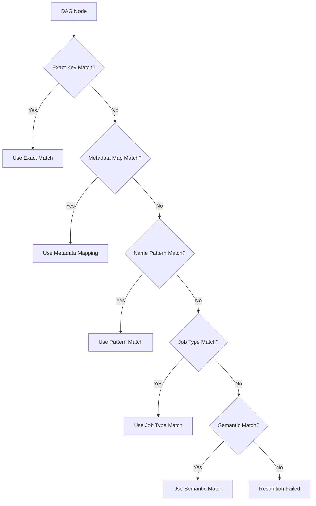
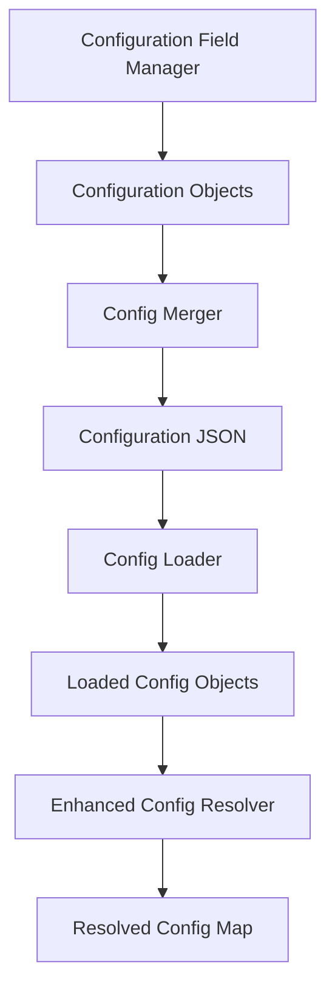

# Configuration Resolution Enhancements

## Overview

This design document outlines enhancements to the Configuration Resolution System used in the MODS framework. The resolution system is responsible for mapping DAG nodes to appropriate configuration instances, handling multiple instances of the same configuration class with different job types, and ensuring consistent behavior across the pipeline ecosystem. The proposed enhancements address several pain points identified in the current implementation, with a focus on improved resolution accuracy and reliability.

## Pain Points

The current configuration resolution system faces several challenges:

1. **Ambiguity with Same-Class Configurations**: The system struggles to correctly resolve DAG nodes when multiple instances of the same configuration class with different job types exist.

   ```
   Candidates for node 'CradleDataLoading_training':
     - CradleDataLoadConfig (job_type='training', confidence=1.00)
     - CradleDataLoadConfig (job_type='training', confidence=0.94)
   ```

2. **Priority of Matching Strategies**: The resolution algorithm doesn't properly prioritize exact name matches over pattern-based or semantic matching, leading to ambiguity when exact matches exist.

3. **Resolution Confidence Overlap**: The confidence scoring system produces similar scores for different matching strategies, making it difficult to select the most appropriate configuration.

4. **Configuration Loading Duplication**: The `load_configs` function creates additional instances based on metadata.config_types, potentially leading to duplicate configurations.

5. **Incomplete Step Name to Configuration Mapping**: The current system doesn't fully utilize the `metadata.config_types` mapping in the resolution process.

6. **Lack of Job Type-Aware Resolution**: While job types are used in step naming and configuration, the resolution process doesn't specifically prioritize job type matching.

## Design Goals

1. Enhance the configuration resolution system to:
   - Prioritize exact name matches over other strategies
   - Properly handle multiple instances of the same configuration class with different job types
   - Make better use of metadata from configuration files
   - Provide clearer error messages when resolution fails

2. Maintain backward compatibility with existing pipelines and configurations

3. Follow the three-tier configuration architecture principles:
   - Tier 1: Essential User Inputs (business requirements, model parameters)
   - Tier 2: System Inputs with sensible defaults
   - Tier 3: Derived values calculated from Tiers 1 and 2

## Enhanced Resolution Strategy

### 1. Tiered Resolution Approach

The enhanced resolution strategy employs a tiered approach to configuration matching:



#### Resolution Tiers:

1. **Exact Key Match**: Checks if the node name exactly matches a configuration key (highest priority)
2. **Metadata Map Match**: Checks if the node name is in the `metadata.config_types` mapping
3. **Name Pattern Match**: Parses node name using pattern recognition to extract config type and job type
4. **Job Type Match**: Matches based on job type and config class similarity
5. **Semantic Match**: Uses semantic similarity for matching (lowest priority)

### 2. Enhanced Direct Name Matching

The enhanced `_direct_name_matching` method immediately returns when an exact match is found:

```python
def _direct_name_matching(self, node_name: str, configs: Dict[str, BasePipelineConfig]) -> Optional[BasePipelineConfig]:
    """Match node name directly to configuration using enhanced matching."""
    
    # First priority: Direct match with config key
    if node_name in configs:
        self.logger.info(f"Found exact key match for node '{node_name}'")
        return configs[node_name]
    
    # Second priority: Check metadata.config_types mapping if available
    metadata_mapping = getattr(self, '_metadata_mapping', {})
    if node_name in metadata_mapping and metadata_mapping[node_name] in configs:
        self.logger.info(f"Found metadata mapping match for node '{node_name}'")
        return configs[metadata_mapping[node_name]]
    
    # Case-insensitive match as fallback
    node_lower = node_name.lower()
    for config_name, config in configs.items():
        if config_name.lower() == node_lower:
            self.logger.info(f"Found case-insensitive match for node '{node_name}': {config_name}")
            return config
    
    return None
```

### 3. Pattern-Based Node Name Analysis

A dedicated pattern analyzer extracts information from node names:

```python
def _parse_node_name(self, node_name: str) -> Dict[str, str]:
    """Parse node name to extract config type and job type information."""
    result = {}
    
    # Common patterns
    patterns = [
        # Pattern 1: ConfigType_JobType (e.g., CradleDataLoading_training)
        r'^([A-Za-z]+[A-Za-z0-9]*)_([a-z]+)$',
        
        # Pattern 2: JobType_Task (e.g., training_data_load)
        r'^([a-z]+)_([A-Za-z_]+)$',
    ]
    
    for pattern in patterns:
        match = re.match(pattern, node_name)
        if match:
            parts = match.groups()
            
            # Analyze parts to determine config_type and job_type
            if parts[0][0].isupper():  # First part starts with uppercase: ConfigType_JobType
                result['config_type'] = parts[0]
                result['job_type'] = parts[1]
            else:  # First part is lowercase: JobType_Task
                result['job_type'] = parts[0]
                
                # Try to infer config type from task
                task_map = {
                    'data_load': 'CradleDataLoading',
                    'preprocess': 'TabularPreprocessing',
                    'train': 'XGBoostTraining',
                    'eval': 'XGBoostModelEval',
                }
                
                for task_pattern, config_type in task_map.items():
                    if task_pattern in parts[1]:
                        result['config_type'] = config_type
                        break
            
            break
    
    return result
```

### 4. Modified Config Resolution Method

```python
def _resolve_single_node(self, node_name: str, available_configs: Dict[str, BasePipelineConfig]) -> Tuple[BasePipelineConfig, float, str]:
    """Resolve a single DAG node to a configuration using enhanced tiered approach."""
    
    # Tier 1: Try direct name matching - if successful, return with highest confidence
    direct_match = self._direct_name_matching(node_name, available_configs)
    if direct_match:
        return direct_match, 1.0, 'direct_name'
    
    # Tier 2: Parse node name for information
    parsed_info = self._parse_node_name(node_name)
    
    # Tier 3: Try job type matching if we extracted job type information
    if 'job_type' in parsed_info:
        job_type_matches = self._job_type_matching(parsed_info['job_type'], available_configs)
        
        # If we also know the config type, filter by that too
        if 'config_type' in parsed_info:
            filtered_matches = []
            config_type_lower = parsed_info['config_type'].lower()
            
            for config, confidence in job_type_matches:
                config_class_name = type(config).__name__.lower()
                if config_type_lower in config_class_name or config_class_name in config_type_lower:
                    # Boost confidence for matching both job_type and config_type
                    filtered_matches.append((config, min(confidence + 0.1, 1.0)))
            
            # If we found matches with both criteria, use those
            if filtered_matches:
                best_match = max(filtered_matches, key=lambda x: x[1])
                return best_match[0], best_match[1], 'job_type_and_config_type'
        
        # Otherwise use job type matches
        if job_type_matches:
            best_match = max(job_type_matches, key=lambda x: x[1])
            return best_match[0], best_match[1], 'job_type'
    
    # Tier 4: Fall back to other matching strategies
    candidates = []
    
    # Semantic matching
    semantic_matches = self._semantic_matching(node_name, available_configs)
    candidates.extend((config, confidence, 'semantic') for config, confidence in semantic_matches)
    
    # Pattern matching
    pattern_matches = self._pattern_matching(node_name, available_configs)
    candidates.extend((config, confidence, 'pattern') for config, confidence in pattern_matches)
    
    # If no candidates or none above threshold, resolution fails
    if not candidates:
        raise ResolutionError(f"No matching configurations found for node '{node_name}'")
    
    # Sort by confidence and return the best match
    candidates.sort(key=lambda x: x[1], reverse=True)
    best_match = candidates[0]
    
    # Check if confidence is above threshold
    if best_match[1] >= self.confidence_threshold:
        return best_match
    
    # If multiple matches with similar confidence, report ambiguity
    close_matches = [c for c in candidates if c[1] >= best_match[1] - 0.05]
    if len(close_matches) > 1:
        raise AmbiguityError(
            f"Multiple configurations match node '{node_name}' with similar confidence",
            candidates=close_matches
        )
    
    # Otherwise, return best match even below threshold (with warning)
    self.logger.warning(
        f"Using best match for '{node_name}' with below-threshold confidence {best_match[1]:.2f}"
    )
    return best_match
```

### 5. Integration with Metadata.config_types

The resolution system should utilize the `metadata.config_types` mapping from the configuration file:

```python
def resolve_config_map(
    self, 
    dag_nodes: List[str], 
    available_configs: Dict[str, BasePipelineConfig],
    metadata: Optional[Dict[str, Any]] = None
) -> Dict[str, BasePipelineConfig]:
    """Resolve DAG nodes to configurations with enhanced metadata handling."""
    
    # Extract metadata.config_types mapping if available
    self._metadata_mapping = {}
    if metadata and "config_types" in metadata:
        self._metadata_mapping = metadata["config_types"]
        self.logger.info(f"Using metadata.config_types mapping with {len(self._metadata_mapping)} entries")
    
    # Proceed with node resolution
    resolved_configs = {}
    unresolved_nodes = []
    
    for node_name in dag_nodes:
        try:
            config, confidence, method = self._resolve_single_node(node_name, available_configs)
            resolved_configs[node_name] = config
            self.logger.info(f"Resolved node '{node_name}' to {type(config).__name__} "
                            f"(job_type='{getattr(config, 'job_type', 'N/A')}') "
                            f"with confidence {confidence:.2f} using {method} matching")
        except (ResolutionError, AmbiguityError) as e:
            self.logger.warning(f"Failed to resolve node '{node_name}': {str(e)}")
            unresolved_nodes.append(node_name)
    
    # If any nodes are unresolved, raise an error
    if unresolved_nodes:
        available_config_names = list(available_configs.keys())
        raise ConfigurationError(
            f"Failed to resolve {len(unresolved_nodes)} DAG nodes to configurations",
            missing_configs=unresolved_nodes,
            available_configs=available_config_names
        )
    
    return resolved_configs
```

### 6. Enhanced Job Type Matching

```python
def _job_type_matching(self, job_type: str, configs: Dict[str, BasePipelineConfig]) -> List[Tuple[BasePipelineConfig, float]]:
    """Match configurations based on job type with improved accuracy."""
    matches = []
    
    normalized_job_type = job_type.lower()
    
    # For each config, check if the job_type matches
    for config_name, config in configs.items():
        if hasattr(config, 'job_type'):
            config_job_type = getattr(config, 'job_type', '').lower()
            
            # Exact job type match - high confidence
            if config_job_type == normalized_job_type:
                # Calculate config type confidence component
                type_confidence = 0.8  # Base confidence for job type match
                
                # Combine for total confidence
                matches.append((config, type_confidence))
            
            # Partial job type match - moderate confidence
            elif normalized_job_type in config_job_type or config_job_type in normalized_job_type:
                # Calculate similarity ratio
                similarity = SequenceMatcher(None, normalized_job_type, config_job_type).ratio()
                matches.append((config, 0.5 + (similarity * 0.3)))
    
    return sorted(matches, key=lambda x: x[1], reverse=True)
```

## Implementation Plan

### Phase 1: Enhanced Direct Name Matching

1. Modify `_direct_name_matching` to immediately return when an exact match is found
2. Update `_resolve_single_node` to prioritize direct name matches
3. Add better logging for resolution decisions
4. Implement `metadata.config_types` integration

### Phase 2: Pattern-Based Node Analysis

1. Implement the `_parse_node_name` method to extract information from node names
2. Enhance job type matching with config type awareness
3. Update the confidence scoring system

### Phase 3: Comprehensive Resolution Strategy

1. Implement the tiered resolution approach
2. Enhance error reporting with more detailed diagnostics
3. Update documentation and examples

### Phase 4: Testing and Validation

1. Create test cases for various resolution scenarios
2. Validate with existing pipelines
3. Measure resolution accuracy improvements

## Integration with Related Components

### 1. Configuration Field Management

The enhanced resolution system integrates with the three-tier configuration architecture:



### 2. Job Type Variant Handling

Integration with job type variant handling:


The job type is used in step name generation, stored in the `metadata.config_types` mapping, and leveraged by the enhanced resolver for precise matching.

### 3. Dynamic Pipeline Template

Integration with the dynamic template:

```python
class DynamicPipelineTemplate(PipelineTemplateBase):
    """Dynamic pipeline template with enhanced resolution."""
    
    def _create_config_map(self) -> Dict[str, BasePipelineConfig]:
        """Auto-map DAG nodes to configurations with enhanced resolution."""
        try:
            dag_nodes = list(self._dag.nodes)
            self.logger.info(f"Resolving {len(dag_nodes)} DAG nodes to configurations")
            
            # Extract metadata from loaded configuration
            metadata = None
            if hasattr(self, '_loaded_metadata'):
                metadata = self._loaded_metadata
            
            # Use the enhanced config resolver
            self._resolved_config_map = self._config_resolver.resolve_config_map(
                dag_nodes=dag_nodes,
                available_configs=self.configs,
                metadata=metadata  # Pass metadata for better resolution
            )
            
            self.logger.info(f"Successfully resolved all {len(self._resolved_config_map)} nodes")
            return self._resolved_config_map
            
        except Exception as e:
            self.logger.error(f"Failed to resolve DAG nodes to configurations: {e}")
            raise ConfigurationError(f"Configuration resolution failed: {e}")
```

## Benefits

1. **Improved Resolution Accuracy**: More reliable matching between DAG nodes and configurations
2. **Better Handling of Multiple Configurations**: Correct resolution when multiple instances of the same configuration class exist
3. **Enhanced Error Reporting**: More detailed diagnostics when resolution fails
4. **Seamless Integration**: Works with existing components without disrupting the ecosystem
5. **Pattern Recognition**: Intelligent extraction of information from node names
6. **Job Type Awareness**: Proper handling of job type variants throughout the pipeline

## Implementation Findings

After implementing and testing the enhanced config resolution system, we've made the following observations:

1. **Resolution Success**: The enhanced resolver successfully maps DAG nodes to the correct configurations with their job types. This is confirmed by the logs showing exact key matches and correct job type attribution:

   ```
   INFO - Found exact key match for node 'CradleDataLoading_training'
   INFO - Resolved node 'CradleDataLoading_training' to CradleDataLoadConfig (job_type='training') with confidence 1.00 using direct_name matching
   ```

2. **Integration with metadata**: The integration of metadata.config_types works effectively, with the system correctly loading and using these mappings:

   ```
   INFO - Using metadata.config_types mapping with 12 entries
   ```

3. **Related System Components**: While the configuration resolution is working correctly, validation still fails due to issues in related components, specifically the step builder registry. The system can't find appropriate step builders for some configurations:

   ```
   ERROR - Validation failed: 4 unresolvable builders
   
   Unresolvable Step Builders:
     - CradleDataLoading_training (CradleDataLoad)
     - Package (Package)
     - Payload (Payload)
     - CradleDataLoading_calibration (CradleDataLoad)
   ```

4. **Builder Registry Mismatch**: There appears to be a mismatch between the config class names and the step builder registry. This is not a problem with the config resolution itself but with how the step types are derived and mapped to builder classes.

## Next Steps

To complete the full implementation, the following additional changes are needed:

1. **Update Builder Registry**: The StepBuilderRegistry class needs to be updated to properly handle job type variants in step types. This involves:
   - Updating the `_config_class_to_step_type` method to preserve job type information
   - Ensuring the BUILDER_REGISTRY has appropriate mappings for all required step types
   - Adding support for variant-aware builder selection

2. **Job Type-Aware Builders**: The step builders themselves may need updates to properly handle job type variants, especially if they need to apply different logic based on the job type.

3. **Testing**: Additional testing should be performed to verify the complete pipeline works end-to-end with job type variants.

## Example Use Cases

### 1. Exact Name Matching

```python
# Configuration name matches DAG node name exactly
configs = {
    "CradleDataLoading_training": CradleDataLoadConfig(job_type="training"),
    "CradleDataLoading_calibration": CradleDataLoadConfig(job_type="calibration"),
    "XGBoostTraining": XGBoostTrainingConfig()
}

dag_nodes = ["CradleDataLoading_training", "CradleDataLoading_calibration", "XGBoostTraining"]

# Enhanced resolver will match each node to its exact configuration
resolved_map = resolver.resolve_config_map(dag_nodes, configs)
```

### 2. Job Type Resolution

```python
# DAG node names include job type information
configs = {
    "config1": CradleDataLoadConfig(job_type="training"),
    "config2": CradleDataLoadConfig(job_type="calibration"),
    "config3": XGBoostTrainingConfig()
}

dag_nodes = ["training_data_load", "calibration_data_load", "xgboost_train"]

# Enhanced resolver will match based on job type and inferred config type
resolved_map = resolver.resolve_config_map(dag_nodes, configs)
```

### 3. Complex Resolution

```python
# Mix of naming patterns
configs = {
    "DataLoading_training": CradleDataLoadConfig(job_type="training"),
    "DataLoading_calibration": CradleDataLoadConfig(job_type="calibration"),
    "Preprocessing_training": TabularPreprocessingConfig(job_type="training"),
    "Preprocessing_calibration": TabularPreprocessingConfig(job_type="calibration"),
    "XGBoostTraining": XGBoostTrainingConfig()
}

dag_nodes = [
    "CradleDataLoading_training",  # Pattern match
    "calibration_data_load",       # Job type match
    "training_preprocess",         # Job type + task inference
    "XGBoostTraining"              # Exact match
]

# Enhanced resolver handles all scenarios
resolved_map = resolver.resolve_config_map(dag_nodes, configs)
```

## References

1. [Dynamic Template Resolution](./dynamic_template_resolution.md)
2. [Job Type Variant Handling](./job_type_variant_handling.md)
3. [Config Types Format](./config_types_format.md)
4. [Config Field Categorization](./config_field_categorization.md)
5. [Three-Tier Configuration Architecture](./config_tiered_design.md)
6. [Dependency Resolution Improvement](./dependency_resolution_improvement.md)
7. [Step Builder Registry Design](./step_builder_registry_design.md)

## Related Issues

The following issues need to be addressed to complete the system's handling of job type variants:

1. **Circular Reference Warnings**: During configuration loading, circular references are detected in various configuration classes. While these don't prevent successful configuration loading, they should be investigated:

   ```
   WARNING - Circular reference detected during model deserialization.
   Object: CradleJobSpecificationConfig in src.pipeline_steps.config_data_load_step_cradle
   Field: unknown
   Original definition path: CradleJobSpecificationConfig()
   Reference path: 
   This creates a cycle in the object graph.
   ```

2. **Builder Registration**: The step builders for certain configurations are not properly registered or mapped:

   ```
   Unresolvable Step Builders:
     - CradleDataLoading_training (CradleDataLoad)
     - Package (Package)
     - Payload (Payload)
     - CradleDataLoading_calibration (CradleDataLoad)
   ```

3. **Builder Naming Convention**: There appears to be a mismatch between how configuration class names are converted to step types and how the builder registry maps these to builder classes. This naming convention issue needs to be resolved to ensure proper builder lookup.
