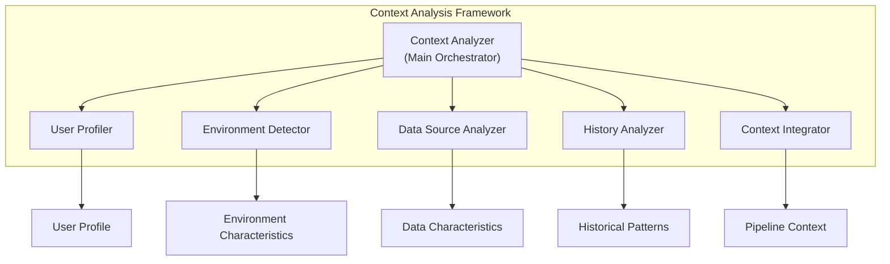

# Context Analysis Framework

## Overview

The Context Analysis Framework is a core component of the [Adaptive Configuration Management System](./adaptive_configuration_management_system.md) that provides comprehensive context understanding to inform intelligent configuration decisions. This framework analyzes user profiles, environment characteristics, data sources, and historical patterns to enable context-aware automation and optimization.

## Purpose and Responsibilities

The Context Analysis Framework serves as the intelligence foundation for the adaptive configuration system by:

1. **User Context Analysis**: Understanding user expertise, preferences, and historical patterns
2. **Environment Detection**: Analyzing deployment environments and resource constraints
3. **Data Source Analysis**: Characterizing data sources to inform optimal configurations
4. **Historical Pattern Recognition**: Learning from past configurations and outcomes
5. **Context Integration**: Combining multiple context sources into unified understanding

## Architecture Overview



## Core Components

### 1. Context Analyzer (Main Orchestrator)

The main orchestrator that coordinates all analysis components to build comprehensive context understanding.

```python
class ContextAnalyzer:
    """
    Main orchestrator for context analysis
    
    Coordinates multiple analysis components to build comprehensive
    understanding of the configuration context
    """
    
    def __init__(self):
        self.user_profiler = UserProfiler()
        self.environment_detector = EnvironmentDetector()
        self.data_analyzer = DataSourceAnalyzer()
        self.history_analyzer = HistoryAnalyzer()
        self.context_integrator = ContextIntegrator()
        self.cache_manager = ContextCacheManager()
    
    def analyze_full_context(self, 
                           user_id: str, 
                           request: ConfigRequest) -> PipelineContext:
        """Build comprehensive context for configuration decisions"""
        # Check cache first for performance
        cache_key = self._generate_cache_key(user_id, request)
        cached_context = self.cache_manager.get_cached_context(cache_key)
        if cached_context and not self._is_context_stale(cached_context):
            return cached_context
        
        # Analyze user context
        user_profile = self.user_profiler.get_profile(user_id)
        
        # Detect environment characteristics
        environment = self.environment_detector.detect_environment(request)
        
        # Analyze data source if provided
        data_characteristics = None
        if request.data_source:
            data_characteristics = self.data_analyzer.analyze_data_source(
                request.data_source, user_profile
            )
        
        # Get historical patterns
        historical_patterns = self.history_analyzer.get_user_patterns(
            user_id, request.pipeline_type
        )
        
        # Integrate all context sources
        integrated_context = self.context_integrator.integrate_context(
            user_profile=user_profile,
            environment=environment,
            data_characteristics=data_characteristics,
            historical_patterns=historical_patterns,
            request=request
        )
        
        # Cache the result
        self.cache_manager.cache_context(cache_key, integrated_context)
        
        return integrated_context
```

### 2. [User Profiler](./user_profiler_design.md)

**Purpose**: Analyzes user characteristics to build comprehensive user profiles

**Key Capabilities**:
- Expertise level analysis across different domains
- Interface preference tracking and adaptation
- Success/failure pattern recognition
- Learning velocity assessment

**Output**: `UserProfile` with expertise levels, preferences, and behavioral patterns

### 3. [Environment Detector](./environment_detector_design.md)

**Purpose**: Detects and analyzes deployment environment characteristics

**Key Capabilities**:
- AWS environment analysis (region, account, quotas)
- Resource constraint detection
- Security requirement analysis
- Cost constraint assessment

**Output**: `EnvironmentCharacteristics` with resource, security, and cost constraints

### 4. Data Source Analyzer

**Purpose**: Analyzes data sources to inform optimal configuration decisions

**Key Capabilities**:
- Data size estimation and complexity analysis
- Schema detection and analysis
- Processing requirement determination
- Resource recommendation generation

**Implementation**: See [Data Source Analyzer Design](./data_source_analyzer_design.md) for detailed implementation

### 5. History Analyzer

**Purpose**: Analyzes historical configuration patterns and outcomes

**Key Capabilities**:
- Success pattern detection
- Failure pattern identification
- Configuration preference analysis
- Trend analysis over time

**Implementation**: See [History Analyzer Design](./history_analyzer_design.md) for detailed implementation

### 6. Context Integrator

**Purpose**: Integrates multiple context sources into unified understanding

**Key Capabilities**:
- Context weight calculation
- Conflict resolution between sources
- Confidence estimation
- Insight generation

```python
class ContextIntegrator:
    """Integrates multiple context sources into unified understanding"""
    
    def integrate_context(self,
                         user_profile: UserProfile,
                         environment: EnvironmentCharacteristics,
                         data_characteristics: DataCharacteristics = None,
                         historical_patterns: HistoricalPatterns = None,
                         request: ConfigRequest = None) -> PipelineContext:
        """Integrate all context sources into unified context"""
        # Calculate context weights based on reliability and relevance
        context_weights = self.weight_calculator.calculate_weights(
            user_profile, environment, data_characteristics, historical_patterns
        )
        
        # Resolve conflicts between context sources
        resolved_context = self.conflict_resolver.resolve_conflicts(
            user_profile, environment, data_characteristics, 
            historical_patterns, context_weights
        )
        
        # Generate context insights
        insights = self._generate_context_insights(resolved_context)
        
        return PipelineContext(
            user_profile=user_profile,
            environment=environment,
            data_characteristics=data_characteristics,
            historical_patterns=historical_patterns,
            request=request,
            context_weights=context_weights,
            insights=insights,
            created_at=datetime.now()
        )
```

## Data Models

### Core Context Models

```python
@dataclass
class PipelineContext:
    """Complete context for pipeline configuration decisions"""
    user_profile: UserProfile
    environment: EnvironmentCharacteristics
    data_characteristics: Optional[DataCharacteristics]
    historical_patterns: Optional[HistoricalPatterns]
    request: ConfigRequest
    context_weights: ContextWeights
    confidence_scores: ConfidenceScores
    insights: ContextInsights
    created_at: datetime

@dataclass
class ContextInsights:
    """Actionable insights derived from context analysis"""
    insights: List[ContextInsight]
    
@dataclass
class ContextInsight:
    """Individual context insight with recommendations"""
    type: InsightType
    message: str
    confidence: float
    recommendations: List[str]
```

## Integration with Adaptive Configuration System

The Context Analysis Framework integrates with the main adaptive system through several key interfaces:

### 1. Intelligence Layer Integration

```python
class IntelligentProcessor:
    def __init__(self):
        self.context_analyzer = ContextAnalyzer()
        # ... other components
    
    def process_configuration(self, essential_inputs: dict, user_id: str) -> ProcessedConfiguration:
        # Build context first
        request = ConfigRequest.from_essential_inputs(essential_inputs)
        context = self.context_analyzer.analyze_full_context(user_id, request)
        
        # Use context for intelligent processing
        # ...
```

### 2. Interface Layer Integration

```python
class GuidedInterface:
    def __init__(self, user_id: str):
        self.context_analyzer = ContextAnalyzer()
        self.context = self.context_analyzer.analyze_full_context(
            user_id, ConfigRequest.for_guided_interface()
        )
    
    def collect_essential_inputs(self) -> EssentialInputsSession:
        # Use context to customize input collection
        return EssentialInputsSession(context=self.context)
```

## Performance Considerations

### 1. Caching Strategy

- **User Profile**: 1 hour TTL (frequently changing)
- **Environment**: 30 minutes TTL (moderately stable)
- **Data Characteristics**: 2 hours TTL (relatively stable)
- **Historical Patterns**: 24 hours TTL (slowly changing)

### 2. Async Processing

Components support parallel processing for high-performance scenarios:

```python
async def analyze_full_context_async(self, user_id: str, request: ConfigRequest) -> PipelineContext:
    """Async context analysis with parallel processing"""
    # Run analysis components in parallel
    tasks = [
        self.user_profiler.get_profile_async(user_id),
        self.environment_detector.detect_environment_async(request),
        self.data_analyzer.analyze_data_source_async(request.data_source)
    ]
    
    results = await asyncio.gather(*tasks)
    return self.context_integrator.integrate_context(*results)
```

## Testing Strategy

### Unit Testing
- Individual component testing with mock dependencies
- Context integration testing
- Caching behavior validation

### Integration Testing
- End-to-end context analysis pipeline
- Performance testing with various data sizes
- Error handling and fallback scenarios

## Usage Examples

### Basic Context Analysis
```python
# Initialize framework
context_analyzer = ContextAnalyzer()

# Analyze context for user request
context = context_analyzer.analyze_full_context(
    user_id="user_123",
    request=ConfigRequest(
        pipeline_type="xgboost_training",
        data_source="s3://bucket/data/"
    )
)

# Use context insights
for insight in context.insights.insights:
    print(f"Insight: {insight.message}")
    print(f"Recommendations: {insight.recommendations}")
```

### Context-Aware Configuration
```python
# Use context to inform configuration decisions
if context.user_profile.expertise_level == UserExpertiseLevel.BEGINNER:
    interface = GuidedInterface(context)
elif context.environment.cost_constraints.budget_limit:
    interface = CostOptimizedInterface(context)
else:
    interface = AdvancedInterface(context)
```

## Related Documents

### Component Design Documents
- **[User Profiler Design](./user_profiler_design.md)** - User analysis and profiling
- **[Environment Detector Design](./environment_detector_design.md)** - Environment analysis and constraints
- **[Data Source Analyzer Design](./data_source_analyzer_design.md)** - Data characterization and analysis
- **[History Analyzer Design](./history_analyzer_design.md)** - Historical pattern analysis

### System Integration
- **[Adaptive Configuration Management System](./adaptive_configuration_management_system.md)** - Main system architecture
- **[Intelligent Processing Engine](./intelligent_processing_engine.md)** - Intelligence layer implementation
- **[User Interface Adaptation](./user_interface_adaptation.md)** - Context-aware interface design

### Implementation Guides
- **[Context Analysis Implementation Guide](./context_analysis_implementation_guide.md)** - Step-by-step implementation
- **[Performance Optimization Guide](./context_performance_optimization.md)** - Performance tuning and optimization
