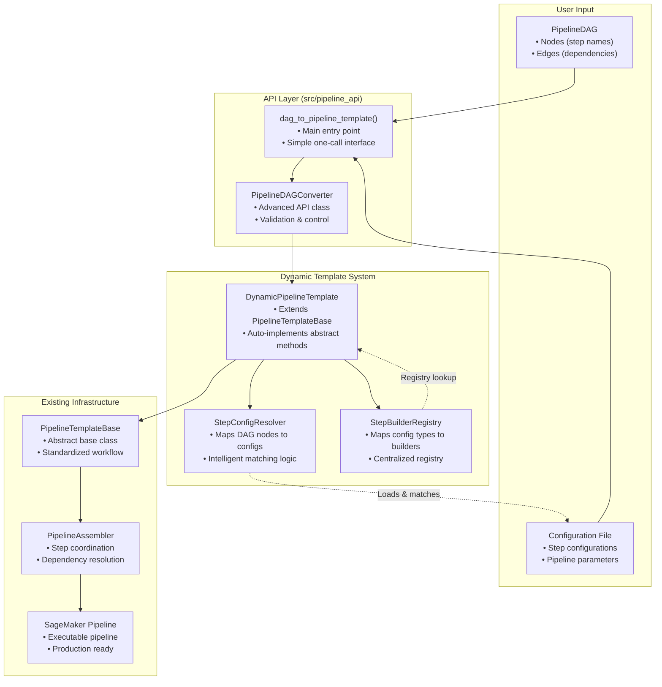

# DAG-to-Template API Design

## Overview

The DAG-to-Template API provides a high-level interface for converting PipelineDAG structures directly into executable SageMaker pipelines without requiring users to create custom template classes. This API bridges the gap between the flexible DAG representation and the robust pipeline building infrastructure.

## Problem Statement

Currently, users must:
1. Create a custom template class extending `PipelineTemplateBase`
2. Implement abstract methods for DAG creation, config mapping, and step builder mapping
3. Handle configuration validation and pipeline assembly manually

This creates significant boilerplate code and requires deep understanding of the pipeline building architecture. The DAG-to-Template API eliminates this complexity by providing a direct conversion path.

## Design Goals

### Primary Goals
1. **Simplicity**: Convert PipelineDAG + config file → SageMaker Pipeline in one API call
2. **Flexibility**: Support any DAG structure without custom template classes
3. **Automatic Resolution**: Intelligently map DAG nodes to configurations and step builders
4. **Validation**: Comprehensive validation of DAG-config compatibility
5. **Backward Compatibility**: Leverage existing PipelineTemplateBase architecture

### Secondary Goals
1. **Extensibility**: Easy to add new step types and builders
2. **Debugging**: Clear error messages and validation feedback
3. **Performance**: Efficient resolution and caching mechanisms
4. **Documentation**: Self-documenting API with rich examples

## Architecture Overview



## Core Components

### 1. Main API Functions

#### Primary Entry Point
```python
def dag_to_pipeline_template(
    dag: PipelineDAG,
    config_path: str,
    sagemaker_session: Optional[PipelineSession] = None,
    role: Optional[str] = None,
    pipeline_name: Optional[str] = None,
    **kwargs
) -> Pipeline:
    """
    Convert a PipelineDAG to a complete SageMaker Pipeline.
    
    This is the main entry point for users who want a simple, one-call
    conversion from DAG to pipeline.
    
    Args:
        dag: PipelineDAG instance defining the pipeline structure
        config_path: Path to configuration file containing step configs
        sagemaker_session: SageMaker session for pipeline execution
        role: IAM role for pipeline execution
        pipeline_name: Optional pipeline name override
        **kwargs: Additional arguments passed to template constructor
        
    Returns:
        Generated SageMaker Pipeline ready for execution
        
    Raises:
        ValueError: If DAG nodes don't have corresponding configurations
        ConfigurationError: If configuration validation fails
        RegistryError: If step builders not found for config types
        
    Example:
        >>> dag = PipelineDAG()
        >>> dag.add_node("data_load")
        >>> dag.add_node("preprocess")
        >>> dag.add_edge("data_load", "preprocess")
        >>> 
        >>> pipeline = dag_to_pipeline_template(
        ...     dag=dag,
        ...     config_path="configs/my_pipeline.json",
        ...     sagemaker_session=session,
        ...     role="arn:aws:iam::123456789012:role/SageMakerRole"
        ... )
        >>> pipeline.upsert()
    """
```

#### Advanced API Class
```python
class PipelineDAGConverter:
    """
    Advanced API for DAG-to-template conversion with additional control.
    
    This class provides more control over the conversion process, including
    validation, debugging, and customization options.
    """
    
    def __init__(
        self,
        config_path: str,
        sagemaker_session: Optional[PipelineSession] = None,
        role: Optional[str] = None,
        **kwargs
    ):
        """Initialize converter with configuration and session."""
        
    def validate_dag_compatibility(self, dag: PipelineDAG) -> ValidationResult:
        """
        Validate that DAG nodes have corresponding configurations.
        
        Returns detailed validation results including:
        - Missing configurations
        - Unresolvable step builders
        - Configuration validation errors
        - Dependency resolution issues
        """
        
    def preview_resolution(self, dag: PipelineDAG) -> ResolutionPreview:
        """
        Preview how DAG nodes will be resolved to configs and builders.
        
        Returns a detailed preview showing:
        - Node → Configuration mappings
        - Configuration → Step Builder mappings
        - Detected step types and dependencies
        - Potential issues or ambiguities
        """
        
    def convert(self, dag: PipelineDAG, **kwargs) -> Pipeline:
        """Convert DAG to pipeline with full control."""
        
    def convert_with_report(self, dag: PipelineDAG, **kwargs) -> Tuple[Pipeline, ConversionReport]:
        """Convert DAG to pipeline and return detailed conversion report."""
```

### 2. Dynamic Template System

#### DynamicPipelineTemplate
```python
class DynamicPipelineTemplate(PipelineTemplateBase):
    """
    Dynamic pipeline template that works with any PipelineDAG.
    
    This template automatically implements the abstract methods of
    PipelineTemplateBase by using intelligent resolution mechanisms
    to map DAG nodes to configurations and step builders.
    """
    
    def __init__(
        self,
        dag: PipelineDAG,
        config_path: str,
        **kwargs
    ):
        """
        Initialize dynamic template.
        
        Args:
            dag: PipelineDAG instance defining pipeline structure
            config_path: Path to configuration file
            **kwargs: Additional arguments for base template
        """
        self._dag = dag
        self._config_resolver = StepConfigResolver()
        self._builder_registry = StepBuilderRegistry()
        
        # Auto-detect required config classes based on DAG nodes
        self.CONFIG_CLASSES = self._detect_config_classes()
        
        super().__init__(config_path, **kwargs)
    
    def _detect_config_classes(self) -> Dict[str, Type[BasePipelineConfig]]:
        """
        Automatically detect required config classes from DAG nodes.
        
        This method analyzes the DAG structure and determines which
        configuration classes are needed based on:
        1. Node naming patterns
        2. Available configurations in the config file
        3. Step builder registry mappings
        """
        
    def _create_pipeline_dag(self) -> PipelineDAG:
        """Return the provided DAG."""
        return self._dag
        
    def _create_config_map(self) -> Dict[str, BasePipelineConfig]:
        """
        Auto-map DAG nodes to configurations.
        
        Uses StepConfigResolver to intelligently match DAG node names
        to configuration instances from the loaded config file.
        """
        return self._config_resolver.resolve_config_map(
            dag_nodes=self._dag.nodes,
            available_configs=self.configs
        )
        
    def _create_step_builder_map(self) -> Dict[str, Type[StepBuilderBase]]:
        """
        Auto-map step types to builders using registry.
        
        Uses StepBuilderRegistry to map configuration types to their
        corresponding step builder classes.
        """
        return self._builder_registry.get_builder_map()
        
    def _validate_configuration(self) -> None:
        """
        Validate that all DAG nodes have corresponding configs.
        
        Performs comprehensive validation including:
        1. All DAG nodes have matching configurations
        2. All configurations have corresponding step builders
        3. Configuration-specific validation passes
        4. Dependency resolution is possible
        """
```

#### StepConfigResolver
```python
class StepConfigResolver:
    """
    Resolves DAG nodes to configuration instances using intelligent matching.
    
    This class implements multiple resolution strategies to match DAG node
    names to configuration instances from the loaded configuration file.
    """
    
    def resolve_config_map(
        self,
        dag_nodes: List[str],
        available_configs: Dict[str, BasePipelineConfig]
    ) -> Dict[str, BasePipelineConfig]:
        """
        Resolve DAG nodes to configuration instances.
        
        Resolution strategies (in order of preference):
        1. Direct name matching
        2. Job type + config type matching
        3. Semantic similarity matching
        4. Pattern-based matching
        """
        
    def _direct_name_matching(self, node_name: str, configs: Dict) -> Optional[BasePipelineConfig]:
        """Match node name directly to config identifier."""
        
    def _job_type_matching(self, node_name: str, configs: Dict) -> Optional[BasePipelineConfig]:
        """Match based on job_type attribute and node naming patterns."""
        
    def _semantic_matching(self, node_name: str, configs: Dict) -> Optional[BasePipelineConfig]:
        """Use semantic similarity to match node names to config types."""
        
    def _pattern_matching(self, node_name: str, configs: Dict) -> Optional[BasePipelineConfig]:
        """Use regex patterns to match node names to config types."""
```

#### StepBuilderRegistry
```python
class StepBuilderRegistry:
    """
    Centralized registry mapping step types to builder classes.
    
    This registry maintains the mapping between step types and their
    corresponding step builder classes, enabling automatic resolution
    during pipeline construction. It uses the step_names registry as the
    single source of truth for step naming.
    """
    
    # Core registry mapping step types to builders - auto-populated during initialization
    BUILDER_REGISTRY = {}  
    
    # Legacy aliases for backward compatibility
    LEGACY_ALIASES = {
        "MIMSPackaging": "Package", 
        "MIMSPayload": "Payload",
        "ModelRegistration": "Registration",
        "PyTorchTraining": "PytorchTraining",
        "PyTorchModel": "PytorchModel",
    }
    
    @classmethod
    def discover_builders(cls):
        """Automatically discover and register step builders."""
        # Auto-discovery implementation that finds all builder classes
        # and registers them using the canonical names from step_names.py
    
    def get_builder_map(self) -> Dict[str, Type[StepBuilderBase]]:
        """Get the complete builder registry."""
        return self.BUILDER_REGISTRY.copy()
        
    def get_builder_for_config(self, config: BasePipelineConfig) -> Type[StepBuilderBase]:
        """Get step builder class for a specific configuration using step_names registry."""
        
    def _config_class_to_step_type(self, config_class_name: str) -> str:
        """Convert configuration class name to step type using step_names registry."""
        
    def register_builder(self, step_type: str, builder_class: Type[StepBuilderBase]):
        """Register a new step builder (for extensibility)."""
        
    def list_supported_step_types(self) -> List[str]:
        """List all supported step types including canonical names and legacy aliases."""
        
    def validate_registry(self) -> Dict[str, List[str]]:
        """Validate registry consistency with step_names registry."""
```

For detailed information on the Step Builder Registry, including auto-discovery, registration mechanisms, and integration with the step names registry, see the [Step Builder Registry Design](./step_builder_registry_design.md) document.

### 3. Validation and Error Handling

#### ValidationResult
```python
@dataclass
class ValidationResult:
    """Result of DAG-config compatibility validation."""
    is_valid: bool
    missing_configs: List[str]
    unresolvable_builders: List[str]
    config_errors: Dict[str, List[str]]
    dependency_issues: List[str]
    warnings: List[str]
    
    def summary(self) -> str:
        """Human-readable validation summary."""
        
    def detailed_report(self) -> str:
        """Detailed validation report with recommendations."""
```

#### ResolutionPreview
```python
@dataclass
class ResolutionPreview:
    """Preview of how DAG nodes will be resolved."""
    node_config_map: Dict[str, str]  # node -> config type
    config_builder_map: Dict[str, str]  # config type -> builder type
    resolution_confidence: Dict[str, float]  # confidence scores
    ambiguous_resolutions: List[str]
    recommendations: List[str]
    
    def display(self) -> str:
        """Display-friendly resolution preview."""
```

## Resolution Strategies

### 1. Direct Name Matching
Match DAG node names directly to configuration identifiers:
- Node: `"train_data_load"` → Config with identifier `"train_data_load"`
- Node: `"preprocessing_step"` → Config with identifier `"preprocessing_step"`

### 2. Job Type + Config Type Matching
Match based on job_type attribute and configuration type:
- Node: `"train_preprocess"` → `TabularPreprocessingConfig` with `job_type="training"`
- Node: `"calib_data_load"` → `CradleDataLoadConfig` with `job_type="calibration"`

### 3. Semantic Similarity Matching
Use semantic similarity to match node names to config types:
- Node: `"data_loading"` → `CradleDataLoadConfig` (high similarity)
- Node: `"model_training"` → `XGBoostTrainingConfig` (high similarity)

### 4. Pattern-Based Matching
Use regex patterns to identify step types:
- Pattern: `.*_data_load.*` → `CradleDataLoadConfig`
- Pattern: `.*_preprocess.*` → `TabularPreprocessingConfig`
- Pattern: `.*_train.*` → Training-related configs

## Handling Node Name Mismatches

### The Challenge

A critical aspect of the DAG-to-template conversion is handling cases where PipelineDAG node names don't directly correspond to registered step names or configuration identifiers. This is common in practice because:

1. **User Freedom**: Users should be able to name DAG nodes descriptively without being constrained by internal step type names
2. **Multiple Instances**: Users may want multiple instances of the same step type (e.g., `train_data_load`, `calib_data_load`, `eval_data_load`)
3. **Domain-Specific Naming**: Users may prefer domain-specific terminology over technical step names
4. **Legacy Compatibility**: Existing DAGs may use naming conventions that don't match current registry

### Resolution Process

The `StepConfigResolver` handles name mismatches through a multi-layered approach:

#### Layer 1: Direct Mapping
```python
# DAG node name matches configuration identifier exactly
dag.add_node("train_data_load")  # → Config with identifier "train_data_load"
```

#### Layer 2: Configuration Type Detection
```python
# Node name doesn't match config identifier, but we can infer the step type
dag.add_node("load_training_data")  # → CradleDataLoadConfig (any instance)
dag.add_node("preprocess_features")  # → TabularPreprocessingConfig (any instance)
dag.add_node("train_xgboost_model")  # → XGBoostTrainingConfig (any instance)
```

#### Layer 3: Job Type Disambiguation
```python
# Multiple configs of same type, disambiguated by job_type
dag.add_node("train_data_load")     # → CradleDataLoadConfig(job_type="training")
dag.add_node("calib_data_load")     # → CradleDataLoadConfig(job_type="calibration")
dag.add_node("eval_data_load")      # → CradleDataLoadConfig(job_type="evaluation")
```

#### Layer 4: Semantic Matching
```python
# Fuzzy matching based on semantic similarity
dag.add_node("etl_process")         # → TabularPreprocessingConfig (semantic match)
dag.add_node("model_fitting")       # → XGBoostTrainingConfig (semantic match)
dag.add_node("performance_check")   # → XGBoostModelEvalConfig (semantic match)
```

### Implementation Details

#### Step Type Inference Algorithm
```python
def _infer_step_type_from_node_name(self, node_name: str) -> List[str]:
    """
    Infer possible step types from DAG node name.
    
    Uses multiple techniques:
    1. Keyword matching (data_load → CradleDataLoading)
    2. Pattern matching (.*_train.* → Training steps)
    3. Semantic similarity (preprocessing → TabularPreprocessing)
    """
    
    possible_types = []
    node_lower = node_name.lower()
    
    # Keyword-based inference
    if any(keyword in node_lower for keyword in ['data', 'load', 'cradle']):
        possible_types.append('CradleDataLoading')
    
    if any(keyword in node_lower for keyword in ['preprocess', 'clean', 'transform']):
        possible_types.append('TabularPreprocessing')
    
    if any(keyword in node_lower for keyword in ['train', 'fit', 'learn']):
        possible_types.extend(['XGBoostTraining', 'PyTorchTraining', 'DummyTraining'])
    
    if any(keyword in node_lower for keyword in ['eval', 'test', 'assess']):
        possible_types.append('XGBoostModelEval')
    
    # Pattern-based inference
    for pattern, step_types in self.STEP_TYPE_PATTERNS.items():
        if re.match(pattern, node_lower):
            possible_types.extend(step_types)
    
    return list(set(possible_types))  # Remove duplicates
```

#### Configuration Selection Algorithm
```python
def _select_best_config_for_step_type(
    self, 
    node_name: str, 
    step_type: str, 
    available_configs: Dict[str, BasePipelineConfig]
) -> Tuple[BasePipelineConfig, float]:
    """
    Select the best configuration instance for a given step type.
    
    Selection criteria (in order of priority):
    1. job_type compatibility with node name
    2. Configuration identifier similarity to node name
    3. Configuration parameter relevance
    """
    
    candidates = []
    
    # Find all configs of the target step type
    target_configs = [
        (name, config) for name, config in available_configs.items()
        if self._get_step_type_from_config(config) == step_type
    ]
    
    if not target_configs:
        raise ConfigurationError(f"No {step_type} configurations found")
    
    # Score each candidate
    for config_name, config in target_configs:
        score = 0.0
        
        # Job type compatibility
        if hasattr(config, 'job_type'):
            job_type_score = self._calculate_job_type_compatibility(node_name, config.job_type)
            score += job_type_score * 0.5
        
        # Name similarity
        name_similarity = self._calculate_name_similarity(node_name, config_name)
        score += name_similarity * 0.3
        
        # Configuration relevance (domain-specific logic)
        relevance_score = self._calculate_config_relevance(node_name, config)
        score += relevance_score * 0.2
        
        candidates.append((config, score))
    
    # Return best candidate
    best_config, best_score = max(candidates, key=lambda x: x[1])
    return best_config, best_score
```

### Practical Examples

#### Example 1: Multiple Data Loading Steps
```python
# DAG with multiple data loading steps
dag = PipelineDAG()
dag.add_node("load_training_data")
dag.add_node("load_calibration_data")
dag.add_node("load_evaluation_data")

# Configuration file contains:
{
    "train_data": {
        "class": "CradleDataLoadConfig",
        "job_type": "training",
        "input_path": "s3://bucket/train/"
    },
    "calib_data": {
        "class": "CradleDataLoadConfig", 
        "job_type": "calibration",
        "input_path": "s3://bucket/calib/"
    },
    "eval_data": {
        "class": "CradleDataLoadConfig",
        "job_type": "evaluation", 
        "input_path": "s3://bucket/eval/"
    }
}

# Resolution process:
# 1. "load_training_data" → infer CradleDataLoading step type
# 2. Find CradleDataLoadConfig instances with job_type containing "train"
# 3. Match to "train_data" configuration (job_type="training")
```

#### Example 2: Domain-Specific Naming
```python
# DAG with domain-specific names
dag = PipelineDAG()
dag.add_node("customer_data_ingestion")
dag.add_node("feature_engineering")
dag.add_node("risk_model_training")
dag.add_node("model_performance_validation")

# Resolution process:
# "customer_data_ingestion" → CradleDataLoading (semantic: ingestion ≈ loading)
# "feature_engineering" → TabularPreprocessing (semantic: engineering ≈ preprocessing)
# "risk_model_training" → XGBoostTraining (semantic: training ≈ training)
# "model_performance_validation" → XGBoostModelEval (semantic: validation ≈ evaluation)
```

#### Example 3: Legacy DAG Integration
```python
# Existing DAG with legacy naming conventions
dag = PipelineDAG()
dag.add_node("step_001_data_extraction")
dag.add_node("step_002_data_cleaning")
dag.add_node("step_003_model_build")
dag.add_node("step_004_model_test")

# Resolution process:
# "step_001_data_extraction" → CradleDataLoading (pattern: .*data.*extraction.*)
# "step_002_data_cleaning" → TabularPreprocessing (pattern: .*data.*clean.*)
# "step_003_model_build" → XGBoostTraining (pattern: .*model.*build.*)
# "step_004_model_test" → XGBoostModelEval (pattern: .*model.*test.*)
```

### Confidence Scoring and Ambiguity Resolution

The resolver assigns confidence scores to each potential match:

#### Confidence Score Calculation
```python
def _calculate_resolution_confidence(
    self,
    node_name: str,
    config: BasePipelineConfig,
    method: str
) -> float:
    """
    Calculate confidence score for a node-config match.
    
    Factors considered:
    1. Method type (direct=1.0, job_type=0.7-1.0, semantic=0.5-0.8, pattern=0.6-0.9)
    2. Name similarity (string matching algorithms)
    3. Job type compatibility (keyword matching)
    4. Configuration parameter relevance
    """
    
    base_confidence = {
        'direct_name': 1.0,
        'job_type': 0.7,
        'semantic': 0.6,
        'pattern': 0.6
    }.get(method, 0.5)
    
    # Boost confidence based on additional factors
    boost = 0.0
    
    # Name similarity boost
    name_similarity = self._calculate_name_similarity(node_name, config.identifier)
    boost += name_similarity * 0.2
    
    # Job type compatibility boost
    if hasattr(config, 'job_type'):
        job_compatibility = self._calculate_job_type_compatibility(node_name, config.job_type)
        boost += job_compatibility * 0.2
    
    # Parameter relevance boost (domain-specific)
    param_relevance = self._calculate_parameter_relevance(node_name, config)
    boost += param_relevance * 0.1
    
    return min(base_confidence + boost, 1.0)
```

#### Ambiguity Detection and Resolution
```python
def _handle_ambiguous_matches(
    self,
    node_name: str,
    candidates: List[Tuple[BasePipelineConfig, float, str]]
) -> BasePipelineConfig:
    """
    Handle cases where multiple configurations match with similar confidence.
    
    Resolution strategies:
    1. If confidence difference > 0.1, select highest
    2. If similar confidence, prefer more specific job_type match
    3. If still ambiguous, prefer configuration with more relevant parameters
    4. If still ambiguous, raise AmbiguityError with suggestions
    """
    
    if not candidates:
        raise ConfigurationError(f"No candidates found for node '{node_name}'")
    
    # Sort by confidence
    candidates.sort(key=lambda x: x[1], reverse=True)
    best_config, best_confidence, best_method = candidates[0]
    
    # Check for ambiguity
    if len(candidates) > 1:
        second_confidence = candidates[1][1]
        
        if abs(best_confidence - second_confidence) < 0.1:
            # Ambiguous - try additional disambiguation
            disambiguated = self._disambiguate_candidates(node_name, candidates[:3])
            
            if disambiguated:
                return disambiguated
            else:
                # Still ambiguous - raise error with suggestions
                raise AmbiguityError(
                    f"Multiple configurations match node '{node_name}' with similar confidence",
                    node_name=node_name,
                    candidates=[
                        {
                            'config_type': type(config).__name__,
                            'confidence': confidence,
                            'job_type': getattr(config, 'job_type', 'N/A'),
                            'method': method
                        }
                        for config, confidence, method in candidates[:3]
                    ]
                )
    
    return best_config
```

### Error Recovery and Suggestions

When resolution fails, the system provides actionable suggestions:

#### Missing Configuration Suggestions
```python
def _generate_missing_config_suggestions(
    self,
    node_name: str,
    inferred_step_types: List[str]
) -> List[str]:
    """Generate suggestions for missing configurations."""
    
    suggestions = []
    
    if inferred_step_types:
        primary_type = inferred_step_types[0]
        suggestions.append(f"Add {primary_type}Config with identifier '{node_name}'")
        
        # Suggest job_type if node name contains job indicators
        job_indicators = self._extract_job_indicators(node_name)
        if job_indicators:
            suggestions.append(f"Use job_type='{job_indicators[0]}' in configuration")
        
        # Suggest alternative node names
        canonical_names = self._get_canonical_names_for_step_type(primary_type)
        if canonical_names:
            suggestions.append(f"Consider renaming node to: {', '.join(canonical_names[:3])}")
    
    else:
        # No step type inferred - suggest based on common patterns
        suggestions.append("Use more descriptive node name (e.g., 'data_load', 'preprocess', 'train')")
        suggestions.append("Check available configurations and use matching identifiers")
    
    return suggestions
```

#### Configuration Mismatch Suggestions
```python
def _generate_mismatch_suggestions(
    self,
    node_name: str,
    available_configs: Dict[str, BasePipelineConfig]
) -> List[str]:
    """Generate suggestions for configuration mismatches."""
    
    suggestions = []
    
    # Find closest matching configurations
    closest_matches = self._find_closest_config_matches(node_name, available_configs)
    
    if closest_matches:
        suggestions.append("Consider using these similar configurations:")
        for config_name, similarity in closest_matches[:3]:
            suggestions.append(f"  - '{config_name}' (similarity: {similarity:.2f})")
    
    # Suggest node name modifications
    config_types = set(type(config).__name__ for config in available_configs.values())
    for config_type in config_types:
        step_type = self._config_class_to_step_type(config_type)
        canonical_names = self._get_canonical_names_for_step_type(step_type)
        if canonical_names:
            suggestions.append(f"For {step_type}, consider: {', '.join(canonical_names[:2])}")
    
    return suggestions
```

### Integration with Existing Step Registry

The resolution system integrates seamlessly with the existing step registry:

#### Registry Consistency Checks
```python
def _validate_registry_consistency(self) -> Dict[str, List[str]]:
    """
    Validate consistency between different registries.
    
    Checks:
    1. All config types have corresponding step builders
    2. All step types are properly registered
    3. Naming conventions are consistent
    """
    
    issues = {'warnings': [], 'errors': []}
    
    # Check config-to-builder mappings
    for step_type, builder_class in self.BUILDER_REGISTRY.items():
        config_types = self._get_config_types_for_step_type(step_type)
        
        if not config_types:
            issues['warnings'].append(f"Step type '{step_type}' has no associated config types")
    
    # Check for orphaned configurations
    all_config_classes = build_complete_config_classes()
    for config_name, config_class in all_config_classes.items():
        step_type = self._config_class_to_step_type(config_name)
        
        if step_type not in self.BUILDER_REGISTRY:
            issues['errors'].append(f"Config '{config_name}' has no registered builder")
    
    return issues
```

This comprehensive approach to handling node name mismatches ensures that users have maximum flexibility in naming their DAG nodes while still maintaining robust, intelligent resolution to the appropriate configurations and step builders.

## Usage Examples

### Simple Usage
```python
from src.pipeline_api import dag_to_pipeline_template
from src.pipeline_dag.base_dag import PipelineDAG

# Create DAG
dag = PipelineDAG()
dag.add_node("train_data_load")
dag.add_node("train_preprocess")
dag.add_node("xgboost_train")
dag.add_edge("train_data_load", "train_preprocess")
dag.add_edge("train_preprocess", "xgboost_train")

# Convert to pipeline
pipeline = dag_to_pipeline_template(
    dag=dag,
    config_path="configs/xgboost_config.json",
    sagemaker_session=session,
    role="arn:aws:iam::123456789012:role/SageMakerRole"
)

# Execute pipeline
pipeline.upsert()
execution = pipeline.start()
```

### Advanced Usage with Validation
```python
from src.pipeline_api import PipelineDAGConverter

# Initialize converter
converter = PipelineDAGConverter(
    config_path="configs/complex_pipeline.json",
    sagemaker_session=session,
    role=role
)

# Validate compatibility
validation = converter.validate_dag_compatibility(dag)
if not validation.is_valid:
    print("Validation Issues:")
    print(validation.detailed_report())
    exit(1)

# Preview resolution
preview = converter.preview_resolution(dag)
print("Resolution Preview:")
print(preview.display())

# Convert with detailed reporting
pipeline, report = converter.convert_with_report(dag)
print(f"Pipeline created with {len(report.steps)} steps")
print(f"Resolution confidence: {report.avg_confidence:.2f}")
```

### Complex Multi-Model Pipeline
```python
# Create complex DAG with multiple branches
dag = PipelineDAG()

# Training branch
dag.add_node("train_data_load")
dag.add_node("train_preprocess")
dag.add_node("xgboost_train")

# Calibration branch
dag.add_node("calib_data_load")
dag.add_node("calib_preprocess")
dag.add_node("model_calibration")

# Evaluation branch
dag.add_node("eval_data_load")
dag.add_node("eval_preprocess")
dag.add_node("model_evaluation")

# Registration and deployment
dag.add_node("model_packaging")
dag.add_node("model_registration")

# Define dependencies
dag.add_edge("train_data_load", "train_preprocess")
dag.add_edge("train_preprocess", "xgboost_train")
dag.add_edge("calib_data_load", "calib_preprocess")
dag.add_edge("calib_preprocess", "model_calibration")
dag.add_edge("xgboost_train", "model_calibration")
dag.add_edge("eval_data_load", "eval_preprocess")
dag.add_edge("eval_preprocess", "model_evaluation")
dag.add_edge("model_calibration", "model_evaluation")
dag.add_edge("model_evaluation", "model_packaging")
dag.add_edge("model_packaging", "model_registration")

# Convert to pipeline
pipeline = dag_to_pipeline_template(
    dag=dag,
    config_path="configs/multi_model_pipeline.json",
    sagemaker_session=session,
    role=role,
    pipeline_name="complex-multi-model-pipeline"
)
```

## Error Handling and Debugging

### Common Error Scenarios

1. **Missing Configuration**: DAG node has no corresponding configuration
   ```
   ConfigurationError: Node 'train_preprocess' has no matching configuration.
   Available configs: ['train_data_load', 'xgboost_train']
   Suggestion: Add TabularPreprocessingConfig with job_type='training'
   ```

2. **Unresolvable Step Builder**: Configuration type has no registered builder
   ```
   RegistryError: No step builder found for config type 'CustomProcessingConfig'
   Available builders: ['CradleDataLoading', 'TabularPreprocessing', ...]
   Suggestion: Register builder or use supported config type
   ```

3. **Ambiguous Resolution**: Multiple configs could match a node
   ```
   AmbiguityError: Node 'preprocess' matches multiple configs:
   - TabularPreprocessingConfig (job_type='training', confidence=0.8)
   - TabularPreprocessingConfig (job_type='calibration', confidence=0.8)
   Suggestion: Use more specific node names or direct mapping
   ```

### Debugging Features

1. **Resolution Tracing**: Detailed logs of resolution process
2. **Confidence Scoring**: Numerical confidence for each resolution
3. **Alternative Suggestions**: Recommendations for failed resolutions
4. **Validation Reports**: Comprehensive validation with actionable feedback

## Integration with Existing Architecture

### Leveraging PipelineTemplateBase
The dynamic template extends the existing `PipelineTemplateBase` architecture:
- Inherits all lifecycle management and best practices
- Uses existing `PipelineAssembler` for step coordination
- Maintains compatibility with existing dependency resolution
- Supports all existing configuration and builder classes

### Registry Integration
Integrates with existing registries:
- Uses `CONFIG_STEP_REGISTRY` for config-to-step-type mapping
- Leverages `STEP_NAMES` registry for consistency
- Maintains backward compatibility with existing templates

### Dependency Resolution
Works seamlessly with existing dependency resolution:
- Uses same `RegistryManager` and `UnifiedDependencyResolver`
- Maintains specification-based dependency matching
- Supports all existing step specifications and contracts

## Performance Considerations

### Caching Strategies
1. **Config Resolution Cache**: Cache node-to-config mappings
2. **Builder Registry Cache**: Cache builder lookups
3. **Validation Cache**: Cache validation results for identical DAGs

### Optimization Techniques
1. **Lazy Loading**: Load configurations only when needed
2. **Parallel Resolution**: Resolve multiple nodes concurrently
3. **Early Validation**: Fail fast on obvious incompatibilities

## Extensibility

### Adding New Step Types
1. Create configuration class extending `BasePipelineConfig`
2. Create step builder class extending `StepBuilderBase`
3. Register in `StepBuilderRegistry.BUILDER_REGISTRY`
4. Add to resolution patterns if needed

### Custom Resolution Strategies
```python
class CustomConfigResolver(StepConfigResolver):
    def _custom_matching(self, node_name: str, configs: Dict) -> Optional[BasePipelineConfig]:
        """Implement custom resolution logic."""
        pass

# Use custom resolver
converter = PipelineDAGConverter(
    config_path="configs/pipeline.json",
    config_resolver=CustomConfigResolver()
)
```

## Testing Strategy

### Unit Tests
1. **Resolution Logic**: Test all resolution strategies
2. **Validation Logic**: Test validation scenarios
3. **Registry Operations**: Test builder registry functionality
4. **Error Handling**: Test error scenarios and messages

### Integration Tests
1. **End-to-End Conversion**: Test complete DAG-to-pipeline conversion
2. **Complex DAGs**: Test with multi-branch, complex topologies
3. **Real Configurations**: Test with actual pipeline configurations
4. **Error Recovery**: Test error handling and recovery

### Performance Tests
1. **Large DAGs**: Test with 50+ node DAGs
2. **Resolution Speed**: Benchmark resolution performance
3. **Memory Usage**: Monitor memory consumption
4. **Concurrent Usage**: Test thread safety

## Future Enhancements

### Phase 1 (Core Implementation)
- Basic DAG-to-template conversion
- Simple resolution strategies
- Core validation and error handling

### Phase 2 (Advanced Features)
- Semantic similarity matching
- Advanced validation and debugging
- Performance optimizations

### Phase 3 (Ecosystem Integration)
- Visual DAG builder integration
- Pipeline optimization suggestions
- Advanced debugging tools

## Related Documentation

- [Step Builder Registry Design](./step_builder_registry_design.md): Registry for step builders with auto-discovery
- [Pipeline Template Base](pipeline_template_base.md): Foundation architecture
- [Pipeline Assembler](pipeline_assembler.md): Step coordination system
- [Pipeline DAG](../pipeline_dag/README.md): DAG structure and algorithms
- [Pipeline Dependencies](../pipeline_deps/README.md): Dependency resolution system
- [Pipeline Steps](../pipeline_steps/README.md): Step builders and configurations

---

This design provides a comprehensive, user-friendly API for converting PipelineDAG structures to executable SageMaker pipelines while maintaining full compatibility with the existing pipeline building infrastructure.
