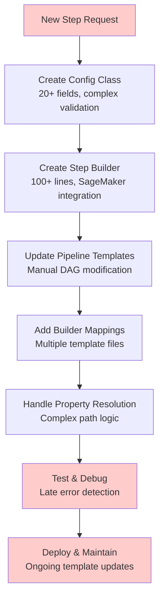
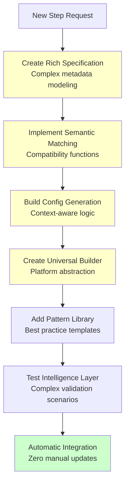
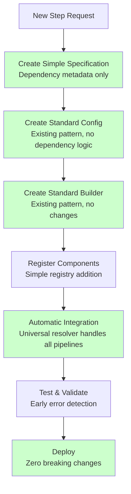

# Developer Perspective: Pipeline Design Philosophy Comparison

## Overview

This document provides a developer-focused analysis of the three pipeline design philosophies, examining their impact on development velocity, maintainability, and adaptability to new requirements. Special emphasis is placed on the developer experience when adding new pipeline steps.

## Related Documents
- **[Config-Driven Design](./config_driven_design.md)** - Current production implementation
- **[Specification-Driven Design](./specification_driven_design.md)** - Pure declarative approach
- **[Hybrid Design](./hybrid_design.md)** - **RECOMMENDED**: Best of both worlds approach

## Executive Summary

| Aspect | Config-Driven | Specification-Driven | **Hybrid (Recommended)** |
|--------|---------------|---------------------|--------------------------|
| **Developer Complexity** | High (Expert-level) | Medium (Business-focused) | **Tiered (Matches expertise)** |
| **New Step Development** | 5+ files, weeks | Complex specification | **3 files, existing patterns** |
| **Adaptability Score** | 3/10 | 7/10 | **9/10** |
| **Learning Curve** | Steep | Moderate | **Gradual** |
| **Maintenance Overhead** | High | Medium | **Low** |
| **Breaking Changes Risk** | High | High | **None** |

## Developer Experience Analysis

### 1. Config-Driven Design (Current Implementation)

#### Developer Profile
- **Target Audience**: Expert platform engineers with deep SageMaker knowledge
- **Required Skills**: Pydantic, SageMaker APIs, complex property resolution, template management
- **Learning Curve**: 2-3 months to become proficient

#### Development Workflow


#### Code Example: Adding DeepLearningTraining Step
```python
# Step 1: Create comprehensive config class (50+ lines)
@dataclass
class DeepLearningTrainingConfig(BasePipelineConfig):
    # SageMaker-specific configuration
    instance_type: str = "ml.p3.2xlarge"
    instance_count: int = 1
    volume_size: int = 100
    max_runtime_in_seconds: int = 172800
    
    # Framework-specific configuration
    framework_version: str = "2.0.1"
    py_version: str = "py39"
    entry_point: str = "train_dl.py"
    source_dir: str = "src/deep_learning"
    
    # Algorithm-specific configuration
    learning_rate: float = 0.001
    batch_size: int = 32
    epochs: int = 100
    optimizer: str = "adam"
    
    # Complex input/output configuration
    input_names: Dict[str, str] = field(default_factory=lambda: {
        "training_data": "training",
        "validation_data": "validation",
        "model_config": "config"
    })
    output_names: Dict[str, str] = field(default_factory=lambda: {
        "model_artifacts": "model",
        "training_metrics": "metrics",
        "tensorboard_logs": "logs"
    })

# Step 2: Create step builder (100+ lines)
class DeepLearningTrainingStepBuilder(StepBuilderBase):
    def __init__(self, config: DeepLearningTrainingConfig):
        self.config = config
        
    def create_step(self, **kwargs) -> TrainingStep:
        # Complex SageMaker integration logic
        estimator = PyTorch(
            entry_point=self.config.entry_point,
            source_dir=self.config.source_dir,
            framework_version=self.config.framework_version,
            py_version=self.config.py_version,
            instance_type=self.config.instance_type,
            instance_count=self.config.instance_count,
            volume_size=self.config.volume_size,
            max_run=self.config.max_runtime_in_seconds,
            hyperparameters={
                'learning_rate': self.config.learning_rate,
                'batch_size': self.config.batch_size,
                'epochs': self.config.epochs,
                'optimizer': self.config.optimizer
            }
        )
        
        # Complex input extraction logic
        inputs = self._extract_inputs_from_dependencies(**kwargs)
        
        return TrainingStep(
            name=self.config.step_name,
            estimator=estimator,
            inputs=inputs
        )
    
    def get_input_requirements(self) -> Dict[str, str]:
        return {
            "training_data": "S3 URI to processed training data",
            "validation_data": "S3 URI to processed validation data",
            "model_config": "S3 URI to model configuration"
        }
    
    def get_output_properties(self) -> Dict[str, str]:
        return {
            "model_artifacts": "properties.ModelArtifacts.S3ModelArtifacts",
            "training_metrics": "properties.ProcessingOutputConfig.Outputs[0].S3Output.S3Uri",
            "tensorboard_logs": "properties.ProcessingOutputConfig.Outputs[1].S3Output.S3Uri"
        }

# Step 3: Update EVERY pipeline template manually
def create_xgboost_end_to_end_pipeline():
    # Manual node addition
    nodes = [
        "CradleDataLoading_Training",
        "TabularPreprocessing_Training",
        "XGBoostTraining",
        "DeepLearningTraining",  # Manual addition
        "XGBoostModel",
        # ... rest of nodes
    ]
    
    # Manual edge addition
    edges = [
        ("CradleDataLoading_Training", "TabularPreprocessing_Training"),
        ("TabularPreprocessing_Training", "XGBoostTraining"),
        ("TabularPreprocessing_Training", "DeepLearningTraining"),  # Manual addition
        ("XGBoostTraining", "XGBoostModel"),
        # ... rest of edges
    ]
    
    # Manual builder mapping
    BUILDER_MAP = {
        "CradleDataLoading": CradleDataLoadingStepBuilder,
        "TabularPreprocessing": TabularPreprocessingStepBuilder,
        "XGBoostTraining": XGBoostTrainingStepBuilder,
        "DeepLearningTraining": DeepLearningTrainingStepBuilder,  # Manual addition
        # ... rest of mappings
    }

# Step 4: Repeat for pytorch_pipeline.py, evaluation_pipeline.py, etc.
# Each template file needs manual updates
```

#### Developer Pain Points
- **Template Proliferation**: Each pipeline type needs manual updates
- **Complex Property Resolution**: Debugging property path failures requires deep system knowledge
- **Late Error Detection**: Many issues only surface during pipeline execution
- **Maintenance Overhead**: Changes to step interfaces impact multiple templates
- **Knowledge Barrier**: Requires expert-level understanding of internal architecture

#### Adaptability Assessment
**Score: 3/10** - High friction for new step development

**Time Investment**:
- Initial development: 2-3 weeks
- Template updates: 1 week per pipeline type
- Testing and debugging: 1-2 weeks
- **Total: 4-6 weeks per new step type**

### 2. Specification-Driven Design (Pure Declarative)

#### Developer Profile
- **Target Audience**: Business-focused developers, data scientists
- **Required Skills**: Domain knowledge, high-level ML concepts, specification modeling
- **Learning Curve**: 2-4 weeks for users, 3-6 months for system developers

#### Development Workflow


#### Code Example: Adding DeepLearningTraining Step
```python
# Step 1: Create comprehensive specification (complex metadata)
DEEP_LEARNING_TRAINING_SPEC = StepSpecification(
    step_type="DeepLearningTraining",
    version="1.0",
    description="Train deep learning models using PyTorch framework",
    
    # Rich capability description
    input_types=[
        DataType.PROCESSED_TABULAR,
        DataType.FEATURE_ENGINEERED_TABULAR,
        DataType.IMAGE_DATA,
        DataType.TEXT_DATA
    ],
    output_types=[
        DataType.PYTORCH_MODEL,
        DataType.TRAINING_METRICS,
        DataType.TENSORBOARD_LOGS
    ],
    
    # Complex dependency specifications
    dependencies=[
        DependencySpec(
            logical_name="training_data",
            compatible_sources=["TabularPreprocessing", "FeatureEngineering", "ImagePreprocessing"],
            data_types=[DataType.PROCESSED_TABULAR, DataType.IMAGE_DATA],
            semantic_keywords=["training", "processed", "features"],
            compatibility_function=lambda source_spec: (
                source_spec.quality_score > 0.8 and
                "deep_learning_ready" in source_spec.capabilities
            ),
            quality_requirements=QualitySpec(
                min_data_quality_score=0.8,
                required_columns=["features", "target"],
                max_missing_values_ratio=0.01
            )
        ),
        DependencySpec(
            logical_name="model_config",
            compatible_sources=["ModelConfiguration", "HyperparameterTuning"],
            data_types=[DataType.MODEL_CONFIG],
            semantic_keywords=["config", "hyperparameters", "architecture"]
        )
    ],
    
    # Resource and performance modeling
    resource_requirements=ResourceSpec(
        min_cpu_cores=4,
        min_memory_gb=16,
        min_gpu_memory_gb=8,
        preferred_instance_types=["ml.p3.2xlarge", "ml.p3.8xlarge"],
        supports_gpu=True,
        requires_gpu=True
    ),
    
    # Cost and performance models
    cost_model=CostModel(
        base_cost_per_hour=3.06,  # ml.p3.2xlarge
        scaling_factor=1.5,
        cost_per_gb_data=0.02,
        gpu_premium=2.0
    ),
    
    performance_model=PerformanceModel(
        training_time_formula="0.5 * data_size_gb + 0.1 * epochs * batch_size",
        accuracy_expectations={"min": 0.75, "typical": 0.88, "max": 0.95},
        convergence_characteristics={
            "early_stopping_patience": 10,
            "learning_rate_schedule": "cosine_annealing"
        }
    ),
    
    # Optimization characteristics
    scaling_characteristics=ScalingSpec(
        horizontal_scaling=True,
        max_instances=8,
        scaling_efficiency=0.85,
        memory_scaling_factor=1.2
    )
)

# Step 2: Implement intelligent config generation
class DeepLearningConfigGenerator:
    def generate_config(self, step_type: str, context: PipelineContext) -> DeepLearningTrainingConfig:
        # Context-aware configuration generation
        base_config = self._get_base_config()
        
        # Data size optimization
        if context.data_size > 100_000_000:  # Large dataset
            base_config.instance_type = "ml.p3.8xlarge"
            base_config.batch_size = 64
            base_config.instance_count = 2
        elif context.data_size < 1_000_000:  # Small dataset
            base_config.instance_type = "ml.p3.2xlarge"
            base_config.batch_size = 16
            base_config.epochs = 200  # More epochs for small data
        
        # Priority-based optimization
        if context.priority == "speed":
            base_config.epochs = min(base_config.epochs, 50)
            base_config.early_stopping_patience = 5
        elif context.priority == "accuracy":
            base_config.epochs = max(base_config.epochs, 200)
            base_config.learning_rate = 0.0001  # Lower for better convergence
        
        # Budget constraints
        if context.budget_constraint:
            base_config = self._optimize_for_cost(base_config, context.budget_constraint)
        
        return base_config

# Step 3: Universal step builder integration
class UniversalStepBuilder:
    def create_deep_learning_step(self, config: DeepLearningTrainingConfig, **kwargs) -> TrainingStep:
        # Automatic platform abstraction
        estimator = self._create_framework_estimator(config)
        inputs = self._resolve_inputs_automatically(config, **kwargs)
        
        return TrainingStep(
            name=config.step_name,
            estimator=estimator,
            inputs=inputs
        )

# Step 4: Automatic integration with ALL pipelines
# No manual updates needed - specification resolver handles everything
```

#### Developer Benefits
- **Automatic Integration**: New steps work in all pipelines immediately
- **Intelligent Optimization**: Context-aware parameter selection
- **Business-Focused Interface**: High-level abstractions
- **Semantic Error Messages**: Clear, actionable feedback

#### Developer Challenges
- **Complex Specification System**: Rich metadata modeling requires deep understanding
- **Black Box Behavior**: Automatic decisions can be hard to debug
- **High Learning Curve**: System developers need to understand complex automation logic
- **Testing Complexity**: Validating intelligent behavior across many scenarios

#### Adaptability Assessment
**Score: 7/10** - Easy for users, complex for system extension

**Time Investment**:
- Specification development: 1-2 weeks
- Intelligence layer implementation: 2-4 weeks
- Testing and validation: 1-2 weeks
- **Total: 4-8 weeks per new step type (system developer)**
- **User experience: Minutes to working pipeline**

### 3. Hybrid Design (Recommended)

#### Developer Profile
- **Target Audience**: Tiered - supports all developer levels
- **Required Skills**: Existing patterns (configs + builders) + simple specification modeling
- **Learning Curve**: Gradual - can start with existing patterns and add specifications incrementally

#### Development Workflow


#### Code Example: Adding DeepLearningTraining Step
```python
# Step 1: Create simple specification (dependency metadata only)
DEEP_LEARNING_TRAINING_SPEC = StepSpecification(
    step_type="DeepLearningTraining",
    dependencies=[
        DependencySpec(
            logical_name="training_data",
            compatible_sources=["TabularPreprocessing", "FeatureEngineering"],
            data_types=["processed_tabular"],
            semantic_keywords=["training", "processed"]
        ),
        DependencySpec(
            logical_name="model_config",
            compatible_sources=["HyperparameterPrep"],
            data_types=["model_config"],
            semantic_keywords=["config", "hyperparameters"]
        )
    ],
    outputs=[
        OutputSpec(
            logical_name="model_artifacts",
            data_type="pytorch_model",
            semantic_keywords=["model", "artifacts"]
        ),
        OutputSpec(
            logical_name="training_metrics",
            data_type="training_metrics",
            semantic_keywords=["metrics", "performance"]
        )
    ]
    # NO implementation details, NO SageMaker specifics
)

# Step 2: Create standard config class (existing pattern)
@dataclass
class DeepLearningTrainingConfig(BasePipelineConfig):
    # SageMaker-specific details (same as config-driven approach)
    instance_type: str = "ml.p3.2xlarge"
    instance_count: int = 1
    volume_size: int = 100
    
    # Algorithm-specific details
    learning_rate: float = 0.001
    batch_size: int = 32
    epochs: int = 100
    optimizer: str = "adam"
    
    # Framework details
    framework_version: str = "2.0.1"
    py_version: str = "py39"
    entry_point: str = "train_dl.py"
    source_dir: str = "src/deep_learning"
    
    # NO dependency information, NO compatibility rules
    # Pure implementation details only

# Step 3: Create standard step builder (existing pattern)
class DeepLearningTrainingStepBuilder(StepBuilderBase):
    def __init__(self, config: DeepLearningTrainingConfig):
        self.config = config  # 1:1 pairing
    
    def create_step(self, **kwargs) -> TrainingStep:
        # Standard SageMaker integration (same as config-driven)
        estimator = PyTorch(
            entry_point=self.config.entry_point,
            source_dir=self.config.source_dir,
            framework_version=self.config.framework_version,
            py_version=self.config.py_version,
            instance_type=self.config.instance_type,
            instance_count=self.config.instance_count,
            volume_size=self.config.volume_size,
            hyperparameters={
                'learning_rate': self.config.learning_rate,
                'batch_size': self.config.batch_size,
                'epochs': self.config.epochs,
                'optimizer': self.config.optimizer
            }
        )
        
        return TrainingStep(
            name=self.config.step_name,
            estimator=estimator,
            inputs=kwargs.get('inputs', {})  # Clean inputs from resolver
        )
    
    # NO dependency resolution logic here
    # Universal resolver provides clean inputs

# Step 4: Simple registration
STEP_REGISTRY.register(DEEP_LEARNING_TRAINING_SPEC)
CONFIG_REGISTRY.register("DeepLearningTraining", DeepLearningTrainingConfig)
BUILDER_REGISTRY.register("DeepLearningTraining", DeepLearningTrainingStepBuilder)

# Step 5: AUTOMATIC integration with ALL existing pipelines
# Universal resolver handles:
# - XGBoost end-to-end pipelines
# - PyTorch end-to-end pipelines  
# - Data preprocessing pipelines
# - Model evaluation pipelines
# - Any combination of steps
# NO manual template updates needed
```

#### Usage Examples
```python
# High-level interface (beginners)
pipeline = Pipeline("fraud_detection").auto_train_deep_learning("s3://data/")

# Progressive interface (intermediate)
pipeline = (Pipeline("fraud_detection")
    .load_data("s3://data/")
    .preprocess_tabular()
    .train_deep_learning(
        config=DeepLearningTrainingConfig(
            instance_type="ml.p3.8xlarge",
            epochs=200,
            learning_rate=0.0001
        )
    ))

# Power user interface (experts)
configs = [
    CradleDataLoadConfig(...),
    TabularPreprocessingConfig(...),
    DeepLearningTrainingConfig(...)
]
pipeline = Pipeline.from_configs(configs, auto_resolve_dependencies=True)
```

#### Developer Benefits
- **Follows Existing Patterns**: Config and builder creation uses established, proven patterns
- **Universal Resolver**: One system handles all pipeline types automatically
- **Zero Breaking Changes**: All existing code continues to work
- **Easy Extension**: New steps integrate automatically with all pipelines
- **Tiered Complexity**: Matches developer expertise levels
- **Early Error Detection**: Specification validation catches issues at design time
- **Semantic Error Messages**: Clear, actionable feedback

#### Developer Advantages
- **Investment Protection**: Leverages existing config and builder infrastructure
- **Reduced Maintenance**: Eliminates template proliferation and duplicate logic
- **Automatic Integration**: New steps work in all existing pipelines immediately
- **Progressive Enhancement**: Can start simple and add complexity as needed

#### Adaptability Assessment
**Score: 9/10** - Optimal balance of simplicity and power

**Time Investment**:
- Specification creation: 1-2 hours
- Config class creation: 2-4 hours (existing pattern)
- Builder creation: 4-8 hours (existing pattern)
- Registration: 5 minutes
- **Total: 1-2 days per new step type**
- **Automatic integration with all pipelines**

## Detailed Adaptability Comparison

### Scenario: Adding 5 New Step Types

| Aspect | Config-Driven | Specification-Driven | **Hybrid** |
|--------|---------------|---------------------|------------|
| **Development Time** | 20-30 weeks | 20-40 weeks (system dev) | **5-10 days** |
| **Files to Modify** | 25+ files | 10-15 files | **15 files** |
| **Template Updates** | Manual (5+ templates) | None | **None** |
| **Breaking Changes Risk** | High | High | **None** |
| **Learning Curve** | Steep for each step | One-time complex | **Gradual** |
| **Maintenance Overhead** | High (ongoing) | Medium | **Low** |
| **Integration Testing** | Manual for each pipeline | Automatic | **Automatic** |

### New Step Development Complexity Matrix

```mermaid
graph TD
    subgraph "Config-Driven Complexity"
        A1[Config Class<br/>High Complexity] --> A2[Builder Class<br/>High Complexity]
        A2 --> A3[Template Updates<br/>Very High Complexity]
        A3 --> A4[Property Resolution<br/>Very High Complexity]
        A4 --> A5[Testing & Debugging<br/>High Complexity]
    end
    
    subgraph "Specification-Driven Complexity"
        B1[Rich Specification<br/>Very High Complexity] --> B2[Intelligence Layer<br/>Very High Complexity]
        B2 --> B3[Universal Builder<br/>High Complexity]
        B3 --> B4[Automatic Integration<br/>Low Complexity]
    end
    
    subgraph "Hybrid Complexity"
        C1[Simple Specification<br/>Low Complexity] --> C2[Standard Config<br/>Medium Complexity]
        C2 --> C3[Standard Builder<br/>Medium Complexity]
        C3 --> C4[Automatic Integration<br/>Low Complexity]
    end
    
    style A3 fill:#ff9999
    style A4 fill:#ff9999
    style B1 fill:#ffcc99
    style B2 fill:#ffcc99
    style C1 fill:#ccffcc
    style C4 fill:#ccffcc
```



## Developer Productivity Impact

### Code Reuse and Patterns

#### Config-Driven
- **Pattern Reuse**: Limited - each pipeline template is unique
- **Code Duplication**: High - dependency logic repeated across templates
- **Maintenance**: Manual updates required for each template

#### Specification-Driven
- **Pattern Reuse**: High - universal patterns for all steps
- **Code Duplication**: Low - centralized intelligence layer
- **Maintenance**: Complex - sophisticated system requires expert maintenance

#### Hybrid (Recommended)
- **Pattern Reuse**: Optimal - existing config/builder patterns + universal resolver
- **Code Duplication**: Minimal - dependency logic centralized, implementation patterns reused
- **Maintenance**: Low - simple specifications + proven implementation patterns

### Error Detection and Debugging

#### Config-Driven
```python
# Typical error message
"Source step training has no output model_artifacts (tried all paths)"
# Developer needs to:
# 1. Understand property path resolution
# 2. Debug complex SageMaker object hierarchies
# 3. Manually trace through template logic
```

#### Specification-Driven
```python
# Semantic error message
"DeepLearning training step expects processed tabular data with quality score > 0.8, 
but TabularPreprocessing step produces data with quality score 0.6.
Suggestion: Add FeatureEngineering step or adjust quality requirements."
# But debugging the intelligence layer can be complex
```

#### Hybrid (Recommended)
```python
# Clear, actionable error message
"DeepLearning training step requires 'training_data' input, 
but no compatible source found in pipeline.
Compatible sources: [TabularPreprocessing, FeatureEngineering]
Suggestion: Add TabularPreprocessing step before DeepLearning training."
# Simple to understand and fix
```

## Knowledge Transfer and Team Scaling

### Onboarding New Developers

#### Config-Driven
- **Time to Productivity**: 2-3 months
- **Required Knowledge**: SageMaker APIs, Pydantic, property resolution, template architecture
- **Documentation Needs**: Extensive - complex system with many edge cases
- **Mentoring Required**: High - expert guidance needed for months

#### Specification-Driven
- **Time to Productivity**: 2-4 weeks (users), 3-6 months (system developers)
- **Required Knowledge**: Domain expertise, specification modeling, intelligent systems
- **Documentation Needs**: Moderate for users, extensive for system developers
- **Mentoring Required**: Low for users, high for system developers

#### Hybrid (Recommended)
- **Time to Productivity**: 1-2 weeks
- **Required Knowledge**: Existing config/builder patterns + simple specification concepts
- **Documentation Needs**: Moderate - builds on existing patterns
- **Mentoring Required**: Low - follows established patterns

### Team Structure Impact

#### Config-Driven
- **Required Roles**: Expert platform engineers only
- **Team Size**: Small, highly specialized
- **Knowledge Concentration**: High risk - few experts hold critical knowledge
- **Scalability**: Poor - bottlenecked by expert availability

#### Specification-Driven
- **Required Roles**: Business analysts + expert system developers
- **Team Size**: Mixed - many users, few system developers
- **Knowledge Concentration**: Medium risk - system complexity concentrated
- **Scalability**: Good for users, poor for system extension

#### Hybrid (Recommended)
- **Required Roles**: Tiered - junior to senior developers can contribute
- **Team Size**: Scalable - different complexity levels for different roles
- **Knowledge Concentration**: Low risk - distributed across team levels
- **Scalability**: Excellent - supports team growth and knowledge distribution

## Recommendations

### For New Projects
**Choose Hybrid Design** because:
1. **Immediate Productivity**: Developers can start with existing patterns
2. **Future-Proof**: Specification layer provides evolution path
3. **Risk Mitigation**: No breaking changes, gradual adoption
4. **Team Scalability**: Supports developers at all levels

### For Existing Config-Driven Systems
**Migrate to Hybrid Design** because:
1. **Zero Breaking Changes**: All existing code continues to work
2. **Immediate Benefits**: Universal resolver eliminates template maintenance
3. **Gradual Migration**: Can adopt new patterns incrementally
4. **Investment Protection**: Leverages all existing infrastructure

### For Greenfield Specification-Driven Systems
**Consider Hybrid Design** because:
1. **Proven Infrastructure**: Builds on battle-tested config/builder patterns
2. **Reduced Complexity**: Simpler specifications, proven implementation
3. **Faster Time to Market**: Existing patterns accelerate development
4. **Lower Risk**: Less complex system to build and maintain

## Implementation Roadmap

### Phase 1: Foundation (2-4 weeks)
1. Create specification registry system
2. Implement universal dependency resolver
3. Add specification validation layer
4. Maintain 100% backward compatibility

### Phase 2: Enhancement (4-6 weeks)
1. Add high-level Pipeline interface
2. Implement intelligent config generation
3. Create progressive enhancement capabilities
4. Add semantic error messaging

### Phase 3: Migration (2-4 weeks per pipeline type)
1. Convert existing templates to use specifications
2. Provide migration tools and documentation
3. Train development teams on new patterns
4. Establish best practices and guidelines

The Hybrid Design provides the optimal developer experience by combining the **simplicity of specifications for dependency resolution** with the **proven robustness of configs for implementation**, creating a system that scales with both team size and complexity requirements.
