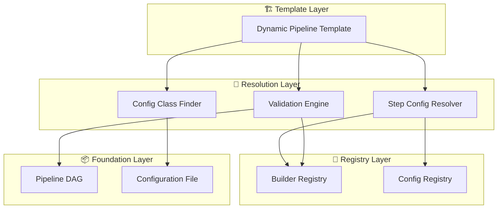

---
tags:
  - design
  - implementation
  - pipeline
  - architecture
keywords:
  - dynamic template
  - pipeline generation
  - specification-driven
  - DAG
  - config resolution
  - validation engine
  - builder registry
topics:
  - pipeline template
  - configuration management
  - pipeline generation
  - automation
language: python
date of note: 2025-07-31
---

# Dynamic Pipeline Template Design

## Overview

The Dynamic Pipeline Template is a powerful component in the pipeline architecture that enables flexible, configuration-driven pipeline creation without requiring custom template classes for each pipeline structure. It extends and implements the [Pipeline Template Base](pipeline_template_base.md), providing a universal adapter between pipeline specifications (expressed as DAGs) and the execution environment, intelligently handling configuration resolution and step builder mapping.

## Motivation

Traditional pipeline template implementations require creating a custom template class for each pipeline structure, leading to significant code duplication and maintenance challenges. The Dynamic Pipeline Template solves this problem by providing a single, adaptive implementation that can work with any pipeline structure defined as a DAG.

Key motivations:
1. Eliminate the need to create custom template classes for each pipeline structure
2. Provide intelligent configuration resolution and step builder mapping
3. Enable rapid pipeline prototyping and iteration
4. Simplify pipeline development and maintenance
5. Create a universal adapter between specifications and execution

## Core Components

### 1. Dynamic Template Core

- **Purpose**: Provide a flexible, configuration-driven pipeline template implementation
- **Key Features**:
  - Automatic implementation of PipelineTemplateBase abstract methods
  - Intelligent DAG node to configuration mapping
  - Automatic step builder resolution
  - Comprehensive validation of pipeline configuration
- **Implementation**: `DynamicPipelineTemplate` class implementing `PipelineTemplateBase`

### 2. Config Class Detection System

- **Purpose**: Efficiently detect required configuration classes from configuration files
- **Key Features**:
  - Analyze configuration files to determine required classes
  - Extract class names from metadata and model types
  - Include essential base classes automatically
  - Fall back to loading all classes if needed
- **Implementation**: `ConfigClassDetector` with optimized class loading strategy
- **Related Documentation**: See [Config Class Detector](../config_field_manager/config_class_detector.md) for detailed design and implementation

### 3. Step Config Resolver

- **Purpose**: Map DAG nodes to appropriate configurations
- **Key Features**:
  - Intelligent matching of node names to configurations
  - Multiple resolution strategies (exact match, fuzzy matching, type inference)
  - Confidence scoring for matching quality
  - Preview of resolution decisions
- **Implementation**: `StepConfigResolver` with multi-strategy resolution
- **Related Documentation**: See [Step Config Resolver](step_config_resolver.md) for detailed resolution strategies and implementation

### 4. Validation Engine

- **Purpose**: Validate pipeline configuration before execution
- **Key Features**:
  - Ensure all DAG nodes have corresponding configurations
  - Verify all configurations have matching step builders
  - Validate configuration-specific requirements
  - Check for dependency resolution issues
- **Implementation**: `ValidationEngine` with comprehensive validation checks
- **Related Documentation**: See [Validation Engine](validation_engine.md) for detailed validation strategies and implementation

## Architecture

The Dynamic Pipeline Template follows a layered architecture:



## Implementation Details

### Dynamic Template Core

The `DynamicPipelineTemplate` class implements the abstract methods from `PipelineTemplateBase`:

```python
class DynamicPipelineTemplate(PipelineTemplateBase):
    """
    Dynamic pipeline template that works with any PipelineDAG.
    """
    
    def __init__(
        self,
        dag: PipelineDAG,
        config_path: str,
        config_resolver: Optional[StepConfigResolver] = None,
        builder_registry: Optional[StepBuilderRegistry] = None,
        **kwargs
    ):
        """Initialize dynamic template."""
        self._dag = dag
        self._config_resolver = config_resolver or StepConfigResolver()
        self._builder_registry = builder_registry or StepBuilderRegistry()
        self._validation_engine = ValidationEngine()
        
        # Auto-detect required config classes based on DAG nodes
        self.CONFIG_CLASSES = self._detect_config_classes()
        
        super().__init__(config_path, **kwargs)
    
    def _detect_config_classes(self) -> Dict[str, Type[BasePipelineConfig]]:
        """
        Automatically detect required config classes from configuration file.
        
        This method analyzes the configuration file to determine which
        configuration classes are needed based on:
        1. Config type metadata in the configuration file
        2. Model type information in configuration entries
        3. Essential base classes needed for all pipelines
        """
        from ..pipeline_steps.utils import detect_config_classes_from_json
        
        # Use the helper function to detect classes from the JSON file
        detected_classes = detect_config_classes_from_json(self.config_path)
        
        return detected_classes
    
    def _create_pipeline_dag(self) -> PipelineDAG:
        """Return the provided DAG."""
        return self._dag
    
    def _create_config_map(self) -> Dict[str, BasePipelineConfig]:
        """Auto-map DAG nodes to configurations."""
        # Implementation details...
    
    def _create_step_builder_map(self) -> Dict[str, Type[StepBuilderBase]]:
        """Auto-map step types to builders using registry."""
        # Implementation details...
    
    def _validate_configuration(self) -> None:
        """Validate that all DAG nodes have corresponding configs."""
        # Implementation details...
```

### Config Class Detection

The Config Class Detection system efficiently identifies the required configuration classes:

```python
class ConfigClassDetector:
    """
    Utility class for detecting required configuration classes from JSON files.
    """
    
    @staticmethod
    def detect_from_json(config_path: str) -> Dict[str, Type]:
        """Detect required config classes from a configuration JSON file."""
        # Implementation details...
        
    @staticmethod
    def _extract_class_names(config_data: Dict[str, Any], logger: logging.Logger) -> Set[str]:
        """Extract config class names from configuration data."""
        # Implementation details...
```

### Step Config Resolution

The config resolution system maps DAG nodes to appropriate configurations:

```python
class StepConfigResolver:
    """
    Resolver for mapping DAG nodes to appropriate configurations.
    """
    
    def resolve_config_map(
        self, 
        dag_nodes: List[str], 
        available_configs: Dict[str, BasePipelineConfig]
    ) -> Dict[str, BasePipelineConfig]:
        """
        Resolve DAG nodes to configurations using intelligent matching.
        """
        # Implementation details...
```

## Key Features

### 1. Automatic Template Implementation

The Dynamic Pipeline Template automatically implements all abstract methods required by `PipelineTemplateBase`, eliminating the need for custom template classes:

- `_create_pipeline_dag`: Returns the provided DAG
- `_create_config_map`: Maps DAG nodes to configurations
- `_create_step_builder_map`: Maps step types to builder classes
- `_validate_configuration`: Validates the complete configuration

### 2. Intelligent Config Resolution

The template uses multiple strategies to match DAG nodes to configurations:

1. **Exact match**: Direct node name to config step name matching
2. **Job type match**: Matching based on job type and node name patterns
3. **Fuzzy matching**: Semantic similarity between node names and config step names
4. **Type inference**: Using node type hints to infer appropriate configurations

### 3. Efficient Config Class Detection

The Config Class Detection system optimizes class loading:

1. Analyzes the configuration file to identify required classes
2. Only loads classes that are actually used in the configuration
3. Falls back to loading all classes only when necessary
4. Always includes essential base classes

### 4. Comprehensive Validation

The Validation Engine performs thorough checks before pipeline execution:

1. All DAG nodes have corresponding configurations
2. All configurations have matching step builders
3. Configuration-specific validation rules pass
4. Dependency resolution between steps is possible

## Integration

### Integration with Pipeline Builder

The Dynamic Pipeline Template integrates with the Pipeline Builder system:

```python
from src.pipeline_api.dynamic_template import DynamicPipelineTemplate
from src.pipeline_dag.base_dag import PipelineDAG

# Create a DAG defining pipeline structure
dag = PipelineDAG()
dag.add_node("data_loading", node_type="CradleDataLoading")
dag.add_node("preprocessing", node_type="TabularPreprocessing")
dag.add_node("training", node_type="XGBoostTraining")
dag.add_edge("data_loading", "preprocessing")
dag.add_edge("preprocessing", "training")

# Create a dynamic template with the DAG
template = DynamicPipelineTemplate(
    dag=dag,
    config_path="path/to/config.json"
)

# Build the pipeline
pipeline = template.build_pipeline()
```

### Integration with DAG Compiler

The Dynamic Pipeline Template works seamlessly with the [DAG Compiler](pipeline_dag_compiler.md):

```python
from src.pipeline_api.dag_compiler import PipelineDAGCompiler
from src.pipeline_api.dynamic_template import DynamicPipelineTemplate

# Convert a DAG representation to a pipeline template
dag_json = {
    "nodes": [...],
    "edges": [...]
}

# Convert JSON DAG to PipelineDAG object
dag = PipelineDAGCompiler.convert_from_json(dag_json)

# Create a dynamic template with the converted DAG
template = DynamicPipelineTemplate(
    dag=dag,
    config_path="path/to/config.json"
)

# Build the pipeline
pipeline = template.build_pipeline()
```

### Integration with Pipeline Template Base

The Dynamic Pipeline Template extends the [Pipeline Template Base](pipeline_template_base.md), providing a flexible implementation that works with any pipeline structure:

```python
# Dynamic template inherits from the template base
class DynamicPipelineTemplate(PipelineTemplateBase):
    # Implementation of abstract methods
    # ...
```

## Advanced Features

### Resolution Preview

The template provides a preview of how DAG nodes will be resolved:

```python
# Get a preview of the resolution process
preview = template.get_resolution_preview()
print(f"Resolving {preview['nodes']} nodes...")

for node, info in preview['resolutions'].items():
    print(f"{node} -> {info['config_type']} (confidence: {info['confidence']:.2f})")
```

### Builder Registry Statistics

The template provides statistics about the builder registry:

```python
# Get statistics about the builder registry
stats = template.get_builder_registry_stats()
print(f"Builder registry contains {stats['total_builders']} builders")
print(f"Supported config types: {stats['supported_config_types']}")
```

### Step Dependencies

The template provides information about step dependencies:

```python
# Get step dependencies based on the DAG
deps = template.get_step_dependencies()
for step, dependencies in deps.items():
    print(f"{step} depends on: {dependencies}")
```

## Benefits

1. **Reduced Code Duplication**: Single template implementation works for all pipeline structures
2. **Rapid Prototyping**: Quickly create and modify pipelines without custom template classes
3. **Improved Maintainability**: Changes to template implementation apply to all pipelines
4. **Enhanced Flexibility**: Works with any DAG structure without modification
5. **Efficient Configuration**: Only loads required configuration classes
6. **Comprehensive Validation**: Validates configuration before execution
7. **Intelligent Resolution**: Maps DAG nodes to configurations using multiple strategies

## Implementation Roadmap

### Phase 1: Core Implementation
1. Implement DynamicPipelineTemplate class
2. Create basic config resolution mechanism
3. Implement validation engine
4. Add builder registry integration

### Phase 2: Enhanced Resolution
1. Implement multiple resolution strategies
2. Add confidence scoring for resolution
3. Create resolution preview functionality
4. Enhance validation with more checks

### Phase 3: Optimization
1. Implement efficient config class detection
2. Add caching for resolution results
3. Optimize validation engine performance
4. Enhance error reporting

### Phase 4: Advanced Features
1. Add support for custom resolution strategies
2. Implement template customization options
3. Create diagnostic tools for pipeline developers
4. Add integration with monitoring systems

## Conclusion

The Dynamic Pipeline Template represents a significant advancement in pipeline architecture, moving from static, custom template implementations to a flexible, configuration-driven approach. By dynamically implementing the required abstract methods of PipelineTemplateBase, it eliminates the need for custom template classes while providing intelligent configuration resolution and validation.

This design enables rapid pipeline development and iteration, simplifies maintenance, and creates a universal adapter between pipeline specifications and execution environments. Combined with the DAG Compiler, it forms a powerful system for transforming high-level pipeline descriptions into executable SageMaker pipelines with minimal development effort.

## Related Documents

- [Step Config Resolver](step_config_resolver.md) - Detailed description of the configuration resolution process
- [Validation Engine](validation_engine.md) - Comprehensive validation system for pipeline configurations
- [Pipeline DAG Compiler](pipeline_dag_compiler.md) - Compilation of pipeline DAGs from various formats
- [Pipeline Template Base](pipeline_template_base.md) - Base class for pipeline templates
- [Step Builder Registry](step_builder_registry_design.md) - Registry for mapping configurations to builders
- [Config Registry](config_registry.md) - Registry for configuration classes
- [Registry-Based Step Name Generation](registry_based_step_name_generation.md) - Step naming conventions
