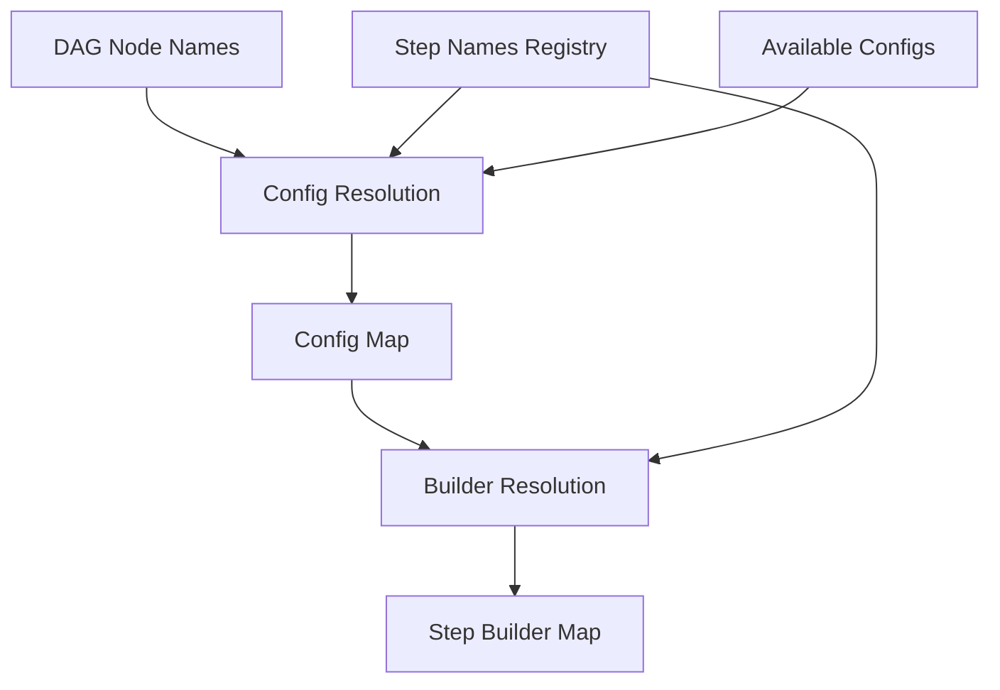

# Dynamic Template Resolution Design

## Overview

This document explains the automatic resolution mechanism used by `DynamicPipelineTemplate` to match DAG nodes to configurations and step builders. This resolution system is what enables the template to work with any pipeline DAG structure without requiring custom template classes.

## Core Resolution Process

The automatic mapping between DAG nodes, configurations, and step builders involves a multi-step process:



1. **DAG Creation**: The process begins with a DAG where nodes have names like "XGBoostTraining", "CradleDataLoading", etc.

2. **Config Detection & Loading**: `DynamicPipelineTemplate` detects required config classes and loads configurations.

3. **Config Mapping**: `_create_config_map()` maps each DAG node name to an appropriate configuration instance.

4. **Builder Mapping**: `_create_step_builder_map()` maps each configuration type to its appropriate step builder class.

## Node to Configuration Resolution

The `StepConfigResolver` class in `src/pipeline_api/config_resolver.py` implements the intelligent mapping between DAG node names and configuration instances. It uses multiple strategies, in order of preference:

### 1. Direct Name Matching

```python
# Example: Node name "XGBoostTraining" matches a config with key "XGBoostTraining"
if node_name in configs:
    return configs[node_name]
```

- Highest confidence (1.0)
- Requires exact match between node name and config identifier

### 2. Job Type + Config Type Matching

```python
# Example: Node "train_preprocess" matches TabularPreprocessingConfig with job_type="training"
if hasattr(config, 'job_type'):
    config_job_type = getattr(config, 'job_type', '').lower()
    if any(keyword in config_job_type for keyword in job_type_keywords):
        # Calculate confidence based on config type match
        config_type_confidence = self._calculate_config_type_confidence(node_name, config)
        total_confidence = 0.7 + (config_type_confidence * 0.3)
        matches.append((config, total_confidence, 'job_type'))
```

- High confidence (0.7-1.0)
- Matches based on job type keywords and config type similarity

### 3. Semantic Similarity Matching

```python
# Example: Node "model_fitting" matches XGBoostTrainingConfig through semantic similarity
semantic_mappings = {
    'train': ['training', 'fit', 'learn'],
    # Other semantic mappings...
}

# Check for semantic matches between node name and config type
for semantic_key, synonyms in semantic_mappings.items():
    if semantic_key in config_type:
        for synonym in synonyms:
            if synonym in node_lower:
                # Calculate similarity
                similarity = SequenceMatcher(None, node_lower, synonym).ratio()
                max_similarity = max(max_similarity, similarity * 0.8)
```

- Moderate confidence (0.5-0.8)
- Uses predefined semantic mappings to match related terms

### 4. Pattern-Based Matching

```python
# Example: Node "load_training_data" matches CradleDataLoadConfig through pattern matching
STEP_TYPE_PATTERNS = {
    r'.*data_load.*': ['CradleDataLoading'],
    r'.*train.*': ['XGBoostTraining', 'PyTorchTraining', 'DummyTraining'],
    # Other patterns...
}

# Find matching patterns
for pattern, step_types in self.STEP_TYPE_PATTERNS.items():
    if re.match(pattern, node_lower):
        matching_step_types.extend(step_types)
```

- Moderate confidence (0.6-0.9)
- Uses regex patterns to identify likely step types from node names

## Configuration to Step Builder Resolution

After mapping nodes to configurations, the `StepBuilderRegistry` maps configurations to step builder classes:

```python
def get_builder_for_config(self, config: BasePipelineConfig) -> Type[StepBuilderBase]:
    """Get step builder class for a specific configuration."""
    config_class_name = type(config).__name__
    step_type = self._config_class_to_step_type(config_class_name)
    
    # Look up the builder class
    if step_type in self.BUILDER_REGISTRY:
        return self.BUILDER_REGISTRY[step_type]
    
    # Check legacy aliases
    if step_type in self.LEGACY_ALIASES:
        alias = self.LEGACY_ALIASES[step_type]
        if alias in self.BUILDER_REGISTRY:
            return self.BUILDER_REGISTRY[alias]
```

1. Get the config class name (e.g., "XGBoostTrainingConfig")
2. Convert to step type (e.g., "XGBoostTraining")
3. Look up the step type in the builder registry
4. Return the corresponding builder class

## The Central Role of `STEP_NAMES` Registry

The `STEP_NAMES` registry in `pipeline_registry/step_names.py` serves as the central coordinator for the resolution system:

```python
STEP_NAMES = {
    "XGBoostTraining": {
        "config_class": "XGBoostTrainingConfig", 
        "builder_step_name": "XGBoostTrainingStep",
        "spec_type": "XGBoostTraining",
        "description": "XGBoost model training step"
    },
    # Other step definitions...
}
```

This registry:

1. Maps canonical step names to configuration class names
2. Maps canonical step names to builder class names
3. Provides the authoritative list of supported step types
4. Serves as the single source of truth for naming conventions

The derived mappings used by the resolution system:

```python
# For mapping config classes to step types
CONFIG_STEP_REGISTRY = {
    info["config_class"]: step_name 
    for step_name, info in STEP_NAMES.items()
}

# For mapping step names to builder class names
BUILDER_STEP_NAMES = {
    step_name: info["builder_step_name"]
    for step_name, info in STEP_NAMES.items()
}
```

## Resolution Example

Given a DAG with a node named "XGBoostTraining":

1. **Config Resolution**:
   - `StepConfigResolver` looks for a configuration matching "XGBoostTraining"
   - If an exact match exists, it's selected with 100% confidence
   - Otherwise, it tries semantic matching, job type matching, etc.
   - Result: `XGBoostTrainingConfig` instance

2. **Builder Resolution**:
   - `StepBuilderRegistry` takes the `XGBoostTrainingConfig` instance
   - Gets the config class name: "XGBoostTrainingConfig"
   - Converts to step type: "XGBoostTraining"
   - Looks up the builder: `BUILDER_REGISTRY["XGBoostTraining"]`
   - Result: `XGBoostTrainingStep` class

## Error Handling and Validation

Both resolution systems include comprehensive error handling:

1. **Config Resolution Errors**:
   - Clear error messages for unresolved nodes
   - Suggestions for potential matches
   - Details about available configurations

2. **Builder Resolution Errors**:
   - Lists configurations without matching builders
   - Shows available builders
   - Suggests possible registry updates

## Strategic Benefits

This resolution system provides several key benefits:

1. **Eliminating Custom Templates**: No need to create custom template classes for each pipeline structure.

2. **Automatic Adaptation**: The system can work with any DAG structure as long as node names are semantically meaningful.

3. **Flexibility**: Even if names don't match exactly, the intelligent resolution can still find appropriate matches.

4. **Consistency**: The central `STEP_NAMES` registry ensures naming consistency across the system.

5. **Extensibility**: Adding new step types only requires updating the registry, not modifying template code.

## Integration with DAG Converter

This resolution system is especially powerful when combined with the DAG Converter, as it enables:

1. Converting visual or programmatic DAGs to executable pipelines
2. Automatically resolving appropriate configurations 
3. Finding the right step builders
4. All without requiring custom template classes

## Conclusion

The dynamic resolution system is what makes the `DynamicPipelineTemplate` truly "dynamic" - it can adapt to any pipeline structure defined as a DAG without requiring custom template classes. This dramatically reduces code duplication and maintenance burden while providing a flexible, powerful pipeline creation mechanism.
