# Environment Variable-Based Contract Enforcement

## Overview

Environment Variable-Based Contract Enforcement is a **lightweight, deployment-friendly approach** to ensuring pipeline script compliance with their specifications. This design addresses the fundamental challenge of contract enforcement in single-script SageMaker deployments where external dependencies cannot be imported.

## Related Documents
- **[Step Contract](./step_contract.md)** - Formal interface definitions and behavioral contracts
- **[Step Specification](./step_specification.md)** - Structural step definitions and requirements
- **[Standardization Rules](./standardization_rules.md)** - Naming conventions and interface standards
- **[Config-Driven Design](./config_driven_design.md)** - Current implementation approach

> **💡 Note**: This approach complements existing step contracts by providing a **deployment-compatible enforcement mechanism** that works within SageMaker's single-script upload constraints.

## Core Problem

### The Single-Script Deployment Challenge

SageMaker Processing Steps have two distinct deployment patterns:

1. **Directory Upload** (XGBoost containers): Entire directory uploaded, can import modules
2. **Single Script Upload** (SKLearn processors): Only one script uploaded, no external imports

```python
# Directory Upload - CAN import external contracts
step_args = processor.run(
    code="model_eval_xgb.py",
    source_dir="dockers/xgboost_atoz/",  # Entire directory uploaded
    inputs=proc_inputs,
    outputs=proc_outputs
)

# Single Script Upload - CANNOT import external contracts  
processing_step = ProcessingStep(
    code="tabular_preprocess.py",  # Only this file uploaded
    processor=processor,
    inputs=proc_inputs,
    outputs=proc_outputs
)
```

### Contract Enforcement Gap

Traditional contract enforcement fails in single-script deployment:

```python
# This FAILS in single-script deployment
def get_script_contract():
    from pipeline_script_contracts.tabular_preprocess_contract import CONTRACT
    return CONTRACT  # ImportError: No module named 'pipeline_script_contracts'
```

## Solution Architecture

### Core Concept: Environment Variables as Contract Medium

Instead of importing contract definitions, **step builders encode contracts into environment variables**, and **scripts read these variables** for contract enforcement.

```mermaid
flowchart TD
    subgraph "🏗️ Build Time"
        ContractDef["Contract Definition<br/>src/pipeline_script_contracts/<br/>• Single source of truth<br/>• Formal specifications<br/>• Validation rules"]
        
        StepBuilder["Step Builder<br/>• Reads contract definition<br/>• Generates environment variables<br/>• Sets SageMaker processor env"]
    end
    
    subgraph "🚀 Runtime (SageMaker Container)"
        EnvVars["Environment Variables<br/>CONTRACT_INPUT_DATA=/opt/ml/input/data<br/>CONTRACT_OUTPUT_PROCESSED=/opt/ml/output<br/>CONTRACT_REQUIRED_ENV_VARS=LABEL_FIELD"]
        
        Script["User Script<br/>• Reads contract env vars<br/>• Validates paths and requirements<br/>• Enforces contract compliance"]
    end
    
    subgraph "📝 Development Time"
        UserScript["User Business Logic<br/>• Clean, focused code<br/>• Uses contract utilities<br/>• No contract boilerplate"]
        
        ContractUtils["Embedded Contract Utils<br/>• validate_contract()<br/>• get_contract_input_path()<br/>• get_contract_output_path()"]
    end
    
    ContractDef --> StepBuilder
    StepBuilder --> EnvVars
    EnvVars --> Script
    UserScript --> ContractUtils
    ContractUtils --> Script
```



## Architecture Components

### 1. Contract Definition (Single Source of Truth)

Canonical contract definitions remain in dedicated files:

```python
# src/pipeline_script_contracts/tabular_preprocess_contract.py
from .base_script_contract import ScriptContract

TABULAR_PREPROCESS_CONTRACT = ScriptContract(
    entry_point="tabular_preprocess.py",
    expected_input_paths={
        "data": "/opt/ml/processing/input/data",
        "metadata": "/opt/ml/processing/input/metadata"
    },
    expected_output_paths={
        "processed": "/opt/ml/processing/output"
    },
    required_env_vars=["LABEL_FIELD", "TRAIN_RATIO", "TEST_VAL_RATIO"],
    framework_requirements={
        "pandas": ">=1.3.0",
        "scikit-learn": ">=1.0.0"
    }
)
```

### 2. Step Builder Contract Integration

Step builders read contracts and generate environment variables:

```python
# In TabularPreprocessingStepBuilder
def _load_contract_for_script(self) -> ScriptContract:
    """Load contract definition for this script"""
    from ..pipeline_script_contracts.tabular_preprocess_contract import TABULAR_PREPROCESS_CONTRACT
    return TABULAR_PREPROCESS_CONTRACT

def _get_environment_variables(self) -> Dict[str, str]:
    """Generate environment variables from contract definition"""
    contract = self._load_contract_for_script()
    
    env_vars = {}
    
    # Set input paths from contract
    for logical_name, path in contract.expected_input_paths.items():
        env_vars[f"CONTRACT_INPUT_{logical_name.upper()}"] = path
    
    # Set output paths from contract  
    for logical_name, path in contract.expected_output_paths.items():
        env_vars[f"CONTRACT_OUTPUT_{logical_name.upper()}"] = path
    
    # Set contract metadata for validation
    env_vars["CONTRACT_REQUIRED_ENV_VARS"] = ",".join(contract.required_env_vars)
    env_vars["CONTRACT_REQUIRED_INPUTS"] = ",".join(contract.expected_input_paths.keys())
    env_vars["CONTRACT_REQUIRED_OUTPUTS"] = ",".join(contract.expected_output_paths.keys())
    
    # Set the actual business environment variables
    for var in contract.required_env_vars:
        if var == "LABEL_FIELD":
            env_vars[var] = self.config.hyperparameters.label_name
        elif var == "TRAIN_RATIO":
            env_vars[var] = str(self.config.train_ratio)
        # ... other mappings from config to env vars
    
    # Contract metadata
    env_vars["CONTRACT_SCRIPT_NAME"] = contract.entry_point
    env_vars["CONTRACT_VERSION"] = "1.0.0"
    
    return env_vars
```

### 3. Embedded Contract Validation

Since external imports are impossible, contract validation logic is embedded directly in scripts:

```python
# src/pipeline_scripts/tabular_preprocess.py
# USER SCRIPT WITH EMBEDDED CONTRACT VALIDATION

import os
import pandas as pd
import argparse

# ============================================================================
# EMBEDDED CONTRACT VALIDATION (GENERATED/TEMPLATE)
# ============================================================================

def validate_contract():
    """Embedded contract validation - cannot import from external modules"""
    print("🔒 Validating contract environment variables...")
    
    # Validate required environment variables
    required_env_vars = os.environ.get("CONTRACT_REQUIRED_ENV_VARS", "").split(",")
    for var in required_env_vars:
        if var and var not in os.environ:
            raise RuntimeError(f"❌ Missing required environment variable: {var}")
        if var:
            print(f"✅ Environment variable {var} = {os.environ.get(var)}")
    
    # Validate input paths
    required_inputs = os.environ.get("CONTRACT_REQUIRED_INPUTS", "").split(",")
    for input_name in required_inputs:
        if input_name:
            path_var = f"CONTRACT_INPUT_{input_name.upper()}"
            if path_var not in os.environ:
                raise RuntimeError(f"❌ Missing contract input path: {path_var}")
            
            path = os.environ[path_var]
            if not os.path.exists(path):
                raise RuntimeError(f"❌ Input path does not exist: {path}")
            print(f"✅ Input path {input_name}: {path}")
    
    # Validate and create output paths
    required_outputs = os.environ.get("CONTRACT_REQUIRED_OUTPUTS", "").split(",")
    for output_name in required_outputs:
        if output_name:
            path_var = f"CONTRACT_OUTPUT_{output_name.upper()}"
            if path_var not in os.environ:
                raise RuntimeError(f"❌ Missing contract output path: {path_var}")
            
            path = os.environ[path_var]
            os.makedirs(path, exist_ok=True)
            print(f"✅ Output path {output_name}: {path}")
    
    print("🔒 Contract validation complete")

def get_contract_input_path(path_name: str) -> str:
    """Get contract-enforced input path"""
    env_var = f"CONTRACT_INPUT_{path_name.upper()}"
    if env_var not in os.environ:
        raise RuntimeError(f"❌ Contract input path not found: {env_var}")
    return os.environ[env_var]

def get_contract_output_path(path_name: str) -> str:
    """Get contract-enforced output path"""
    env_var = f"CONTRACT_OUTPUT_{path_name.upper()}"
    if env_var not in os.environ:
        raise RuntimeError(f"❌ Contract output path not found: {env_var}")
    return os.environ[env_var]

def get_contract_env_var(var_name: str) -> str:
    """Get required environment variable with validation"""
    if var_name not in os.environ:
        raise RuntimeError(f"❌ Required environment variable not found: {var_name}")
    return os.environ[var_name]

# ============================================================================
# USER BUSINESS LOGIC
# ============================================================================

def main():
    """User's main function with embedded contract enforcement"""
    parser = argparse.ArgumentParser()
    parser.add_argument("--job_type", type=str, required=True)
    args = parser.parse_args()
    
    # VALIDATE CONTRACT (embedded function)
    validate_contract()
    
    # GET CONTRACT-ENFORCED PATHS
    data_path = get_contract_input_path("data")
    metadata_path = get_contract_input_path("metadata")
    output_path = get_contract_output_path("processed")
    
    # GET CONTRACT-ENFORCED ENVIRONMENT VARIABLES
    label_field = get_contract_env_var("LABEL_FIELD")
    train_ratio = float(get_contract_env_var("TRAIN_RATIO"))
    
    # USER'S BUSINESS LOGIC
    print(f"Loading data from: {data_path}")
    df = pd.read_csv(data_path)
    
    print(f"Processing data with label field: {label_field}")
    # ... user's processing logic ...
    
    print(f"Saving processed data to: {output_path}")
    df.to_csv(f"{output_path}/processed.csv", index=False)
    
    print("✅ Processing completed successfully")

if __name__ == "__main__":
    main()
```

## Environment Variable Conventions

### Contract Path Variables

```bash
# Input paths
CONTRACT_INPUT_DATA="/opt/ml/processing/input/data"
CONTRACT_INPUT_METADATA="/opt/ml/processing/input/metadata"
CONTRACT_INPUT_MODEL="/opt/ml/processing/input/model"

# Output paths  
CONTRACT_OUTPUT_PROCESSED="/opt/ml/processing/output"
CONTRACT_OUTPUT_METRICS="/opt/ml/processing/output/metrics"
CONTRACT_OUTPUT_MODEL="/opt/ml/processing/output/model"
```

### Contract Metadata Variables

```bash
# Validation metadata
CONTRACT_REQUIRED_ENV_VARS="LABEL_FIELD,TRAIN_RATIO,TEST_VAL_RATIO"
CONTRACT_REQUIRED_INPUTS="data,metadata"
CONTRACT_REQUIRED_OUTPUTS="processed"

# Contract identity
CONTRACT_SCRIPT_NAME="tabular_preprocess.py"
CONTRACT_VERSION="1.0.0"
```

### Business Environment Variables

```bash
# Actual business parameters (set by step builder from config)
LABEL_FIELD="target"
TRAIN_RATIO="0.8"
TEST_VAL_RATIO="0.5"
```

## Contract Code Generation

### Template-Based Generation

Since the same contract validation logic is needed across multiple scripts, we use code generation:

```python
# tools/generate_contract_template.py

def generate_contract_validation_code(contract_def) -> str:
    """Generate embedded contract validation code"""
    
    return f'''
# ============================================================================
# AUTO-GENERATED CONTRACT VALIDATION - DO NOT EDIT MANUALLY
# Generated from: {contract_def.entry_point}_contract.py
# Last updated: {datetime.now().isoformat()}
# ============================================================================

import os

def validate_contract():
    """Embedded contract validation"""
    print("🔒 Validating contract environment variables...")
    
    # Validate required environment variables
    required_env_vars = os.environ.get("CONTRACT_REQUIRED_ENV_VARS", "").split(",")
    for var in required_env_vars:
        if var and var not in os.environ:
            raise RuntimeError(f"❌ Missing required environment variable: {{var}}")
        if var:
            print(f"✅ Environment variable {{var}} = {{os.environ.get(var)}}")
    
    # Validate input paths
    required_inputs = os.environ.get("CONTRACT_REQUIRED_INPUTS", "").split(",")
    for input_name in required_inputs:
        if input_name:
            path_var = f"CONTRACT_INPUT_{{input_name.upper()}}"
            if path_var not in os.environ:
                raise RuntimeError(f"❌ Missing contract input path: {{path_var}}")
            
            path = os.environ[path_var]
            if not os.path.exists(path):
                raise RuntimeError(f"❌ Input path does not exist: {{path}}")
            print(f"✅ Input path {{input_name}}: {{path}}")
    
    # Validate and create output paths
    required_outputs = os.environ.get("CONTRACT_REQUIRED_OUTPUTS", "").split(",")
    for output_name in required_outputs:
        if output_name:
            path_var = f"CONTRACT_OUTPUT_{{output_name.upper()}}"
            if path_var not in os.environ:
                raise RuntimeError(f"❌ Missing contract output path: {{path_var}}")
            
            path = os.environ[path_var]
            os.makedirs(path, exist_ok=True)
            print(f"✅ Output path {{output_name}}: {{path}}")
    
    print("🔒 Contract validation complete")

def get_contract_input_path(path_name: str) -> str:
    """Get contract-enforced input path"""
    env_var = f"CONTRACT_INPUT_{{path_name.upper()}}"
    if env_var not in os.environ:
        raise RuntimeError(f"❌ Contract input path not found: {{env_var}}")
    return os.environ[env_var]

def get_contract_output_path(path_name: str) -> str:
    """Get contract-enforced output path"""
    env_var = f"CONTRACT_OUTPUT_{{path_name.upper()}}"
    if env_var not in os.environ:
        raise RuntimeError(f"❌ Contract output path not found: {{env_var}}")
    return os.environ[env_var]

def get_contract_env_var(var_name: str) -> str:
    """Get required environment variable with validation"""
    if var_name not in os.environ:
        raise RuntimeError(f"❌ Required environment variable not found: {{var_name}}")
    return os.environ[var_name]

# ============================================================================
# END AUTO-GENERATED CONTRACT VALIDATION
# ============================================================================
'''
```

### Build Process Integration

```python
# tools/embed_contracts.py

class ContractEmbedder:
    """Embeds contract validation code into user scripts"""
    
    def embed_contract_in_script(self, script_path: Path, contract_def):
        """Embed contract validation code into user script"""
        
        with open(script_path, 'r') as f:
            original_script = f.read()
        
        # Generate contract validation code
        contract_code = self.generate_contract_validation_code(contract_def)
        
        # Find insertion point (after imports, before user functions)
        lines = original_script.split('\n')
        insertion_point = self._find_insertion_point(lines)
        
        # Insert contract code
        lines.insert(insertion_point, contract_code)
        
        # Transform hardcoded paths to use contract functions
        transformed_lines = self._transform_hardcoded_paths(lines)
        
        # Write enhanced script
        enhanced_script = '\n'.join(transformed_lines)
        with open(script_path, 'w') as f:
            f.write(enhanced_script)
        
        print(f"✅ Embedded contract validation in {script_path}")
    
    def _transform_hardcoded_paths(self, lines):
        """Replace hardcoded paths with contract function calls"""
        replacements = {
            '"/opt/ml/processing/input/data"': 'get_contract_input_path("data")',
            '"/opt/ml/processing/input/metadata"': 'get_contract_input_path("metadata")',
            '"/opt/ml/processing/output"': 'get_contract_output_path("processed")',
        }
        
        transformed_lines = []
        for line in lines:
            transformed_line = line
            for old_path, new_call in replacements.items():
                transformed_line = transformed_line.replace(old_path, new_call)
            transformed_lines.append(transformed_line)
        
        return transformed_lines
```

## Development Workflow

### 1. User Writes Clean Business Logic

```python
# src/pipeline_scripts/tabular_preprocess.py (USER ORIGINAL)

import pandas as pd
import argparse

def main():
    parser = argparse.ArgumentParser()
    parser.add_argument("--job_type", type=str, required=True)
    args = parser.parse_args()
    
    # USER WRITES HARDCODED PATHS INITIALLY
    data_path = "/opt/ml/processing/input/data"
    output_path = "/opt/ml/processing/output"
    
    # Business logic
    df = pd.read_csv(data_path)
    df.to_csv(f"{output_path}/processed.csv", index=False)

if __name__ == "__main__":
    main()
```

### 2. Build Process Embeds Contract

```bash
# Build command
python tools/embed_contracts.py

# Output:
# ✅ Contract validation code embedded
# ✅ Hardcoded paths replaced with contract functions
# ✅ Contract enforcement added to main()
```

### 3. Enhanced Script (Generated)

```python
# src/pipeline_scripts/tabular_preprocess.py (AFTER EMBEDDING)

import pandas as pd
import argparse

# ============================================================================
# AUTO-GENERATED CONTRACT VALIDATION
# ============================================================================
# ... embedded contract validation functions ...

def main():
    parser = argparse.ArgumentParser()
    parser.add_argument("--job_type", type=str, required=True)
    args = parser.parse_args()
    
    # CONTRACT ENFORCEMENT (auto-added)
    validate_contract()
    
    # CONTRACT-ENFORCED PATHS (auto-replaced)
    data_path = get_contract_input_path("data")
    output_path = get_contract_output_path("processed")
    
    # Business logic (unchanged)
    df = pd.read_csv(data_path)
    df.to_csv(f"{output_path}/processed.csv", index=False)

if __name__ == "__main__":
    main()
```

## Hybrid Architecture for Different Deployment Types

### Type 1: Directory Upload Steps (XGBoost, PyTorch)

Full contract infrastructure with external contract files:

```
dockers/xgboost_atoz/
├── pipeline_script_contracts/     # Full contract system
│   ├── base_script_contract.py
│   ├── model_evaluation_contract.py
│   └── xgboost_train_contract.py
├── model_eval_xgb.py             # References external contracts
└── processing/                   # Other dependencies
```

```python
# In directory upload scripts - can import external contracts
def get_script_contract():
    from pipeline_script_contracts.model_evaluation_contract import MODEL_EVALUATION_CONTRACT
    return MODEL_EVALUATION_CONTRACT

def main():
    contract = get_script_contract()
    with ContractEnforcer(contract) as enforcer:
        # Contract-enforced execution
        model_dir = enforcer.get_input_path('model_input')
        data_dir = enforcer.get_input_path('eval_data_input')
        # ... business logic
```

### Type 2: Single Script Steps (Tabular Preprocessing, Payload, etc.)

Embedded contracts with environment variable enforcement:

```python
# In single script deployment - embedded contract validation
def main():
    # Environment variable-based contract enforcement
    validate_contract()  # Embedded function
    
    # Contract-enforced paths from environment variables
    data_path = get_contract_input_path("data")
    output_path = get_contract_output_path("processed")
    
    # Business logic
    # ...
```

## Validation and Testing

### Contract Alignment Validation

```python
# tools/validate_contracts.py

class ContractValidator:
    def validate_environment_variable_contracts(self):
        """Validate environment variable contract implementation"""
        
        for script_path in self.get_single_script_steps():
            # Load contract definition
            contract_def = self.load_contract_for_script(script_path)
            
            # Check if script has embedded validation
            script_content = script_path.read_text()
            if "validate_contract()" not in script_content:
                self.add_violation(f"Script {script_path} missing contract validation")
            
            # Check if script uses contract functions for paths
            hardcoded_paths = self.find_hardcoded_paths(script_content)
            if hardcoded_paths:
                self.add_violation(f"Script {script_path} has hardcoded paths: {hardcoded_paths}")
            
            # Validate environment variable naming conventions
            self.validate_env_var_conventions(contract_def)
    
    def validate_step_builder_contract_integration(self):
        """Validate step builders properly set contract environment variables"""
        
        for builder_class in self.get_step_builders():
            if hasattr(builder_class, '_get_environment_variables'):
                # Check if builder sets contract environment variables
                env_vars = builder_class._get_environment_variables()
                
                contract_vars = [var for var in env_vars.keys() if var.startswith('CONTRACT_')]
                if not contract_vars:
                    self.add_violation(f"Builder {builder_class} missing contract environment variables")
```

### Runtime Contract Testing

```python
# test/contract_enforcement/test_environment_variable_contracts.py

def test_contract_enforcement_in_container():
    """Test contract enforcement works in actual SageMaker container"""
    
    # Set up contract environment variables
    contract_env = {
        "CONTRACT_INPUT_DATA": "/opt/ml/processing/input/data",
        "CONTRACT_OUTPUT_PROCESSED": "/opt/ml/processing/output",
        "CONTRACT_REQUIRED_ENV_VARS": "LABEL_FIELD",
        "CONTRACT_REQUIRED_INPUTS": "data",
        "CONTRACT_REQUIRED_OUTPUTS": "processed",
        "LABEL_FIELD": "target"
    }
    
    # Create test data
    os.makedirs("/opt/ml/processing/input/data", exist_ok=True)
    test_df = pd.DataFrame({"feature1": [1, 2, 3], "target": [0, 1, 0]})
    test_df.to_csv("/opt/ml/processing/input/data/test.csv", index=False)
    
    # Run script with contract environment
    with patch.dict(os.environ, contract_env):
        # Should succeed with valid contract environment
        result = subprocess.run([
            "python", "src/pipeline_scripts/tabular_preprocess.py", 
            "--job_type", "training"
        ], capture_output=True, text=True)
        
        assert result.returncode == 0
        assert "🔒 Contract validation complete" in result.stdout
        assert "✅ Processing completed successfully" in result.stdout

def test_contract_violation_detection():
    """Test contract violations are properly detected"""
    
    # Missing required environment variable
    incomplete_env = {
        "CONTRACT_INPUT_DATA": "/opt/ml/processing/input/data",
        "CONTRACT_REQUIRED_ENV_VARS": "LABEL_FIELD",
        # Missing LABEL_FIELD
    }
    
    with patch.dict(os.environ, incomplete_env, clear=True):
        result = subprocess.run([
            "python", "src/pipeline_scripts/tabular_preprocess.py",
            "--job_type", "training"
        ], capture_output=True, text=True)
        
        assert result.returncode != 0
        assert "❌ Missing required environment variable: LABEL_FIELD" in result.stderr
```

## Advantages

### ✅ Deployment Compatibility
- **Works with Single-Script Upload**: No external import dependencies
- **Leverages Standard SageMaker Pattern**: Environment variables are the standard way to configure SageMaker containers
- **Self-Contained Scripts**: Each script contains all necessary contract enforcement logic

### ✅ Single Source of Truth
- **Canonical Contract Definitions**: Contracts defined once in `src/pipeline_script_contracts/`
- **Automatic Propagation**: Contract changes automatically propagate through environment variables
- **Build-Time Generation**: Contract validation code generated from canonical source

### ✅ User-Friendly Development
- **Clean Business Logic**: Users write focused, contract-free business code
- **Transparent Enforcement**: Contract enforcement happens automatically
- **Clear Error Messages**: Runtime violations provide actionable feedback

### ✅ Robust Contract Enforcement
- **Runtime Validation**: Paths and environment variables validated at startup
- **Early Failure**: Contract violations detected before business logic execution
- **Comprehensive Logging**: Clear audit trail in CloudWatch logs

## Limitations

### ❌ Code Duplication
- **Embedded Validation Logic**: Same contract validation code embedded in multiple scripts
- **Maintenance Overhead**: Changes to validation logic require regenerating all scripts
- **Build Process Dependency**: Scripts must be regenerated when contracts change

### ❌ Limited Contract Complexity
- **Environment Variable Constraints**: Complex contract logic difficult to encode in environment variables
- **String-Based Configuration**: Type safety and validation limited compared to object-based contracts
- **Runtime-Only Validation**: No design-time contract checking for single-script steps

### ❌ Debugging Complexity
- **Generated Code**: Debugging embedded contract code can be challenging
- **Environment Variable Dependencies**: Contract behavior depends on correct environment variable setup
- **Build Process Failures**: Contract embedding failures can be difficult to diagnose

## Use Cases

### Ideal For
- **Single-Script Processing Steps**: Tabular preprocessing, payload generation, currency conversion
- **Standard SageMaker Deployments**: Steps that use SKLearnProcessor or similar single-script processors
- **Lightweight Contract Enforcement**: Basic path and environment variable validation
- **Rapid Development**: Quick contract enforcement without complex infrastructure

### Not Ideal For
- **Complex Contract Logic**: Advanced validation rules that require sophisticated logic
- **Directory Upload Steps**: Steps that can already import external contract modules
- **Design-Time Validation**: Scenarios requiring contract checking during pipeline construction
- **Dynamic Contract Behavior**: Contracts that need to adapt based on runtime conditions

## Implementation Strategy

### Phase 1: Core Infrastructure
1. **Environment Variable Conventions**: Establish standard naming patterns
2. **Contract Code Generation**: Build tools to generate embedded validation code
3. **Step Builder Integration**: Update builders to set contract environment variables

### Phase 2: Script Enhancement
1. **Identify Single-Script Steps**: Catalog all steps using single-script deployment
2. **Embed Contract Validation**: Add contract enforcement to existing scripts
3. **Path Transformation**: Replace hardcoded paths with contract function calls

### Phase 3: Validation and Testing
1. **Contract Alignment Validation**: Ensure contracts match script implementations
2. **Runtime Testing**: Validate contract enforcement in actual SageMaker containers
3. **Build Process Integration**: Integrate contract embedding into CI/CD pipeline

## Strategic Value

Environment Variable-Based Contract Enforcement provides:

1. **Deployment Compatibility**: Enables contract enforcement in constrained deployment environments
2. **Consistency**: Uniform contract enforcement across all pipeline steps
3. **Maintainability**: Single source of truth with automatic propagation
4. **Reliability**: Runtime validation prevents contract violations
5. **Developer Experience**: Clean separation between business logic and contract enforcement
6. **Scalability**: Approach scales to any number of single-script processing steps

## Example Usage

```python
# Contract definition (single source of truth)
TABULAR_PREPROCESS_CONTRACT = ScriptContract(
    entry_point="tabular_preprocess.py",
    expected_input_paths={"data": "/opt/ml/processing/input/data"},
    expected_output_paths={"processed": "/opt/ml/processing/output"},
    required_env_vars=["LABEL_FIELD", "TRAIN_RATIO"]
)

# Step builder sets environment variables
env_vars = {
    "CONTRACT_INPUT_DATA": "/opt/ml/processing/input/data",
    "CONTRACT_OUTPUT_PROCESSED": "/opt/ml/processing/output",
    "CONTRACT_REQUIRED_ENV_VARS": "LABEL_FIELD,TRAIN_RATIO",
    "LABEL_FIELD": "target",
    "TRAIN_RATIO": "0.8"
}

# User script with embedded contract enforcement
def main():
    validate_contract()  # Embedded validation
    data_path = get_contract_input_path("data")  # Contract-enforced path
    # ... business logic
```

Environment Variable-Based Contract Enforcement represents a **pragmatic solution** to the deployment constraints of single-script SageMaker processing, enabling robust contract enforcement while maintaining deployment compatibility and developer productivity.

## See Also

### Related Design Patterns
- **[Step Contract](./step_contract.md)** - Formal interface definitions that this approach implements
- **[Step Specification](./step_specification.md)** - Structural definitions that contracts enforce
- **[Standardization Rules](./standardization_rules.md)** - Standards enforced through contracts

### Implementation Details
- **[Config-Driven Design](./config_driven_design.md)** - Current implementation that this approach extends
- **[Step Builder](./step_builder.md)** - Step builders that implement contract environment variable generation
- **[Dependency Resolver](./dependency_resolver.md)** - Dependency resolution that works with contract-enforced steps

### Validation and Quality Assurance
- **[Pipeline Validation](./pipeline_validation.md)** - Overall pipeline validation including contract enforcement
- **[Quality Gates](./quality_gates.md)** - Quality gates that leverage contract enforcement for validation
