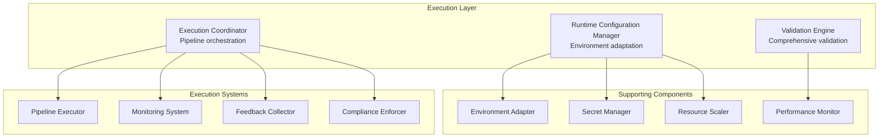

# Execution Layer Design

## Overview

The Execution Layer is the fourth and final layer of the [Adaptive Configuration Management System](./adaptive_configuration_management_system.md) that manages runtime configuration adaptation, validation, and execution coordination. This layer ensures configurations are properly adapted for specific execution environments and provides comprehensive monitoring and feedback loops.

## Purpose and Responsibilities

1. **Runtime Adaptation**: Environment-specific configuration adaptation
2. **Execution Coordination**: Pipeline orchestration with adaptive configurations
3. **Validation & Monitoring**: Comprehensive validation and performance monitoring
4. **Feedback Integration**: Learning from execution outcomes for system improvement
5. **Security & Compliance**: Secure credential handling and compliance enforcement

## Architecture Overview



## Core Components

### 1. Runtime Configuration Manager

**Purpose**: Runtime adaptation and environment-specific management

```python
class RuntimeConfigurationManager:
    """
    Manages configuration at runtime with environment adaptation
    
    Provides runtime capabilities:
    - Environment-specific adaptation
    - Secret and credential injection
    - Resource scaling based on load
    - Real-time optimization
    """
    
    def __init__(self):
        self.environment_adapter = EnvironmentAdapter()
        self.secret_manager = SecretManager()
        self.resource_scaler = ResourceScaler()
        self.runtime_optimizer = RuntimeOptimizer()
        self.compliance_enforcer = ComplianceEnforcer()
    
    def prepare_for_execution(self, 
                            config: ContextualConfiguration,
                            execution_environment: ExecutionEnvironment) -> RuntimeConfiguration:
        """
        Prepare configuration for execution in specific environment
        
        Adaptations:
        - Environment-specific parameter adjustment
        - Secret and credential injection
        - Resource scaling based on current load
        - Runtime optimization based on current conditions
        """
        # Adapt for execution environment
        env_adapted = self.environment_adapter.adapt_configuration(
            config, execution_environment
        )
        
        # Inject secrets and credentials
        with_secrets = self.secret_manager.inject_secrets(
            env_adapted, execution_environment
        )
        
        # Scale resources based on current load
        scaled_config = self.resource_scaler.scale_resources(
            with_secrets, execution_environment
        )
        
        # Apply runtime optimizations
        runtime_optimized = self.runtime_optimizer.optimize_for_runtime(
            scaled_config, execution_environment
        )
        
        # Enforce compliance requirements
        compliant_config = self.compliance_enforcer.enforce_compliance(
            runtime_optimized, execution_environment
        )
        
        return RuntimeConfiguration(
            configuration=compliant_config,
            environment=execution_environment,
            runtime_metadata=self._generate_runtime_metadata(),
            adaptation_log=self._generate_adaptation_log()
        )
    
    def adapt_during_execution(self, 
                             runtime_config: RuntimeConfiguration,
                             execution_metrics: ExecutionMetrics) -> RuntimeConfiguration:
        """
        Adapt configuration during execution based on real-time metrics
        
        Provides dynamic adaptation for:
        - Performance bottlenecks
        - Resource constraints
        - Cost optimization opportunities
        - Error recovery scenarios
        """
        # Analyze current performance
        performance_analysis = self._analyze_execution_performance(execution_metrics)
        
        # Identify adaptation opportunities
        adaptation_opportunities = self._identify_adaptation_opportunities(
            runtime_config, performance_analysis
        )
        
        # Apply safe adaptations
        adapted_config = runtime_config
        for opportunity in adaptation_opportunities:
            if opportunity.safety_score > 0.8:  # Only apply safe adaptations
                adapted_config = opportunity.apply(adapted_config)
                self._log_runtime_adaptation(opportunity)
        
        return adapted_config

class EnvironmentAdapter:
    """Adapts configurations for different execution environments"""
    
    def __init__(self):
        self.environment_detector = EnvironmentDetector()
        self.resource_mapper = ResourceMapper()
        self.network_adapter = NetworkAdapter()
        self.storage_adapter = StorageAdapter()
    
    def adapt_configuration(self, 
                          config: ContextualConfiguration,
                          environment: ExecutionEnvironment) -> ContextualConfiguration:
        """
        Adapt configuration for specific execution environment
        
        Adaptations include:
        - Resource limits and quotas
        - Network and security settings
        - Storage and data access patterns
        - Monitoring and logging configuration
        """
        adapted_configs = []
        
        for config_obj in config.configuration:
            # Apply environment-specific adaptations
            adapted = self._adapt_single_config(config_obj, environment)
            adapted_configs.append(adapted)
        
        return ContextualConfiguration(
            configuration=adapted_configs,
            intelligence_metadata=config.intelligence_metadata,
            original_context=config.original_context,
            target_context=config.target_context,
            environment_adaptations=self._generate_adaptation_metadata(environment)
        )
    
    def _adapt_single_config(self, 
                           config: BaseModel, 
                           environment: ExecutionEnvironment) -> BaseModel:
        """Adapt single configuration object for environment"""
        adapted_config = config.copy()
        
        # Resource adaptations
        if hasattr(adapted_config, 'instance_type'):
            adapted_config.instance_type = self.resource_mapper.map_instance_type(
                config.instance_type, environment
            )
        
        # Network adaptations
        if hasattr(adapted_config, 'vpc_config'):
            adapted_config.vpc_config = self.network_adapter.adapt_network_config(
                config.vpc_config, environment
            )
        
        # Storage adaptations
        if hasattr(adapted_config, 'output_path'):
            adapted_config.output_path = self.storage_adapter.adapt_storage_path(
                config.output_path, environment
            )
        
        return adapted_config

class SecretManager:
    """Manages secure injection of secrets and credentials"""
    
    def __init__(self):
        self.secret_store = SecretStore()
        self.credential_resolver = CredentialResolver()
        self.encryption_manager = EncryptionManager()
    
    def inject_secrets(self, 
                      config: ContextualConfiguration,
                      environment: ExecutionEnvironment) -> ContextualConfiguration:
        """
        Inject secrets and credentials into configuration
        
        Provides secure injection of:
        - Database credentials
        - API keys and tokens
        - Service account credentials
        - Encryption keys
        """
        configs_with_secrets = []
        
        for config_obj in config.configuration:
            # Identify secret placeholders
            secret_fields = self._identify_secret_fields(config_obj)
            
            # Resolve and inject secrets
            config_with_secrets = config_obj.copy()
            for field_name, secret_ref in secret_fields.items():
                secret_value = self.secret_store.get_secret(
                    secret_ref, environment.security_context
                )
                setattr(config_with_secrets, field_name, secret_value)
            
            configs_with_secrets.append(config_with_secrets)
        
        return ContextualConfiguration(
            configuration=configs_with_secrets,
            intelligence_metadata=config.intelligence_metadata,
            original_context=config.original_context,
            target_context=config.target_context,
            security_metadata=self._generate_security_metadata()
        )

class ResourceScaler:
    """Scales resources based on current load and requirements"""
    
    def __init__(self):
        self.load_analyzer = LoadAnalyzer()
        self.capacity_planner = CapacityPlanner()
        self.cost_optimizer = RuntimeCostOptimizer()
    
    def scale_resources(self, 
                       config: ContextualConfiguration,
                       environment: ExecutionEnvironment) -> ContextualConfiguration:
        """
        Scale resources based on current load and environment conditions
        
        Scaling considerations:
        - Current system load
        - Data size and complexity
        - Performance requirements
        - Cost constraints
        """
        # Analyze current load
        current_load = self.load_analyzer.analyze_current_load(environment)
        
        # Plan capacity requirements
        capacity_plan = self.capacity_planner.plan_capacity(
            config, current_load, environment
        )
        
        # Apply resource scaling
        scaled_configs = []
        for config_obj in config.configuration:
            scaled_config = self._apply_resource_scaling(
                config_obj, capacity_plan, environment
            )
            scaled_configs.append(scaled_config)
        
        return ContextualConfiguration(
            configuration=scaled_configs,
            intelligence_metadata=config.intelligence_metadata,
            original_context=config.original_context,
            target_context=config.target_context,
            scaling_metadata=capacity_plan.metadata
        )
```

### 2. Validation Engine

**Purpose**: Comprehensive validation with intelligent suggestions

```python
class ValidationEngine:
    """
    Comprehensive validation engine with intelligent suggestions
    
    Provides multi-level validation:
    - Configuration syntax and semantics
    - Environment compatibility
    - Resource availability
    - Security and compliance
    """
    
    def __init__(self):
        self.syntax_validator = SyntaxValidator()
        self.semantic_validator = SemanticValidator()
        self.environment_validator = EnvironmentValidator()
        self.security_validator = SecurityValidator()
        self.intelligent_suggester = IntelligentSuggester()
    
    def validate_runtime_configuration(self, 
                                     runtime_config: RuntimeConfiguration) -> ValidationResult:
        """
        Comprehensive validation of runtime configuration
        
        Validation levels:
        1. Syntax validation
        2. Semantic validation
        3. Environment compatibility
        4. Security and compliance
        5. Performance predictions
        """
        validation_results = []
        
        # Level 1: Syntax validation
        syntax_result = self.syntax_validator.validate_syntax(runtime_config)
        validation_results.append(syntax_result)
        
        # Level 2: Semantic validation
        semantic_result = self.semantic_validator.validate_semantics(runtime_config)
        validation_results.append(semantic_result)
        
        # Level 3: Environment compatibility
        env_result = self.environment_validator.validate_environment_compatibility(
            runtime_config
        )
        validation_results.append(env_result)
        
        # Level 4: Security and compliance
        security_result = self.security_validator.validate_security_compliance(
            runtime_config
        )
        validation_results.append(security_result)
        
        # Aggregate results
        overall_result = self._aggregate_validation_results(validation_results)
        
        # Generate intelligent suggestions for issues
        if not overall_result.is_valid:
            suggestions = self.intelligent_suggester.generate_suggestions(
                overall_result, runtime_config
            )
            overall_result.suggestions = suggestions
        
        return overall_result
    
    def validate_during_execution(self, 
                                runtime_config: RuntimeConfiguration,
                                execution_state: ExecutionState) -> ValidationResult:
        """
        Validate configuration during execution
        
        Runtime validation includes:
        - Resource utilization validation
        - Performance threshold validation
        - Error pattern detection
        - Anomaly detection
        """
        # Resource utilization validation
        resource_validation = self._validate_resource_utilization(
            runtime_config, execution_state
        )
        
        # Performance validation
        performance_validation = self._validate_performance_metrics(
            runtime_config, execution_state
        )
        
        # Anomaly detection
        anomaly_validation = self._detect_execution_anomalies(
            runtime_config, execution_state
        )
        
        # Combine results
        runtime_validation = ValidationResult.combine([
            resource_validation,
            performance_validation,
            anomaly_validation
        ])
        
        return runtime_validation

class IntelligentSuggester:
    """Generates intelligent suggestions for validation issues"""
    
    def __init__(self):
        self.ml_suggester = MLSuggestionEngine()
        self.pattern_matcher = ValidationPatternMatcher()
        self.best_practices = BestPracticesEngine()
    
    def generate_suggestions(self, 
                           validation_result: ValidationResult,
                           runtime_config: RuntimeConfiguration) -> List[ValidationSuggestion]:
        """
        Generate intelligent suggestions for fixing validation issues
        
        Suggestions based on:
        - ML models trained on successful fixes
        - Pattern matching with known issues
        - Best practices recommendations
        - Context-specific solutions
        """
        suggestions = []
        
        for issue in validation_result.issues:
            # ML-based suggestions
            ml_suggestions = self.ml_suggester.suggest_fixes(issue, runtime_config)
            suggestions.extend(ml_suggestions)
            
            # Pattern-based suggestions
            pattern_suggestions = self.pattern_matcher.match_issue_patterns(
                issue, runtime_config
            )
            suggestions.extend(pattern_suggestions)
            
            # Best practices suggestions
            bp_suggestions = self.best_practices.suggest_best_practices(
                issue, runtime_config
            )
            suggestions.extend(bp_suggestions)
        
        # Rank and deduplicate suggestions
        ranked_suggestions = self._rank_suggestions(suggestions, validation_result)
        
        return ranked_suggestions[:10]  # Top 10 suggestions
```

### 3. Execution Coordinator

**Purpose**: Pipeline orchestration with adaptive configurations

```python
class ExecutionCoordinator:
    """
    Coordinates pipeline execution with adaptive configurations
    
    Provides intelligent orchestration:
    - Adaptive execution planning
    - Real-time monitoring and adjustment
    - Error recovery and retry logic
    - Performance optimization
    """
    
    def __init__(self):
        self.execution_planner = ExecutionPlanner()
        self.pipeline_executor = PipelineExecutor()
        self.monitoring_system = MonitoringSystem()
        self.feedback_collector = FeedbackCollector()
    
    def execute_pipeline(self, 
                        runtime_config: RuntimeConfiguration) -> ExecutionResult:
        """
        Execute pipeline with adaptive configuration management
        
        Execution process:
        1. Create execution plan
        2. Initialize monitoring
        3. Execute with real-time adaptation
        4. Collect feedback and metrics
        """
        # Create execution plan
        execution_plan = self.execution_planner.create_execution_plan(runtime_config)
        
        # Initialize monitoring
        monitoring_session = self.monitoring_system.start_monitoring(
            runtime_config, execution_plan
        )
        
        try:
            # Execute pipeline with monitoring
            execution_result = self.pipeline_executor.execute_with_monitoring(
                execution_plan, monitoring_session
            )
            
            # Collect feedback
            feedback = self.feedback_collector.collect_execution_feedback(
                runtime_config, execution_result
            )
            
            return ExecutionResult(
                success=True,
                result_data=execution_result.data,
                performance_metrics=execution_result.metrics,
                feedback=feedback,
                runtime_adaptations=execution_result.adaptations
            )
            
        except Exception as e:
            # Handle execution errors with intelligent recovery
            recovery_result = self._handle_execution_error(
                e, runtime_config, execution_plan, monitoring_session
            )
            
            return recovery_result
        
        finally:
            # Stop monitoring and collect final metrics
            final_metrics = self.monitoring_system.stop_monitoring(monitoring_session)
            self._store_execution_metrics(runtime_config, final_metrics)
    
    def _handle_execution_error(self, 
                              error: Exception,
                              runtime_config: RuntimeConfiguration,
                              execution_plan: ExecutionPlan,
                              monitoring_session: MonitoringSession) -> ExecutionResult:
        """
        Handle execution errors with intelligent recovery
        
        Recovery strategies:
        - Automatic retry with adjusted parameters
        - Resource scaling and reallocation
        - Alternative execution paths
        - Graceful degradation
        """
        # Analyze error and execution state
        error_analysis = self._analyze_execution_error(
            error, runtime_config, monitoring_session
        )
        
        # Determine recovery strategy
        recovery_strategy = self._determine_recovery_strategy(
            error_analysis, runtime_config
        )
        
        if recovery_strategy.should_retry:
            # Apply recovery adaptations
            adapted_config = recovery_strategy.apply_adaptations(runtime_config)
            
            # Retry execution
            return self.execute_pipeline(adapted_config)
        else:
            # Return failure result with analysis
            return ExecutionResult(
                success=False,
                error=error,
                error_analysis=error_analysis,
                recovery_suggestions=recovery_strategy.suggestions
            )

class MonitoringSystem:
    """Real-time monitoring and performance tracking"""
    
    def __init__(self):
        self.metrics_collector = MetricsCollector()
        self.anomaly_detector = AnomalyDetector()
        self.performance_analyzer = PerformanceAnalyzer()
        self.alert_manager = AlertManager()
    
    def start_monitoring(self, 
                        runtime_config: RuntimeConfiguration,
                        execution_plan: ExecutionPlan) -> MonitoringSession:
        """
        Start comprehensive monitoring session
        
        Monitoring includes:
        - Resource utilization
        - Performance metrics
        - Error rates and patterns
        - Cost tracking
        """
        session = MonitoringSession(
            config_id=runtime_config.config_id,
            execution_plan=execution_plan,
            start_time=datetime.now()
        )
        
        # Initialize metric collection
        self.metrics_collector.start_collection(session)
        
        # Initialize anomaly detection
        self.anomaly_detector.start_monitoring(session)
        
        # Initialize performance analysis
        self.performance_analyzer.start_analysis(session)
        
        return session
    
    def monitor_execution_step(self, 
                             session: MonitoringSession,
                             step_name: str,
                             step_metrics: StepMetrics) -> MonitoringUpdate:
        """
        Monitor individual execution step
        
        Provides real-time analysis and alerts
        """
        # Collect step metrics
        self.metrics_collector.collect_step_metrics(session, step_name, step_metrics)
        
        # Detect anomalies
        anomalies = self.anomaly_detector.detect_step_anomalies(
            session, step_name, step_metrics
        )
        
        # Analyze performance
        performance_analysis = self.performance_analyzer.analyze_step_performance(
            session, step_name, step_metrics
        )
        
        # Generate alerts if needed
        alerts = []
        if anomalies or performance_analysis.has_issues:
            alerts = self.alert_manager.generate_alerts(
                session, step_name, anomalies, performance_analysis
            )
        
        return MonitoringUpdate(
            step_name=step_name,
            metrics=step_metrics,
            anomalies=anomalies,
            performance_analysis=performance_analysis,
            alerts=alerts
        )

class FeedbackCollector:
    """Collects feedback for system improvement"""
    
    def __init__(self):
        self.outcome_analyzer = OutcomeAnalyzer()
        self.performance_tracker = PerformanceTracker()
        self.learning_engine = LearningEngine()
    
    def collect_execution_feedback(self, 
                                 runtime_config: RuntimeConfiguration,
                                 execution_result: ExecutionResult) -> ExecutionFeedback:
        """
        Collect comprehensive feedback from execution
        
        Feedback includes:
        - Configuration effectiveness
        - Performance outcomes
        - Resource utilization efficiency
        - User satisfaction indicators
        """
        # Analyze execution outcomes
        outcome_analysis = self.outcome_analyzer.analyze_outcomes(
            runtime_config, execution_result
        )
        
        # Track performance metrics
        performance_feedback = self.performance_tracker.track_performance(
            runtime_config, execution_result
        )
        
        # Generate learning insights
        learning_insights = self.learning_engine.generate_insights(
            runtime_config, execution_result, outcome_analysis
        )
        
        feedback = ExecutionFeedback(
            config_id=runtime_config.config_id,
            execution_success=execution_result.success,
            outcome_analysis=outcome_analysis,
            performance_feedback=performance_feedback,
            learning_insights=learning_insights,
            timestamp=datetime.now()
        )
        
        # Store feedback for future learning
        self._store_feedback(feedback)
        
        return feedback
```

## Data Models

```python
@dataclass
class RuntimeConfiguration:
    """Configuration prepared for runtime execution"""
    configuration: List[BaseModel]
    environment: ExecutionEnvironment
    runtime_metadata: RuntimeMetadata
    adaptation_log: List[AdaptationRecord]

@dataclass
class ExecutionResult:
    """Result of pipeline execution"""
    success: bool
    result_data: Optional[Any] = None
    error: Optional[Exception] = None
    performance_metrics: Optional[PerformanceMetrics] = None
    feedback: Optional[ExecutionFeedback] = None
    runtime_adaptations: List[RuntimeAdaptation] = field(default_factory=list)

@dataclass
class ValidationResult:
    """Result of configuration validation"""
    is_valid: bool
    issues: List[ValidationIssue]
    warnings: List[ValidationWarning]
    suggestions: List[ValidationSuggestion]
    confidence_score: float

@dataclass
class MonitoringSession:
    """Active monitoring session"""
    config_id: str
    execution_plan: ExecutionPlan
    start_time: datetime
    metrics: Dict[str, Any] = field(default_factory=dict)
    alerts: List[Alert] = field(default_factory=list)

@dataclass
class ExecutionFeedback:
    """Feedback collected from execution"""
    config_id: str
    execution_success: bool
    outcome_analysis: OutcomeAnalysis
    performance_feedback: PerformanceFeedback
    learning_insights: List[LearningInsight]
    timestamp: datetime
```

## Integration with Other Layers

### Integration with Storage Layer
```python
class ExecutionStorageIntegration:
    """Integration with Storage & Representation Layer"""
    
    def load_for_execution(self, 
                         config_id: str,
                         execution_environment: ExecutionEnvironment) -> RuntimeConfiguration:
        """Load configuration from storage and prepare for execution"""
        # Load contextual configuration
        contextual_config = self.storage_layer.retrieve_configuration_for_context(
            config_id, execution_environment.pipeline_context
        )
        
        # Prepare for runtime
        runtime_config = self.runtime_manager.prepare_for_execution(
            contextual_config, execution_environment
        )
        
        return runtime_config
```

## Testing Strategy

### Unit Testing
```python
class TestExecutionLayer(unittest.TestCase):
    def test_runtime_configuration_preparation(self):
        """Test runtime configuration preparation"""
        manager = RuntimeConfigurationManager()
        runtime_config = manager.prepare_for_execution(
            mock_contextual_config, mock_execution_environment
        )
        
        self.assertIsInstance(runtime_config, RuntimeConfiguration)
        self.assertIsNotNone(runtime_config.runtime_metadata)
    
    def test_execution_coordination(self):
        """Test pipeline execution coordination"""
        coordinator = ExecutionCoordinator()
        result = coordinator.execute_pipeline(mock_runtime_config)
        
        self.assertIsInstance(result, ExecutionResult)
    
    def test_validation_engine(self):
        """Test comprehensive validation"""
        validator = ValidationEngine()
        result = validator.validate_runtime_configuration(mock_runtime_config)
        
        self.assertIsInstance(result, ValidationResult)
        self.assertIsInstance(result.is_valid, bool)
```

## Related Documents

- **[Adaptive Configuration Management System](./adaptive_configuration_management_system.md)** - Main system architecture
- **[Storage & Representation Layer Design](./storage_representation_layer_design.md)** - Previous layer in architecture
- **[Runtime Optimization Strategies](./runtime_optimization_strategies.md)** - Runtime optimization details
- **[Monitoring and Feedback Systems](./monitoring_feedback_systems.md)** - Monitoring implementation details
