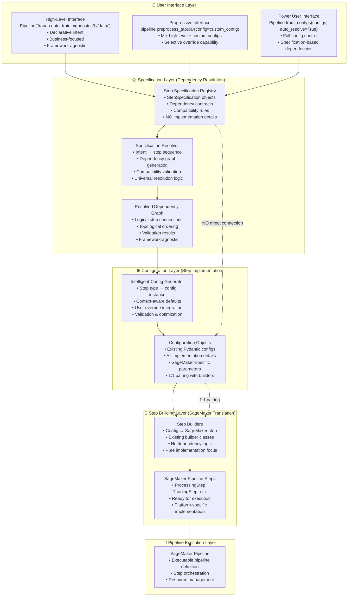

# Hybrid Specification + Config Architecture: The Best of Both Worlds

## Overview

The Hybrid Specification + Config Architecture combines the best aspects of both [specification-driven](./specification_driven_design.md) and [config-driven](./config_driven_design.md) approaches to create an optimal pipeline building system. This design uses **specifications for dependency resolution** and **configurations for step implementation**, providing a clean separation of concerns while maintaining backward compatibility.

## Related Documents
- **[Config-Driven Design](./config_driven_design.md)** - Current implementation that this hybrid approach builds upon
- **[Specification-Driven Design](./specification_driven_design.md)** - Pure declarative approach that inspires the dependency resolution layer
- **[Dependency Resolver](./dependency_resolver.md)** - Technical details on dependency resolution mechanisms

## Core Principles

### Clean Separation of Concerns
- **Specifications**: Handle "what steps are needed and how they connect" (dependency resolution)
- **Configurations**: Handle "how to implement each step" (SageMaker-specific details)
- **Step Builders**: Handle "how to create SageMaker steps from configs" (unchanged from current)

### Evolutionary Enhancement
- **Zero Breaking Changes**: All existing configs and builders continue to work
- **Gradual Migration**: Teams can adopt specification-driven interface at their own pace
- **Investment Protection**: All existing pipeline templates and configurations remain valid

## Layered Architecture



## User Experience Levels

### Level 1: High-Level Declarative (Beginners)
```python
# Day 1: Working pipeline
pipeline = Pipeline("fraud_detection").auto_train_xgboost("s3://fraud-data/")

# Behind the scenes:
# 1. Specifications resolve: data_loading → preprocessing → training → model
# 2. Intelligent defaults generate appropriate configs
# 3. Existing builders create SageMaker steps
# 4. Dependencies automatically resolved
```

### Level 2: Progressive Enhancement (Intermediate)
```python
# Week 1: Add custom configurations where needed
pipeline = (Pipeline("fraud_detection")
    .load_data("s3://fraud-data/")
    .preprocess_tabular(
        config=TabularPreprocessingConfig(
            instance_type="ml.m5.4xlarge",
            custom_transformations=["log_transform"]
        )
    )
    .train_xgboost(max_depth=8, n_estimators=200)
    .evaluate_performance())

# Specifications handle dependencies, configs handle implementation
```

### Level 3: Full Control (Power Users)
```python
# Full config control with automatic dependency resolution
configs = [
    CradleDataLoadConfig(s3_bucket="fraud-data", job_type="training"),
    TabularPreprocessingConfig(job_type="training", instance_type="ml.m5.4xlarge"),
    XGBoostTrainingConfig(max_depth=8, n_estimators=200)
]

# Specifications still resolve dependencies automatically
pipeline = Pipeline.from_configs(configs, auto_resolve_dependencies=True)
```

## Implementation Components

### Step Specifications (Dependency Resolution Only)
```python
# Pure dependency metadata - NO implementation details
XGBOOST_TRAINING_SPEC = StepSpecification(
    step_type="XGBoostTraining",
    dependencies=[
        DependencySpec(
            logical_name="training_data",
            compatible_sources=["TabularPreprocessing"],
            data_types=["processed_tabular"],
            semantic_keywords=["training", "processed"]
        )
    ],
    outputs=[
        OutputSpec(
            logical_name="model_artifacts",
            data_type="xgboost_model",
            semantic_keywords=["model", "artifacts"]
        )
    ]
    # NO SageMaker details, NO instance types, NO hyperparameters
)
```

### Step Configurations (Implementation Details Only)
```python
# All implementation details - NO dependency logic
@dataclass
class XGBoostTrainingConfig(BasePipelineConfig):
    # SageMaker-specific details
    instance_type: str = "ml.m5.2xlarge"
    instance_count: int = 1
    
    # Algorithm-specific details
    max_depth: int = 6
    n_estimators: int = 100
    learning_rate: float = 0.1
    
    # Infrastructure details
    volume_size: int = 30
    max_runtime_in_seconds: int = 86400
    
    # NO dependency information, NO compatibility rules
```

### Step Builders (Config → SageMaker Translation)
```python
# Paired 1:1 with configs, handles SageMaker implementation
class XGBoostTrainingStepBuilder(StepBuilderBase):
    def __init__(self, config: XGBoostTrainingConfig):
        self.config = config  # 1:1 pairing
    
    def create_step(self, **kwargs) -> TrainingStep:
        # Translate config to SageMaker step
        return TrainingStep(
            name=self.config.step_name,
            estimator=self._create_estimator(),
            inputs=kwargs.get('inputs', {}),
            # All SageMaker-specific implementation
        )
    
    # NO dependency resolution logic here
```

## Dependency Resolution Mechanisms

### Specification-Based Resolution (New)
```python
# Universal resolver works for all pipeline types
class SpecificationResolver:
    def resolve_dependencies(self, step_types: List[str]) -> PipelineDAG:
        nodes = step_types
        edges = []
        
        for step_type in step_types:
            spec = self.registry.get_specification(step_type)
            for dependency in spec.dependencies:
                compatible_sources = self._find_compatible_sources(dependency, step_types)
                for source in compatible_sources:
                    edges.append((source, step_type))
        
        return PipelineDAG(nodes=nodes, edges=edges)
```

### Enhanced Input Resolution
```python
# Specification resolver provides clean inputs
resolved_inputs = {
    "training_data": "s3://bucket/preprocessing/output/",
    "model_artifacts": "s3://bucket/training/model/"
}

# No more complex property path resolution needed
# No more manual message propagation
# Clean, semantic input names
```

## Error Handling & Debugging

### Early Detection Through Specifications
```python
# Specification validation catches issues at design time
try:
    pipeline = Pipeline("fraud").auto_train_xgboost("s3://data/")
except IncompatibleStepsError as e:
    print(f"Step compatibility issue: {e.message}")
    print(f"Suggestion: {e.suggested_fix}")
    # "XGBoost training requires processed tabular data. Add preprocessing step?"

except MissingDependencyError as e:
    print(f"Missing dependency: {e.message}")
    print(f"Available options: {e.compatible_sources}")
    # "Training step needs data source. Compatible: [DataLoading, Preprocessing]"
```

### Semantic Error Messages
- **Instead of**: "Source step training has no output model_artifacts (tried all paths)"
- **Now**: "XGBoost training step expects processed tabular data, but DataLoading step produces raw data. Add TabularPreprocessing step between them?"

## Scalability & Maintenance

### Universal Resolver (vs. Template Proliferation)
```python
# ONE resolver works for ALL pipeline types
class UniversalSpecificationResolver:
    def resolve_any_pipeline(self, step_types: List[str]) -> PipelineDAG:
        # Same logic works for:
        # - XGBoost end-to-end
        # - PyTorch end-to-end  
        # - Data preprocessing only
        # - Model evaluation only
        # - Any combination of steps
        
        return self._resolve_dependencies_from_specifications(step_types)

# NO MORE template_pipeline_*.py files needed
# NO MORE manual DAG definitions
# NO MORE duplicate dependency logic
```

### Easy Extension
```python
# Adding new step type requires only:
# 1. New step specification (dependency metadata)
NEW_STEP_SPEC = StepSpecification(
    step_type="DeepLearningTraining",
    dependencies=[...],
    outputs=[...]
)

# 2. New config class (existing pattern)
class DeepLearningTrainingConfig(BasePipelineConfig):
    # Implementation details only
    pass

# 3. New step builder (existing pattern)
class DeepLearningTrainingStepBuilder(StepBuilderBase):
    # SageMaker implementation only
    pass

# Automatic integration with ALL existing pipelines
# NO changes to resolver or other components
```

## Development Velocity

### Hybrid Development Timeline

#### High-Level Interface (Day 1)
```python
# Working prototype in minutes
pipeline = Pipeline("fraud_detection").auto_train_xgboost("s3://data/")
pipeline.execute()  # Ready to run
```

#### Progressive Enhancement (Week 1)
```python
# Add custom configurations as needed
pipeline = (Pipeline("fraud_detection")
    .load_data("s3://data/")
    .preprocess_tabular(instance_type="ml.m5.4xlarge")
    .train_xgboost(max_depth=8, n_estimators=200)
    .evaluate_performance(metrics=["auc", "precision", "recall"]))
```

#### Production Ready (Week 2)
```python
# Full production pipeline with monitoring, quality gates, etc.
pipeline = (Pipeline("fraud_detection")
    .load_data("s3://data/", validation_split=0.2)
    .preprocess_with_quality_checks()
    .train_xgboost_with_hyperparameter_tuning()
    .evaluate_with_business_metrics()
    .deploy_with_monitoring())
```

## Knowledge Requirements

### Tiered Knowledge Model

#### Level 1: Business Users
- **Domain Knowledge**: Understanding of ML pipeline concepts
- **High-Level Configuration**: Basic parameter tuning
- **No Infrastructure Knowledge**: Specifications handle complexity

#### Level 2: ML Engineers
- **Config Customization**: Ability to create custom configurations
- **Performance Tuning**: Understanding of resource optimization
- **Some SageMaker Knowledge**: For advanced configurations

#### Level 3: Platform Engineers
- **Full System Knowledge**: Understanding of specifications, configs, and builders
- **Extension Development**: Ability to add new step types
- **Deep SageMaker Expertise**: For complex integrations

## Key Benefits

### Best of Both Worlds

| Aspect | [Config-Driven](./config_driven_design.md) (Current) | [Pure Specification-Driven](./specification_driven_design.md) | **Hybrid (Proposed)** |
|--------|------------------------|---------------------------|----------------------|
| **Dependency Resolution** | ❌ Manual DAG definition<br/>❌ Complex property paths<br/>❌ Template proliferation | ✅ Automatic resolution<br/>✅ Semantic matching<br/>✅ Universal logic | ✅ **Specification-based resolution**<br/>✅ **Universal resolver**<br/>✅ **Early validation** |
| **Step Implementation** | ✅ Detailed configuration<br/>✅ Pydantic validation<br/>✅ Production-ready | ❌ May lack implementation detail<br/>❌ New infrastructure needed | ✅ **Existing config classes**<br/>✅ **Existing step builders**<br/>✅ **No breaking changes** |
| **User Experience** | ❌ Expert knowledge required<br/>❌ Manual coordination<br/>❌ Late error detection | ✅ High-level interface<br/>✅ Automatic assembly<br/>✅ Early validation | ✅ **Tiered interfaces**<br/>✅ **Progressive enhancement**<br/>✅ **Flexible control levels** |
| **Development Velocity** | ❌ Weeks to working pipeline<br/>❌ Complex debugging | ✅ Minutes to prototype<br/>✅ Semantic errors | ✅ **Minutes to prototype**<br/>✅ **Weeks to production**<br/>✅ **Intelligent debugging** |
| **Investment Protection** | ✅ Existing infrastructure<br/>✅ Proven in production | ❌ Complete rewrite needed<br/>❌ Migration complexity | ✅ **Zero breaking changes**<br/>✅ **Gradual migration**<br/>✅ **Preserve all investments** |

> **📖 For detailed analysis**: See [Config-Driven Design](./config_driven_design.md) for current implementation details and [Specification-Driven Design](./specification_driven_design.md) for pure declarative approach comparison.

### Hybrid Advantages

#### 1. Evolutionary, Not Revolutionary
- **Preserve Investments**: All existing configs, builders, and pipelines continue to work
- **Gradual Adoption**: Teams can migrate at their own pace
- **Risk Mitigation**: No big-bang changes, incremental improvements

#### 2. Best User Experience at Every Level
- **Beginners**: High-level declarative interface with intelligent defaults
- **Intermediate**: Mix specifications with custom configurations
- **Experts**: Full control with automatic dependency resolution

#### 3. Optimal Complexity Distribution
- **Specifications**: Handle the complex, error-prone dependency resolution
- **Configs**: Handle the detailed, step-specific implementation
- **Builders**: Continue to handle SageMaker integration (no changes)

#### 4. Universal Scalability
- **One Resolver**: Works for all current and future pipeline types
- **Easy Extension**: New step types integrate automatically
- **Reduced Maintenance**: Eliminate template proliferation and duplicate logic

#### 5. Production-Ready from Day One
- **Proven Infrastructure**: Builds on existing, battle-tested components
- **Enhanced Capabilities**: Adds intelligent automation without breaking existing functionality
- **Immediate Benefits**: Better user experience and faster development without migration costs

## Implementation Strategy

### Phase 1: Add Specification Layer (No Breaking Changes)
1. Create step specification registry
2. Implement specification resolver
3. Add high-level Pipeline interface
4. Maintain full backward compatibility

### Phase 2: Enhanced Dependency Resolution
1. Replace manual DAG definition with specification-based resolution
2. Enhance existing pipeline templates to use specifications
3. Provide migration tools for existing pipelines

### Phase 3: Intelligent Config Generation
1. Implement context-aware config generation
2. Add intelligent defaults based on specifications
3. Provide progressive enhancement capabilities

This hybrid architecture delivers **specification-driven simplicity for dependency resolution** while **preserving config-driven robustness for implementation**, creating the optimal balance between ease of use and production readiness.

## See Also

### Design Approach Comparisons
- **[Config-Driven Design](./config_driven_design.md)** - Current production implementation with detailed control
- **[Specification-Driven Design](./specification_driven_design.md)** - Pure declarative approach for rapid prototyping
- **[Design Evolution](./design_evolution.md)** - Historical context and evolution of pipeline design approaches

### Technical Implementation Details
- **[Dependency Resolver](./dependency_resolver.md)** - Core dependency resolution mechanisms
- **[Step Specification](./step_specification.md)** - Specification format and structure
- **[Step Builder](./step_builder.md)** - Step builder architecture and patterns
- **[Pipeline Template Builder](./pipeline_template_builder_v2.md)** - Template-based orchestration system
