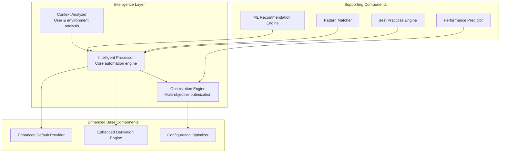

# Intelligence Layer Design

## Overview

The Intelligence Layer is the second layer of the [Adaptive Configuration Management System](./adaptive_configuration_management_system.md) that provides the core intelligence engine for automation and derivation. This layer processes user inputs and context to generate complete configurations through sophisticated analysis, optimization, and machine learning-based recommendations.

## Purpose and Responsibilities

1. **Context Analysis**: Comprehensive analysis of user, environment, and data context
2. **Intelligent Processing**: Transform essential inputs into complete configurations
3. **Optimization**: Multi-objective optimization for performance, cost, and reliability
4. **Pattern Recognition**: Identify and apply successful configuration patterns
5. **Continuous Learning**: Learn from outcomes to improve future recommendations

## Architecture Overview



## Core Components

### 1. Context Analyzer

**Purpose**: Analyze user context and environment to inform intelligent decisions

**Implementation**: See [Context Analysis Framework](./context_analysis_framework.md) for detailed design

**Key Capabilities**:
- User profiling and expertise analysis
- Environment detection and constraint analysis
- Data source characterization
- Historical pattern analysis

### 2. Intelligent Processor

**Purpose**: Core intelligence engine that processes user inputs and context to generate complete configurations

```python
class IntelligentProcessor:
    """
    Core intelligence engine that processes user inputs and context
    to generate complete configurations
    
    Integrates the three-tier architecture with intelligent enhancements
    """
    
    def __init__(self):
        # Core components from existing designs
        self.tier_registry = ConfigFieldTierRegistry()
        self.defaults_provider = EnhancedDefaultValuesProvider()
        self.derivation_engine = EnhancedFieldDerivationEngine()
        
        # New intelligence components
        self.ml_recommender = MLRecommendationEngine()
        self.optimization_engine = ConfigurationOptimizer()
        self.pattern_matcher = PatternMatcher()
        self.validator = IntelligentValidator()
    
    def process_configuration(self, 
                            essential_inputs: dict, 
                            context: PipelineContext) -> ProcessedConfiguration:
        """
        Transform essential inputs into complete configuration using intelligence
        
        Process:
        1. Validate and enhance essential inputs
        2. Apply intelligent defaults (enhanced Tier 2)
        3. Derive dependent fields (enhanced Tier 3)
        4. Apply ML-based optimizations
        5. Validate and suggest improvements
        """
        # Step 1: Validate and enhance essential inputs
        validated_inputs = self._validate_and_enhance_inputs(essential_inputs, context)
        
        # Step 2: Create base configuration objects
        config_objects = self._create_config_objects(validated_inputs, context)
        
        # Step 3: Apply intelligent defaults (Enhanced Tier 2)
        self.defaults_provider.apply_intelligent_defaults(config_objects, context)
        
        # Step 4: Derive dependent fields (Enhanced Tier 3)
        self.derivation_engine.derive_fields_with_intelligence(config_objects, context)
        
        # Step 5: Apply ML-based optimizations
        optimized_configs = self.optimization_engine.optimize_configurations(
            config_objects, context
        )
        
        # Step 6: Generate recommendations
        recommendations = self.ml_recommender.generate_recommendations(
            optimized_configs, context
        )
        
        # Step 7: Final validation
        validation_results = self.validator.validate_configurations(
            optimized_configs, context
        )
        
        return ProcessedConfiguration(
            configurations=optimized_configs,
            recommendations=recommendations,
            validation_results=validation_results,
            context=context,
            processing_metadata=self._generate_metadata()
        )
    
    def _validate_and_enhance_inputs(self, 
                                   essential_inputs: dict, 
                                   context: PipelineContext) -> dict:
        """
        Validate essential inputs and enhance with intelligent suggestions
        
        Enhancements:
        - Fill missing required fields with intelligent defaults
        - Suggest improvements for provided values
        - Detect and resolve conflicts
        - Apply context-aware transformations
        """
        enhanced_inputs = essential_inputs.copy()
        
        # Validate required fields
        missing_fields = self._identify_missing_required_fields(essential_inputs, context)
        for field in missing_fields:
            suggested_value = self.ml_recommender.suggest_field_value(field, context)
            if suggested_value.confidence > 0.8:
                enhanced_inputs[field] = suggested_value.value
                print(f"Auto-filled {field} with {suggested_value.value} (confidence: {suggested_value.confidence:.1%})")
        
        # Enhance provided values
        for field, value in essential_inputs.items():
            enhancement = self.ml_recommender.suggest_field_enhancement(field, value, context)
            if enhancement and enhancement.confidence > 0.9:
                enhanced_inputs[field] = enhancement.enhanced_value
                print(f"Enhanced {field}: {value} -> {enhancement.enhanced_value}")
        
        return enhanced_inputs
    
    def _create_config_objects(self, 
                             validated_inputs: dict, 
                             context: PipelineContext) -> List[BaseModel]:
        """
        Create configuration objects from validated inputs
        
        Uses pattern matching to determine appropriate configuration types
        """
        # Determine pipeline pattern
        pattern = self.pattern_matcher.match_pattern(validated_inputs, context)
        
        # Create configuration objects based on pattern
        config_objects = []
        for config_type in pattern.required_configurations:
            config_obj = config_type()
            
            # Populate with relevant inputs
            self._populate_config_from_inputs(config_obj, validated_inputs, context)
            
            config_objects.append(config_obj)
        
        return config_objects

class EnhancedDefaultValuesProvider(DefaultValuesProvider):
    """
    Enhanced version of DefaultValuesProvider with intelligent capabilities
    
    Extends the existing DefaultValuesProvider with:
    - Context-aware defaults
    - ML-based recommendations
    - Historical pattern analysis
    """
    
    def __init__(self):
        super().__init__()
        self.ml_engine = MLDefaultsEngine()
        self.context_analyzer = ContextAnalyzer()
        self.pattern_analyzer = HistoricalPatternAnalyzer()
    
    def apply_intelligent_defaults(self, 
                                 configs: List[BaseModel], 
                                 context: PipelineContext) -> None:
        """
        Apply defaults using intelligence and context
        
        Enhancement over base DefaultValuesProvider:
        - Uses context to select optimal defaults
        - Applies ML-based recommendations
        - Considers historical success patterns
        """
        for config in configs:
            # Apply base defaults first
            super().apply_defaults(config)
            
            # Apply context-aware enhancements
            self._apply_context_aware_defaults(config, context)
            
            # Apply ML-based recommendations
            self._apply_ml_recommendations(config, context)
            
            # Apply historical pattern insights
            self._apply_pattern_based_defaults(config, context)
    
    def _apply_context_aware_defaults(self, 
                                    config: BaseModel, 
                                    context: PipelineContext) -> None:
        """Apply defaults based on context analysis"""
        # Environment-based defaults
        if context.environment.cost_constraints.budget_limit:
            self._apply_cost_optimized_defaults(config, context)
        
        if context.environment.performance_requirements.high_throughput:
            self._apply_performance_optimized_defaults(config, context)
        
        # Data-based defaults
        if context.data_characteristics:
            data_size = context.data_characteristics.size_estimate.total_size_gb
            if data_size > 1000:  # Large dataset
                self._apply_large_data_defaults(config, context)
        
        # User-based defaults
        if context.user_profile.expertise_level == UserExpertiseLevel.BEGINNER:
            self._apply_beginner_friendly_defaults(config, context)
    
    def _apply_ml_recommendations(self, 
                                config: BaseModel, 
                                context: PipelineContext) -> None:
        """Apply ML-based default recommendations"""
        # Get ML recommendations for each field
        for field_name, field_info in config.__fields__.items():
            if getattr(config, field_name) is None:  # Only for unset fields
                recommendation = self.ml_engine.recommend_default_value(
                    config_type=type(config),
                    field_name=field_name,
                    context=context
                )
                
                if recommendation.confidence > 0.7:
                    setattr(config, field_name, recommendation.value)

class EnhancedFieldDerivationEngine(FieldDerivationEngine):
    """
    Enhanced version of FieldDerivationEngine with intelligent capabilities
    
    Extends the existing FieldDerivationEngine with:
    - Context-aware derivation
    - Optimization-based field values
    - Cross-configuration intelligence
    """
    
    def __init__(self):
        super().__init__()
        self.optimization_engine = DerivationOptimizationEngine()
        self.dependency_analyzer = SmartDependencyAnalyzer()
        self.cross_config_optimizer = CrossConfigurationOptimizer()
    
    def derive_fields_with_intelligence(self, 
                                      configs: List[BaseModel], 
                                      context: PipelineContext) -> None:
        """
        Derive fields using intelligence and optimization
        
        Enhancement over base FieldDerivationEngine:
        - Uses context for optimal derivation
        - Applies cross-configuration optimization
        - Considers resource constraints and performance targets
        """
        # Apply base derivation first
        super().derive_fields_for_multiple(configs)
        
        # Apply intelligent enhancements
        self._apply_intelligent_derivations(configs, context)
        
        # Optimize cross-configuration dependencies
        self._optimize_cross_config_fields(configs, context)
        
        # Apply resource-aware optimizations
        self._apply_resource_optimizations(configs, context)
    
    def _apply_intelligent_derivations(self, 
                                     configs: List[BaseModel], 
                                     context: PipelineContext) -> None:
        """Apply intelligent field derivations"""
        for config in configs:
            # Analyze dependencies with intelligence
            dependencies = self.dependency_analyzer.analyze_smart_dependencies(
                config, context
            )
            
            # Derive fields using optimization
            for field_name, dependency_info in dependencies.items():
                if self._should_derive_intelligently(config, field_name, context):
                    optimal_value = self.optimization_engine.derive_optimal_value(
                        config, field_name, dependency_info, context
                    )
                    setattr(config, field_name, optimal_value)
    
    def _optimize_cross_config_fields(self, 
                                    configs: List[BaseModel], 
                                    context: PipelineContext) -> None:
        """Optimize fields across multiple configurations"""
        # Identify cross-configuration optimization opportunities
        optimization_opportunities = self.cross_config_optimizer.identify_opportunities(
            configs, context
        )
        
        # Apply optimizations
        for opportunity in optimization_opportunities:
            if opportunity.benefit_score > 0.8:
                self.cross_config_optimizer.apply_optimization(
                    configs, opportunity, context
                )
```

### 3. Optimization Engine

**Purpose**: Optimize configurations for multiple objectives

```python
class ConfigurationOptimizer:
    """
    Optimizes configurations for multiple objectives
    
    Provides intelligent optimization across:
    - Performance optimization
    - Cost optimization
    - Reliability optimization
    - Compliance optimization
    """
    
    def __init__(self):
        self.performance_optimizer = PerformanceOptimizer()
        self.cost_optimizer = CostOptimizer()
        self.reliability_optimizer = ReliabilityOptimizer()
        self.compliance_checker = ComplianceChecker()
        self.multi_objective_optimizer = MultiObjectiveOptimizer()
    
    def optimize_configurations(self, 
                              configs: List[BaseModel], 
                              context: PipelineContext) -> List[BaseModel]:
        """
        Apply multi-objective optimization to configurations
        
        Returns optimized configurations with metadata about changes made
        """
        optimization_results = []
        
        for config in configs:
            # Multi-objective optimization
            optimized_config = self.multi_objective_optimizer.optimize(
                config, context, objectives=[
                    OptimizationObjective.PERFORMANCE,
                    OptimizationObjective.COST,
                    OptimizationObjective.RELIABILITY
                ]
            )
            
            # Ensure compliance
            compliant_config = self.compliance_checker.ensure_compliance(
                optimized_config, context
            )
            
            optimization_results.append(compliant_config)
        
        return optimization_results

class PerformanceOptimizer:
    """Optimizes configurations for performance"""
    
    def __init__(self):
        self.resource_analyzer = ResourceRequirementAnalyzer()
        self.bottleneck_predictor = BottleneckPredictor()
        self.scaling_optimizer = ScalingOptimizer()
    
    def optimize(self, config: BaseModel, context: PipelineContext) -> BaseModel:
        """
        Optimize configuration for performance based on:
        - Data size and complexity
        - Processing requirements
        - Historical performance data
        - Resource availability
        """
        # Analyze performance requirements
        perf_requirements = self._analyze_performance_requirements(config, context)
        
        # Predict potential bottlenecks
        bottlenecks = self.bottleneck_predictor.predict_bottlenecks(
            config, context, perf_requirements
        )
        
        # Optimize for identified bottlenecks
        optimized_config = config.copy()
        for bottleneck in bottlenecks:
            optimization = self._optimize_for_bottleneck(
                optimized_config, bottleneck, context
            )
            optimized_config = optimization.apply(optimized_config)
        
        # Optimize resource allocation
        resource_optimized = self.scaling_optimizer.optimize_resources(
            optimized_config, context, perf_requirements
        )
        
        return resource_optimized
    
    def _analyze_performance_requirements(self, 
                                        config: BaseModel, 
                                        context: PipelineContext) -> PerformanceRequirements:
        """Analyze performance requirements from context"""
        requirements = PerformanceRequirements()
        
        # Data-based requirements
        if context.data_characteristics:
            data_size = context.data_characteristics.size_estimate.total_size_gb
            requirements.processing_time_target = self._estimate_processing_time_target(data_size)
            requirements.memory_requirements = self._estimate_memory_requirements(data_size)
            requirements.io_requirements = self._estimate_io_requirements(data_size)
        
        # User-based requirements
        if context.user_profile.preferences.get("performance_priority") == "high":
            requirements.priority_level = PerformancePriority.HIGH
        
        # Environment-based requirements
        if context.environment.performance_requirements:
            requirements.update(context.environment.performance_requirements)
        
        return requirements

class CostOptimizer:
    """Optimizes configurations for cost efficiency"""
    
    def __init__(self):
        self.cost_model = AWSCostModel()
        self.spot_instance_analyzer = SpotInstanceAnalyzer()
        self.resource_rightsizer = ResourceRightsizer()
    
    def optimize(self, config: BaseModel, context: PipelineContext) -> BaseModel:
        """
        Optimize configuration for cost efficiency
        
        Optimizations include:
        - Instance type selection
        - Spot instance usage
        - Resource rightsizing
        - Storage optimization
        """
        # Estimate current cost
        current_cost = self.cost_model.estimate_cost(config, context)
        
        # Analyze cost optimization opportunities
        opportunities = self._identify_cost_opportunities(config, context, current_cost)
        
        # Apply cost optimizations
        optimized_config = config.copy()
        for opportunity in sorted(opportunities, key=lambda x: x.savings_potential, reverse=True):
            if opportunity.risk_level <= context.user_profile.risk_tolerance:
                optimized_config = opportunity.apply(optimized_config)
        
        return optimized_config
    
    def _identify_cost_opportunities(self, 
                                   config: BaseModel, 
                                   context: PipelineContext,
                                   current_cost: CostEstimate) -> List[CostOptimization]:
        """Identify cost optimization opportunities"""
        opportunities = []
        
        # Spot instance opportunities
        if self.spot_instance_analyzer.is_suitable_for_spot(config, context):
            spot_savings = self.spot_instance_analyzer.estimate_savings(config, context)
            opportunities.append(SpotInstanceOptimization(
                savings_potential=spot_savings.amount,
                risk_level=spot_savings.risk_level,
                config_changes=spot_savings.required_changes
            ))
        
        # Resource rightsizing opportunities
        rightsizing_analysis = self.resource_rightsizer.analyze(config, context)
        if rightsizing_analysis.has_opportunities:
            opportunities.extend(rightsizing_analysis.opportunities)
        
        return opportunities

class MultiObjectiveOptimizer:
    """Optimizes configurations for multiple objectives simultaneously"""
    
    def __init__(self):
        self.pareto_optimizer = ParetoOptimizer()
        self.weight_calculator = ObjectiveWeightCalculator()
        self.trade_off_analyzer = TradeOffAnalyzer()
    
    def optimize(self, 
                config: BaseModel, 
                context: PipelineContext,
                objectives: List[OptimizationObjective]) -> BaseModel:
        """
        Optimize configuration for multiple objectives
        
        Uses Pareto optimization to find optimal trade-offs
        """
        # Calculate objective weights based on context
        weights = self.weight_calculator.calculate_weights(objectives, context)
        
        # Generate candidate configurations
        candidates = self._generate_candidate_configurations(config, context, objectives)
        
        # Find Pareto-optimal solutions
        pareto_solutions = self.pareto_optimizer.find_pareto_optimal(
            candidates, objectives, weights
        )
        
        # Select best solution based on context preferences
        best_solution = self._select_best_solution(pareto_solutions, context, weights)
        
        return best_solution
```

## Supporting Components

### ML Recommendation Engine

```python
class MLRecommendationEngine:
    """
    Machine learning-based recommendation engine
    
    Provides intelligent recommendations based on:
    - Historical configuration data
    - Success/failure patterns
    - Similar user patterns
    - Best practices
    """
    
    def __init__(self):
        self.model_registry = MLModelRegistry()
        self.feature_extractor = ConfigurationFeatureExtractor()
        self.similarity_engine = ConfigurationSimilarityEngine()
    
    def generate_recommendations(self, 
                               configs: List[BaseModel], 
                               context: PipelineContext) -> List[Recommendation]:
        """
        Generate ML-based recommendations for configurations
        
        Returns ranked list of recommendations with confidence scores
        """
        recommendations = []
        
        for config in configs:
            # Extract features for ML model
            features = self.feature_extractor.extract_features(config, context)
            
            # Get model predictions
            model = self.model_registry.get_model_for_config_type(type(config))
            predictions = model.predict_recommendations(features)
            
            # Find similar successful configurations
            similar_configs = self.similarity_engine.find_similar_successful(
                config, context, limit=10
            )
            
            # Generate recommendations
            config_recommendations = self._generate_config_recommendations(
                config, predictions, similar_configs, context
            )
            
            recommendations.extend(config_recommendations)
        
        # Rank and filter recommendations
        ranked_recommendations = self._rank_recommendations(recommendations, context)
        
        return ranked_recommendations[:20]  # Top 20 recommendations
    
    def suggest_field_value(self, 
                          field_name: str, 
                          context: PipelineContext) -> FieldSuggestion:
        """
        Suggest value for a specific field based on context
        
        Uses ML models trained on successful configurations
        """
        # Extract context features
        context_features = self.feature_extractor.extract_context_features(context)
        
        # Get field-specific model
        field_model = self.model_registry.get_field_model(field_name)
        
        # Generate suggestion
        suggestion = field_model.suggest_value(context_features)
        
        return FieldSuggestion(
            field_name=field_name,
            value=suggestion.value,
            confidence=suggestion.confidence,
            rationale=suggestion.rationale
        )

class ConfigurationFeatureExtractor:
    """Extracts features from configurations for ML models"""
    
    def extract_features(self, 
                        config: BaseModel, 
                        context: PipelineContext) -> FeatureVector:
        """
        Extract comprehensive features for ML models
        
        Features include:
        - Configuration parameter values
        - Context characteristics
        - Derived metrics
        - Historical patterns
        """
        features = {}
        
        # Configuration features
        config_features = self._extract_config_features(config)
        features.update(config_features)
        
        # Context features
        context_features = self._extract_context_features(context)
        features.update(context_features)
        
        # Derived features
        derived_features = self._extract_derived_features(config, context)
        features.update(derived_features)
        
        return FeatureVector(features)
    
    def _extract_config_features(self, config: BaseModel) -> dict:
        """Extract features from configuration object"""
        features = {}
        
        for field_name, field_value in config.__dict__.items():
            if field_value is not None:
                # Numerical features
                if isinstance(field_value, (int, float)):
                    features[f"config_{field_name}"] = field_value
                
                # Categorical features (one-hot encoded)
                elif isinstance(field_value, str):
                    features[f"config_{field_name}_{field_value}"] = 1
                
                # Boolean features
                elif isinstance(field_value, bool):
                    features[f"config_{field_name}"] = int(field_value)
        
        return features
```

## Data Models

```python
@dataclass
class ProcessedConfiguration:
    """Result of intelligent processing"""
    configurations: List[BaseModel]
    recommendations: List[Recommendation]
    validation_results: List[ValidationResult]
    context: PipelineContext
    processing_metadata: ProcessingMetadata

@dataclass
class Recommendation:
    """ML-based recommendation"""
    type: RecommendationType
    target_config: str
    target_field: str
    current_value: Any
    recommended_value: Any
    confidence: float
    rationale: str
    expected_benefit: str

@dataclass
class OptimizationResult:
    """Result of configuration optimization"""
    original_config: BaseModel
    optimized_config: BaseModel
    optimizations_applied: List[OptimizationChange]
    performance_impact: PerformanceImpact
    cost_impact: CostImpact
    risk_assessment: RiskAssessment

class OptimizationObjective(Enum):
    PERFORMANCE = "performance"
    COST = "cost"
    RELIABILITY = "reliability"
    COMPLIANCE = "compliance"
```

## Integration Points

### With Intent Capture Layer
```python
class IntelligenceLayerIntegration:
    """Integration point with Intent Capture Layer"""
    
    def process_captured_intent(self, request: ConfigurationRequest) -> ProcessedConfiguration:
        """Process intent captured from user interfaces"""
        # Enhance context
        enhanced_context = self.context_analyzer.analyze_full_context(
            request.user_id, request
        )
        
        # Process through intelligence pipeline
        return self.intelligent_processor.process_configuration(
            request.inputs, enhanced_context
        )
```

### With Storage Layer
```python
class StorageLayerIntegration:
    """Integration point with Storage & Representation Layer"""
    
    def prepare_for_storage(self, processed_config: ProcessedConfiguration) -> StoragePackage:
        """Prepare processed configuration for storage"""
        return StoragePackage(
            configurations=processed_config.configurations,
            intelligence_metadata=processed_config.processing_metadata,
            recommendations=processed_config.recommendations,
            context_snapshot=processed_config.context
        )
```

## Testing Strategy

### Unit Testing
```python
class TestIntelligenceLayer(unittest.TestCase):
    def test_intelligent_processor_basic_flow(self):
        """Test basic intelligent processing flow"""
        processor = IntelligentProcessor()
        essential_inputs = {"region": "us-west-2", "model_type": "xgboost"}
        context = mock_pipeline_context()
        
        result = processor.process_configuration(essential_inputs, context)
        
        self.assertIsInstance(result, ProcessedConfiguration)
        self.assertGreater(len(result.configurations), 0)
        self.assertGreater(len(result.recommendations), 0)
    
    def test_ml_recommendation_engine(self):
        """Test ML recommendation generation"""
        engine = MLRecommendationEngine()
        config = XGBoostTrainingConfig()
        context = mock_pipeline_context()
        
        recommendations = engine.generate_recommendations([config], context)
        
        self.assertIsInstance(recommendations, list)
        for rec in recommendations:
            self.assertIsInstance(rec, Recommendation)
            self.assertGreater(rec.confidence, 0)
```

## Related Documents

- **[Adaptive Configuration Management System](./adaptive_configuration_management_system.md)** - Main system architecture
- **[Context Analysis Framework](./context_analysis_framework.md)** - Context analysis implementation
- **[Intent Capture Layer Design](./intent_capture_layer_design.md)** - Previous layer in architecture
- **[Storage & Representation Layer Design](./storage_representation_layer_design.md)** - Next layer in architecture
- **[Default Values Provider Design](./default_values_provider_design.md)** - Enhanced defaults implementation
- **[Field Derivation Engine Design](./field_derivation_engine_design.md)** - Enhanced derivation implementation
