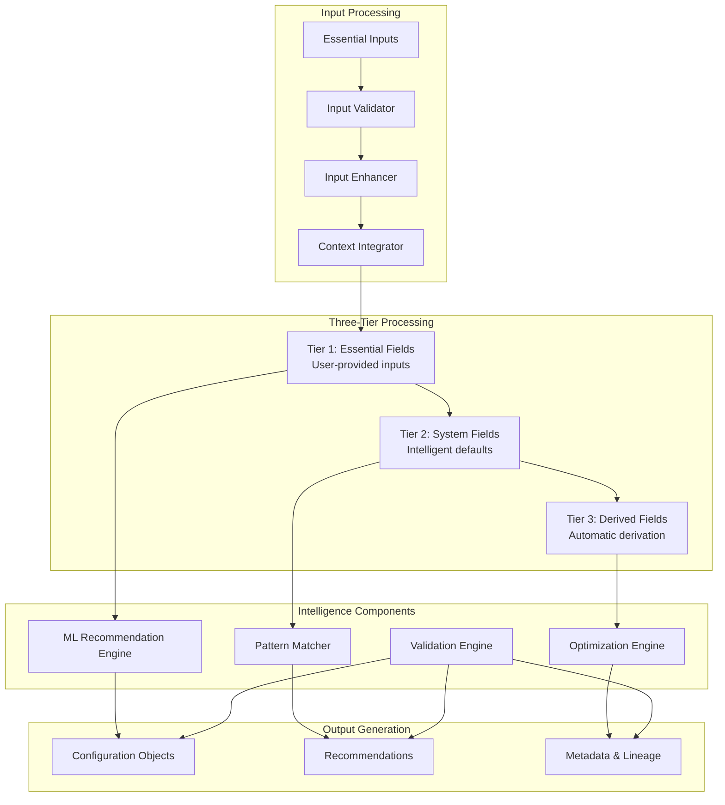

# Intelligent Processing Engine

## Overview

The Intelligent Processing Engine is the core intelligence component of the [Adaptive Configuration Management System](./adaptive_configuration_management_system.md) that transforms user inputs and context into complete, optimized configurations. This engine integrates the three-tier architecture from the [Essential Inputs Design](./essential_inputs_notebook_design.md) with advanced machine learning and optimization capabilities.

## Purpose and Responsibilities

The Intelligent Processing Engine serves as the central intelligence hub by:

1. **Configuration Generation**: Transform essential inputs into complete configurations
2. **Intelligent Automation**: Apply ML-based defaults and optimizations
3. **Context-Aware Processing**: Adapt processing based on user and environment context
4. **Multi-Objective Optimization**: Balance performance, cost, and reliability
5. **Continuous Learning**: Improve recommendations based on outcomes

## Architecture Overview



## Core Components

### 1. Intelligent Processor (Main Orchestrator)

```python
class IntelligentProcessor:
    """
    Core intelligence engine that processes user inputs and context
    to generate complete configurations
    
    Integrates the three-tier architecture with intelligent enhancements
    """
    
    def __init__(self):
        # Core components from existing designs
        self.tier_registry = ConfigFieldTierRegistry()
        self.defaults_provider = EnhancedDefaultValuesProvider()
        self.derivation_engine = EnhancedFieldDerivationEngine()
        
        # New intelligence components
        self.ml_recommender = MLRecommendationEngine()
        self.optimization_engine = ConfigurationOptimizer()
        self.pattern_matcher = PatternMatcher()
        self.validation_engine = IntelligentValidationEngine()
        
        # Processing components
        self.input_processor = InputProcessor()
        self.context_integrator = ContextIntegrator()
        self.output_generator = OutputGenerator()
    
    def process_configuration(self, 
                            essential_inputs: dict, 
                            context: PipelineContext) -> ProcessedConfiguration:
        """
        Transform essential inputs into complete configuration using intelligence
        
        Process:
        1. Validate and enhance essential inputs
        2. Apply intelligent defaults (enhanced Tier 2)
        3. Derive dependent fields (enhanced Tier 3)
        4. Apply ML-based optimizations
        5. Validate and suggest improvements
        6. Generate output with metadata
        """
        # Step 1: Process and validate inputs
        processed_inputs = self.input_processor.process_inputs(
            essential_inputs, context
        )
        
        # Step 2: Create base configuration objects (Tier 1)
        config_objects = self._create_config_objects(processed_inputs, context)
        
        # Step 3: Apply intelligent defaults (Enhanced Tier 2)
        self.defaults_provider.apply_intelligent_defaults(config_objects, context)
        
        # Step 4: Derive dependent fields (Enhanced Tier 3)
        self.derivation_engine.derive_fields_with_intelligence(config_objects, context)
        
        # Step 5: Apply ML-based optimizations
        optimized_configs = self.optimization_engine.optimize_configurations(
            config_objects, context
        )
        
        # Step 6: Generate recommendations
        recommendations = self.ml_recommender.generate_recommendations(
            optimized_configs, context
        )
        
        # Step 7: Validate final configuration
        validation_results = self.validation_engine.validate_configurations(
            optimized_configs, context
        )
        
        # Step 8: Generate output with metadata
        return self.output_generator.generate_output(
            configurations=optimized_configs,
            recommendations=recommendations,
            validation_results=validation_results,
            context=context,
            processing_metadata=self._generate_processing_metadata()
        )
    
    def _create_config_objects(self, 
                             processed_inputs: ProcessedInputs, 
                             context: PipelineContext) -> List[BaseModel]:
        """
        Create base configuration objects from processed inputs
        
        This implements Tier 1 of the three-tier architecture
        """
        config_objects = []
        
        # Determine required configuration types based on pipeline type
        required_configs = self._determine_required_configs(
            processed_inputs.pipeline_type, context
        )
        
        for config_type in required_configs:
            # Create configuration object
            config_class = self.tier_registry.get_config_class(config_type)
            config_obj = config_class()
            
            # Populate with essential inputs (Tier 1)
            self._populate_essential_fields(
                config_obj, processed_inputs, context
            )
            
            config_objects.append(config_obj)
        
        return config_objects
    
    def _populate_essential_fields(self,
                                 config_obj: BaseModel,
                                 processed_inputs: ProcessedInputs,
                                 context: PipelineContext) -> None:
        """Populate configuration object with essential user inputs"""
        essential_fields = self.tier_registry.get_essential_fields(
            type(config_obj).__name__
        )
        
        for field_name in essential_fields:
            if field_name in processed_inputs.fields:
                setattr(config_obj, field_name, processed_inputs.fields[field_name])
```

### 2. Enhanced Default Values Provider

```python
class EnhancedDefaultValuesProvider(DefaultValuesProvider):
    """
    Enhanced version of DefaultValuesProvider with intelligent capabilities
    
    Extends the existing DefaultValuesProvider with:
    - Context-aware defaults
    - ML-based recommendations
    - Historical pattern analysis
    """
    
    def __init__(self):
        super().__init__()
        self.ml_defaults_engine = MLDefaultsEngine()
        self.context_analyzer = ContextAnalyzer()
        self.pattern_analyzer = PatternAnalyzer()
        self.performance_predictor = PerformancePredictor()
    
    def apply_intelligent_defaults(self, 
                                 configs: List[BaseModel], 
                                 context: PipelineContext) -> None:
        """
        Apply defaults using intelligence and context
        
        Enhancement over base DefaultValuesProvider:
        - Uses context to select optimal defaults
        - Applies ML-based recommendations
        - Considers historical success patterns
        """
        for config in configs:
            # Apply base defaults first
            super().apply_defaults(config)
            
            # Apply context-aware enhancements
            self._apply_context_aware_defaults(config, context)
            
            # Apply ML-based recommendations
            self._apply_ml_recommendations(config, context)
            
            # Apply pattern-based optimizations
            self._apply_pattern_optimizations(config, context)
    
    def _apply_context_aware_defaults(self,
                                    config: BaseModel,
                                    context: PipelineContext) -> None:
        """Apply defaults based on context analysis"""
        config_type = type(config).__name__
        system_fields = self.tier_registry.get_system_fields(config_type)
        
        for field_name in system_fields:
            if not hasattr(config, field_name) or getattr(config, field_name) is None:
                # Generate context-aware default
                default_value = self._generate_context_aware_default(
                    field_name, config, context
                )
                setattr(config, field_name, default_value)
    
    def _generate_context_aware_default(self,
                                      field_name: str,
                                      config: BaseModel,
                                      context: PipelineContext) -> Any:
        """Generate context-aware default for specific field"""
        # User expertise-based defaults
        if context.user_profile.expertise_level == UserExpertiseLevel.BEGINNER:
            return self._get_beginner_friendly_default(field_name, config)
        
        # Environment constraint-based defaults
        if context.environment.cost_constraints.budget_limit:
            return self._get_cost_optimized_default(field_name, config, context)
        
        # Data size-based defaults
        if context.data_characteristics:
            data_size = context.data_characteristics.size_estimate.total_size_gb
            if data_size > 1000:  # Large dataset
                return self._get_performance_optimized_default(field_name, config)
        
        # Historical pattern-based defaults
        if context.historical_patterns and context.historical_patterns.success_patterns:
            return self._get_pattern_based_default(
                field_name, config, context.historical_patterns
            )
        
        # Fallback to base default
        return super().get_default_value(field_name, config)
    
    def _apply_ml_recommendations(self,
                                config: BaseModel,
                                context: PipelineContext) -> None:
        """Apply ML-based recommendations for system fields"""
        # Get ML recommendations for this configuration type
        ml_recommendations = self.ml_defaults_engine.get_recommendations(
            config, context
        )
        
        for field_name, recommended_value in ml_recommendations.items():
            if self._should_apply_ml_recommendation(field_name, config, context):
                setattr(config, field_name, recommended_value)

class MLDefaultsEngine:
    """Machine learning engine for generating intelligent defaults"""
    
    def __init__(self):
        self.models = self._load_ml_models()
        self.feature_extractor = FeatureExtractor()
        self.model_cache = ModelCache()
    
    def get_recommendations(self,
                          config: BaseModel,
                          context: PipelineContext) -> Dict[str, Any]:
        """
        Get ML-based recommendations for configuration fields
        
        Returns:
            Dictionary mapping field names to recommended values
        """
        config_type = type(config).__name__
        
        # Check cache first
        cache_key = self._generate_cache_key(config, context)
        cached_recommendations = self.model_cache.get(cache_key)
        if cached_recommendations:
            return cached_recommendations
        
        # Extract features for ML model
        features = self.feature_extractor.extract_features(config, context)
        
        # Get model for this configuration type
        model = self.models.get(config_type)
        if not model:
            return {}
        
        # Generate predictions
        predictions = model.predict(features)
        
        # Convert predictions to field recommendations
        recommendations = self._convert_predictions_to_recommendations(
            predictions, config, context
        )
        
        # Cache results
        self.model_cache.set(cache_key, recommendations)
        
        return recommendations
    
    def _convert_predictions_to_recommendations(self,
                                              predictions: np.ndarray,
                                              config: BaseModel,
                                              context: PipelineContext) -> Dict[str, Any]:
        """Convert ML predictions to field recommendations"""
        recommendations = {}
        config_type = type(config).__name__
        
        # Get field mapping for this configuration type
        field_mapping = self._get_field_mapping(config_type)
        
        for i, field_name in enumerate(field_mapping):
            if i < len(predictions):
                # Convert prediction to appropriate field type
                field_type = self._get_field_type(config, field_name)
                recommended_value = self._convert_prediction_to_type(
                    predictions[i], field_type
                )
                recommendations[field_name] = recommended_value
        
        return recommendations
```

### 3. Enhanced Field Derivation Engine

```python
class EnhancedFieldDerivationEngine(FieldDerivationEngine):
    """
    Enhanced version of FieldDerivationEngine with intelligent capabilities
    
    Extends the existing FieldDerivationEngine with:
    - Context-aware derivation
    - Optimization-based field values
    - Cross-configuration intelligence
    """
    
    def __init__(self):
        super().__init__()
        self.dependency_resolver = DependencyResolver()
        self.optimization_engine = FieldOptimizationEngine()
        self.cross_config_analyzer = CrossConfigAnalyzer()
        self.performance_estimator = PerformanceEstimator()
    
    def derive_fields_with_intelligence(self, 
                                      configs: List[BaseModel], 
                                      context: PipelineContext) -> None:
        """
        Derive fields using intelligence and optimization
        
        Enhancement over base FieldDerivationEngine:
        - Uses context for optimal derivation
        - Applies cross-configuration optimization
        - Considers resource constraints and performance targets
        """
        # Apply base derivation first
        super().derive_fields_for_multiple(configs)
        
        # Apply intelligent enhancements
        self._apply_intelligent_derivations(configs, context)
        
        # Optimize cross-configuration dependencies
        self._optimize_cross_config_fields(configs, context)
        
        # Apply performance-based optimizations
        self._apply_performance_optimizations(configs, context)
    
    def _apply_intelligent_derivations(self,
                                     configs: List[BaseModel],
                                     context: PipelineContext) -> None:
        """Apply intelligent derivations based on context"""
        for config in configs:
            config_type = type(config).__name__
            derived_fields = self.tier_registry.get_derived_fields(config_type)
            
            for field_name in derived_fields:
                if not hasattr(config, field_name) or getattr(config, field_name) is None:
                    # Derive field value intelligently
                    derived_value = self._derive_field_intelligently(
                        field_name, config, configs, context
                    )
                    setattr(config, field_name, derived_value)
    
    def _derive_field_intelligently(self,
                                  field_name: str,
                                  config: BaseModel,
                                  all_configs: List[BaseModel],
                                  context: PipelineContext) -> Any:
        """Derive field value using intelligent analysis"""
        # Try context-based derivation first
        context_derived = self._derive_from_context(field_name, config, context)
        if context_derived is not None:
            return context_derived
        
        # Try cross-configuration derivation
        cross_config_derived = self._derive_from_cross_config(
            field_name, config, all_configs, context
        )
        if cross_config_derived is not None:
            return cross_config_derived
        
        # Try performance-based derivation
        performance_derived = self._derive_from_performance_requirements(
            field_name, config, context
        )
        if performance_derived is not None:
            return performance_derived
        
        # Fallback to base derivation
        return super().derive_field_value(field_name, config, all_configs)
    
    def _optimize_cross_config_fields(self,
                                    configs: List[BaseModel],
                                    context: PipelineContext) -> None:
        """Optimize fields across multiple configurations"""
        # Analyze cross-configuration dependencies
        dependencies = self.cross_config_analyzer.analyze_dependencies(configs)
        
        # Optimize resource allocation across configurations
        optimized_resources = self.optimization_engine.optimize_resource_allocation(
            configs, dependencies, context
        )
        
        # Apply optimized values
        for config_idx, resource_allocation in optimized_resources.items():
            config = configs[config_idx]
            for field_name, optimized_value in resource_allocation.items():
                setattr(config, field_name, optimized_value)

class CrossConfigAnalyzer:
    """Analyzes dependencies and relationships across multiple configurations"""
    
    def analyze_dependencies(self, configs: List[BaseModel]) -> CrossConfigDependencies:
        """
        Analyze dependencies between configurations
        
        Returns:
            CrossConfigDependencies with resource sharing and constraint information
        """
        dependencies = CrossConfigDependencies()
        
        # Analyze resource sharing opportunities
        resource_sharing = self._analyze_resource_sharing(configs)
        dependencies.resource_sharing = resource_sharing
        
        # Analyze constraint propagation
        constraint_propagation = self._analyze_constraint_propagation(configs)
        dependencies.constraint_propagation = constraint_propagation
        
        # Analyze performance interdependencies
        performance_deps = self._analyze_performance_dependencies(configs)
        dependencies.performance_dependencies = performance_deps
        
        return dependencies
    
    def _analyze_resource_sharing(self, configs: List[BaseModel]) -> ResourceSharing:
        """Analyze opportunities for resource sharing between configurations"""
        sharing_opportunities = []
        
        # Check for shared storage requirements
        storage_configs = [c for c in configs if hasattr(c, 'volume_size')]
        if len(storage_configs) > 1:
            total_storage = sum(getattr(c, 'volume_size', 0) for c in storage_configs)
            shared_storage = self._calculate_optimal_shared_storage(total_storage)
            sharing_opportunities.append(
                SharingOpportunity(
                    resource_type='storage',
                    configs=storage_configs,
                    shared_value=shared_storage,
                    savings_estimate=self._estimate_storage_savings(
                        total_storage, shared_storage
                    )
                )
            )
        
        return ResourceSharing(opportunities=sharing_opportunities)
```

### 4. ML Recommendation Engine

```python
class MLRecommendationEngine:
    """
    Machine learning engine for generating intelligent recommendations
    
    Provides ML-based suggestions for configuration optimization
    """
    
    def __init__(self):
        self.models = self._load_recommendation_models()
        self.feature_extractor = RecommendationFeatureExtractor()
        self.recommendation_ranker = RecommendationRanker()
        self.feedback_processor = FeedbackProcessor()
    
    def generate_recommendations(self,
                               configs: List[BaseModel],
                               context: PipelineContext) -> List[Recommendation]:
        """
        Generate intelligent recommendations for configuration improvements
        
        Args:
            configs: List of configuration objects
            context: Pipeline context with user and environment information
            
        Returns:
            List of Recommendation objects ranked by importance and confidence
        """
        all_recommendations = []
        
        # Generate recommendations for each configuration
        for config in configs:
            config_recommendations = self._generate_config_recommendations(
                config, configs, context
            )
            all_recommendations.extend(config_recommendations)
        
        # Generate cross-configuration recommendations
        cross_config_recommendations = self._generate_cross_config_recommendations(
            configs, context
        )
        all_recommendations.extend(cross_config_recommendations)
        
        # Rank recommendations by importance and confidence
        ranked_recommendations = self.recommendation_ranker.rank_recommendations(
            all_recommendations, context
        )
        
        return ranked_recommendations
    
    def _generate_config_recommendations(self,
                                       config: BaseModel,
                                       all_configs: List[BaseModel],
                                       context: PipelineContext) -> List[Recommendation]:
        """Generate recommendations for a single configuration"""
        recommendations = []
        config_type = type(config).__name__
        
        # Get ML model for this configuration type
        model = self.models.get(config_type)
        if not model:
            return recommendations
        
        # Extract features
        features = self.feature_extractor.extract_features(config, context)
        
        # Generate performance recommendations
        perf_recommendations = self._generate_performance_recommendations(
            config, features, model, context
        )
        recommendations.extend(perf_recommendations)
        
        # Generate cost optimization recommendations
        cost_recommendations = self._generate_cost_recommendations(
            config, features, model, context
        )
        recommendations.extend(cost_recommendations)
        
        # Generate reliability recommendations
        reliability_recommendations = self._generate_reliability_recommendations(
            config, features, model, context
        )
        recommendations.extend(reliability_recommendations)
        
        return recommendations
    
    def _generate_performance_recommendations(self,
                                            config: BaseModel,
                                            features: np.ndarray,
                                            model: MLModel,
                                            context: PipelineContext) -> List[Recommendation]:
        """Generate performance optimization recommendations"""
        recommendations = []
        
        # Predict performance impact of different configurations
        performance_predictions = model.predict_performance_impact(features)
        
        # Generate recommendations based on predictions
        for field_name, impact_score in performance_predictions.items():
            if impact_score > 0.7:  # High impact threshold
                current_value = getattr(config, field_name, None)
                recommended_value = model.get_optimal_value(field_name, features)
                
                if current_value != recommended_value:
                    recommendations.append(Recommendation(
                        type=RecommendationType.PERFORMANCE,
                        config_type=type(config).__name__,
                        field_name=field_name,
                        current_value=current_value,
                        recommended_value=recommended_value,
                        impact_score=impact_score,
                        confidence=model.get_confidence(field_name, features),
                        rationale=f"Predicted {impact_score:.1%} performance improvement",
                        estimated_benefit=self._estimate_performance_benefit(
                            field_name, current_value, recommended_value, context
                        )
                    ))
        
        return recommendations

class RecommendationRanker:
    """Ranks recommendations by importance and confidence"""
    
    def rank_recommendations(self,
                           recommendations: List[Recommendation],
                           context: PipelineContext) -> List[Recommendation]:
        """
        Rank recommendations by importance and confidence
        
        Considers user expertise level, context constraints, and potential impact
        """
        # Calculate ranking scores
        for recommendation in recommendations:
            ranking_score = self._calculate_ranking_score(recommendation, context)
            recommendation.ranking_score = ranking_score
        
        # Sort by ranking score (descending)
        ranked_recommendations = sorted(
            recommendations, 
            key=lambda r: r.ranking_score, 
            reverse=True
        )
        
        # Filter recommendations based on user expertise level
        filtered_recommendations = self._filter_by_expertise_level(
            ranked_recommendations, context.user_profile.expertise_level
        )
        
        return filtered_recommendations
    
    def _calculate_ranking_score(self,
                               recommendation: Recommendation,
                               context: PipelineContext) -> float:
        """Calculate ranking score for recommendation"""
        score = 0.0
        
        # Base score from impact and confidence
        score += recommendation.impact_score * 0.4
        score += recommendation.confidence * 0.3
        
        # Adjust for user expertise level
        if context.user_profile.expertise_level == UserExpertiseLevel.BEGINNER:
            if recommendation.type in [RecommendationType.PERFORMANCE, RecommendationType.COST]:
                score += 0.2  # Prioritize performance and cost for beginners
        elif context.user_profile.expertise_level == UserExpertiseLevel.ADVANCED:
            if recommendation.type == RecommendationType.RELIABILITY:
                score += 0.2  # Advanced users care more about reliability
        
        # Adjust for context constraints
        if context.environment.cost_constraints.budget_limit:
            if recommendation.type == RecommendationType.COST:
                score += 0.3  # Prioritize cost recommendations when budget constrained
        
        # Adjust for estimated benefit
        if recommendation.estimated_benefit:
            if recommendation.estimated_benefit.cost_savings > 100:  # $100+ savings
                score += 0.2
            if recommendation.estimated_benefit.performance_improvement > 0.2:  # 20%+ improvement
                score += 0.2
        
        return min(score, 1.0)  # Cap at 1.0
```

### 5. Configuration Optimizer

```python
class ConfigurationOptimizer:
    """
    Multi-objective optimizer for configuration parameters
    
    Optimizes configurations for performance, cost, and reliability
    """
    
    def __init__(self):
        self.performance_optimizer = PerformanceOptimizer()
        self.cost_optimizer = CostOptimizer()
        self.reliability_optimizer = ReliabilityOptimizer()
        self.multi_objective_optimizer = MultiObjectiveOptimizer()
        self.constraint_handler = ConstraintHandler()
    
    def optimize_configurations(self,
                              configs: List[BaseModel],
                              context: PipelineContext) -> List[BaseModel]:
        """
        Apply multi-objective optimization to configurations
        
        Args:
            configs: List of configuration objects to optimize
            context: Pipeline context with constraints and objectives
            
        Returns:
            List of optimized configuration objects
        """
        # Handle constraints first
        constrained_configs = self.constraint_handler.apply_constraints(
            configs, context
        )
        
        # Apply single-objective optimizations
        performance_optimized = self.performance_optimizer.optimize_batch(
            constrained_configs, context
        )
        
        cost_optimized = self.cost_optimizer.optimize_batch(
            performance_optimized, context
        )
        
        reliability_optimized = self.reliability_optimizer.optimize_batch(
            cost_optimized, context
        )
        
        # Apply multi-objective optimization for trade-offs
        final_optimized = self.multi_objective_optimizer.optimize_trade_offs(
            reliability_optimized, context
        )
        
        return final_optimized

class PerformanceOptimizer:
    """Optimizes configurations for performance"""
    
    def optimize_batch(self,
                      configs: List[BaseModel],
                      context: PipelineContext) -> List[BaseModel]:
        """Optimize multiple configurations for performance"""
        optimized_configs = []
        
        for config in configs:
            optimized_config = self.optimize_single(config, context)
            optimized_configs.append(optimized_config)
        
        return optimized_configs
    
    def optimize_single(self,
                       config: BaseModel,
                       context: PipelineContext) -> BaseModel:
        """Optimize single configuration for performance"""
        config_copy = copy.deepcopy(config)
        
        # Optimize instance types based on workload
        if hasattr(config_copy, 'instance_type'):
            optimal_instance = self._optimize_instance_type(config_copy, context)
            config_copy.instance_type = optimal_instance
        
        # Optimize parallelization settings
        if hasattr(config_copy, 'instance_count'):
            optimal_count = self._optimize_instance_count(config_copy, context)
            config_copy.instance_count = optimal_count
        
        # Optimize memory and storage
        if hasattr(config_copy, 'volume_size'):
            optimal_volume = self._optimize_volume_size(config_copy, context)
            config_copy.volume_size = optimal_volume
        
        return config_copy
    
    def _optimize_instance_type(self,
                               config: BaseModel,
                               context: PipelineContext) -> str:
        """Optimize instance type based on workload characteristics"""
        if not context.data_characteristics:
            return getattr(config, 'instance_type', 'ml.m5.xlarge')
        
        data_size = context.data_characteristics.size_estimate.total_size_gb
        complexity = context.data_characteristics.complexity_info.complexity_score
        
        # CPU-intensive workloads
        if complexity > 0.8:
            if data_size > 1000:
                return 'ml.c5.4xlarge'
            elif data_size > 100:
                return 'ml.c5.2xlarge'
            else:
                return 'ml.c5.xlarge'
        
        # Memory-intensive workloads
        elif data_size > 500:
            if data_size > 2000:
                return 'ml.r5.4xlarge'
            elif data_size > 1000:
                return 'ml.r5.2xlarge'
            else:
                return 'ml.r5.xlarge'
        
        # Balanced workloads
        else:
            if data_size > 1000:
                return 'ml.m5.2xlarge'
            elif data_size > 100:
                return 'ml.m5.xlarge'
            else:
                return 'ml.m5.large'

class CostOptimizer:
    """Optimizes configurations for cost efficiency"""
    
    def optimize_batch(self,
                      configs: List[BaseModel],
                      context: PipelineContext) -> List[BaseModel]:
        """Optimize multiple configurations for cost"""
        optimized_configs = []
        
        # Calculate total cost budget
        total_budget = context.environment.cost_constraints.budget_limit
        if total_budget:
            # Distribute budget across configurations
            budget_per_config = total_budget / len(configs)
            
            for config in configs:
                optimized_config = self.optimize_single_with_budget(
                    config, budget_per_config, context
                )
                optimized_configs.append(optimized_config)
        else:
            # Optimize each configuration independently
            for config in configs:
                optimized_config = self.optimize_single(config, context)
                optimized_configs.append(optimized_config)
        
        return optimized_configs
    
    def optimize_single_with_budget(self,
                                   config: BaseModel,
                                   budget: float,
                                   context: PipelineContext) -> BaseModel:
        """Optimize single configuration within budget constraint"""
        config_copy = copy.deepcopy(config)
        
        # Estimate current cost
        current_cost = self._estimate_config_cost(config_copy, context)
        
        if current_cost <= budget:
            return config_copy  # Already within budget
        
        # Apply cost reduction strategies
        config_copy = self._apply_cost_reduction_strategies(
            config_copy, budget, context
        )
        
        return config_copy
    
    def _apply_cost_reduction_strategies(self,
                                       config: BaseModel,
                                       budget: float,
                                       context: PipelineContext) -> BaseModel:
        """Apply various cost reduction strategies"""
        strategies = [
            self._use_spot_instances,
            self._reduce_instance_size,
            self._optimize_storage,
            self._reduce_runtime_limits
        ]
        
        for strategy in strategies:
            config = strategy(config, context)
            estimated_cost = self._estimate_config_cost(config, context)
            
            if estimated_cost <= budget:
                break  # Budget constraint satisfied
        
        return config
```

## Data Models and Integration

### Core Data Models

```python
@dataclass
class ProcessedConfiguration:
    """Complete processed configuration with metadata"""
    configurations: List[BaseModel]
    recommendations: List[Recommendation]
    validation_results: ValidationResults
    context: PipelineContext
    processing_metadata: ProcessingMetadata
    created_at: datetime

@dataclass
class Recommendation:
    """Configuration recommendation with rationale"""
    type: RecommendationType
    config_type: str
    field_name: str
    current_value: Any
    recommended_value: Any
    impact_score: float
    confidence: float
    rationale: str
    estimated_benefit: Optional[EstimatedBenefit]
    ranking_score: Optional[float] = None

@dataclass
class EstimatedBenefit:
    """Estimated benefit from applying recommendation"""
    performance_improvement: Optional[float] = None  # Percentage improvement
    cost_savings: Optional[float] = None  # Dollar savings
    reliability_improvement: Optional[float] = None  # Reliability score improvement
    time_savings: Optional[int] = None  # Time savings in seconds

@dataclass
class ProcessingMetadata:
    """Metadata about the processing pipeline"""
    processing_time: float
    intelligence_decisions: List[IntelligenceDecision]
    optimization_applied: List[OptimizationApplied]
    validation_warnings: List[ValidationWarning]
    confidence_scores: Dict[str, float]
```

### Integration with Existing Systems

The Intelligent Processing Engine integrates seamlessly with existing components:

#### 1. With Config Field Categorization System

```python
class EnhancedConfigFieldCategorizer(ConfigFieldCategorizer):
    def __init__(self, config_list: List[BaseModel], context: PipelineContext):
        super().__init__(config_list)
        self.context = context
        self.intelligent_processor = IntelligentProcessor()
    
    def categorize_with_intelligence(self) -> IntelligentCategorization:
        """Categorize fields using intelligence insights"""
        base_categorization = super().categorize_fields()
        
        # Enhance with intelligence insights
        intelligence_insights = self.intelligent_processor.get_categorization_insights(
            self.config_list, self.context
        )
        
        return IntelligentCategorization(
            base_categorization=base_categorization,
            intelligence_insights=intelligence_insights,
            adaptive_tiers=self._generate_adaptive_tiers()
        )
```

#### 2. With Essential Inputs Design

```python
class EssentialInputsProcessor:
    def __init__(self):
        self.intelligent_processor = IntelligentProcessor()
        self.tier_registry = ConfigFieldTierRegistry()
    
    def process_essential_inputs(self,
                               essential_inputs: dict,
                               context: PipelineContext) -> ProcessedConfiguration:
        """Process essential inputs using intelligent engine"""
        return self.intelligent_processor.process_configuration(
            essential_inputs, context
        )
    
    def get_derived_fields_preview(self,
                                 essential_inputs: dict,
                                 context: PipelineContext) -> Dict[str, Any]:
        """Preview what fields will be derived"""
        # Create temporary configuration objects
        temp_configs = self.intelligent_processor._create_config_objects(
            ProcessedInputs.from_dict(essential_inputs), context
        )
        
        # Apply defaults and derivation
        self.intelligent_processor.defaults_provider.apply_intelligent_defaults(
            temp_configs, context
        )
        self.intelligent_processor.derivation_engine.derive_fields_with_intelligence(
            temp_configs, context
        )
        
        # Extract derived fields
        derived_fields = {}
        for config in temp_configs:
            config_type = type(config).__name__
            tier_3_fields = self.tier_registry.get_derived_fields(config_type)
            
            for field_name in tier_3_fields:
                if hasattr(config, field_name):
                    derived_fields[f"{config_type}.{field_name}"] = getattr(config, field_name)
        
        return derived_fields
```

## Performance Optimization

### 1. Caching Strategy

```python
class IntelligentProcessorCache:
    """Caching system for intelligent processing results"""
    
    def __init__(self):
        self.redis_client = redis.Redis()
        self.cache_ttl = {
            'ml_recommendations': 3600,  # 1 hour
            'optimization_results': 1800,  # 30 minutes
            'validation_results': 600,     # 10 minutes
            'pattern_matches': 7200        # 2 hours
        }
    
    def get_cached_recommendations(self,
                                 config_hash: str,
                                 context_hash: str) -> Optional[List[Recommendation]]:
        """Get cached ML recommendations"""
        cache_key = f"ml_rec:{config_hash}:{context_hash}"
        cached_data = self.redis_client.get(cache_key)
        
        if cached_data:
            return pickle.loads(cached_data)
        return None
    
    def cache_recommendations(self,
                            config_hash: str,
                            context_hash: str,
                            recommendations: List[Recommendation]) -> None:
        """Cache ML recommendations"""
        cache_key = f"ml_rec:{config_hash}:{context_hash}"
        self.redis_client.setex(
            cache_key,
            self.cache_ttl['ml_recommendations'],
            pickle.dumps(recommendations)
        )
```

### 2. Async Processing

```python
class AsyncIntelligentProcessor:
    """Async version for high-performance scenarios"""
    
    async def process_configuration_async(self,
                                        essential_inputs: dict,
                                        context: PipelineContext) -> ProcessedConfiguration:
        """Async configuration processing with parallel execution"""
        
        # Process inputs
        processed_inputs = await self.input_processor.process_inputs_async(
            essential_inputs, context
        )
        
        # Create config objects
        config_objects = self._create_config_objects(processed_inputs, context)
        
        # Run parallel processing tasks
        defaults_task = asyncio.create_task(
            self.defaults_provider.apply_intelligent_defaults_async(
                config_objects, context
            )
        )
        
        derivation_task = asyncio.create_task(
            self.derivation_engine.derive_fields_with_intelligence_async(
                config_objects, context
            )
        )
        
        # Wait for core processing to complete
        await asyncio.gather(defaults_task, derivation_task)
        
        # Run optimization and recommendations in parallel
        optimization_task = asyncio.create_task(
            self.optimization_engine.optimize_configurations_async(
                config_objects, context
            )
        )
        
        recommendations_task = asyncio.create_task(
            self.ml_recommender.generate_recommendations_async(
                config_objects, context
            )
        )
        
        optimized_configs, recommendations = await asyncio.gather(
            optimization_task, recommendations_task
        )
        
        # Final validation
        validation_results = await self.validation_engine.validate_configurations_async(
            optimized_configs, context
        )
        
        return ProcessedConfiguration(
            configurations=optimized_configs,
            recommendations=recommendations,
            validation_results=validation_results,
            context=context,
            processing_metadata=self._generate_processing_metadata()
        )
```

## Testing Strategy

### 1. Unit Testing

```python
class TestIntelligentProcessor(unittest.TestCase):
    def setUp(self):
        self.processor = IntelligentProcessor()
        self.mock_context = self._create_mock_context()
        self.sample_inputs = {
            'pipeline_type': 'xgboost_training',
            'data_source': 's3://test-bucket/data/',
            'target_variable': 'fraud_label'
        }
    
    def test_process_configuration_basic(self):
        """Test basic configuration processing"""
        result = self.processor.process_configuration(
            self.sample_inputs, self.mock_context
        )
        
        self.assertIsInstance(result, ProcessedConfiguration)
        self.assertGreater(len(result.configurations), 0)
        self.assertIsInstance(result.recommendations, list)
    
    def test_three_tier_processing(self):
        """Test that three-tier architecture is properly implemented"""
        result = self.processor.process_configuration(
            self.sample_inputs, self.mock_context
        )
        
        # Verify Tier 1 fields are populated from inputs
        for config in result.configurations:
            essential_fields = self.processor.tier_registry.get_essential_fields(
                type(config).__name__
            )
            for field_name in essential_fields:
                if field_name in self.sample_inputs:
                    self.assertEqual(
                        getattr(config, field_name),
                        self.sample_inputs[field_name]
                    )
    
    def test_ml_recommendations_generation(self):
        """Test ML recommendation generation"""
        result = self.processor.process_configuration(
            self.sample_inputs, self.mock_context
        )
        
        # Should have at least some recommendations
        self.assertGreater(len(result.recommendations), 0)
        
        # Recommendations should be properly ranked
        for i in range(len(result.recommendations) - 1):
            self.assertGreaterEqual(
                result.recommendations[i].ranking_score,
                result.recommendations[i + 1].ranking_score
            )
```

### 2. Integration Testing

```python
class TestIntelligentProcessorIntegration(unittest.TestCase):
    def test_end_to_end_processing(self):
        """Test complete end-to-end processing pipeline"""
        # Setup
        processor = IntelligentProcessor()
        context_analyzer = ContextAnalyzer()
        
        # Create realistic context
        context = context_analyzer.analyze_full_context(
            user_id="test_user",
            request=ConfigRequest(
                pipeline_type="xgboost_training",
                data_source="s3://test-bucket/large-dataset/"
            )
        )
        
        essential_inputs = {
            'pipeline_type': 'xgboost_training',
            'data_source': 's3://test-bucket/large-dataset/',
            'target_variable': 'fraud_label',
            'max_depth': 6
        }
        
        # Process configuration
        result = processor.process_configuration(essential_inputs, context)
        
        # Verify complete processing
        self.assertIsNotNone(result.configurations)
        self.assertIsNotNone(result.recommendations)
        self.assertIsNotNone(result.validation_results)
        
        # Verify configurations are valid
        for config in result.configurations:
            self.assertIsNotNone(config)
            # Should have all required fields populated
            required_fields = processor.tier_registry.get_required_fields(
                type(config).__name__
            )
            for field_name in required_fields:
                self.assertTrue(hasattr(config, field_name))
                self.assertIsNotNone(getattr(config, field_name))
```

## Conclusion

The Intelligent Processing Engine represents the core intelligence capability of the Adaptive Configuration Management System. By integrating the proven three-tier architecture with advanced machine learning and optimization techniques, it delivers:

1. **Intelligent Automation**: 80%+ reduction in user input requirements through smart defaults and derivation
2. **Context-Aware Processing**: Configurations adapted to user expertise, environment constraints, and data characteristics
3. **Multi-Objective Optimization**: Balanced optimization for performance, cost, and reliability
4. **Continuous Learning**: Improvement through feedback and outcome analysis

The engine maintains full compatibility with existing configuration systems while adding sophisticated intelligence capabilities that dramatically improve the user experience and configuration quality.

## Related Documents

- **[Adaptive Configuration Management System](./adaptive_configuration_management_system.md)** - Main system architecture
- **[Context Analysis Framework](./context_analysis_framework.md)** - Context understanding and analysis
- **[Essential Inputs Notebook Design](./essential_inputs_notebook_design.md)** - Three-tier architecture foundation
- **[Config Field Categorization Refactored](./config_field_categorization_refactored.md)** - Field categorization system
- **[Default Values Provider Design](./default_values_provider_design.md)** - System inputs (Tier 2) implementation
- **[Field Derivation Engine Design](./field_derivation_engine_design.md)** - Derived inputs (Tier 3) implementation
