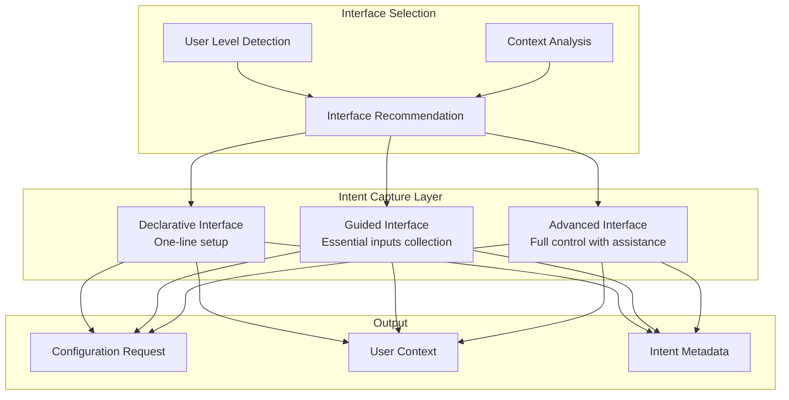

# Intent Capture Layer Design

## Overview

The Intent Capture Layer is the first layer of the [Adaptive Configuration Management System](./adaptive_configuration_management_system.md) that provides multiple interfaces for users to express their pipeline configuration intent. This layer adapts to different user expertise levels and use cases, providing appropriate complexity and guidance.

## Purpose and Responsibilities

1. **Multi-Level Interface Provision**: Offer interfaces for different expertise levels
2. **Intent Translation**: Convert user expressions into structured configuration requests
3. **Progressive Disclosure**: Reveal complexity gradually based on user needs
4. **Context Collection**: Gather necessary context for intelligent processing
5. **User Experience Optimization**: Provide optimal experience for each user type

## Architecture Overview



## Core Components

### 1. Declarative Interface

**Purpose**: Enable one-line setup for common pipeline scenarios

**Target Users**: Beginners, users with simple requirements, rapid prototyping

**Key Features**:
- Pattern-based pipeline generation
- Automatic data source analysis
- Intelligent template selection
- Minimal user input required

```python
class DeclarativeInterface:
    """
    Highest-level interface for common pipeline patterns
    
    Enables users to express intent without configuration details
    """
    
    def __init__(self, context: PipelineContext):
        self.context = context
        self.pattern_matcher = PipelinePatternMatcher()
        self.template_generator = TemplateGenerator()
        self.data_analyzer = DataSourceAnalyzer()
    
    def auto_train_xgboost(self, data_source: str, **overrides) -> PipelineConfig:
        """
        Create complete XGBoost training pipeline from data source
        
        Args:
            data_source: S3 path or data identifier
            **overrides: Optional overrides for specific parameters
            
        Returns:
            Complete pipeline configuration ready for execution
        """
        # Analyze data source to determine pipeline requirements
        data_analysis = self.data_analyzer.analyze_source(data_source)
        
        # Match to appropriate pipeline pattern
        pattern = self.pattern_matcher.match_pattern("xgboost_training", data_analysis)
        
        # Generate configuration from pattern
        config = self.template_generator.generate_from_pattern(pattern, overrides)
        
        # Add declarative metadata
        config.add_metadata(
            interface_type="declarative",
            pattern_used=pattern.name,
            data_analysis=data_analysis,
            overrides_applied=overrides
        )
        
        return config
    
    def auto_evaluate_model(self, model_path: str, test_data: str, **options) -> PipelineConfig:
        """
        Create model evaluation pipeline
        
        Args:
            model_path: Path to trained model
            test_data: Path to test dataset
            **options: Optional evaluation parameters
            
        Returns:
            Complete evaluation pipeline configuration
        """
        # Analyze model and test data
        model_analysis = self.data_analyzer.analyze_model(model_path)
        test_data_analysis = self.data_analyzer.analyze_source(test_data)
        
        # Match evaluation pattern
        pattern = self.pattern_matcher.match_evaluation_pattern(
            model_analysis, test_data_analysis
        )
        
        # Generate evaluation configuration
        config = self.template_generator.generate_evaluation_config(
            pattern, model_path, test_data, options
        )
        
        return config
    
    def auto_deploy_model(self, model_path: str, **deployment_options) -> PipelineConfig:
        """
        Create model deployment pipeline
        
        Args:
            model_path: Path to trained model
            **deployment_options: Deployment configuration options
            
        Returns:
            Complete deployment pipeline configuration
        """
        # Analyze model for deployment requirements
        model_analysis = self.data_analyzer.analyze_model_for_deployment(model_path)
        
        # Determine deployment pattern
        deployment_pattern = self.pattern_matcher.match_deployment_pattern(
            model_analysis, deployment_options
        )
        
        # Generate deployment configuration
        config = self.template_generator.generate_deployment_config(
            deployment_pattern, model_path, deployment_options
        )
        
        return config

class PipelinePatternMatcher:
    """Matches user intent to appropriate pipeline patterns"""
    
    def __init__(self):
        self.pattern_library = PipelinePatternLibrary()
        self.similarity_engine = PatternSimilarityEngine()
    
    def match_pattern(self, intent: str, data_analysis: DataAnalysis) -> PipelinePattern:
        """
        Match user intent and data characteristics to pipeline pattern
        
        Args:
            intent: User's stated intent (e.g., "xgboost_training")
            data_analysis: Analysis of the data source
            
        Returns:
            Best matching pipeline pattern
        """
        # Get candidate patterns for intent
        candidates = self.pattern_library.get_patterns_for_intent(intent)
        
        # Score patterns based on data characteristics
        scored_patterns = []
        for pattern in candidates:
            score = self.similarity_engine.score_pattern_match(pattern, data_analysis)
            scored_patterns.append((pattern, score))
        
        # Return best matching pattern
        best_pattern, best_score = max(scored_patterns, key=lambda x: x[1])
        
        if best_score < 0.7:  # Threshold for pattern confidence
            # Fall back to generic pattern with warnings
            return self.pattern_library.get_generic_pattern(intent)
        
        return best_pattern

class TemplateGenerator:
    """Generates pipeline configurations from patterns"""
    
    def generate_from_pattern(self, 
                            pattern: PipelinePattern, 
                            overrides: dict) -> PipelineConfig:
        """
        Generate complete pipeline configuration from pattern
        
        Args:
            pattern: Selected pipeline pattern
            overrides: User-specified parameter overrides
            
        Returns:
            Complete pipeline configuration
        """
        # Start with pattern template
        config = pattern.base_configuration.copy()
        
        # Apply pattern-specific optimizations
        optimized_config = self._apply_pattern_optimizations(config, pattern)
        
        # Apply user overrides
        final_config = self._apply_overrides(optimized_config, overrides)
        
        # Validate configuration
        self._validate_generated_config(final_config, pattern)
        
        return final_config
```

### 2. Guided Interface

**Purpose**: Collect essential inputs through guided experience

**Target Users**: Intermediate users, users learning the system, complex scenarios

**Key Features**:
- Progressive input collection
- Context-aware suggestions
- Real-time validation
- Preview of derived configurations

```python
class GuidedInterface:
    """
    Guided collection of essential inputs with intelligent assistance
    
    Based on the Essential Inputs Design three-tier architecture
    """
    
    def __init__(self, context: PipelineContext):
        self.context = context
        self.tier_registry = ConfigFieldTierRegistry()
        self.input_validator = InputValidator()
        self.suggestion_engine = SuggestionEngine()
        self.preview_generator = ConfigurationPreviewGenerator()
    
    def collect_essential_inputs(self) -> EssentialInputsSession:
        """
        Start guided collection session
        
        Returns session object for progressive input collection
        """
        return EssentialInputsSession(
            context=self.context,
            tier_registry=self.tier_registry,
            validator=self.input_validator,
            suggestions=self.suggestion_engine,
            preview_generator=self.preview_generator
        )

class EssentialInputsSession:
    """
    Interactive session for collecting essential inputs
    
    Implements the three-tier architecture:
    - Tier 1: Essential User Inputs (collect from user)
    - Tier 2: System Inputs (intelligent defaults)
    - Tier 3: Derived Inputs (automatic derivation)
    """
    
    def __init__(self, 
                 context: PipelineContext,
                 tier_registry: ConfigFieldTierRegistry,
                 validator: InputValidator,
                 suggestions: SuggestionEngine,
                 preview_generator: ConfigurationPreviewGenerator):
        self.context = context
        self.tier_registry = tier_registry
        self.validator = validator
        self.suggestions = suggestions
        self.preview_generator = preview_generator
        self.collected_inputs = {}
        self.current_section = None
    
    def collect_data_configuration(self) -> DataConfigSection:
        """
        Collect data-related essential inputs
        
        Fields collected:
        - Region selection
        - Date ranges
        - Feature group selection
        - Data source parameters
        """
        self.current_section = "data_configuration"
        section = DataConfigSection()
        
        # Region selection with intelligent suggestions
        suggested_regions = self.suggestions.suggest_regions(self.context)
        section.region = self._collect_with_suggestions(
            field_name="region",
            suggestions=suggested_regions,
            required=True,
            help_text="Select the AWS region for your data processing"
        )
        
        # Date range with validation
        section.date_range = self._collect_date_range_with_validation()
        
        # Feature groups with explanations
        section.feature_groups = self._collect_feature_groups_with_preview()
        
        # Data source parameters
        section.data_source_params = self._collect_data_source_parameters()
        
        # Store collected inputs
        self.collected_inputs["data_configuration"] = section
        
        # Generate preview of derived configurations
        self._show_configuration_preview("data_configuration")
        
        return section
    
    def collect_model_configuration(self) -> ModelConfigSection:
        """
        Collect model training essential inputs
        
        Fields collected:
        - Model type selection
        - Key hyperparameters
        - Target variable configuration
        - Training parameters
        """
        self.current_section = "model_configuration"
        section = ModelConfigSection()
        
        # Model type selection with recommendations
        recommended_models = self.suggestions.suggest_model_types(
            self.context, self.collected_inputs.get("data_configuration")
        )
        section.model_type = self._collect_with_recommendations(
            field_name="model_type",
            recommendations=recommended_models,
            required=True,
            help_text="Select the machine learning model type"
        )
        
        # Key hyperparameters based on model type
        section.hyperparameters = self._collect_key_hyperparameters(section.model_type)
        
        # Target variable configuration
        section.target_config = self._collect_target_configuration()
        
        # Training parameters
        section.training_params = self._collect_training_parameters()
        
        self.collected_inputs["model_configuration"] = section
        self._show_configuration_preview("model_configuration")
        
        return section
    
    def collect_deployment_configuration(self) -> DeploymentConfigSection:
        """
        Collect deployment essential inputs
        
        Fields collected:
        - Model identification
        - Performance requirements
        - Deployment options
        - Monitoring configuration
        """
        self.current_section = "deployment_configuration"
        section = DeploymentConfigSection()
        
        # Model identification
        section.model_reference = self._collect_model_reference()
        
        # Performance requirements
        section.performance_requirements = self._collect_performance_requirements()
        
        # Deployment options
        section.deployment_options = self._collect_deployment_options()
        
        # Monitoring configuration
        section.monitoring_config = self._collect_monitoring_configuration()
        
        self.collected_inputs["deployment_configuration"] = section
        self._show_configuration_preview("deployment_configuration")
        
        return section
    
    def _collect_with_suggestions(self, 
                                field_name: str, 
                                suggestions: List[Suggestion],
                                required: bool = False,
                                help_text: str = None) -> Any:
        """
        Collect input with intelligent suggestions
        
        Provides:
        - Ranked suggestions based on context
        - Explanation for each suggestion
        - Validation of user input
        - Help text and examples
        """
        print(f"\n=== {field_name.replace('_', ' ').title()} ===")
        if help_text:
            print(f"Help: {help_text}")
        
        # Show suggestions
        if suggestions:
            print("\nSuggestions (ranked by relevance):")
            for i, suggestion in enumerate(suggestions[:5], 1):
                print(f"  {i}. {suggestion.value} - {suggestion.explanation}")
                print(f"     Confidence: {suggestion.confidence:.1%}")
        
        # Collect user input
        while True:
            user_input = input(f"\nEnter {field_name} (or number from suggestions): ").strip()
            
            # Handle suggestion selection
            if user_input.isdigit() and 1 <= int(user_input) <= len(suggestions):
                selected_suggestion = suggestions[int(user_input) - 1]
                print(f"Selected: {selected_suggestion.value}")
                return selected_suggestion.value
            
            # Validate direct input
            validation_result = self.validator.validate_field(field_name, user_input)
            if validation_result.is_valid:
                return validation_result.processed_value
            else:
                print(f"Error: {validation_result.error_message}")
                if validation_result.suggestions:
                    print("Did you mean:", ", ".join(validation_result.suggestions))
    
    def _show_configuration_preview(self, section_name: str) -> None:
        """
        Show preview of how collected inputs will affect final configuration
        
        Provides transparency into:
        - What system defaults will be applied
        - What fields will be derived automatically
        - Estimated resource usage and costs
        - Potential optimizations
        """
        print(f"\n=== Configuration Preview for {section_name} ===")
        
        # Generate preview based on collected inputs
        preview = self.preview_generator.generate_preview(
            self.collected_inputs, self.context
        )
        
        # Show system defaults that will be applied
        if preview.system_defaults:
            print("\nSystem defaults that will be applied:")
            for field, value in preview.system_defaults.items():
                print(f"  • {field}: {value}")
        
        # Show derived fields
        if preview.derived_fields:
            print("\nFields that will be derived automatically:")
            for field, derivation in preview.derived_fields.items():
                print(f"  • {field}: {derivation.value} (from {derivation.source})")
        
        # Show resource estimates
        if preview.resource_estimates:
            print("\nEstimated resource usage:")
            for resource, estimate in preview.resource_estimates.items():
                print(f"  • {resource}: {estimate}")
        
        # Show optimization opportunities
        if preview.optimization_opportunities:
            print("\nOptimization opportunities:")
            for opportunity in preview.optimization_opportunities:
                print(f"  • {opportunity.description} (potential {opportunity.benefit})")
```

### 3. Advanced Interface

**Purpose**: Provide full control with intelligent assistance

**Target Users**: Expert users, complex scenarios, custom requirements

**Key Features**:
- Full access to all configuration options
- Intelligent suggestions and validation
- Real-time optimization recommendations
- Integration with existing config classes

```python
class AdvancedInterface:
    """
    Full-control interface with intelligent assistance
    
    Integrates with existing configuration classes while providing
    enhanced capabilities
    """
    
    def __init__(self, context: PipelineContext):
        self.context = context
        self.config_builder = ConfigurationBuilder()
        self.assistant = IntelligentAssistant()
        self.validator = AdvancedValidator()
        self.optimizer = ConfigurationOptimizer()
    
    def create_configuration_builder(self) -> ConfigurationBuilder:
        """
        Create configuration builder with intelligent assistance
        
        Returns builder that provides:
        - Full access to all configuration options
        - Intelligent suggestions and validation
        - Real-time optimization recommendations
        - Integration with existing config classes
        """
        return ConfigurationBuilder(
            context=self.context,
            assistant=self.assistant,
            validator=self.validator,
            optimizer=self.optimizer
        )
    
    def load_and_enhance_existing(self, config_path: str) -> EnhancedConfiguration:
        """
        Load existing configuration and enhance with new capabilities
        
        Provides backward compatibility while adding new features
        """
        # Load existing configuration
        existing_config = self.config_builder.load_existing(config_path)
        
        # Enhance with intelligent assistance
        enhanced_config = self.assistant.enhance_configuration(existing_config, self.context)
        
        return enhanced_config

class ConfigurationBuilder:
    """
    Advanced configuration builder with intelligent assistance
    
    Provides full control while offering intelligent suggestions
    """
    
    def __init__(self, 
                 context: PipelineContext,
                 assistant: IntelligentAssistant,
                 validator: AdvancedValidator,
                 optimizer: ConfigurationOptimizer):
        self.context = context
        self.assistant = assistant
        self.validator = validator
        self.optimizer = optimizer
        self.configurations = []
        self.current_config = None
    
    def create_xgboost_training_config(self) -> XGBoostConfigBuilder:
        """
        Create XGBoost training configuration with assistance
        
        Returns specialized builder for XGBoost configurations
        """
        config = XGBoostTrainingConfig()
        builder = XGBoostConfigBuilder(config, self.context, self.assistant)
        
        # Apply intelligent defaults
        self.assistant.apply_intelligent_defaults(config, self.context)
        
        # Add to configurations list
        self.configurations.append(config)
        self.current_config = config
        
        return builder
    
    def optimize_current_configuration(self) -> OptimizationResult:
        """
        Optimize current configuration for performance, cost, and reliability
        
        Returns optimization suggestions and automatically applicable improvements
        """
        if not self.current_config:
            raise ValueError("No current configuration to optimize")
        
        # Run optimization analysis
        optimization_result = self.optimizer.analyze_configuration(
            self.current_config, self.context
        )
        
        # Show optimization opportunities
        self._display_optimization_opportunities(optimization_result)
        
        return optimization_result
    
    def validate_all_configurations(self) -> ValidationResult:
        """
        Validate all configurations with intelligent suggestions
        
        Returns comprehensive validation results with suggestions for fixes
        """
        validation_results = []
        
        for config in self.configurations:
            result = self.validator.validate_configuration(config, self.context)
            validation_results.append(result)
        
        # Aggregate results
        overall_result = ValidationResult.aggregate(validation_results)
        
        # Show validation summary
        self._display_validation_summary(overall_result)
        
        return overall_result

class IntelligentAssistant:
    """
    Provides intelligent assistance for advanced configuration
    
    Offers suggestions, optimizations, and guidance for expert users
    """
    
    def __init__(self):
        self.ml_recommender = MLRecommendationEngine()
        self.pattern_analyzer = ConfigurationPatternAnalyzer()
        self.best_practices = BestPracticesEngine()
    
    def enhance_configuration(self, 
                            config: BaseModel, 
                            context: PipelineContext) -> EnhancedConfiguration:
        """
        Enhance existing configuration with intelligent capabilities
        
        Adds:
        - Optimization recommendations
        - Best practice suggestions
        - Context-aware improvements
        - Performance predictions
        """
        # Analyze current configuration
        analysis = self.pattern_analyzer.analyze_configuration(config, context)
        
        # Generate recommendations
        recommendations = self.ml_recommender.generate_recommendations(
            config, context, analysis
        )
        
        # Apply best practices
        best_practice_suggestions = self.best_practices.suggest_improvements(
            config, context
        )
        
        # Create enhanced configuration
        enhanced = EnhancedConfiguration(
            base_configuration=config,
            recommendations=recommendations,
            best_practice_suggestions=best_practice_suggestions,
            analysis=analysis,
            context=context
        )
        
        return enhanced
```

## Interface Selection Logic

```python
class InterfaceSelector:
    """
    Selects appropriate interface based on user context and preferences
    
    Considers:
    - User expertise level
    - Task complexity
    - Historical preferences
    - Context requirements
    """
    
    def __init__(self):
        self.user_profiler = UserProfiler()
        self.complexity_analyzer = TaskComplexityAnalyzer()
        self.preference_engine = UserPreferenceEngine()
    
    def select_interface(self, user_id: str, task_context: dict) -> InterfaceRecommendation:
        """
        Select most appropriate interface for user and task
        
        Args:
            user_id: User identifier
            task_context: Context about the task to be performed
            
        Returns:
            Interface recommendation with rationale
        """
        # Get user profile
        user_profile = self.user_profiler.get_profile(user_id)
        
        # Analyze task complexity
        task_complexity = self.complexity_analyzer.analyze_task(task_context)
        
        # Get user preferences
        preferences = self.preference_engine.get_preferences(user_id)
        
        # Determine best interface
        if self._should_use_declarative(user_profile, task_complexity, preferences):
            return InterfaceRecommendation(
                interface_type=InterfaceType.DECLARATIVE,
                confidence=0.9,
                rationale="Simple task with standard pattern, user prefers minimal input"
            )
        elif self._should_use_guided(user_profile, task_complexity, preferences):
            return InterfaceRecommendation(
                interface_type=InterfaceType.GUIDED,
                confidence=0.8,
                rationale="Moderate complexity task, user benefits from guidance"
            )
        else:
            return InterfaceRecommendation(
                interface_type=InterfaceType.ADVANCED,
                confidence=0.7,
                rationale="Complex task or expert user requiring full control"
            )
```

## Data Models

```python
@dataclass
class ConfigurationRequest:
    """Request object containing user intent and context"""
    interface_type: InterfaceType
    user_id: str
    task_type: str
    inputs: Dict[str, Any]
    context: PipelineContext
    metadata: RequestMetadata

@dataclass
class InterfaceRecommendation:
    """Recommendation for which interface to use"""
    interface_type: InterfaceType
    confidence: float
    rationale: str
    alternative_options: List[InterfaceType]

@dataclass
class EssentialInputsResult:
    """Result from guided input collection"""
    collected_inputs: Dict[str, Any]
    tier_classifications: Dict[str, FieldTier]
    preview_data: ConfigurationPreview
    validation_results: List[ValidationResult]

class InterfaceType(Enum):
    DECLARATIVE = "declarative"
    GUIDED = "guided"
    ADVANCED = "advanced"
```

## Integration with Intelligence Layer

The Intent Capture Layer integrates seamlessly with the Intelligence Layer:

```python
class IntentProcessor:
    """
    Processes captured intent and forwards to Intelligence Layer
    
    Bridges Intent Capture and Intelligence layers
    """
    
    def __init__(self):
        self.context_analyzer = ContextAnalyzer()
        self.intelligent_processor = IntelligentProcessor()
    
    def process_intent(self, request: ConfigurationRequest) -> ProcessedConfiguration:
        """
        Process captured intent through intelligence pipeline
        
        Args:
            request: Configuration request from Intent Capture Layer
            
        Returns:
            Processed configuration ready for storage and execution
        """
        # Enhance context with additional analysis
        enhanced_context = self.context_analyzer.enhance_context(request.context)
        
        # Process through intelligence layer
        processed_config = self.intelligent_processor.process_configuration(
            essential_inputs=request.inputs,
            context=enhanced_context
        )
        
        return processed_config
```

## Testing Strategy

### Unit Testing
```python
class TestIntentCaptureLayer(unittest.TestCase):
    def test_declarative_interface_xgboost_training(self):
        """Test declarative interface for XGBoost training"""
        interface = DeclarativeInterface(mock_context)
        config = interface.auto_train_xgboost("s3://test-bucket/data/")
        
        self.assertIsInstance(config, PipelineConfig)
        self.assertEqual(config.metadata.interface_type, "declarative")
    
    def test_guided_interface_input_collection(self):
        """Test guided interface input collection"""
        interface = GuidedInterface(mock_context)
        session = interface.collect_essential_inputs()
        
        # Mock user inputs
        with patch('builtins.input', side_effect=['us-west-2', '2023-01-01', '2023-12-31']):
            data_config = session.collect_data_configuration()
        
        self.assertEqual(data_config.region, 'us-west-2')
    
    def test_interface_selection_logic(self):
        """Test interface selection based on user profile"""
        selector = InterfaceSelector()
        recommendation = selector.select_interface("beginner_user", {"complexity": "low"})
        
        self.assertEqual(recommendation.interface_type, InterfaceType.DECLARATIVE)
```

## Related Documents

- **[Adaptive Configuration Management System](./adaptive_configuration_management_system.md)** - Main system architecture
- **[Intelligence Layer Design](./intelligence_layer_design.md)** - Next layer in the architecture
- **[Essential Inputs Notebook Design](./essential_inputs_notebook_design.md)** - Foundation for guided interface
- **[User Interface Adaptation](./user_interface_adaptation.md)** - Context-aware interface design
