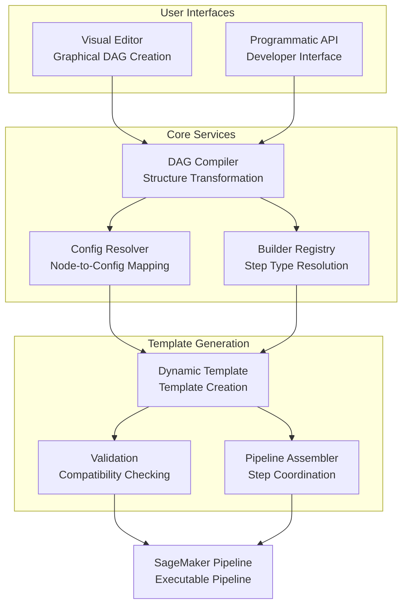
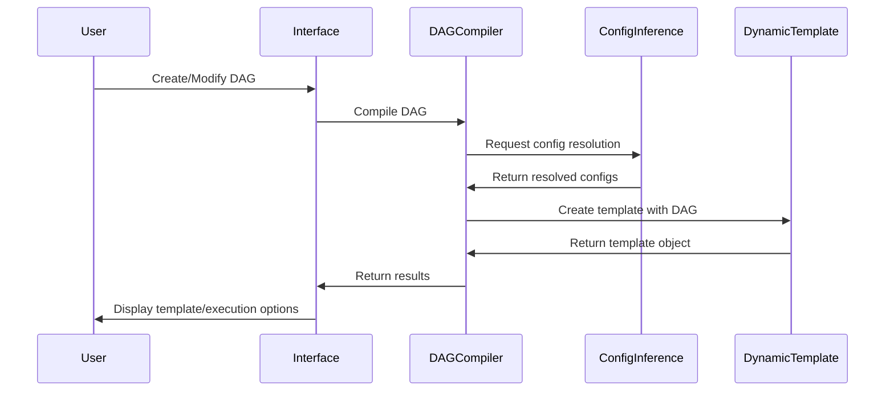

---
tags:
  - design
  - compiler
  - pipeline_design
  - transformation
keywords:
  - DAG compilation
  - visual interface
  - programmatic API
  - config resolution
  - template generation
  - pipeline visualization
topics:
  - compiler architecture
  - transformation system
  - visual programming
language: python
date of note: 2025-07-31
---

# DAG to Template Compilation System

## Overview

The DAG to Template Compilation system transforms Directed Acyclic Graph (DAG) representations of pipelines into executable pipeline templates. This system provides both a visual interface for non-technical users and a programmatic API for developers, making pipeline creation accessible to a wider audience while maintaining flexibility and control for advanced users.

## Motivation

Traditional pipeline creation requires extensive programming knowledge and understanding of the underlying infrastructure. The DAG to Template Compilation system addresses this challenge through:

1. **Accessibility**: Makes complex pipeline design accessible to non-programmers
2. **Visualization**: Provides immediate feedback through visual representations
3. **Automation**: Automates the tedious aspects of pipeline construction
4. **Standardization**: Ensures consistent pipeline structures and configurations
5. **Integration**: Bridges the gap between visual design and execution environments

## System Architecture

The DAG to Template Compilation system consists of two main components:

1. **Visual Interface**: Graphical environment for creating and editing pipeline DAGs
2. **Programmatic API**: Developer interfaces for compiling DAGs to executable templates

These components are integrated through shared core services:



## Part 1: Visual Interface

### 1. Visual DAG Editor

- **Purpose**: Provide an interactive interface for creating and editing pipeline DAGs
- **Key Features**:
  - Drag-and-drop node creation
  - Visual connection management
  - Node configuration through property panels
  - Validation feedback directly on the graph
  - Save/load DAG representations
- **Implementation**: Web-based visualization using libraries like Cytoscape.js or D3.js

### 2. Configuration Panel

- **Purpose**: Configure pipeline steps through intuitive UI components
- **Key Features**:
  - Dynamic form generation based on step type
  - Intelligent defaults and suggestions
  - Validation with immediate feedback
  - Parameter dependency handling
  - Context-sensitive help
- **Implementation**: Form components with integration to Configuration Inference Engine

### 3. User Interface Flow

1. **DAG Creation**: User creates a pipeline DAG by dragging and dropping nodes and connecting them
2. **Configuration**: User configures each node with required parameters
3. **Validation**: System validates the DAG structure and configurations in real-time
4. **Generation**: User requests template generation from the validated DAG
5. **Review**: User reviews the generated template and makes adjustments
6. **Execution**: User executes the pipeline or saves for later use

### 4. Visual Representation

The DAG is represented visually with:

- **Nodes**: Step types represented as distinct icons/shapes
- **Edges**: Dependencies shown as connecting arrows
- **States**: Validation states indicated through color coding
- **Properties**: Configuration status shown through visual indicators

### 5. User Experience Examples

#### Creating a New Pipeline
1. User opens Visual DAG Editor
2. Drags data source node onto canvas
3. Adds processing, training, and evaluation nodes
4. Connects nodes to create flow
5. Configures each node using panels
6. Validates the DAG with one click
7. Generates and executes the template

#### Modifying an Existing Pipeline
1. User loads existing pipeline into Visual DAG Editor
2. Views the entire pipeline structure visually
3. Modifies node connections or configurations
4. Gets immediate visual feedback on changes
5. Generates an updated template
6. Compares versions before executing

## Part 2: Programmatic API

### 1. Core API Functions

#### Primary Entry Point
```python
def compile_dag_to_pipeline(
    dag: PipelineDAG,
    config_path: str,
    sagemaker_session: Optional[PipelineSession] = None,
    role: Optional[str] = None,
    pipeline_name: Optional[str] = None,
    **kwargs
) -> Pipeline:
    """
    Compile a PipelineDAG to a complete SageMaker Pipeline.
    
    This is the main entry point for users who want a simple, one-call
    compilation from DAG to pipeline.
    """
```

#### Advanced API Class
```python
class PipelineDAGCompiler:
    """
    Advanced API for DAG-to-template compilation with additional control.
    
    This class provides more control over the compilation process, including
    validation, debugging, and customization options.
    """
    
    def validate_dag_compatibility(self, dag: PipelineDAG) -> ValidationResult:
        """Validate that DAG nodes have corresponding configurations."""
        
    def preview_resolution(self, dag: PipelineDAG) -> ResolutionPreview:
        """Preview how DAG nodes will be resolved to configs and builders."""
        
    def compile(self, dag: PipelineDAG, **kwargs) -> Pipeline:
        """Compile DAG to pipeline with full control."""
        
    def compile_with_report(self, dag: PipelineDAG, **kwargs) -> Tuple[Pipeline, ConversionReport]:
        """Compile DAG to pipeline and return detailed compilation report."""
```

### 2. Resolution Strategies

The system uses multiple strategies to match DAG nodes to configurations:

1. **Direct Name Matching**
   - Match node names directly to configuration identifiers
   - Example: `"train_data_load"` → Config with identifier `"train_data_load"`

2. **Job Type + Config Type Matching**
   - Match based on job_type attribute and node name patterns
   - Example: `"train_preprocess"` → `TabularPreprocessingConfig(job_type="training")`

3. **Semantic Similarity Matching**
   - Use semantic similarity to match node names to config types
   - Example: `"data_loading"` → `CradleDataLoadConfig` (high semantic similarity)

4. **Pattern-Based Matching**
   - Use regex patterns to identify step types
   - Example: `".*_data_load.*"` → `CradleDataLoadConfig`

### 3. Configuration Resolution

The `StepConfigResolver` handles name mismatches through a multi-layered approach:

```python
def resolve_config_map(
    self,
    dag_nodes: List[str],
    available_configs: Dict[str, BasePipelineConfig]
) -> Dict[str, BasePipelineConfig]:
    """
    Resolve DAG nodes to configurations using intelligent matching.
    
    Resolution strategies (in order of preference):
    1. Direct name matching
    2. Job type + config type matching
    3. Semantic similarity matching
    4. Pattern-based matching
    """
```

### 4. Confidence Scoring and Ambiguity Resolution

The resolver assigns confidence scores to each potential match:

```python
def _calculate_resolution_confidence(
    self,
    node_name: str,
    config: BasePipelineConfig,
    method: str
) -> float:
    """
    Calculate confidence score for a node-config match.
    
    Factors considered:
    1. Method type (direct=1.0, job_type=0.7-1.0, semantic=0.5-0.8, pattern=0.6-0.9)
    2. Name similarity (string matching algorithms)
    3. Job type compatibility (keyword matching)
    4. Configuration parameter relevance
    """
```

### 5. Usage Examples

#### Simple Usage
```python
from src.pipeline_api import compile_dag_to_pipeline
from src.pipeline_dag.base_dag import PipelineDAG

# Create DAG
dag = PipelineDAG()
dag.add_node("train_data_load")
dag.add_node("train_preprocess")
dag.add_node("xgboost_train")
dag.add_edge("train_data_load", "train_preprocess")
dag.add_edge("train_preprocess", "xgboost_train")

# Compile to pipeline
pipeline = compile_dag_to_pipeline(
    dag=dag,
    config_path="configs/xgboost_config.json",
    sagemaker_session=session,
    role="arn:aws:iam::123456789012:role/SageMakerRole"
)

# Execute pipeline
pipeline.upsert()
execution = pipeline.start()
```

#### Advanced Usage with Validation
```python
from src.pipeline_api import PipelineDAGCompiler

# Initialize compiler
compiler = PipelineDAGCompiler(
    config_path="configs/complex_pipeline.json",
    sagemaker_session=session,
    role=role
)

# Validate compatibility
validation = compiler.validate_dag_compatibility(dag)
if not validation.is_valid:
    print("Validation Issues:")
    print(validation.detailed_report())
    exit(1)

# Preview resolution
preview = compiler.preview_resolution(dag)
print("Resolution Preview:")
print(preview.display())

# Compile with detailed reporting
pipeline, report = compiler.compile_with_report(dag)
```

## Part 3: Core Components (Shared Infrastructure)

### 1. DAG Compiler

- **Purpose**: Transform DAG representations into a format suitable for template generation
- **Key Features**:
  - Compilation of graphical nodes to pipeline steps
  - Preservation of dependencies from visual connections
  - Type safety validation during compilation
  - Error reporting with visual feedback
- **Implementation**: Integration with DynamicPipelineTemplate for flexible pipeline generation

### 2. Configuration Inference Engine

- **Purpose**: Intelligently infer appropriate configurations for pipeline steps
- **Key Features**:
  - Context-aware default suggestions
  - Configuration validation with immediate feedback
  - Type-safe parameter suggestions
  - Handling of dependencies between parameters
- **Implementation**: Leverages ConfigClassDetector and StepConfigResolver for intelligent configuration

### 3. Dynamic Pipeline Template

- **Purpose**: Generate executable pipeline templates from validated DAGs
- **Key Features**:
  - Automatic implementation of PipelineTemplateBase abstract methods
  - Intelligent DAG node to configuration mapping
  - Automatic step builder resolution
  - Comprehensive validation of pipeline configuration
- **Implementation**: `DynamicPipelineTemplate` class implementing `PipelineTemplateBase`

### 4. DAG Representation

The DAG is represented as a JSON structure with nodes and edges:

```json
{
  "nodes": [
    {
      "id": "data_load_1",
      "type": "CradleDataLoading",
      "position": { "x": 100, "y": 100 },
      "config": {
        "job_type": "training",
        "data_source": "my-dataset"
      }
    },
    {
      "id": "preprocess_1",
      "type": "TabularPreprocessing",
      "position": { "x": 300, "y": 100 },
      "config": {
        "job_type": "training"
      }
    }
  ],
  "edges": [
    {
      "source": "data_load_1",
      "target": "preprocess_1",
      "outputPort": "data",
      "inputPort": "input_data"
    }
  ],
  "metadata": {
    "name": "my-pipeline",
    "version": "1.0",
    "description": "Example pipeline"
  }
}
```

## Integration with Dynamic Template

The DAG to Template system integrates tightly with the DynamicPipelineTemplate system:



## Benefits

1. **Accessibility**: Makes ML pipeline creation accessible to non-programmers
2. **Visualization**: Provides immediate feedback on pipeline structure
3. **Rapid Prototyping**: Enables quick iteration through visual or programmatic interfaces
4. **Error Reduction**: Validates configurations and connections with helpful feedback
5. **Learning Tool**: Helps users understand pipeline concepts visually
6. **Flexibility**: Supports both visual and programmatic workflows
7. **Integration**: Seamless connection to execution environments

## Implementation Roadmap

### Phase 1: Core Infrastructure
1. Implement DAG compiler components
2. Create basic configuration resolution
3. Build dynamic template integration
4. Establish validation framework

### Phase 2: Programmatic API
1. Implement core API functions
2. Create advanced resolution strategies
3. Build comprehensive validation system
4. Develop detailed error reporting

### Phase 3: Visual Interface
1. Create basic DAG visualization
2. Implement node and edge representations
3. Develop configuration panels
4. Build validation feedback system

### Phase 4: Integration & Polish
1. Connect visual and programmatic components
2. Implement comprehensive testing
3. Create user documentation
4. Develop deployment tools

## Conclusion

The DAG to Template Compilation system transforms the pipeline creation process by providing both visual and programmatic interfaces for compiling DAG representations into executable pipeline templates. By leveraging the power of the DynamicPipelineTemplate system and adding intuitive interfaces, it bridges the gap between ease of use and powerful functionality.

This system represents a key component in the evolution of ML pipeline tools, moving from code-centric approaches to more user-friendly paradigms while maintaining the robustness and flexibility of the underlying architecture.
