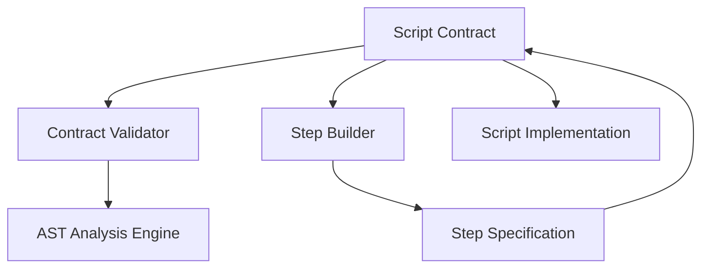

---
tags:
  - design
  - implementation
  - script_contracts
  - pipeline_scripts
keywords:
  - script contract
  - execution requirements
  - environment variables
  - input paths
  - output paths
  - validation framework
  - script compliance
  - AST analysis
topics:
  - contract validation
  - script requirements
  - path validation
  - compliance checking
language: python
date of note: 2025-07-31
---

# Script Contract Design

## What is the Purpose of Script Contract?

Script Contracts serve as the **execution bridge** between declarative [Step Specifications](step_specification.md) and imperative script implementations. They provide an explicit definition and validation mechanism that scripts conform to their architectural specifications, eliminating the risk of runtime failures due to script-specification misalignment.

The core purpose is to formalize the **implicit contract** that exists between:
1. **Pipeline Builders** - Who define steps with specific input/output requirements
2. **Script Developers** - Who implement processing or training logic
3. **Runtime Environment** - Where scripts execute with specific environment variables and paths

## Core Design Principles

Script Contracts are built on several key design principles:

1. **Explicit over Implicit** - All requirements must be explicitly defined, not assumed
2. **Validation over Discovery** - Scripts must be validated against contracts, not the other way around
3. **Build-time over Runtime** - Issues should be caught during development, not during execution
4. **Self-documenting** - Contracts serve as living documentation for script requirements
5. **Single Source of Truth** - One definitive place for I/O paths and environment variables
6. **Separation of Concerns** - Contracts define requirements; scripts implement logic

## Contract Architecture

The Script Contract architecture consists of three main components:



### 1. Contract Definition Component

The core contract definition contains:

```python
class ScriptContract(BaseModel):
    """Definition of script execution requirements."""
    
    entry_point: str                                   # Primary script file
    expected_input_paths: Dict[str, str]               # Logical name -> physical path
    expected_output_paths: Dict[str, str]              # Logical name -> physical path
    required_env_vars: List[str] = Field(default_factory=list)  # Required environment variables
    optional_env_vars: List[str] = Field(default_factory=list)  # Optional environment variables
    framework_requirements: Dict[str, str] = Field(default_factory=dict)  # Framework -> version
    description: Optional[str] = None                  # Human-readable description
```

### 2. Validation Component

The validation component provides:

1. **Static Analysis** - AST parsing to detect path and environment variable usage
2. **Usage Validation** - Verification that scripts use the defined paths and environment variables
3. **Compliance Report** - Detailed reporting of validation results
4. **CI/CD Integration** - Command-line tools for validation in CI/CD pipelines

### 3. Integration Component

The integration component provides:

1. **Step Specification Binding** - Linking contracts to step specifications
2. **Step Builder Integration** - Using contracts for runtime configuration
3. **Script Compatibility Validation** - Ensuring scripts match their intended contracts

## Standardization Rules

Script Contracts enforce standardization through:

### 1. Path Standardization

```python
# Standard SageMaker Processing Paths
STANDARD_PROCESSING_PATHS = {
    "input_data": "/opt/ml/processing/input/data",
    "output_data": "/opt/ml/processing/output/data",
    "model_input": "/opt/ml/processing/input/model",
    "code_input": "/opt/ml/processing/input/code"
}

# Standard SageMaker Training Paths
STANDARD_TRAINING_PATHS = {
    "train_data": "/opt/ml/input/data/train",
    "val_data": "/opt/ml/input/data/val", 
    "test_data": "/opt/ml/input/data/test",
    "model_output": "/opt/ml/model",
}
```

### 2. Environment Variable Naming

```python
# Environment Variable Naming Conventions
ENV_VAR_PATTERNS = {
    "Feature Fields": r"[A-Z_]+_FIELD$",              # ID_FIELD, LABEL_FIELD
    "Data Ratios": r"[A-Z_]+_RATIO$",                 # TRAIN_RATIO, TEST_RATIO
    "Toggles": r"(ENABLE|DISABLE)_[A-Z_]+$",          # ENABLE_FEATURE, DISABLE_LOGGING
    "Thresholds": r"[A-Z_]+_THRESHOLD$",              # CONFIDENCE_THRESHOLD
    "Modes": r"[A-Z_]+_MODE$",                        # TRAINING_MODE, DEBUG_MODE
}
```

### 3. Framework Version Specification

```python
# Framework Version Specification Format
VERSION_PATTERNS = {
    "Exact": r"==\d+\.\d+\.\d+",                      # ==1.2.3
    "Minimum": r">=\d+\.\d+\.\d+",                    # >=1.2.3
    "Range": r">=\d+\.\d+\.\d+,<\d+\.\d+\.\d+",       # >=1.2.3,<2.0.0
    "Compatible": r"~=\d+\.\d+\.\d+",                 # ~=1.2.3
}
```

## Implementation Details

### Contract Classes

The script contract system is implemented with two main contract classes:

1. **Base Script Contract** - For general processing scripts
   ```python
   class ScriptContract(BaseModel):
       """Contract for SageMaker Processing scripts."""
       entry_point: str
       expected_input_paths: Dict[str, str]
       expected_output_paths: Dict[str, str]
       required_env_vars: List[str] = Field(default_factory=list)
       optional_env_vars: List[str] = Field(default_factory=list)
       framework_requirements: Dict[str, str] = Field(default_factory=dict)
       description: Optional[str] = None
       
       def validate_implementation(self, script_path: str) -> ValidationResult:
           """Validate script implementation against contract."""
           validator = ScriptContractValidator(os.path.dirname(script_path))
           return validator.validate_script_against_contract(
               os.path.basename(script_path), self)
   ```

2. **Training Script Contract** - For SageMaker training scripts
   ```python
   class TrainingScriptContract(ScriptContract):
       """Contract for SageMaker Training scripts with specialized training paths."""
       
       def __init__(self, **data):
           # Override with specialized training path validation
           super().__init__(**data)
           self._validate_training_paths()
           
       def _validate_training_paths(self):
           """Validate that training paths follow SageMaker conventions."""
           required_training_paths = {
               "model_output": "/opt/ml/model"
           }
           
           for name, path in required_training_paths.items():
               if not any(path in output_path for output_path in self.expected_output_paths.values()):
                   warnings.warn(f"Training contract is missing standard path: {path}")
   ```

### AST-Based Analysis Engine

The validation engine uses Python's Abstract Syntax Tree (AST) module to analyze script code:

```python
class ScriptASTAnalyzer:
    """Analyzes script AST for contract compliance."""
    
    def __init__(self, script_path: str):
        self.script_path = script_path
        self.ast = None
        self._parse_script()
        
    def _parse_script(self):
        """Parse script into AST."""
        with open(self.script_path, 'r') as file:
            source = file.read()
        self.ast = ast.parse(source)
        
    def find_path_usages(self) -> Set[str]:
        """Find all hardcoded paths in the script."""
        path_finder = PathUsageFinder()
        path_finder.visit(self.ast)
        return path_finder.paths
        
    def find_env_var_usages(self) -> Set[str]:
        """Find all environment variable accesses."""
        env_finder = EnvVarFinder()
        env_finder.visit(self.ast)
        return env_finder.env_vars
```

### Validation Result Model

The validation system provides detailed results:

```python
class ValidationResult(BaseModel):
    """Result of script validation against contract."""
    
    is_valid: bool
    errors: List[str] = Field(default_factory=list)
    warnings: List[str] = Field(default_factory=list)
    missing_inputs: List[str] = Field(default_factory=list)
    missing_outputs: List[str] = Field(default_factory=list)
    missing_env_vars: List[str] = Field(default_factory=list)
    unused_paths: List[str] = Field(default_factory=list)
    script_path: Optional[str] = None
    contract: Optional[ScriptContract] = None
    
    @property
    def summary(self) -> str:
        """Get a summary of the validation result."""
        if self.is_valid:
            return f"{self.script_path} vs {self.contract.__class__.__name__}: ✅ COMPLIANT"
        else:
            return f"{self.script_path} vs {self.contract.__class__.__name__}: ❌ NON-COMPLIANT ({len(self.errors)} errors)"
```

## Cross-Component Integration

### Script Contracts and [Step Specifications](step_specification.md)

Script Contracts are integrated with Step Specifications to provide a complete definition of step behavior:

```python
class StepSpecification:
    """Specification for a pipeline step."""
    
    def __init__(self, step_type, node_type, dependencies, outputs, script_contract=None):
        self.step_type = step_type
        self.node_type = node_type
        self.dependencies = dependencies
        self.outputs = outputs
        self.script_contract = script_contract
        
    def validate_script_compliance(self, script_path: str) -> ValidationResult:
        """Validate a script against this specification's contract."""
        if not self.script_contract:
            raise ValueError("This step specification does not have a script contract")
            
        return self.script_contract.validate_implementation(script_path)
```

Key integration points:
1. **Contract Assignment**: Step Specifications can include Script Contracts
2. **Validation Access**: Step Specifications provide access to script validation
3. **Dependency Validation**: Script input paths are aligned with step dependencies
4. **Output Validation**: Script output paths are aligned with step outputs

### Script Contracts and [Step Builders](step_builder.md)

Step Builders use Script Contracts for configuration and validation:

```python
class StepBuilderBase:
    """Base class for step builders."""
    
    def validate_configuration(self) -> None:
        """Validate step configuration and script compliance."""
        # Validate config against general rules
        self._validate_config_general()
        
        # Validate script compliance if contract exists
        if self.spec and self.spec.script_contract:
            script_path = self.config.get_script_path()
            result = self.spec.validate_script_compliance(script_path)
            
            if not result.is_valid:
                raise ValueError(f"Script validation failed: {'; '.join(result.errors)}")
    
    def _configure_processing_args(self) -> Dict:
        """Configure processing arguments based on script contract."""
        if not self.spec or not self.spec.script_contract:
            return self._default_processing_args()
            
        contract = self.spec.script_contract
        
        # Set up processing inputs based on contract
        inputs = []
        for input_name, input_path in contract.expected_input_paths.items():
            if input_name in self.input_data:
                inputs.append(
                    ProcessingInput(
                        source=self.input_data[input_name],
                        destination=input_path
                    )
                )
        
        # Set up processing outputs based on contract
        outputs = []
        for output_name, output_path in contract.expected_output_paths.items():
            outputs.append(
                ProcessingOutput(
                    source=output_path,
                    destination=self.config.get_output_destination(output_name)
                )
            )
                
        # Configure environment variables from contract
        environment = {}
        for env_var in contract.required_env_vars:
            environment[env_var] = self.config.get_env_var(env_var)
```

Key integration points:
1. **Configuration Validation**: Step Builders validate configs against Script Contracts
2. **Path Mapping**: Step Builders map contract paths to actual input/output locations
3. **Environment Configuration**: Step Builders set up environment variables based on contracts
4. **Framework Requirements**: Step Builders ensure container images have the right dependencies

### Script Contracts and Script Implementations

Script implementations can directly use contracts for self-validation:

```python
# Script with explicit contract validation
from src.pipeline_script_contracts import TABULAR_PREPROCESS_CONTRACT

def main():
    # Validate script compliance at startup
    validation = TABULAR_PREPROCESS_CONTRACT.validate_implementation(__file__)
    if not validation.is_valid:
        raise RuntimeError(f"Contract validation failed: {validation.errors}")
    
    # Use contract-defined paths with confidence
    data_path = "/opt/ml/processing/input/data"  # From contract
    output_path = "/opt/ml/processing/output/data"  # From contract
    
    # Access environment variables confidently
    label_field = os.environ["LABEL_FIELD"]  # Contract ensures this exists
    
    # Safe processing with validated inputs
    df = pd.read_csv(data_path)
    # ... processing logic ...
    df.to_csv(output_path)
```

Key integration points:
1. **Self-validation**: Scripts can validate themselves against their contracts
2. **Path Constants**: Scripts use paths defined in contracts
3. **Environment Access**: Scripts confidently access environment variables defined in contracts
4. **Error Prevention**: Scripts fail fast if contract requirements are not met

## Evolution of Script Contracts

### Before Script Contracts: The Problem

The problem before script contracts was the implicit, undocumented agreement between step configurations and script implementations:

```python
# Step Builder (Before)
class PreprocessingStepBuilder:
    def build(self):
        return ProcessingStep(
            inputs=[
                ProcessingInput(
                    source=self.config.input_data_uri,
                    destination="/opt/ml/processing/input/data"  # Implicit contract
                )
            ],
            outputs=[
                ProcessingOutput(
                    source="/opt/ml/processing/output/data",  # Implicit contract
                    destination=self.config.output_data_uri
                )
            ],
            environment={
                "LABEL_FIELD": self.config.label_field  # Implicit contract
            }
        )

# Script Implementation (Before)
def main():
    # Hardcoded path with no validation
    input_path = "/opt/ml/processing/input/data"  # Must match builder
    
    # Environment variable with no validation
    label_field = os.environ["LABEL_FIELD"]  # Fails if not provided
    
    # Process data
    df = pd.read_csv(input_path)
    # ... processing logic ...
    
    # Output with hardcoded path
    df.to_csv("/opt/ml/processing/output/data")  # Must match builder
```

This approach was fragile because:
1. No explicit documentation of the agreement
2. No validation that both sides respected the agreement
3. No central source of truth for paths and environment variables
4. Runtime failures when scripts or configurations changed

### After Script Contracts: The Solution

With script contracts, the agreement between step builders and scripts is explicit and validated:

```python
# Contract Definition
PREPROCESSING_CONTRACT = ScriptContract(
    entry_point="preprocess.py",
    expected_input_paths={
        "input_data": "/opt/ml/processing/input/data"
    },
    expected_output_paths={
        "processed_data": "/opt/ml/processing/output/data"
    },
    required_env_vars=["LABEL_FIELD"]
)

# Step Builder (After)
class PreprocessingStepBuilder:
    def __init__(self, config, spec):
        self.config = config
        self.spec = spec
        self.contract = spec.script_contract
    
    def build(self):
        # Validate script compliance
        self.contract.validate_implementation("preprocess.py")
        
        # Use contract paths and environment vars
        return ProcessingStep(
            inputs=[
                ProcessingInput(
                    source=self.config.input_data_uri,
                    destination=self.contract.expected_input_paths["input_data"]
                )
            ],
            outputs=[
                ProcessingOutput(
                    source=self.contract.expected_output_paths["processed_data"],
                    destination=self.config.output_data_uri
                )
            ],
            environment={
                var: getattr(self.config, var.lower()) 
                for var in self.contract.required_env_vars
            }
        )

# Script Implementation (After)
from src.pipeline_script_contracts import PREPROCESSING_CONTRACT

def main():
    # Validate script against contract
    PREPROCESSING_CONTRACT.validate_implementation(__file__)
    
    # Use contract paths
    input_path = PREPROCESSING_CONTRACT.expected_input_paths["input_data"]
    output_path = PREPROCESSING_CONTRACT.expected_output_paths["processed_data"]
    
    # Access environment variables confidently
    label_field = os.environ["LABEL_FIELD"]
    
    # Process data
    df = pd.read_csv(input_path)
    # ... processing logic ...
    df.to_csv(output_path)
```

This approach is robust because:
1. The contract is explicit and central
2. Both step builders and scripts validate against the contract
3. Changes to paths or environment variables only need to be made in one place
4. Validation happens at build-time, not runtime

## References

- [Step Specifications](step_specification.md) - Integration with step specifications
- [Step Builders](step_builder.md) - Integration with step builders
- [Step Config Resolver](step_config_resolver.md) - Configuration resolution for pipeline steps
- [Registry-Based Step Naming](registry_based_step_name_generation.md) - Naming conventions for steps
