---
tags:
  - design
  - architecture
  - specification_driven
  - pipeline_design
keywords:
  - specification-driven design
  - declarative dependencies
  - step specifications
  - script contracts
  - dependency resolution
topics:
  - pipeline architecture
  - dependency management
  - implementation patterns
language: python
date of note: 2025-07-31
---

# Specification-Driven Pipeline Design

## Overview

Specification-driven design is a declarative approach to building ML pipelines where users express their intent at a high level, and the system resolves dependencies and assembles the pipeline automatically. This approach has now been implemented in the MODS pipeline system, creating a clear separation between **what** (specifications) and **how** (implementations).

## Related Documents
- **[Hybrid Design](./hybrid_design.md)** - The implemented approach that combines specifications with robust config classes
- **[Config-Driven Design](./config_driven_design.md)** - Previous implementation that provided detailed control but higher complexity
- **[Step Specification](./step_specification.md)** - Technical details on step specification format and structure
- **[Script Contract](./script_contract.md)** - Script contract enforcement in the specification system
- **[Step Builder](./step_builder.md)** - How step builders implement specifications

> **💡 Implementation Note**: The current implementation follows a hybrid approach where specifications define the "what" (dependencies, outputs) while configuration classes and builders handle the "how" (implementation details). This provides a balance between declarative simplicity and implementation flexibility.

## Core Principles

### Declarative Dependencies
- Users declare **dependencies** between steps, not implementation details
- System automatically resolves connections between steps
- Semantic matching connects outputs to compatible inputs

### Specification-Implementation Separation
- **Specifications** define step dependencies and outputs
- **Script Contracts** define script input/output paths
- **Configurations** provide implementation parameters
- **Builders** implement specifications as SageMaker steps

### Runtime Validation
- Specifications validate dependencies at runtime
- Script contracts ensure implementation aligns with specification
- Error messages provide clear guidance on missing dependencies

## Architecture Overview

The implemented specification-driven architecture consists of these key components:

```mermaid
flowchart TD
    subgraph "📝 Specification Layer"
        StepSpec["Step Specification<br/>• Dependencies<br/>• Outputs<br/>• Property paths<br/>• Step type & description"]
        ScriptContract["Script Contract<br/>• Entry point<br/>• Input paths<br/>• Output paths<br/>• Environment variables"]
        StepSpec <--> ScriptContract
    end
    
    subgraph "⚙️ Implementation Layer"
        Config["Configuration<br/>• Parameters<br/>• Resources<br/>• Environments<br/>• Hyperparameters"]
        StepBuilder["Step Builder<br/>• Implementation<br/>• Integration<br/>• SageMaker mapping<br/>• Input/Output handling"]
        Config --> StepBuilder
        StepSpec --> StepBuilder
        ScriptContract --> StepBuilder
    end
    
    subgraph "🔗 Dependency Resolution"
        DependencyResolver["Dependency Resolver<br/>• Semantic matching<br/>• Property references<br/>• Type compatibility<br/>• Automatic connections"]
        DependencyResolver <-- Resolves dependencies --> StepSpec
        DependencyResolver --> StepBuilder
    end
    
    subgraph "🏗️ Pipeline Assembly"
        DAG["Pipeline DAG<br/>• Step connections<br/>• Data flow<br/>• Execution order"]
        Assembler["Pipeline Assembler<br/>• Connects steps<br/>• Resolves references<br/>• Creates pipeline"]
        
        DAG --> Assembler
        DependencyResolver --> Assembler
        StepBuilder --> Assembler
    end
    
    PipelineTemplate["Pipeline Template<br/>• High-level structure<br/>• Step configuration<br/>• Pipeline composition"]
    PipelineTemplate --> DAG
    PipelineTemplate --> Config
```



## Implementation Components

### Step Specifications

Step specifications define a step's dependencies and outputs declaratively:

```python
# XGBoost Training Step Specification
XGBOOST_TRAINING_SPEC = StepSpecification(
    step_type=get_spec_step_type("XGBoostTraining"),
    node_type=NodeType.INTERNAL,
    script_contract=_get_xgboost_train_contract(),
    dependencies=[
        DependencySpec(
            logical_name="input_path",
            dependency_type=DependencyType.TRAINING_DATA,
            required=True,
            compatible_sources=["TabularPreprocessing", "ProcessingStep", "DataLoad"],
            semantic_keywords=["data", "input", "training", "dataset", "processed", "train", "tabular"],
            data_type="S3Uri",
            description="Training dataset S3 location with train/val/test subdirectories"
        ),
        DependencySpec(
            logical_name="hyperparameters_s3_uri",
            dependency_type=DependencyType.HYPERPARAMETERS,
            required=False,
            compatible_sources=["HyperparameterPrep", "ProcessingStep"],
            semantic_keywords=["config", "params", "hyperparameters", "settings", "hyperparams"],
            data_type="S3Uri",
            description="Hyperparameters configuration file (optional, can be generated internally)"
        )
    ],
    outputs=[
        OutputSpec(
            logical_name="model_output",
            output_type=DependencyType.MODEL_ARTIFACTS,
            property_path="properties.ModelArtifacts.S3ModelArtifacts",
            data_type="S3Uri",
            description="Trained XGBoost model artifacts",
            aliases=["ModelOutputPath", "ModelArtifacts", "model_data", "output_path", "model_input"]
        ),
        OutputSpec(
            logical_name="evaluation_output",
            output_type=DependencyType.PROCESSING_OUTPUT,
            property_path="properties.TrainingJobDefinition.OutputDataConfig.S3OutputPath",
            data_type="S3Uri",
            description="Model evaluation results and predictions (val.tar.gz, test.tar.gz)"
        )
    ]
)
```

### Script Contracts

Script contracts define the expected input and output paths for step scripts:

```python
XGBOOST_TRAIN_CONTRACT = TrainingScriptContract(
    entry_point="train_xgb.py",
    expected_input_paths={
        "input_path": "/opt/ml/input/data",
        "hyperparameters_s3_uri": "/opt/ml/input/data/config/hyperparameters.json"
    },
    expected_output_paths={
        "model_output": "/opt/ml/model",
        "evaluation_output": "/opt/ml/output/data"
    },
    required_env_vars=[],
    optional_env_vars={},
    framework_requirements={
        "boto3": ">=1.26.0",
        "xgboost": "==1.7.6",
        "scikit-learn": ">=0.23.2,<1.0.0",
        "pandas": ">=1.2.0,<2.0.0"
    },
    description="XGBoost training script for tabular data classification"
)
```

### Step Builders

Step builders implement specifications to create SageMaker steps:

```python
class XGBoostTrainingStepBuilder(StepBuilderBase):
    def __init__(self, config: XGBoostTrainingConfig, ...):
        # Initialize with specification
        super().__init__(
            config=config,
            spec=XGBOOST_TRAINING_SPEC,  # Connect to the specification
            sagemaker_session=sagemaker_session,
            ...
        )
        self.config: XGBoostTrainingConfig = config
        
    def create_step(self, **kwargs):
        """Create step using specification-driven dependency resolution"""
        # Extract common parameters
        inputs_raw = kwargs.get('inputs', {})
        dependencies = kwargs.get('dependencies', [])
        
        # If dependencies are provided, extract inputs using the resolver
        if dependencies:
            try:
                extracted_inputs = self.extract_inputs_from_dependencies(dependencies)
                inputs.update(extracted_inputs)
            except Exception as e:
                self.log_warning("Failed to extract inputs from dependencies: %s", e)
        
        # Generate step with specification-validated inputs
        training_inputs = self._get_inputs(inputs)
        output_path = self._get_outputs({})
        estimator = self._create_estimator(output_path)
        
        # Create the training step
        step = TrainingStep(
            name=self._get_step_name('XGBoostTraining'),
            estimator=estimator,
            inputs=training_inputs,
            depends_on=dependencies,
            cache_config=self._get_cache_config(enable_caching)
        )
        
        # Attach specification to the step for future reference
        setattr(step, '_spec', self.spec)
        
        return step
```

### Dependency Resolution

The UnifiedDependencyResolver automatically connects steps based on their specifications:

```python
def extract_inputs_from_dependencies(self, dependency_steps: List[Step]) -> Dict[str, Any]:
    """Extract inputs from dependency steps using the UnifiedDependencyResolver."""
    if not self.spec:
        raise ValueError("Step specification is required for dependency extraction.")
        
    # Get step name
    step_name = self.__class__.__name__.replace("Builder", "Step")
    
    # Use the injected resolver or create one
    resolver = self._get_dependency_resolver()
    resolver.register_specification(step_name, self.spec)
    
    # Register dependencies and enhance them with metadata
    available_steps = []
    self._enhance_dependency_steps_with_specs(resolver, dependency_steps, available_steps)
    
    # One method call handles what used to require multiple matching methods
    resolved = resolver.resolve_step_dependencies(step_name, available_steps)
    
    # Convert results to SageMaker properties
    return {name: prop_ref.to_sagemaker_property() for name, prop_ref in resolved.items()}
```

### Pipeline Templates

Pipeline templates define the high-level structure of a pipeline and use specifications for automatic connection:

```python
class XGBoostTrainingPipeline(PipelineTemplateBase):
    """Pipeline template that uses specification-driven dependency resolution"""
    
    def _create_pipeline_dag(self) -> PipelineDAG:
        # Create the DAG structure
        dag = PipelineDAG()
        dag.add_node("data_loading")
        dag.add_node("preprocessing") 
        dag.add_node("training")
        
        # Define logical connections, implementations handled by specifications
        dag.add_edge("data_loading", "preprocessing")
        dag.add_edge("preprocessing", "training")
        
        return dag
        
    def _create_config_map(self) -> Dict[str, BasePipelineConfig]:
        # Map steps to configurations
        return {
            "data_loading": self.configs['DataLoading'],
            "preprocessing": self.configs['Preprocessing'],
            "training": self.configs['Training']
        }
    
    def _create_step_builder_map(self) -> Dict[str, Type[StepBuilderBase]]:
        # Map step types to builder classes
        return {
            "CradleDataLoading": CradleDataLoadingStepBuilder,
            "TabularPreprocessing": TabularPreprocessingStepBuilder,
            "XGBoostTraining": XGBoostTrainingStepBuilder
        }
```

## Advantages of the Implementation

### Clean Separation of Concerns
- **Specifications**: Define what steps require and produce
- **Contracts**: Define how scripts interact with SageMaker
- **Configs**: Define parameters for implementation
- **Builders**: Define how to create SageMaker steps

### Automated Dependency Resolution
- Automatic connection between compatible steps
- Semantic matching of dependencies to outputs
- Runtime validation of required connections
- Clear error messages for missing dependencies

### Enhanced Maintainability
- Changes to specifications don't require builder changes
- New step types can be added by defining specifications
- Script contracts ensure consistency between specs and scripts
- Property paths abstract SageMaker property details

### Simplified Pipeline Creation
- Define pipeline structure as a DAG
- System handles connections automatically
- Reduced boilerplate for input/output mapping
- Clear separation between structure and implementation

## User Experience

### Traditional Pattern with Specification Benefits

```python
# Create configuration
config = XGBoostTrainingConfig(
    training_instance_type="ml.m5.xlarge",
    training_instance_count=1,
    # other configuration parameters
)

# Create builder with specification
builder = XGBoostTrainingStepBuilder(config=config)

# Create step - using the builder now uses the specification for validation
step = builder.create_step(
    input_path=previous_step.properties.OutputPath,
    dependencies=[previous_step]
)

# Or simply use dependencies for automatic resolution
step = builder.create_step(dependencies=[previous_step])

# Add to pipeline
pipeline.add_step(step)
```

### Template-Based Pattern

```python
from src.pipeline_builder.pipeline_template_base import PipelineTemplateBase
from src.pipeline_dag.base_dag import PipelineDAG

class XGBoostPipelineTemplate(PipelineTemplateBase):
    # Define configuration classes
    CONFIG_CLASSES = {
        'Base': BasePipelineConfig,
        'DataLoading': CradleDataLoadingConfig,
        'Preprocessing': TabularPreprocessingConfig,
        'Training': XGBoostTrainingConfig
    }
    
    def _create_pipeline_dag(self) -> PipelineDAG:
        # Create DAG structure - connections are resolved automatically
        dag = PipelineDAG()
        dag.add_node("data_loading")
        dag.add_node("preprocessing")
        dag.add_node("training")
        
        # Define data flow edges - implementation details handled by specifications
        dag.add_edge("data_loading", "preprocessing")
        dag.add_edge("preprocessing", "training")
        
        return dag
    
    def _create_config_map(self) -> Dict[str, BasePipelineConfig]:
        # Map steps to configurations
        return {
            "data_loading": self.configs['DataLoading'],
            "preprocessing": self.configs['Preprocessing'],
            "training": self.configs['Training']
        }
    
    def _create_step_builder_map(self) -> Dict[str, Type[StepBuilderBase]]:
        # Map step types to builder classes
        return {
            "CradleDataLoading": CradleDataLoadingStepBuilder,
            "TabularPreprocessing": TabularPreprocessingStepBuilder,
            "XGBoostTraining": XGBoostTrainingStepBuilder
        }

# Create the template and generate pipeline
template = XGBoostPipelineTemplate(
    config_path="configs/pipeline_config.json",
    sagemaker_session=sagemaker_session,
    role=role
)
pipeline = template.generate_pipeline()
```

## Future Directions

While the current implementation provides significant benefits through specifications and contracts, there are opportunities for further enhancement:

### Enhanced Semantic Matching
- Add more advanced semantic matching algorithms
- Support for weighted keyword matching
- Context-aware dependency resolution

### Intelligent Configuration Generation
- Generate optimal configurations based on data characteristics
- Automatic resource allocation based on workload
- Performance profiling and optimization

### Domain-Specific Templates
- Create specialized templates for common ML workflows
- Domain-specific abstractions for different use cases
- Higher-level interfaces for business users

### Feedback-Based Optimization
- Learn from pipeline execution results
- Optimize configurations based on performance metrics
- Suggest improvements based on historical runs

## Conclusion

The implemented specification-driven design provides a pragmatic balance between declarative simplicity and implementation flexibility. By separating specifications (what) from implementations (how), the system achieves better maintainability, clearer dependency resolution, and simplified pipeline creation while maintaining backward compatibility with existing code.

## See Also

### Design Approach Comparisons
- **[Hybrid Design](./hybrid_design.md)** - The implemented hybrid approach combining specifications and configs
- **[Config-Driven Design](./config_driven_design.md)** - Previous implementation approach
- **[Design Evolution](./design_evolution.md)** - Historical context and evolution of pipeline design approaches

### Technical Implementation Details
- **[Step Specification](./step_specification.md)** - Specification format and structure details
- **[Script Contract](./script_contract.md)** - Script contract implementation details
- **[Step Builder](./step_builder.md)** - Step builder implementation details
- **[Dependency Resolver](./dependency_resolver.md)** - Core dependency resolution mechanisms
