# Specification-Driven Pipeline Design

## Overview

Specification-driven design is a declarative approach to building ML pipelines where users express their intent at a high level, and the system automatically determines the required steps, resolves dependencies, and assembles the pipeline. This approach prioritizes ease of use and rapid prototyping over fine-grained control.

## Related Documents
- **[Hybrid Design](./hybrid_design.md)** - **RECOMMENDED**: Combines this approach with config-driven implementation for the best of both worlds
- **[Config-Driven Design](./config_driven_design.md)** - Current implementation that provides detailed control but higher complexity
- **[Step Specification](./step_specification.md)** - Technical details on step specification format and structure
- **[Specification Registry](./specification_registry.md)** - Implementation details for managing step specifications

> **💡 Note**: While this document describes a pure specification-driven approach, the **[Hybrid Design](./hybrid_design.md)** is the recommended implementation strategy as it provides specification-driven simplicity while preserving the robust config infrastructure.

## Core Principles

### Declarative Intent
- Users specify **what** they want to achieve, not **how** to implement it
- High-level business goals drive pipeline structure
- System handles technical implementation details automatically

### Intelligent Automation
- Automatic step discovery based on user intent
- Smart dependency resolution through semantic matching
- Context-aware parameter selection and optimization

### Semantic Understanding
- Rich metadata about step capabilities and requirements
- Natural language-like pipeline definitions
- Business-focused abstractions over technical details

## Architecture Overview

```mermaid
flowchart TD
    subgraph "🎯 User Intent Layer"
        UserIntent["High-Level User Intent<br/>Pipeline('fraud').auto_train_xgboost('s3://data/')<br/>• Business-focused<br/>• Declarative<br/>• Framework-agnostic"]
    end
    
    subgraph "🧠 Intelligence Layer"
        IntentParser["Intent Parser<br/>• Parse user declarations<br/>• Extract requirements<br/>• Identify pipeline type<br/>• Determine success criteria"]
        
        StepDiscovery["Step Discovery Engine<br/>• Analyze requirements<br/>• Discover compatible steps<br/>• Generate step sequences<br/>• Optimize for performance"]
    end
    
    subgraph "📋 Specification Registry"
        StepSpecs["Step Specifications<br/>• Capability descriptions<br/>• Input/output contracts<br/>• Compatibility rules<br/>• Performance characteristics"]
        
        PatternLibrary["Pattern Library<br/>• Common pipeline patterns<br/>• Best practice templates<br/>• Domain-specific workflows<br/>• Optimization strategies"]
    end
    
    subgraph "🔗 Dependency Resolution"
        SemanticMatcher["Semantic Matcher<br/>• Match step capabilities<br/>• Resolve data flow<br/>• Validate compatibility<br/>• Handle type conversions"]
        
        DependencyGraph["Dependency Graph<br/>• Logical step connections<br/>• Data flow validation<br/>• Execution ordering<br/>• Resource optimization"]
    end
    
    subgraph "⚙️ Configuration Generation"
        ConfigGenerator["Intelligent Config Generator<br/>• Generate step configurations<br/>• Apply best practices<br/>• Optimize for context<br/>• Handle edge cases"]
        
        ParameterOptimizer["Parameter Optimizer<br/>• Context-aware defaults<br/>• Performance optimization<br/>• Resource allocation<br/>• Cost optimization"]
    end
    
    subgraph "🔧 Step Assembly"
        StepBuilder["Universal Step Builder<br/>• Create pipeline steps<br/>• Apply configurations<br/>• Handle platform specifics<br/>• Ensure compatibility"]
        
        PipelineAssembler["Pipeline Assembler<br/>• Combine all steps<br/>• Apply dependencies<br/>• Validate pipeline<br/>• Generate execution plan"]
    end
    
    UserIntent --> IntentParser
    IntentParser --> StepDiscovery
    StepDiscovery --> StepSpecs
    StepSpecs --> SemanticMatcher
    SemanticMatcher --> DependencyGraph
    DependencyGraph --> ConfigGenerator
    ConfigGenerator --> ParameterOptimizer
    ParameterOptimizer --> StepBuilder
    StepBuilder --> PipelineAssembler
    
    PatternLibrary --> StepDiscovery
    PatternLibrary --> ConfigGenerator
```



## User Experience

### Ultra-Simple Interface
```python
# One-line pipeline creation
pipeline = Pipeline("fraud_detection").auto_train_xgboost("s3://fraud-data/")

# System automatically:
# 1. Discovers data loading is needed
# 2. Determines preprocessing requirements
# 3. Configures XGBoost training
# 4. Sets up model creation
# 5. Resolves all dependencies
# 6. Optimizes parameters
```

### Progressive Enhancement
```python
# Add constraints and preferences
pipeline = (Pipeline("fraud_detection")
    .auto_train_xgboost("s3://fraud-data/")
    .with_constraints(
        max_training_time="2 hours",
        min_accuracy=0.85,
        max_cost_per_run=50
    )
    .with_preferences(
        prefer_speed_over_accuracy=True,
        enable_hyperparameter_tuning=True
    ))
```

### Domain-Specific Languages
```python
# Fraud detection specific
fraud_pipeline = (FraudDetectionPipeline()
    .load_transaction_data("s3://transactions/")
    .detect_anomalies()
    .train_classifier()
    .evaluate_performance()
    .deploy_for_realtime_scoring())

# Time series specific
forecast_pipeline = (TimeSeriesPipeline()
    .load_time_series("s3://metrics/")
    .detect_seasonality()
    .train_forecasting_model()
    .validate_predictions()
    .deploy_forecasting_endpoint())
```

## Step Specifications

### Rich Metadata Model
```python
@dataclass
class StepSpecification:
    # Identity
    step_type: str
    version: str
    description: str
    
    # Capabilities
    input_types: List[DataType]
    output_types: List[DataType]
    supported_algorithms: List[str]
    performance_characteristics: Dict[str, Any]
    
    # Requirements
    dependencies: List[DependencySpec]
    resource_requirements: ResourceSpec
    constraints: List[ConstraintSpec]
    
    # Optimization
    cost_model: CostModel
    performance_model: PerformanceModel
    scaling_characteristics: ScalingSpec

# Example specification
XGBOOST_TRAINING_SPEC = StepSpecification(
    step_type="XGBoostTraining",
    version="1.0",
    description="Train XGBoost model for tabular data classification/regression",
    
    input_types=[
        DataType.PROCESSED_TABULAR,
        DataType.FEATURE_ENGINEERED_TABULAR
    ],
    output_types=[
        DataType.XGBOOST_MODEL,
        DataType.TRAINING_METRICS
    ],
    
    dependencies=[
        DependencySpec(
            logical_name="training_data",
            compatible_sources=["TabularPreprocessing", "FeatureEngineering"],
            data_types=[DataType.PROCESSED_TABULAR],
            semantic_keywords=["training", "processed", "features"]
        )
    ],
    
    resource_requirements=ResourceSpec(
        min_cpu_cores=2,
        min_memory_gb=8,
        preferred_instance_types=["ml.m5.2xlarge", "ml.m5.4xlarge"],
        supports_gpu=False
    ),
    
    cost_model=CostModel(
        base_cost_per_hour=0.50,
        scaling_factor=1.2,
        cost_per_gb_data=0.01
    ),
    
    performance_model=PerformanceModel(
        training_time_formula="0.1 * data_size_gb + 0.05 * n_estimators",
        accuracy_expectations={"min": 0.7, "typical": 0.85, "max": 0.95}
    )
)
```

### Dependency Specifications
```python
@dataclass
class DependencySpec:
    logical_name: str
    compatible_sources: List[str]
    data_types: List[DataType]
    semantic_keywords: List[str]
    
    # Advanced matching
    compatibility_function: Optional[Callable]
    transformation_required: Optional[str]
    quality_requirements: Optional[QualitySpec]
    
    # Optimization hints
    preferred_sources: List[str]
    performance_impact: Dict[str, float]

# Example with advanced matching
ADVANCED_DEPENDENCY = DependencySpec(
    logical_name="high_quality_features",
    compatible_sources=["FeatureEngineering", "TabularPreprocessing"],
    data_types=[DataType.PROCESSED_TABULAR],
    semantic_keywords=["features", "engineered", "processed"],
    
    compatibility_function=lambda source_spec: (
        source_spec.quality_score > 0.8 and
        "feature_selection" in source_spec.capabilities
    ),
    
    quality_requirements=QualitySpec(
        min_data_quality_score=0.8,
        required_columns=["features", "target"],
        max_missing_values_ratio=0.05
    ),
    
    preferred_sources=["FeatureEngineering"],  # Prefer over basic preprocessing
    performance_impact={"accuracy": 0.15, "training_time": -0.1}
)
```

## Intelligent Dependency Resolution

### Semantic Matching Engine
```python
class SemanticMatcher:
    def find_compatible_sources(self, dependency: DependencySpec, available_steps: List[StepSpec]) -> List[Match]:
        matches = []
        
        for step in available_steps:
            # 1. Type compatibility
            type_score = self._calculate_type_compatibility(dependency.data_types, step.output_types)
            
            # 2. Semantic similarity
            semantic_score = self._calculate_semantic_similarity(
                dependency.semantic_keywords, 
                step.semantic_keywords
            )
            
            # 3. Custom compatibility function
            custom_score = 1.0
            if dependency.compatibility_function:
                custom_score = dependency.compatibility_function(step)
            
            # 4. Performance impact
            performance_score = self._calculate_performance_impact(dependency, step)
            
            # Combined score
            total_score = (type_score * 0.4 + semantic_score * 0.3 + 
                          custom_score * 0.2 + performance_score * 0.1)
            
            if total_score > 0.7:  # Threshold for compatibility
                matches.append(Match(step=step, score=total_score, reasons=...))
        
        return sorted(matches, key=lambda m: m.score, reverse=True)
```

### Automatic Pipeline Assembly
```python
class PipelineAssembler:
    def assemble_pipeline(self, user_intent: UserIntent) -> Pipeline:
        # 1. Parse intent and extract requirements
        requirements = self.intent_parser.parse(user_intent)
        
        # 2. Discover required steps
        step_sequence = self.step_discovery.discover_steps(requirements)
        
        # 3. Resolve dependencies
        dependency_graph = self.dependency_resolver.resolve(step_sequence)
        
        # 4. Optimize configuration
        optimized_configs = self.config_optimizer.optimize(dependency_graph, requirements)
        
        # 5. Generate pipeline
        pipeline = self.pipeline_generator.generate(dependency_graph, optimized_configs)
        
        return pipeline
```

## Configuration Generation

### Context-Aware Defaults
```python
class IntelligentConfigGenerator:
    def generate_config(self, step_type: str, context: PipelineContext) -> Dict[str, Any]:
        # Base configuration from specification
        base_config = self.spec_registry.get_default_config(step_type)
        
        # Context-aware adjustments
        if context.data_size > 10_000_000:  # Large dataset
            base_config["instance_type"] = "ml.m5.4xlarge"
            base_config["volume_size"] = 100
        
        if context.priority == "speed":
            base_config["early_stopping_rounds"] = 10
            base_config["n_estimators"] = min(base_config["n_estimators"], 100)
        
        if context.priority == "accuracy":
            base_config["n_estimators"] = max(base_config["n_estimators"], 500)
            base_config["learning_rate"] = 0.01  # Slower but more accurate
        
        # Cost optimization
        if context.budget_constraint:
            base_config = self._optimize_for_cost(base_config, context.budget_constraint)
        
        return base_config
```

### Performance Optimization
```python
class PerformanceOptimizer:
    def optimize_pipeline(self, pipeline_spec: PipelineSpec) -> OptimizedPipeline:
        # Analyze data flow
        data_flow = self._analyze_data_flow(pipeline_spec)
        
        # Identify bottlenecks
        bottlenecks = self._identify_bottlenecks(data_flow)
        
        # Apply optimizations
        optimizations = []
        for bottleneck in bottlenecks:
            if bottleneck.type == "compute":
                optimizations.append(self._optimize_compute(bottleneck))
            elif bottleneck.type == "io":
                optimizations.append(self._optimize_io(bottleneck))
            elif bottleneck.type == "memory":
                optimizations.append(self._optimize_memory(bottleneck))
        
        return self._apply_optimizations(pipeline_spec, optimizations)
```

## Error Handling & Validation

### Early Validation
```python
class PipelineValidator:
    def validate_intent(self, user_intent: UserIntent) -> ValidationResult:
        issues = []
        
        # Check data availability
        if not self._validate_data_access(user_intent.data_sources):
            issues.append(ValidationIssue(
                type="data_access",
                message="Cannot access specified data sources",
                suggested_fix="Check S3 permissions and bucket existence"
            ))
        
        # Check resource constraints
        estimated_cost = self._estimate_cost(user_intent)
        if estimated_cost > user_intent.budget_limit:
            issues.append(ValidationIssue(
                type="budget_exceeded",
                message=f"Estimated cost ${estimated_cost} exceeds budget ${user_intent.budget_limit}",
                suggested_fix="Reduce data size or use smaller instance types"
            ))
        
        # Check compatibility
        compatibility_issues = self._check_step_compatibility(user_intent)
        issues.extend(compatibility_issues)
        
        return ValidationResult(
            is_valid=len(issues) == 0,
            issues=issues,
            suggestions=self._generate_suggestions(issues)
        )
```

### Intelligent Error Messages
```python
class ErrorMessageGenerator:
    def generate_semantic_error(self, error: PipelineError) -> str:
        if error.type == "incompatible_steps":
            return f"""
            Step '{error.source_step}' produces {error.source_output_type} data,
            but step '{error.target_step}' expects {error.target_input_type} data.
            
            Suggestion: Add a {error.suggested_intermediate_step} step between them
            to convert {error.source_output_type} to {error.target_input_type}.
            
            Example:
            pipeline.{error.source_step}().{error.suggested_intermediate_step}().{error.target_step}()
            """
        
        elif error.type == "missing_dependency":
            return f"""
            Step '{error.step}' requires {error.missing_dependency} but no compatible
            source was found in the pipeline.
            
            Compatible sources: {', '.join(error.compatible_sources)}
            
            Suggestion: Add one of these steps before '{error.step}':
            {self._format_step_suggestions(error.compatible_sources)}
            """
```

## Advantages

### Rapid Prototyping
- **Minutes to Working Pipeline**: From idea to executable pipeline in minutes
- **No Infrastructure Knowledge Required**: Focus on business logic, not technical details
- **Automatic Best Practices**: System applies ML and infrastructure best practices automatically

### Intelligent Automation
- **Smart Dependency Resolution**: Automatic discovery and connection of compatible steps
- **Context-Aware Optimization**: Parameters optimized based on data characteristics and constraints
- **Performance Optimization**: Automatic bottleneck detection and resolution

### Business-Focused Interface
- **Natural Language-Like**: Pipeline definitions read like business requirements
- **Domain-Specific Languages**: Specialized interfaces for different ML domains
- **Semantic Error Messages**: Errors explained in business terms with actionable suggestions

## Limitations

### Reduced Control
- **Limited Customization**: May not support highly specialized or custom requirements
- **Black Box Decisions**: System makes many decisions automatically, reducing transparency
- **Standardized Approaches**: May not accommodate unique or innovative approaches

### Complexity Hidden, Not Eliminated
- **Complex Implementation**: Requires sophisticated specification system and intelligent automation
- **Debugging Challenges**: When things go wrong, the abstraction can make debugging difficult
- **Performance Unpredictability**: Automatic optimizations may not always produce expected results

### Learning Curve for Extension
- **Specification Complexity**: Adding new step types requires understanding complex specification model
- **System Knowledge**: Extending the system requires deep understanding of the automation logic
- **Testing Complexity**: Validating intelligent behavior across many scenarios is challenging

## Use Cases

### Ideal For
- **Rapid Prototyping**: Quick exploration of ML approaches
- **Standard Workflows**: Common ML patterns with well-established best practices
- **Non-Expert Users**: Data scientists who want to focus on business problems, not infrastructure
- **Experimentation**: A/B testing different approaches quickly

### Not Ideal For
- **Highly Customized Pipelines**: Unique requirements that don't fit standard patterns
- **Performance-Critical Applications**: Where every optimization must be manually tuned
- **Regulatory Environments**: Where full transparency and control are required
- **Research Applications**: Where novel approaches need to be implemented

## Implementation Considerations

### Specification Registry
- **Comprehensive Coverage**: Must cover all common ML patterns and step types
- **Version Management**: Handle evolution of specifications over time
- **Quality Assurance**: Ensure specifications are accurate and up-to-date

### Intelligence Layer
- **Machine Learning**: Use ML to improve intent parsing and optimization over time
- **Feedback Loop**: Learn from user corrections and pipeline performance
- **Continuous Improvement**: Regular updates based on usage patterns and outcomes

### Performance Monitoring
- **Pipeline Analytics**: Track performance of automatically generated pipelines
- **User Satisfaction**: Monitor user experience and success rates
- **Cost Optimization**: Continuously improve cost-performance trade-offs

This specification-driven approach prioritizes **ease of use and rapid development** over fine-grained control, making it ideal for users who want to focus on business problems rather than technical implementation details.

## See Also

### Design Approach Comparisons
- **[Hybrid Design](./hybrid_design.md)** - **RECOMMENDED**: Combines this approach with config-driven robustness
- **[Config-Driven Design](./config_driven_design.md)** - Current production implementation with detailed control
- **[Design Evolution](./design_evolution.md)** - Historical context and evolution of pipeline design approaches

### Technical Implementation Details
- **[Step Specification](./step_specification.md)** - Specification format and structure for this approach
- **[Specification Registry](./specification_registry.md)** - Registry management for step specifications
- **[Dependency Resolver](./dependency_resolver.md)** - Core dependency resolution mechanisms
- **[Smart Proxy](./smart_proxy.md)** - Intelligent automation and proxy patterns
