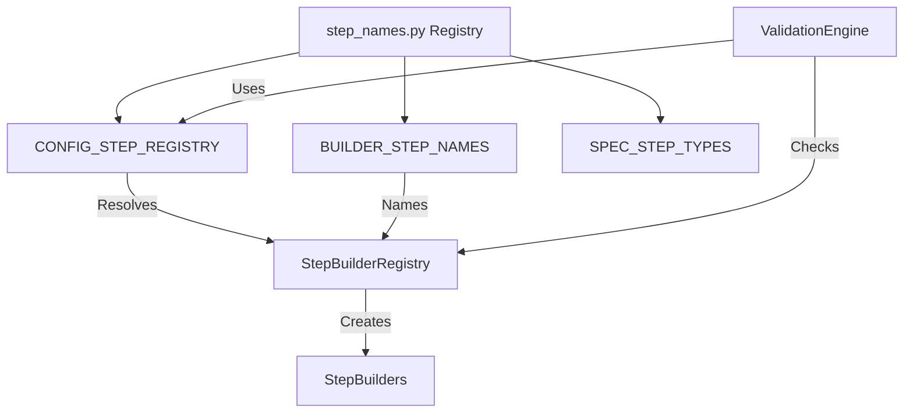

# Step Builder Registry Design

## Overview

The Step Builder Registry is a central component of the Pipeline API that maps configuration types to their corresponding step builder classes. This design document outlines its architecture, key principles, and recent enhancements to support job type variants.

## Architecture

The Step Builder Registry follows a single source of truth approach, using centralized step naming conventions defined in `step_names.py`. This ensures consistency across the entire pipeline system.



## Key Components

1. **STEP_NAMES Registry**: The central dictionary defining all step types, their config classes, and builder classes.
2. **StepBuilderRegistry**: Maps step types to builder classes, using the registry information.
3. **ConfigClassToStepType**: Transformation logic that converts config class names to step types.
4. **ValidationEngine**: Validates that all nodes in a DAG have corresponding builders.

## Job Type Variants

Job types are used to create variants of the same configuration class for different purposes, for example:

```
CradleDataLoading_training
CradleDataLoading_calibration
```

Both map to the same `CradleDataLoadConfig` class but with different `job_type` attributes.

### Implementation

The enhanced implementation handles job type variants through:

1. **Job Type Extraction**: Parse node names to extract job type information using regex patterns.
2. **Name Resolution**: Uses a multi-tier approach:
   - First try with job type (e.g., `CradleDataLoading_training`)
   - Then fall back to base type (e.g., `CradleDataLoading`)
3. **Legacy Name Handling**: Maintains backward compatibility with legacy naming conventions.

## Challenges and Solutions

### Challenge: Name Transformation Mismatches

We identified an issue where the ValidationEngine was using a simplified transformation from config classes to step types that didn't match the logic in StepBuilderRegistry:

```python
# Simplified approach in ValidationEngine (old)
step_type = config_type.replace('Config', '').replace('Step', '')
```

This caused validation failures when:
1. `CradleDataLoadConfig` → ValidationEngine expected "CradleDataLoad", Registry used "CradleDataLoading"
2. `PackageStepConfig` → ValidationEngine expected "Package", Registry used "MIMSPackaging"

### Solution: Aligned Transformation Logic

The updated ValidationEngine now:

1. Uses the central `CONFIG_STEP_REGISTRY` for name mapping
2. Falls back to a more robust transformation logic when needed
3. Handles job type variants explicitly
4. Checks for both canonical and legacy names

## Code Example

```python
# Step type resolution with job type awareness
if config_type in CONFIG_STEP_REGISTRY:
    step_type = CONFIG_STEP_REGISTRY[config_type]
else:
    # Fall back to simplified transformation only if not in registry
    step_type = config_type.replace('Config', '').replace('Step', '')
    
    # Handle special cases for backward compatibility
    if step_type == "CradleDataLoad":
        step_type = "CradleDataLoading"
    # ...

# Check for job type variants
job_type = getattr(config, 'job_type', None)
if job_type:
    job_type_step = f"{step_type}_{job_type}"
    if job_type_step in builder_registry:
        # Use job type variant
```

## Benefits

1. **Consistency**: Single source of truth for step naming
2. **Flexibility**: Support for job type variants
3. **Backward Compatibility**: Maintains compatibility with legacy names
4. **Enhanced Validation**: More accurate validation of builder availability

## Related Components

- **StepConfigResolver**: Resolves configurations based on job type variants
- **DynamicPipelineTemplate**: Integrates job type information into pipeline generation
- **ValidationEngine**: Validates job type variant resolution

## Future Enhancements

1. **Registration of Job Type Variants**: Allow direct registration of job type variant builders
2. **Automatic Job Type Detection**: Further improve job type extraction from node names
3. **Job Type-Specific Builder Logic**: Enable builders to customize behavior based on job type
