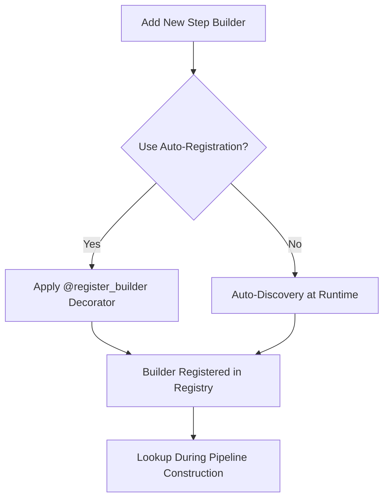

# Step Builder Registry Design

**Version**: 1.0  
**Date**: July 30, 2025  
**Author**: MODS Development Team

## Overview

The Step Builder Registry serves as a centralized lookup system that maps pipeline step names to their corresponding builder classes. It plays a crucial role in the pipeline system by enabling automatic resolution of step builders during pipeline construction, establishing a single source of truth for step naming, and providing a standardized way to expand the system with new step types.

## Design Goals

1. **Single Source of Truth**: Maintain consistency with the step names registry
2. **Extensibility**: Make it easy to add new step builders as the system evolves
3. **Auto-Discovery**: Reduce manual maintenance by automatically discovering step builders
4. **Backward Compatibility**: Support legacy step type names for existing code
5. **Validation**: Provide tools to validate the registry and detect inconsistencies

## Architecture

### Core Components

1. **BUILDER_REGISTRY**: Central dictionary mapping canonical step types to builder classes
2. **LEGACY_ALIASES**: Dictionary mapping legacy step type names to canonical names
3. **StepBuilderRegistry**: Class that manages the builder registry and provides lookup methods
4. **Discovery Mechanism**: System for automatically finding and registering step builders
5. **Registration Decorator**: Decorator to auto-register step builder classes

### Integration with Step Names Registry

The Step Builder Registry is closely integrated with the Step Names Registry (`step_names.py`), which serves as the single source of truth for step naming across the system. This integration ensures that:

1. Step builders use canonical step names from the central registry
2. Legacy step names are properly mapped to canonical names
3. Step configuration classes are correctly associated with step builders

### Registration Flow



## Implementation Details

### StepBuilderRegistry Class

The `StepBuilderRegistry` class maintains the registry and provides methods for lookup and validation:

```python
class StepBuilderRegistry:
    """
    Centralized registry mapping step types to builder classes.
    
    This registry maintains the mapping between step types and their
    corresponding step builder classes, enabling automatic resolution
    during pipeline construction.
    """
    
    # Core registry mapping step types to builders
    BUILDER_REGISTRY = {}  # Auto-populated during initialization
    
    # Legacy aliases for backward compatibility
    LEGACY_ALIASES = {
        "MIMSPackaging": "Package", 
        "MIMSPayload": "Payload",
        "ModelRegistration": "Registration",
        "PyTorchTraining": "PytorchTraining",
        "PyTorchModel": "PytorchModel",
    }
    
    def __init__(self):
        """Initialize the registry."""
        self._custom_builders = {}
        self.logger = logging.getLogger(__name__)
        
        # Populate the registry if empty (first initialization)
        if not self.__class__.BUILDER_REGISTRY:
            # Get core builders through discovery
            discovered = self.__class__.discover_builders()
            self.__class__.BUILDER_REGISTRY = discovered
            
            # Log discovery results
            self.logger.info(f"Discovered {len(discovered)} step builders")
```

### Builder Discovery

The discovery mechanism automatically finds and registers step builders using the same `STEP_NAMES` registry logic as the registration decorator:

```python
@classmethod
def discover_builders(cls):
    """Automatically discover and register step builders."""
    from ..pipeline_steps import builder_step_base
    import importlib
    import inspect
    import pkgutil
    
    # Get the package containing all step builders
    import src.pipeline_steps as steps_package
    
    discovered_builders = {}
    
    # Walk through all modules in the package
    for _, module_name, _ in pkgutil.iter_modules(steps_package.__path__):
        if module_name.startswith('builder_'):
            # Import the module
            module = importlib.import_module(f"src.pipeline_steps.{module_name}")
            
            # Find builder classes in the module
            for name, obj in inspect.getmembers(module):
                if (inspect.isclass(obj) and 
                    issubclass(obj, builder_step_base.StepBuilderBase) and 
                    obj != builder_step_base.StepBuilderBase):
                    
                    # Use the same logic as register_builder decorator for consistency
                    step_type = None
                    
                    # First, try to find in STEP_NAMES registry (single source of truth)
                    if name in REVERSE_BUILDER_MAPPING:
                        step_type = REVERSE_BUILDER_MAPPING[name]
                        logging.getLogger(__name__).debug(f"Found step type '{step_type}' for class '{name}' in STEP_NAMES registry")
                    else:
                        # Fallback to current logic for backward compatibility
                        if name.endswith('StepBuilder'):
                            step_type = name[:-11]  # Remove 'StepBuilder'
                        else:
                            step_type = name
                        logging.getLogger(__name__).debug(f"Class '{name}' not found in STEP_NAMES registry, using fallback step type '{step_type}'")
                    
                    discovered_builders[step_type] = obj
                    logging.getLogger(__name__).debug(f"Discovered builder: {step_type} -> {name}")
    
    return discovered_builders
```

### Registration Decorator

The registration decorator provides an easy way to auto-register step builders and now uses the `STEP_NAMES` registry as the single source of truth:

```python
# Create reverse mapping from builder step names to canonical step names for efficient lookup
REVERSE_BUILDER_MAPPING = {
    info["builder_step_name"]: step_name 
    for step_name, info in STEP_NAMES.items()
}

def register_builder(step_type: str = None):
    """
    Decorator to automatically register a step builder class.
    
    Args:
        step_type: Optional step type name. If not provided,
                  will be derived from the class name using the STEP_NAMES registry.
    """
    def decorator(cls):
        if not issubclass(cls, StepBuilderBase):
            raise TypeError(f"@register_builder can only be used on StepBuilderBase subclasses: {cls.__name__}")
        
        # Determine step type if not provided
        nonlocal step_type
        if step_type is None:
            class_name = cls.__name__
            
            # First, try to find in STEP_NAMES registry (single source of truth)
            if class_name in REVERSE_BUILDER_MAPPING:
                step_type = REVERSE_BUILDER_MAPPING[class_name]
                logger.debug(f"Found step type '{step_type}' for class '{class_name}' in STEP_NAMES registry")
            else:
                # Fallback to current logic for backward compatibility
                logger.debug(f"Class '{class_name}' not found in STEP_NAMES registry, using fallback logic")
                if class_name.endswith('StepBuilder'):
                    step_type = class_name[:-11]  # Remove 'StepBuilder'
                else:
                    step_type = class_name
                logger.warning(f"Using fallback step type '{step_type}' for class '{class_name}'. Consider adding to STEP_NAMES registry.")
        
        # Register the class
        StepBuilderRegistry.register_builder_class(step_type, cls)
        return cls
    
    return decorator
```

## Usage Examples

### Using the Registry in Pipeline Construction

```python
from src.pipeline_registry.builder_registry import get_global_registry

def create_pipeline(configs, dag_structure):
    """Create a pipeline from configs and DAG structure."""
    registry = get_global_registry()
    steps = {}
    
    # Create steps for each config
    for config_id, config in configs.items():
        # Get the builder for this config
        builder_class = registry.get_builder_for_config(config)
        builder = builder_class(config)
        
        # Create the step and store it
        step = builder.create_step()
        steps[config_id] = step
    
    # Connect steps based on DAG structure
    # ...
    
    return pipeline
```

### Adding a New Step Builder

With the auto-registration decorator:

```python
# In src/pipeline_steps/builder_new_step.py
from src.pipeline_registry.builder_registry import register_builder
from src.pipeline_steps.builder_step_base import StepBuilderBase

@register_builder()  # Auto-registers with derived name
class NewStepBuilder(StepBuilderBase):
    """Builder for NewStep processing step."""
    # Implementation here
```

Without the decorator (relies on auto-discovery):

```python
# In src/pipeline_steps/builder_new_step.py
from src.pipeline_steps.builder_step_base import StepBuilderBase

class NewStepBuilder(StepBuilderBase):
    """Builder for NewStep processing step."""
    # Implementation here
```

## Best Practices

1. **Use the Registration Decorator**: For explicit and clear registration of new step builders
2. **Update Step Names Registry**: Always add new step types to the step names registry first
3. **Validate the Registry**: Run validation checks to detect inconsistencies
4. **Follow Naming Conventions**: Use consistent naming (ClassNameStepBuilder for classes)
5. **Maintain Legacy Aliases**: Add aliases when renaming step types for backward compatibility

## Validation and Troubleshooting

The `validate_registry()` method helps identify issues with the registry:

```python
validation = registry.validate_registry()

if validation['invalid']:
    print("Invalid registry entries:")
    for entry in validation['invalid']:
        print(f"  - {entry}")

if validation['missing']:
    print("Missing registry entries:")
    for entry in validation['missing']:
        print(f"  - {entry}")
```

## Recent Improvements

### STEP_NAMES Registry Integration (July 30, 2025)

The step type inference logic has been significantly improved to use the `STEP_NAMES` registry as the single source of truth:

**Key Changes:**
1. **Reverse Mapping**: Created `REVERSE_BUILDER_MAPPING` for efficient lookup from builder class names to canonical step names
2. **Consistent Logic**: Both the `register_builder` decorator and `discover_builders` method now use identical step type inference logic
3. **Registry-First Approach**: Step type inference first checks the `STEP_NAMES` registry before falling back to string manipulation
4. **Enhanced Logging**: Added debug and warning messages to help developers understand the registration process
5. **Backward Compatibility**: Maintains fallback logic for classes not yet added to the `STEP_NAMES` registry

**Benefits:**
- **More Reliable**: Uses authoritative mapping instead of error-prone string manipulation
- **Single Source of Truth**: Eliminates inconsistencies between different registration methods
- **Better Developer Experience**: Clear warnings guide developers to update the `STEP_NAMES` registry
- **Maintainable**: Centralized logic makes future changes easier to implement

## Benefits and Impact

1. **Reduced Maintenance**: Auto-discovery and registration reduce manual maintenance
2. **Improved Consistency**: Better integration with step names registry ensures consistent naming
3. **Enhanced Developer Experience**: Clear patterns for adding new steps
4. **Future-Proof Design**: Flexible approach that accommodates project growth
5. **Better Error Messages**: Validation helps catch and diagnose issues early
6. **Reliable Step Type Inference**: Uses centralized registry instead of string manipulation

## Related Documents

- [Step Names Registry](./step_names_registry_design.md)
- [DAG to Template API](./dag_to_template_api.md)
- [Step Builder Implementation](../developer_guide/step_builder.md)
- [Adding a New Pipeline Step](../developer_guide/adding_new_pipeline_step.md)
