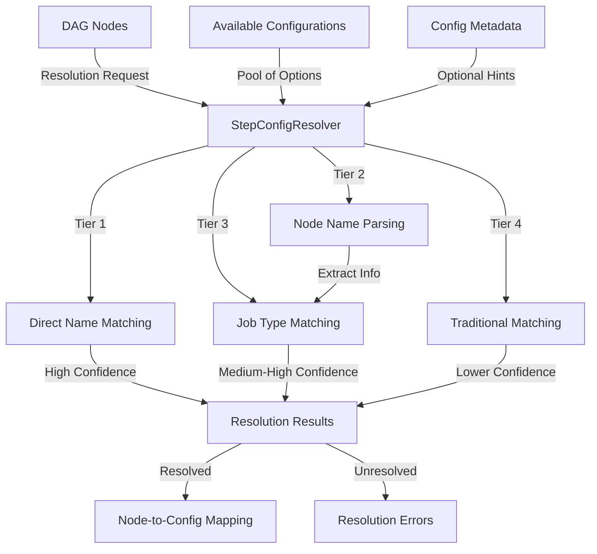

---
tags:
  - design
  - implementation
  - pipeline_api
  - configuration
keywords:
  - config resolver
  - DAG node resolution
  - job type variants
  - configuration matching
  - pipeline assembly
  - intelligent matching
  - node resolution
topics:
  - configuration resolution
  - intelligent matching
  - node-to-config mapping
  - pipeline assembly
language: python
date of note: 2025-07-31
---

# Step Config Resolver

## Overview

The StepConfigResolver is a key component in the Pipeline API that intelligently maps DAG node names to configuration instances using a multi-tiered matching strategy. It bridges the gap between the abstract pipeline structure defined in DAG nodes and the concrete configurations needed to build pipeline steps.

## Purpose

The StepConfigResolver serves several critical purposes:

1. **Intelligent Node Resolution**: Map abstract DAG nodes to concrete configuration objects
2. **Job Type Handling**: Support variants of the same step type with different job types
3. **Multi-Strategy Matching**: Apply multiple resolution strategies with confidence scoring
4. **Ambiguity Detection**: Identify and report ambiguous resolution cases
5. **Resilient Resolution**: Fall back to alternative strategies when preferred methods fail
6. **Configuration Validation**: Ensure all required configurations are available for pipeline execution

## Architecture

The StepConfigResolver uses a multi-tiered matching approach with weighted confidence scores:



## Resolution Strategy

### Multi-Tiered Resolution Process

The StepConfigResolver implements a sophisticated tiered resolution strategy:

1. **Tier 1: Direct Name Matching**
   - Exact match between node name and configuration key
   - Metadata-based matching using `metadata.config_types` mapping
   - Case-insensitive matching as fallback

2. **Tier 2: Node Name Parsing**
   - Pattern-based extraction of config type and job type information
   - Support for formats like `ConfigType_JobType` (e.g., `CradleDataLoading_training`)
   - Support for formats like `JobType_Task` (e.g., `training_data_load`)

3. **Tier 3: Enhanced Job Type Matching**
   - Match configurations with appropriate job type attribute
   - Consider both node name and configuration class when scoring matches
   - Filter by config type when information is available

4. **Tier 4: Traditional Matching Methods**
   - Basic job type matching (without node parsing)
   - Semantic similarity matching using synonyms and keywords
   - Pattern-based matching using predefined regex patterns

### Resolution Algorithm

The core resolution algorithm works as follows:

```python
def _resolve_single_node(self, node_name, available_configs):
    # Tier 1: Direct name matching
    direct_match = self._direct_name_matching(node_name, available_configs)
    if direct_match:
        return direct_match, 1.0, 'direct_name'
    
    # Tier 2: Parse node name for information
    parsed_info = self._parse_node_name(node_name)
    
    # Tier 3: Job type matching with parsed information
    if parsed_info and 'job_type' in parsed_info:
        job_type_matches = self._job_type_matching_enhanced(
            parsed_info['job_type'], 
            available_configs,
            config_type=parsed_info.get('config_type')
        )
        
        if job_type_matches:
            best_match = max(job_type_matches, key=lambda x: x[1])
            return best_match[0], best_match[1], 'job_type_enhanced'
    
    # Tier 4: Traditional matching strategies
    candidates = []
    candidates.extend(self._job_type_matching(node_name, available_configs))
    candidates.extend(self._semantic_matching(node_name, available_configs))
    candidates.extend(self._pattern_matching(node_name, available_configs))
    
    # Select best match with confidence handling
    # ...
```

## Job Type Handling

The StepConfigResolver has sophisticated job type handling capabilities to support different variants of the same step:

### Job Type Keywords

The resolver maintains a dictionary of job type keywords for improved matching:

```python
JOB_TYPE_KEYWORDS = {
    'train': ['training', 'train'],
    'calib': ['calibration', 'calib'],
    'eval': ['evaluation', 'eval', 'test'],
    'inference': ['inference', 'infer', 'predict'],
    'validation': ['validation', 'valid'],
}
```

### Job Type Extraction

Job types can be extracted using several methods:

1. **From node names**: Parse formats like `ConfigType_JobType` (e.g., `TabularPreprocessing_training`)
2. **From node name keywords**: Detect job type keywords in node name (e.g., `training_data`)
3. **From configuration attributes**: Match with `job_type` attributes on configurations

### Node Name Parsing

The resolver extracts valuable information from node names using pattern recognition:

```python
def _parse_node_name(self, node_name: str) -> Dict[str, str]:
    """Parse node name to extract config type and job type information."""
    patterns = [
        # Pattern 1: ConfigType_JobType (e.g., CradleDataLoading_training)
        (r'^([A-Za-z]+[A-Za-z0-9]*)_([a-z]+)$', 'config_first'),
        
        # Pattern 2: JobType_Task (e.g., training_data_load)
        (r'^([a-z]+)_([A-Za-z_]+)$', 'job_first'),
    ]
    
    for pattern, pattern_type in patterns:
        match = re.match(pattern, node_name)
        if match:
            # Extract information based on pattern type
            # ...
```

## Integration with Other Components

The StepConfigResolver integrates with several other pipeline components:

### 1. Pipeline DAG Integration

The StepConfigResolver connects the DAG structure with available configurations:

```python
from src.pipeline_api import StepConfigResolver

# In pipeline building process
resolver = StepConfigResolver()
dag_nodes = pipeline_dag.get_node_names()
config_map = resolver.resolve_config_map(dag_nodes, available_configs, metadata)
```

### 2. Integration with [Registry-Based Step Naming](registry_based_step_name_generation.md)

The resolver complements the registry-based step name generation system:

```python
# Step type resolution with registry awareness
def _config_class_to_step_type(self, config_class_name: str) -> str:
    """Convert configuration class name to step type."""
    # Use the same logic as in builder_registry
    step_type = config_class_name
    
    # Remove 'Config' suffix
    if step_type.endswith('Config'):
        step_type = step_type[:-6]
    
    # Handle special cases that match registry definitions
    if step_type == "CradleDataLoad":
        return "CradleDataLoading"
    # ...
```

### 3. Integration with [Step Builder Registry](step_builder_registry_design.md)

The resolver creates mappings that are later used by the step builder registry:

```python
# In pipeline template
resolved_configs = resolver.resolve_config_map(dag_nodes, available_configs)

# Later used with step builder registry
for node_name, config in resolved_configs.items():
    builder_class = builder_registry.get_builder_for_config(config)
    builder = builder_class(config, ...)
    step = builder.create_step()
    steps[node_name] = step
```

### 4. Integration with [Configuration System](config.md)

The resolver works directly with configuration objects:

```python
# Configuration objects have job_type attributes
class TabularPreprocessingConfig(BasePipelineConfig):
    job_type: Optional[str] = None
    # ...

# Resolver uses these attributes during matching
if hasattr(config, 'job_type'):
    config_job_type = getattr(config, 'job_type', '').lower()
    # Match against detected job type from node name
```

## Confidence-Based Resolution

A key feature of the StepConfigResolver is its confidence-based resolution system:

1. **Confidence Scores**: Each match is assigned a confidence score (0.0-1.0)
2. **Confidence Threshold**: A minimum threshold determines automatic resolution
3. **Ambiguity Detection**: Multiple close matches are flagged as ambiguous
4. **Tiered Confidences**: Different strategies have different base confidence levels

This enables intelligent fallback strategies while maintaining high-quality matches.

## Error Handling and Diagnostics

### Error Types

The StepConfigResolver has robust error handling with specific error types:

1. **ResolutionError**: When no configuration matches a node
2. **AmbiguityError**: When multiple configurations match with similar confidence
3. **ConfigurationError**: When the overall configuration map cannot be created

### Diagnostic Capabilities

The resolver includes diagnostic tools to help users troubleshoot resolution issues:

```python
preview = resolver.preview_resolution(dag_nodes, available_configs)
print(f"Resolution confidence for node1: {preview['resolution_confidence']['node1']}")
print(f"Resolution method: {preview['node_resolution']['node1']['method']}")

# Get recommendations
for recommendation in preview['recommendations']:
    print(recommendation)
```

## Use Cases

### 1. Basic Resolution

```python
# Create resolver
resolver = StepConfigResolver()

# Resolve configurations
config_map = resolver.resolve_config_map(
    dag_nodes=["data_loading", "preprocessing", "training"],
    available_configs={
        "cradle_config": cradle_config,
        "preproc_config": preproc_config,
        "xgb_config": xgb_config
    }
)

# Use resolved configurations
data_loading_config = config_map["data_loading"]
preprocessing_config = config_map["preprocessing"]
training_config = config_map["training"]
```

### 2. Resolution with Job Types

```python
# DAG with job type variants
dag_nodes = [
    "CradleDataLoading_training",
    "TabularPreprocessing_training",
    "XGBoostTraining",
    "CradleDataLoading_calibration",
    "TabularPreprocessing_calibration",
    "ModelCalibration"
]

# Configurations with job type attributes
configs = {
    "cradle_training": CradleDataLoadConfig(job_type="training"),
    "cradle_calibration": CradleDataLoadConfig(job_type="calibration"),
    "preproc_training": TabularPreprocessingConfig(job_type="training"),
    "preproc_calibration": TabularPreprocessingConfig(job_type="calibration"),
    "xgb": XGBoostTrainingConfig(),
    "calibration": ModelCalibrationConfig()
}

# Resolver automatically handles job type variants
config_map = resolver.resolve_config_map(dag_nodes, configs)
```

### 3. Resolution with Metadata Hints

```python
# Explicit metadata hints
metadata = {
    "config_types": {
        "data_loading": "CradleDataLoadConfig",
        "preprocessing": "TabularPreprocessingConfig",
        "training": "XGBoostTrainingConfig"
    }
}

# Use metadata hints for exact matching
config_map = resolver.resolve_config_map(dag_nodes, configs, metadata)
```

## Benefits

1. **Flexibility**: Support for various node naming conventions
2. **Robustness**: Multiple resolution strategies with fallbacks
3. **Job Type Support**: First-class handling of job type variants
4. **Diagnostics**: Detailed error messages and resolution diagnostics
5. **Integration**: Works seamlessly with other pipeline components
6. **Extensibility**: Easy to add new matching strategies and patterns

## Implementation Challenges

### Challenge: Handling Ambiguous Matches

When multiple configurations match a node with similar confidence, determining the right one can be difficult:

```
Node 'preprocessing_step' has multiple matching configurations:
- TabularPreprocessingConfig (job_type='training', confidence=0.82)
- TabularPreprocessingConfig (job_type='validation', confidence=0.80)
```

### Solution: Multi-tiered Approach with Clear Errors

The resolver:
1. Uses direct matches whenever possible
2. Extracts more context from node names through parsing
3. Applies job type filters to narrow down options
4. Reports ambiguity with detailed diagnostics when needed

```python
# When ambiguity occurs
raise AmbiguityError(
    f"Multiple configurations match node '{node_name}' with similar confidence",
    node_name=node_name,
    candidates=[{
        "config_type": type(c[0]).__name__,
        "job_type": getattr(c[0], 'job_type', None),
        "confidence": c[1],
        "method": c[2]
    } for c in candidates]
)
```

## Future Enhancements

1. **Learning-Based Matching**: Add machine learning-based matching that learns from user selections
2. **Graph-Aware Resolution**: Consider node connections in the DAG when resolving ambiguities
3. **Custom Matchers**: Allow users to register custom matching strategies
4. **Multi-Phase Resolution**: Resolve easy matches first, then use context to resolve harder cases
5. **Integration with Registry**: Tighter integration with the [step builder registry](step_builder_registry_design.md)

## References

- [Step Builder](step_builder.md) - Step builders that use resolved configurations
- [Step Builder Registry](step_builder_registry_design.md) - Registry for step builders
- [Registry-Based Step Names](registry_based_step_name_generation.md) - Step naming conventions
- [Configuration System](config.md) - Configuration object design
- [DAG Compiler](pipeline_dag.md) - DAG compilation that uses the resolver
- [Dynamic Pipeline Template](dynamic_template.md) - Template system that leverages the config resolver
