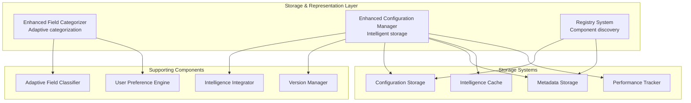

# Storage & Representation Layer Design

## Overview

The Storage & Representation Layer is the third layer of the [Adaptive Configuration Management System](./adaptive_configuration_management_system.md) that provides sophisticated storage, categorization, and management of configurations with intelligence integration. This layer ensures robust, type-safe handling of configurations while maintaining comprehensive metadata and enabling intelligent retrieval.

## Purpose and Responsibilities

1. **Sophisticated Storage**: Robust storage with intelligence metadata and versioning
2. **Adaptive Categorization**: Context-aware field categorization and classification
3. **Configuration Management**: Comprehensive lifecycle management of configurations
4. **Registry Integration**: Component discovery and registration with intelligence
5. **Metadata Management**: Rich metadata storage for intelligence and audit trails

## Architecture Overview



## Core Components

### 1. Enhanced Field Categorizer

**Purpose**: Sophisticated field categorization with adaptive capabilities

```python
class EnhancedConfigFieldCategorizer(ConfigFieldCategorizer):
    """
    Enhanced version of ConfigFieldCategorizer with adaptive capabilities
    
    Extends the existing ConfigFieldCategorizer with:
    - Context-aware categorization
    - Dynamic tier classification
    - User-level adaptive categorization
    """
    
    def __init__(self, config_list: List[BaseModel], context: PipelineContext):
        super().__init__(config_list)
        self.context = context
        self.adaptive_classifier = AdaptiveFieldClassifier()
        self.user_preference_engine = UserPreferenceEngine()
        self.categorization_cache = CategorizationCache()
    
    def categorize_fields_adaptively(self) -> AdaptiveCategorization:
        """
        Categorize fields based on context and user preferences
        
        Returns categorization that adapts to:
        - User expertise level
        - Pipeline complexity
        - Environment requirements
        - Historical preferences
        """
        # Check cache first
        cache_key = self._generate_cache_key()
        cached_result = self.categorization_cache.get(cache_key)
        if cached_result:
            return cached_result
        
        # Get base categorization
        base_categorization = super().categorize_fields()
        
        # Apply adaptive enhancements
        adaptive_categorization = self.adaptive_classifier.enhance_categorization(
            base_categorization, self.context
        )
        
        # Apply user preferences
        user_adapted = self.user_preference_engine.apply_preferences(
            adaptive_categorization, self.context.user_profile
        )
        
        # Cache result
        self.categorization_cache.set(cache_key, user_adapted)
        
        return user_adapted
    
    def get_fields_for_interface_level(self, interface_level: InterfaceLevel) -> FieldCollection:
        """
        Get fields appropriate for specific interface level
        
        Dynamically adjusts field visibility based on:
        - Interface complexity level
        - User expertise
        - Context requirements
        """
        categorization = self.categorize_fields_adaptively()
        
        if interface_level == InterfaceLevel.DECLARATIVE:
            return FieldCollection(
                essential_fields=[],  # No user input required
                system_fields=categorization.get_auto_configurable_fields(),
                derived_fields=categorization.get_all_derived_fields()
            )
        elif interface_level == InterfaceLevel.GUIDED:
            return FieldCollection(
                essential_fields=categorization.get_essential_fields(),
                system_fields=categorization.get_system_fields(),
                derived_fields=categorization.get_derived_fields()
            )
        else:  # ADVANCED
            return FieldCollection(
                essential_fields=categorization.get_all_configurable_fields(),
                system_fields=categorization.get_optional_system_fields(),
                derived_fields=categorization.get_overridable_derived_fields()
            )

class AdaptiveFieldClassifier:
    """
    Classifies fields adaptively based on context
    
    Provides dynamic field classification that considers:
    - User expertise level
    - Pipeline complexity
    - Environment constraints
    - Usage patterns
    """
    
    def __init__(self):
        self.ml_classifier = MLFieldClassifier()
        self.rule_engine = FieldClassificationRuleEngine()
        self.pattern_analyzer = FieldUsagePatternAnalyzer()
    
    def classify_field_for_context(self, 
                                 field_name: str, 
                                 field_info: FieldInfo,
                                 context: PipelineContext) -> AdaptiveFieldTier:
        """
        Classify field considering full context
        
        Returns adaptive tier that may differ from static classification
        based on context requirements
        """
        # Get base tier from registry
        base_tier = self.tier_registry.get_tier(field_name)
        
        # Analyze context requirements
        context_requirements = self._analyze_context_requirements(context)
        
        # Get ML-based classification
        ml_classification = self.ml_classifier.classify_field(
            field_name, field_info, context
        )
        
        # Apply classification rules
        rule_based_tier = self.rule_engine.apply_rules(
            field_name, field_info, context, base_tier
        )
        
        # Analyze usage patterns
        usage_patterns = self.pattern_analyzer.analyze_field_usage(
            field_name, context.user_profile
        )
        
        # Combine all inputs to determine final tier
        final_tier = self._combine_classification_inputs(
            base_tier, ml_classification, rule_based_tier, usage_patterns, context
        )
        
        return AdaptiveFieldTier(
            tier=final_tier,
            confidence=self._calculate_confidence(ml_classification, rule_based_tier),
            rationale=self._generate_rationale(base_tier, final_tier, context)
        )
    
    def _analyze_context_requirements(self, context: PipelineContext) -> ContextRequirements:
        """Analyze what the context requires from field classification"""
        requirements = ContextRequirements()
        
        # User expertise requirements
        if context.user_profile.expertise_level == UserExpertiseLevel.BEGINNER:
            requirements.minimize_user_inputs = True
            requirements.maximize_automation = True
        elif context.user_profile.expertise_level == UserExpertiseLevel.EXPERT:
            requirements.provide_full_control = True
            requirements.minimize_automation = False
        
        # Environment requirements
        if context.environment.cost_constraints.strict_budget:
            requirements.promote_cost_fields = True
        
        if context.environment.performance_requirements.high_performance:
            requirements.promote_performance_fields = True
        
        # Data requirements
        if context.data_characteristics and context.data_characteristics.complexity_info.high_complexity:
            requirements.promote_data_processing_fields = True
        
        return requirements

class UserPreferenceEngine:
    """
    Applies user preferences to field categorization
    
    Learns and applies user-specific preferences for:
    - Field visibility preferences
    - Automation level preferences
    - Interface complexity preferences
    """
    
    def __init__(self):
        self.preference_storage = UserPreferenceStorage()
        self.preference_learner = PreferenceLearner()
        self.preference_applier = PreferenceApplier()
    
    def apply_preferences(self, 
                         categorization: FieldCategorization,
                         user_profile: UserProfile) -> FieldCategorization:
        """
        Apply user preferences to field categorization
        
        Personalizes categorization based on:
        - Explicit user preferences
        - Learned preferences from usage patterns
        - User expertise progression
        """
        # Load user preferences
        preferences = self.preference_storage.load_preferences(user_profile.user_id)
        
        # Learn new preferences from recent activity
        learned_preferences = self.preference_learner.learn_from_activity(
            user_profile, categorization
        )
        
        # Merge preferences
        merged_preferences = self._merge_preferences(preferences, learned_preferences)
        
        # Apply preferences to categorization
        personalized_categorization = self.preference_applier.apply_preferences(
            categorization, merged_preferences, user_profile
        )
        
        # Store updated preferences
        self.preference_storage.save_preferences(user_profile.user_id, merged_preferences)
        
        return personalized_categorization
```

### 2. Enhanced Configuration Manager

**Purpose**: Sophisticated storage and management with intelligence integration

```python
class EnhancedConfigurationManager(ConfigurationManager):
    """
    Enhanced configuration manager with intelligence integration
    
    Extends existing ConfigurationManager with:
    - Intelligent storage optimization
    - Context-aware retrieval
    - Automated versioning and migration
    - Performance monitoring integration
    """
    
    def __init__(self):
        super().__init__()
        self.intelligence_integrator = IntelligenceIntegrator()
        self.version_manager = ConfigurationVersionManager()
        self.performance_tracker = PerformanceTracker()
        self.metadata_manager = MetadataManager()
    
    def store_configuration_with_intelligence(self, 
                                            configs: List[BaseModel],
                                            context: PipelineContext,
                                            processing_metadata: ProcessingMetadata) -> StorageResult:
        """
        Store configuration with intelligence metadata
        
        Enhancements:
        - Store intelligence decisions and rationale
        - Track performance implications
        - Enable intelligent retrieval
        - Support automated migration
        """
        # Prepare enhanced storage format
        enhanced_storage = self._prepare_enhanced_storage(configs, context, processing_metadata)
        
        # Store with base functionality
        base_result = super().store_configuration(configs)
        
        # Add intelligence metadata
        intelligence_metadata = self.intelligence_integrator.generate_metadata(
            configs, context, processing_metadata
        )
        
        # Store intelligence metadata
        self._store_intelligence_metadata(base_result.config_id, intelligence_metadata)
        
        # Store context snapshot
        self._store_context_snapshot(base_result.config_id, context)
        
        # Track for performance monitoring
        self.performance_tracker.track_configuration(base_result.config_id, context)
        
        # Create version entry
        version_info = self.version_manager.create_version_entry(
            base_result.config_id, configs, intelligence_metadata
        )
        
        return StorageResult(
            config_id=base_result.config_id,
            storage_location=base_result.storage_location,
            intelligence_metadata=intelligence_metadata,
            version_info=version_info,
            context_snapshot=context
        )
    
    def retrieve_configuration_for_context(self, 
                                         config_id: str,
                                         target_context: PipelineContext) -> ContextualConfiguration:
        """
        Retrieve configuration adapted for specific context
        
        Provides context-aware retrieval that:
        - Adapts configuration for target environment
        - Applies context-specific optimizations
        - Provides migration recommendations if needed
        """
        # Retrieve base configuration
        base_config = super().load_configuration(config_id)
        
        # Retrieve intelligence metadata
        intelligence_metadata = self._load_intelligence_metadata(config_id)
        
        # Retrieve original context
        original_context = self._load_context_snapshot(config_id)
        
        # Adapt for target context
        adapted_config = self.intelligence_integrator.adapt_for_context(
            base_config, intelligence_metadata, original_context, target_context
        )
        
        # Generate migration recommendations if contexts differ significantly
        migration_recommendations = self._generate_migration_recommendations(
            original_context, target_context, adapted_config
        )
        
        return ContextualConfiguration(
            configuration=adapted_config,
            intelligence_metadata=intelligence_metadata,
            original_context=original_context,
            target_context=target_context,
            migration_recommendations=migration_recommendations
        )
    
    def search_similar_configurations(self, 
                                    context: PipelineContext,
                                    similarity_threshold: float = 0.8) -> List[SimilarConfiguration]:
        """
        Search for similar configurations based on context
        
        Uses intelligence metadata to find configurations with:
        - Similar context characteristics
        - Similar performance profiles
        - Similar optimization patterns
        """
        # Extract search features from context
        search_features = self.intelligence_integrator.extract_search_features(context)
        
        # Search intelligence metadata
        similar_configs = self.metadata_manager.search_similar_configurations(
            search_features, similarity_threshold
        )
        
        # Rank by relevance
        ranked_configs = self._rank_configurations_by_relevance(
            similar_configs, context
        )
        
        return ranked_configs

class IntelligenceIntegrator:
    """
    Integrates intelligence metadata with storage operations
    
    Manages the storage and retrieval of intelligence decisions,
    context information, and performance data
    """
    
    def __init__(self):
        self.metadata_serializer = IntelligenceMetadataSerializer()
        self.context_adapter = ContextAdapter()
        self.performance_analyzer = PerformanceAnalyzer()
    
    def generate_metadata(self, 
                         configs: List[BaseModel],
                         context: PipelineContext,
                         processing_metadata: ProcessingMetadata) -> IntelligenceMetadata:
        """
        Generate comprehensive intelligence metadata for storage
        
        Metadata includes:
        - Intelligence decisions made
        - Context analysis results
        - Optimization applied
        - Performance predictions
        """
        metadata = IntelligenceMetadata()
        
        # Store intelligence decisions
        metadata.decisions = self._extract_intelligence_decisions(processing_metadata)
        
        # Store context analysis
        metadata.context_analysis = self._serialize_context_analysis(context)
        
        # Store optimization information
        metadata.optimizations = self._extract_optimization_info(processing_metadata)
        
        # Store performance predictions
        metadata.performance_predictions = self.performance_analyzer.predict_performance(
            configs, context
        )
        
        # Store feature vectors for similarity search
        metadata.feature_vectors = self._generate_feature_vectors(configs, context)
        
        return metadata
    
    def adapt_for_context(self, 
                         configs: List[BaseModel],
                         intelligence_metadata: IntelligenceMetadata,
                         original_context: PipelineContext,
                         target_context: PipelineContext) -> List[BaseModel]:
        """
        Adapt stored configuration for new context
        
        Applies intelligent adaptations based on context differences
        """
        # Analyze context differences
        context_diff = self.context_adapter.analyze_context_differences(
            original_context, target_context
        )
        
        # Apply adaptations
        adapted_configs = []
        for config in configs:
            adapted_config = self.context_adapter.adapt_configuration(
                config, context_diff, intelligence_metadata
            )
            adapted_configs.append(adapted_config)
        
        return adapted_configs

class ConfigurationVersionManager:
    """
    Manages configuration versioning with intelligence awareness
    
    Provides intelligent versioning that considers:
    - Configuration changes and their impact
    - Intelligence evolution
    - Performance improvements
    - Context changes
    """
    
    def __init__(self):
        self.version_storage = VersionStorage()
        self.change_analyzer = ConfigurationChangeAnalyzer()
        self.migration_engine = ConfigurationMigrationEngine()
    
    def create_version_entry(self, 
                           config_id: str,
                           configs: List[BaseModel],
                           intelligence_metadata: IntelligenceMetadata) -> VersionInfo:
        """
        Create version entry with intelligence tracking
        
        Tracks not just configuration changes but also:
        - Intelligence improvements
        - Performance changes
        - Context evolution
        """
        # Analyze changes from previous version
        previous_version = self.version_storage.get_latest_version(config_id)
        change_analysis = None
        
        if previous_version:
            change_analysis = self.change_analyzer.analyze_changes(
                previous_version.configs, configs,
                previous_version.intelligence_metadata, intelligence_metadata
            )
        
        # Create version entry
        version_info = VersionInfo(
            config_id=config_id,
            version_number=self._generate_version_number(config_id),
            configs=configs,
            intelligence_metadata=intelligence_metadata,
            change_analysis=change_analysis,
            created_at=datetime.now()
        )
        
        # Store version
        self.version_storage.store_version(version_info)
        
        return version_info
    
    def migrate_configuration(self, 
                            config_id: str,
                            target_version: str) -> MigrationResult:
        """
        Migrate configuration to target version with intelligence
        
        Provides intelligent migration that:
        - Preserves user customizations
        - Applies new intelligence improvements
        - Maintains performance characteristics
        """
        # Get source and target versions
        source_version = self.version_storage.get_latest_version(config_id)
        target_version_info = self.version_storage.get_version(config_id, target_version)
        
        # Generate migration plan
        migration_plan = self.migration_engine.generate_migration_plan(
            source_version, target_version_info
        )
        
        # Execute migration
        migrated_configs = self.migration_engine.execute_migration(
            source_version.configs, migration_plan
        )
        
        return MigrationResult(
            migrated_configs=migrated_configs,
            migration_plan=migration_plan,
            warnings=migration_plan.warnings,
            manual_steps=migration_plan.manual_steps
        )
```

### 3. Registry System

**Purpose**: Component discovery and registration with intelligence integration

```python
class EnhancedRegistrySystem(RegistrySystem):
    """
    Enhanced registry system with intelligence integration
    
    Extends existing registry with:
    - Intelligent component discovery
    - Context-aware component selection
    - Performance-based component ranking
    - Automated component optimization
    """
    
    def __init__(self):
        super().__init__()
        self.intelligence_registry = IntelligenceComponentRegistry()
        self.performance_tracker = ComponentPerformanceTracker()
        self.compatibility_analyzer = ComponentCompatibilityAnalyzer()
    
    def discover_components_for_context(self, 
                                      context: PipelineContext) -> List[ComponentRecommendation]:
        """
        Discover and recommend components based on context
        
        Provides intelligent component discovery that considers:
        - Context requirements
        - Performance characteristics
        - Compatibility constraints
        - User preferences
        """
        # Get base component discovery
        base_components = super().discover_components()
        
        # Analyze context requirements
        context_requirements = self._analyze_component_requirements(context)
        
        # Filter compatible components
        compatible_components = self.compatibility_analyzer.filter_compatible(
            base_components, context_requirements
        )
        
        # Rank by performance and suitability
        ranked_components = self.performance_tracker.rank_components(
            compatible_components, context
        )
        
        # Generate recommendations
        recommendations = []
        for component in ranked_components:
            recommendation = ComponentRecommendation(
                component=component,
                suitability_score=self._calculate_suitability_score(component, context),
                performance_prediction=self.performance_tracker.predict_performance(
                    component, context
                ),
                rationale=self._generate_recommendation_rationale(component, context)
            )
            recommendations.append(recommendation)
        
        return recommendations
    
    def register_component_with_intelligence(self, 
                                           component: ComponentSpec,
                                           intelligence_profile: ComponentIntelligenceProfile) -> None:
        """
        Register component with intelligence profile
        
        Stores not just component specification but also:
        - Performance characteristics
        - Context suitability
        - Optimization patterns
        - Usage analytics
        """
        # Register with base system
        super().register_component(component)
        
        # Register intelligence profile
        self.intelligence_registry.register_intelligence_profile(
            component.name, intelligence_profile
        )
        
        # Initialize performance tracking
        self.performance_tracker.initialize_component_tracking(component.name)
```

## Data Models

```python
@dataclass
class AdaptiveCategorization:
    """Result of adaptive field categorization"""
    essential_fields: List[FieldInfo]
    system_fields: List[FieldInfo]
    derived_fields: List[FieldInfo]
    context_adaptations: List[ContextAdaptation]
    user_preferences_applied: List[PreferenceApplication]
    confidence_scores: Dict[str, float]

@dataclass
class StorageResult:
    """Result of enhanced configuration storage"""
    config_id: str
    storage_location: str
    intelligence_metadata: IntelligenceMetadata
    version_info: VersionInfo
    context_snapshot: PipelineContext

@dataclass
class ContextualConfiguration:
    """Configuration adapted for specific context"""
    configuration: List[BaseModel]
    intelligence_metadata: IntelligenceMetadata
    original_context: PipelineContext
    target_context: PipelineContext
    migration_recommendations: List[MigrationRecommendation]

@dataclass
class IntelligenceMetadata:
    """Comprehensive intelligence metadata"""
    decisions: List[IntelligenceDecision]
    context_analysis: ContextAnalysisResult
    optimizations: List[OptimizationRecord]
    performance_predictions: PerformancePrediction
    feature_vectors: Dict[str, FeatureVector]
    created_at: datetime
    intelligence_version: str

@dataclass
class ComponentRecommendation:
    """Intelligent component recommendation"""
    component: ComponentSpec
    suitability_score: float
    performance_prediction: PerformancePrediction
    rationale: str
    alternatives: List[ComponentSpec]
```

## Integration Points

### With Intelligence Layer
```python
class StorageIntelligenceIntegration:
    """Integration point with Intelligence Layer"""
    
    def store_processed_configuration(self, 
                                    processed_config: ProcessedConfiguration) -> StorageResult:
        """Store configuration processed by Intelligence Layer"""
        return self.enhanced_config_manager.store_configuration_with_intelligence(
            processed_config.configurations,
            processed_config.context,
            processed_config.processing_metadata
        )
```

### With Execution Layer
```python
class ExecutionLayerIntegration:
    """Integration point with Execution Layer"""
    
    def prepare_for_execution(self, 
                            config_id: str,
                            execution_context: ExecutionContext) -> ExecutionPackage:
        """Prepare stored configuration for execution"""
        # Retrieve configuration for execution context
        contextual_config = self.enhanced_config_manager.retrieve_configuration_for_context(
            config_id, execution_context.pipeline_context
        )
        
        return ExecutionPackage(
            configurations=contextual_config.configuration,
            execution_metadata=contextual_config.intelligence_metadata,
            context=contextual_config.target_context
        )
```

## Performance Considerations

### Caching Strategy
```python
class StorageLayerCache:
    """Multi-level caching for storage layer"""
    
    def __init__(self):
        self.categorization_cache = CategorizationCache(ttl=3600)  # 1 hour
        self.metadata_cache = MetadataCache(ttl=1800)  # 30 minutes
        self.similarity_cache = SimilarityCache(ttl=7200)  # 2 hours
    
    def get_cached_categorization(self, cache_key: str) -> Optional[AdaptiveCategorization]:
        """Get cached field categorization"""
        return self.categorization_cache.get(cache_key)
```

### Async Operations
```python
class AsyncStorageOperations:
    """Async operations for high-performance scenarios"""
    
    async def store_configuration_async(self, 
                                      configs: List[BaseModel],
                                      context: PipelineContext) -> StorageResult:
        """Async configuration storage"""
        # Parallel metadata generation
        metadata_task = asyncio.create_task(
            self._generate_metadata_async(configs, context)
        )
        
        # Parallel base storage
        storage_task = asyncio.create_task(
            self._store_base_config_async(configs)
        )
        
        # Wait for completion
        metadata, base_result = await asyncio.gather(metadata_task, storage_task)
        
        return self._combine_storage_results(base_result, metadata)
```

## Testing Strategy

### Unit Testing
```python
class TestStorageRepresentationLayer(unittest.TestCase):
    def test_adaptive_field_categorization(self):
        """Test adaptive field categorization"""
        categorizer = EnhancedConfigFieldCategorizer(mock_configs, mock_context)
        categorization = categorizer.categorize_fields_adaptively()
        
        self.assertIsInstance(categorization, AdaptiveCategorization)
        self.assertGreater(len(categorization.essential_fields), 0)
    
    def test_intelligent_configuration_storage(self):
        """Test intelligent configuration storage"""
        manager = EnhancedConfigurationManager()
        result = manager.store_configuration_with_intelligence(
            mock_configs, mock_context, mock_metadata
        )
        
        self.assertIsInstance(result, StorageResult)
        self.assertIsNotNone(result.intelligence_metadata)
    
    def test_context_aware_retrieval(self):
        """Test context-aware configuration retrieval"""
        manager = EnhancedConfigurationManager()
        contextual_config = manager.retrieve_configuration_for_context(
            "test_config_id", mock_target_context
        )
        
        self.assertIsInstance(contextual_config, ContextualConfiguration)
```

## Related Documents

- **[Adaptive Configuration Management System](./adaptive_configuration_management_system.md)** - Main system architecture
- **[Intelligence Layer Design](./intelligence_layer_design.md)** - Previous layer in architecture
- **[Execution Layer Design](./execution_layer_design.md)** - Next layer in architecture
- **[Config Field Categorization Refactored](./config_field_categorization_refactored.md)** - Base categorization system
- **[Configuration Manager Design](./configuration_manager_design.md)** - Base configuration management
