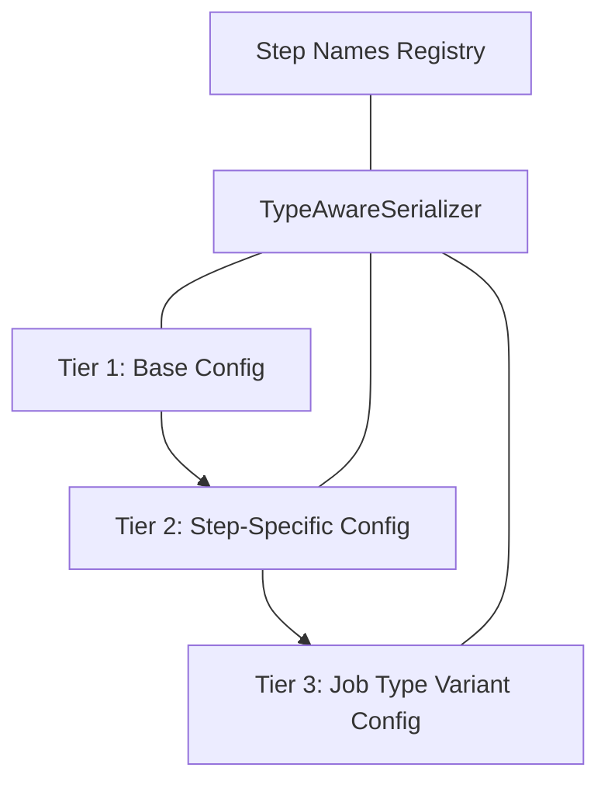

---
tags:
  - design
  - implementation
  - serialization
  - configuration
keywords:
  - type-aware serialization
  - configuration serialization
  - deserialization
  - step name resolution
  - registry integration
  - three-tier config system
topics:
  - configuration management
  - serialization patterns
  - registry integration
  - type resolution
language: python
date of note: 2025-07-31
---

# Type-Aware Serializer

## Overview

The Type-Aware Serializer is a specialized component in the pipeline system that handles intelligent serialization and deserialization of configuration objects with awareness of their types and relationships. It bridges the gap between the serialized representation of configuration objects and their type-specific behavior at runtime.

This component is a crucial part of the [Three-Tier Configuration System](config.md) and integrates deeply with the [Registry as Single Source of Truth](registry_single_source_of_truth.md) pattern.

## Purpose

The Type-Aware Serializer serves several critical purposes:

1. **Type-Preserving Serialization**: Ensure configuration objects maintain their type information during serialization
2. **Automatic Type Resolution**: Intelligently determine object types during deserialization
3. **Registry Integration**: Use the [Step Names Registry](registry_single_source_of_truth.md#step-names-registry) for canonical step name resolution
4. **Step Name Generation**: Generate consistent step names for configuration objects
5. **Job Type Support**: Handle job type variants during serialization and deserialization
6. **Configuration Hierarchy**: Respect the three-tier configuration hierarchy

## The Three-Tier Configuration System

The Type-Aware Serializer is a key component in the Three-Tier Configuration System:



### Tier 1: Base Configuration

The base configuration tier provides common fields and functionality for all configuration objects:

```python
class BasePipelineConfig(BaseModel):
    """Base class for all pipeline configurations."""
    step_name_override: Optional[str] = None
    description: Optional[str] = None
    tags: Dict[str, str] = Field(default_factory=dict)
```

### Tier 2: Step-Specific Configuration

The step-specific tier provides fields and behavior for specific step types:

```python
class TabularPreprocessingConfig(BasePipelineConfig):
    """Configuration for tabular preprocessing steps."""
    input_data_uri: str
    output_data_uri: str
    features_to_use: List[str]
    imputation_strategy: str = "mean"
    remove_outliers: bool = True
```

### Tier 3: Job Type Variant Configuration

The job type variant tier specializes configurations for specific job types:

```python
class TrainingTabularPreprocessingConfig(TabularPreprocessingConfig):
    """Configuration for training-specific preprocessing."""
    job_type: Literal["training"] = "training"
    generate_train_validation_split: bool = True
    validation_ratio: float = 0.2
    shuffle_data: bool = True
```

## Implementation Details

### Core Serializer Class

The Type-Aware Serializer is implemented as a class with methods for serialization and deserialization:

```python
class TypeAwareConfigSerializer:
    """Serializer that preserves configuration type information."""
    
    def serialize(self, config: Any) -> Dict[str, Any]:
        """Serialize a configuration object preserving type information."""
        if not isinstance(config, BaseModel):
            raise TypeError(f"Expected Pydantic model, got {type(config)}")
            
        # Generate step name based on type and job type
        step_name = self.generate_step_name(config)
        
        # Extract fields from the config
        config_dict = config.dict()
        
        # Add type information
        serialized = {
            "config_type": type(config).__name__,
            "step_name": step_name,
            "config": config_dict
        }
        
        return serialized
    
    def deserialize(self, serialized_data: Dict[str, Any]) -> Any:
        """Deserialize a configuration object with type resolution."""
        if not isinstance(serialized_data, dict):
            raise TypeError(f"Expected dictionary, got {type(serialized_data)}")
            
        # Extract type information and config data
        config_type = serialized_data.get("config_type")
        config_data = serialized_data.get("config", {})
        
        if not config_type:
            raise ValueError("Missing config_type in serialized data")
            
        # Resolve the actual class based on config_type
        config_class = self._resolve_config_class(config_type)
        
        # Create instance
        return config_class(**config_data)
    
    def _resolve_config_class(self, config_type: str) -> Type:
        """Resolve configuration class using the three-tier system."""
        # Dynamic import of all potential configuration classes
        from src.pipeline_steps import config_classes
        
        # Try direct resolution first
        if hasattr(config_classes, config_type):
            return getattr(config_classes, config_type)
        
        # Try registry-based resolution
        from src.pipeline_registry.step_names import get_config_class_name
        try:
            class_name = get_config_class_name(config_type)
            if hasattr(config_classes, class_name):
                return getattr(config_classes, class_name)
        except (KeyError, ValueError):
            pass
        
        # Try job type variant resolution
        if '_' in config_type:
            base_type, job_type = config_type.rsplit('_', 1)
            # Try with job type prefix (e.g., TrainingXxxConfig)
            job_type_class = f"{job_type.capitalize()}{base_type}Config"
            if hasattr(config_classes, job_type_class):
                return getattr(config_classes, job_type_class)
                
        # If all else fails, raise informative error
        raise ValueError(f"Could not resolve config class for type '{config_type}'")
```

### Step Name Generation

The serializer uses the Step Names Registry to generate consistent step names:

```python
def generate_step_name(self, config: Any) -> str:
    """Generate a step name for a config, including job type and other attributes."""
    # First check for step_name_override - highest priority
    if hasattr(config, "step_name_override") and config.step_name_override != config.__class__.__name__:
        return config.step_name_override
        
    # Get class name
    class_name = config.__class__.__name__
    
    # Look up the step name from the registry (primary source of truth)
    try:
        from src.pipeline_registry.step_names import CONFIG_STEP_REGISTRY
        if class_name in CONFIG_STEP_REGISTRY:
            base_step = CONFIG_STEP_REGISTRY[class_name]
        else:
            # Fall back to the old behavior if not in registry
            from src.pipeline_steps.config_base import BasePipelineConfig
            base_step = BasePipelineConfig.get_step_name(class_name)
    except (ImportError, AttributeError):
        # If registry not available, fall back to the old behavior
        from src.pipeline_steps.config_base import BasePipelineConfig
        base_step = BasePipelineConfig.get_step_name(class_name)
    
    # Start with the base step name
    step_name = base_step
    
    # Append distinguishing attributes - essential for job type variants
    for attr in ("job_type", "data_type", "mode"):
        if hasattr(config, attr):
            val = getattr(config, attr)
            if val is not None:
                step_name = f"{step_name}_{val}"
                
    return step_name
```

## Integration with Step Names Registry

The Type-Aware Serializer is deeply integrated with the [Step Names Registry](registry_single_source_of_truth.md#step-names-registry) to ensure consistent naming and type resolution:

1. **Step Name Resolution**: Uses `CONFIG_STEP_REGISTRY` to map config class names to step names
2. **Type Resolution**: Resolves config types using registry-defined class names
3. **Job Type Handling**: Processes job type variants consistent with registry naming conventions

```python
# Sample integration with registry
from src.pipeline_registry.step_names import CONFIG_STEP_REGISTRY, STEP_NAMES

def get_registry_step_info(config_class_name: str) -> Dict[str, Any]:
    """Get registry information for a configuration class."""
    if config_class_name in CONFIG_STEP_REGISTRY:
        step_name = CONFIG_STEP_REGISTRY[config_class_name]
        return STEP_NAMES.get(step_name, {})
    return {}
```

## Integration with Step Config Resolver

The Type-Aware Serializer works in concert with the [Step Config Resolver](step_config_resolver.md) to ensure consistent mapping between configuration objects and pipeline nodes:

1. **Serializer**: Responsible for type-aware serialization/deserialization of config objects
2. **Config Resolver**: Responsible for mapping DAG node names to configuration objects

This partnership enables the config resolver to match node names against properly serialized configuration objects:

```python
# In StepConfigResolver
def resolve_config_map(self, dag_nodes: List[str], available_configs: Dict[str, BasePipelineConfig]) -> Dict[str, BasePipelineConfig]:
    """Resolve DAG nodes to configurations."""
    # Initialize serializer to access step names
    serializer = TypeAwareConfigSerializer()
    
    # Build reverse lookup for step names to configs
    step_name_to_config = {}
    for config_name, config in available_configs.items():
        step_name = serializer.generate_step_name(config)
        step_name_to_config[step_name] = config
        
    # Direct match using step names
    # ...
```

## Benefits of Type-Aware Serialization

1. **Type Safety**: Ensures configuration objects maintain their class information
2. **Consistency**: Generates step names consistent with the registry
3. **Self-Documenting**: Serialized data includes both type and step name information
4. **Job Type Support**: First-class handling of job type variants in step names
5. **Registry Integration**: Uses registry as the single source of truth for step names
6. **Three-Tier Awareness**: Respects and supports the three-tier configuration hierarchy

## Example Usage

### Serialization

```python
from src.pipeline_api import TypeAwareConfigSerializer

# Create serializer
serializer = TypeAwareConfigSerializer()

# Serialize configuration object
training_config = TrainingTabularPreprocessingConfig(
    input_data_uri="s3://bucket/input",
    output_data_uri="s3://bucket/output",
    features_to_use=["feature1", "feature2"],
    validation_ratio=0.15
)

# Serialize with type information
serialized = serializer.serialize(training_config)

# Result includes type information and step name
print(serialized)
# Output:
# {
#   "config_type": "TrainingTabularPreprocessingConfig",
#   "step_name": "TabularPreprocessing_training",
#   "config": {
#     "input_data_uri": "s3://bucket/input",
#     "output_data_uri": "s3://bucket/output",
#     "features_to_use": ["feature1", "feature2"],
#     "validation_ratio": 0.15,
#     "job_type": "training",
#     ...
#   }
# }
```

### Deserialization

```python
# Deserialize back to concrete type
config = serializer.deserialize(serialized)

# Type information is preserved
print(type(config).__name__)  # "TrainingTabularPreprocessingConfig"
print(config.job_type)        # "training"

# Fields are correctly populated
print(config.input_data_uri)  # "s3://bucket/input"
print(config.validation_ratio)  # 0.15
```

### Configuration Validation

```python
# Type-aware validation during loading
def load_typed_config(config_file: str) -> BasePipelineConfig:
    """Load configuration with type awareness."""
    serializer = TypeAwareConfigSerializer()
    
    with open(config_file, 'r') as f:
        data = json.load(f)
        
    try:
        # Deserialize with type resolution
        config = serializer.deserialize(data)
        return config
    except (ValueError, TypeError) as e:
        raise ConfigurationError(f"Failed to load configuration: {str(e)}")
```

## References

- [Registry as Single Source of Truth](registry_single_source_of_truth.md) - Central registry pattern for step naming
- [Step Config Resolver](step_config_resolver.md) - Resolution between DAG nodes and configurations
- [Step Builder Registry](step_builder_registry_design.md) - Registry for step builders
- [Configuration Design](config.md) - Overall configuration system design
