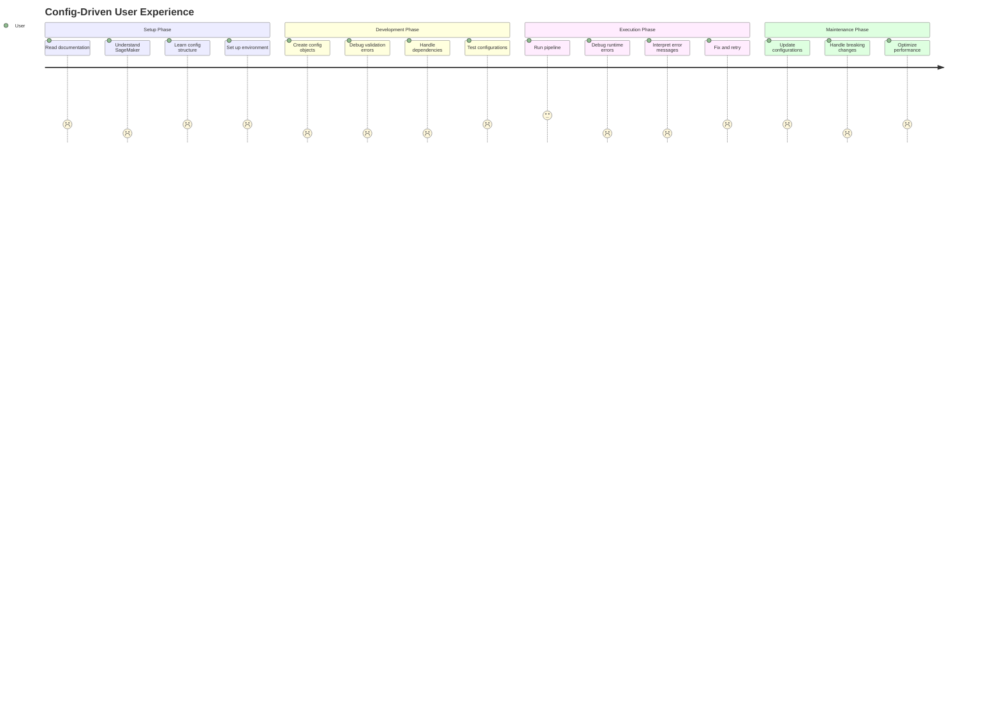
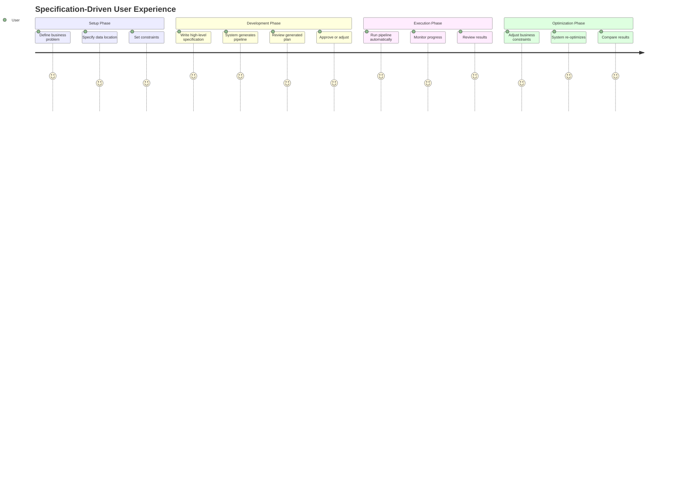
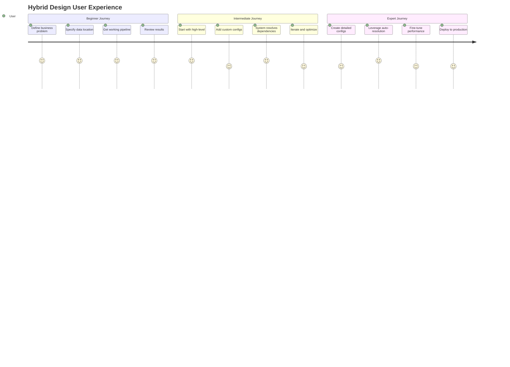
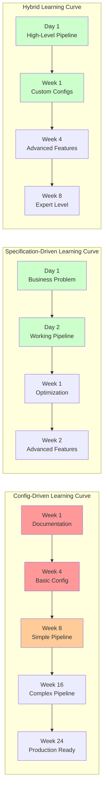

# User Perspective: Pipeline Design Philosophy Comparison

## Overview

This document provides a user-focused analysis of the three pipeline design philosophies, examining their impact on user experience, learning curve, input requirements, and overall usability. The analysis considers different user personas from data scientists to ML engineers to business analysts.

## Related Documents
- **[Config-Driven Design](./config_driven_design.md)** - Current production implementation
- **[Specification-Driven Design](./specification_driven_design.md)** - Pure declarative approach
- **[Hybrid Design](./hybrid_design.md)** - **RECOMMENDED**: Best of both worlds approach
- **[Developer Perspective Comparison](./developer_perspective_comparison.md)** - Developer-focused analysis

## Executive Summary

| Aspect | Config-Driven | Specification-Driven | **Hybrid (Recommended)** |
|--------|---------------|---------------------|--------------------------|
| **User Input Complexity** | Very High | Very Low | **Tiered (Low to High)** |
| **Required Knowledge** | Expert SageMaker | Business Domain | **Progressive Learning** |
| **Abstraction Level** | Low (Infrastructure) | Very High (Business) | **Adaptive (Business to Infrastructure)** |
| **Error Handling** | Technical, Late | Semantic, Early | **Semantic, Early & Progressive** |
| **Learning Curve** | Steep (Months) | Gentle (Days) | **Adaptive (Days to Weeks)** |
| **User Experience Score** | 2/10 | 8/10 | **9/10** |

## User Personas Analysis

### Persona 1: Data Scientist (Primary User)
**Background**: PhD in Statistics, 3 years ML experience, limited infrastructure knowledge
**Goals**: Build and iterate on ML models quickly, focus on business problems
**Pain Points**: Infrastructure complexity, long feedback cycles, debugging technical issues

### Persona 2: ML Engineer (Power User)
**Background**: CS degree, 5 years experience, good infrastructure knowledge
**Goals**: Build production-ready pipelines, optimize performance, ensure reliability
**Pain Points**: Balancing speed with control, managing complexity, maintaining systems

### Persona 3: Business Analyst (Occasional User)
**Background**: MBA, domain expertise, limited technical background
**Goals**: Understand model performance, create simple pipelines, generate insights
**Pain Points**: Technical barriers, complex interfaces, lack of business context

## User Experience Analysis

### 1. Config-Driven Design (Current Implementation)

#### User Input Requirements
```python
# Example: Creating a fraud detection pipeline
# User must provide 200+ configuration parameters across 10+ config objects

# Step 1: Data Loading Configuration (20+ parameters)
cradle_train_config = CradleDataLoadConfig(
    s3_bucket="fraud-detection-data",           # Must know S3 structure
    s3_key_prefix="training/2024/",             # Must understand data organization
    job_type="training",                        # Must understand job types
    data_source="transactions",                 # Must know data source names
    output_format="parquet",                    # Must choose format
    compression="snappy",                       # Must understand compression
    instance_type="ml.m5.2xlarge",             # Must know SageMaker instances
    instance_count=1,                           # Must understand scaling
    volume_size=30,                             # Must calculate storage needs
    max_runtime_in_seconds=3600,               # Must estimate runtime
    role_arn="arn:aws:iam::123456789012:role/SageMakerRole",  # Must know IAM
    # ... 10+ more parameters
)

# Step 2: Preprocessing Configuration (25+ parameters)
prep_config = TabularPreprocessingConfig(
    job_type="training",
    instance_type="ml.m5.2xlarge",             # Must choose appropriate instance
    instance_count=1,
    volume_size=30,
    max_runtime_in_seconds=3600,
    transformations=[                           # Must know transformation names
        "normalize_numerical",
        "encode_categorical", 
        "handle_missing_values"
    ],
    feature_columns=[                           # Must know exact column names
        "transaction_amount",
        "merchant_category",
        "user_age",
        "account_balance"
    ],
    target_column="is_fraud",                   # Must know target column
    test_size=0.2,                             # Must understand ML concepts
    random_state=42,
    normalization_method="standard",            # Must choose method
    categorical_encoding="onehot",              # Must understand encoding
    missing_value_strategy="mean",              # Must choose strategy
    # ... 15+ more parameters
)

# Step 3: Training Configuration (30+ parameters)
train_config = XGBoostTrainingConfig(
    instance_type="ml.m5.4xlarge",             # Must choose training instance
    instance_count=1,
    volume_size=50,
    max_runtime_in_seconds=7200,
    
    # XGBoost hyperparameters (must understand algorithm)
    max_depth=8,
    n_estimators=200,
    learning_rate=0.1,
    subsample=0.8,
    colsample_bytree=0.8,
    gamma=0,
    min_child_weight=1,
    reg_alpha=0,
    reg_lambda=1,
    
    # Framework parameters
    framework_version="1.5-1",
    py_version="py3",
    entry_point="train.py",                     # Must know script names
    source_dir="src/xgboost",                  # Must know directory structure
    
    # Evaluation parameters
    eval_metric="auc",
    early_stopping_rounds=10,
    # ... 10+ more parameters
)

# Must repeat for 7+ more step configurations...
# Total: 200+ parameters to configure manually
```

#### Knowledge Requirements
**Infrastructure Knowledge (Expert Level)**:
- SageMaker instance types and pricing
- S3 bucket structure and permissions
- IAM roles and policies
- Docker containers and entry points
- Resource estimation and optimization

**ML Knowledge (Advanced Level)**:
- Algorithm hyperparameters
- Data preprocessing techniques
- Evaluation metrics
- Cross-validation strategies
- Feature engineering methods

**System Knowledge (Expert Level)**:
- Pipeline orchestration
- Dependency management
- Error handling and debugging
- Property path resolution
- Template architecture

#### User Experience Journey


#### Error Handling Experience
```python
# Typical error messages users encounter:

# 1. Validation Error (Configuration Phase)
ValidationError: 1 validation error for XGBoostTrainingConfig
max_depth
  ensure this value is greater than 0 (type=value_error.number.not_gt; limit_value=0)

# 2. Runtime Error (Execution Phase)  
ClientError: An error occurred (ValidationException) when calling the CreateTrainingJob operation: 
The role provided does not have permissions to access the S3 bucket.

# 3. Property Resolution Error (Pipeline Phase)
PropertyResolutionError: Source step training has no output model_artifacts 
(tried paths: properties.ModelArtifacts.S3ModelArtifacts, 
properties.ProcessingOutputConfig.Outputs[0].S3Output.S3Uri)

# 4. Dependency Error (Template Phase)
DependencyError: No output match found for input: model_evaluation.eval_data_input
Available outputs from preprocessing: ['training_data', 'validation_data']
```

**User Impact**: 
- **Technical Jargon**: Errors require deep system knowledge to understand
- **Late Detection**: Many errors only surface during expensive pipeline execution
- **Complex Debugging**: Users need to understand internal architecture to fix issues
- **Long Feedback Cycles**: Hours or days between error and resolution

#### Abstraction Level
**Very Low - Infrastructure Focused**
- Users work directly with SageMaker APIs
- Must understand cloud infrastructure concepts
- Exposed to implementation details
- No business-level abstractions

#### User Experience Assessment
**Score: 2/10** - Expert-only, high friction, poor user experience

**Strengths**:
- Complete control over implementation
- Predictable behavior
- Production-ready infrastructure

**Weaknesses**:
- Extremely high learning curve (3-6 months)
- Requires expert-level knowledge across multiple domains
- Poor error messages and debugging experience
- Long time-to-value (weeks to first working pipeline)
- High cognitive load and complexity

### 2. Specification-Driven Design (Pure Declarative)

#### User Input Requirements
```python
# Example: Creating the same fraud detection pipeline
# User provides high-level business intent with minimal parameters

# Option 1: Ultra-simple (Business Analyst level)
pipeline = Pipeline("fraud_detection").auto_train_xgboost("s3://fraud-data/")

# Option 2: With business constraints (Data Scientist level)
pipeline = (Pipeline("fraud_detection")
    .auto_train_xgboost("s3://fraud-data/")
    .with_constraints(
        max_training_time="2 hours",        # Business constraint
        min_accuracy=0.85,                  # Business requirement
        max_cost_per_run=50                 # Budget constraint
    )
    .with_preferences(
        prefer_speed_over_accuracy=True,    # Business priority
        enable_hyperparameter_tuning=True  # Feature flag
    ))

# Option 3: Domain-specific language (Domain Expert level)
fraud_pipeline = (FraudDetectionPipeline()
    .load_transaction_data("s3://transactions/")
    .detect_anomalies()                     # Domain-specific step
    .train_classifier()                     # Business-focused
    .evaluate_performance()                 # Business outcome
    .deploy_for_realtime_scoring())         # Business goal

# Total: 5-10 parameters, all business-focused
```

#### Knowledge Requirements
**Business Knowledge (Domain Level)**:
- Understanding of business problem
- Knowledge of success criteria
- Awareness of constraints and priorities

**ML Knowledge (Conceptual Level)**:
- High-level understanding of ML concepts
- Basic knowledge of model types
- Understanding of evaluation metrics

**Infrastructure Knowledge (Minimal)**:
- Basic cloud storage concepts (S3 paths)
- Understanding of data formats
- Awareness of cost implications

#### User Experience Journey


#### Error Handling Experience
```python
# Semantic, business-focused error messages:

# 1. Business Constraint Error (Early Detection)
BusinessConstraintError: 
"Cannot achieve minimum accuracy of 0.85 with current data quality (0.6).
Suggestions:
- Improve data quality through additional preprocessing
- Reduce accuracy requirement to 0.75
- Add feature engineering step to improve model performance"

# 2. Resource Constraint Error (Early Detection)
ResourceConstraintError:
"Estimated cost $75 exceeds budget constraint of $50.
Suggestions:
- Use smaller instance types (reduces cost by 40%)
- Reduce training time from 4 hours to 2 hours
- Use spot instances (reduces cost by 60%)"

# 3. Data Compatibility Error (Early Detection)
DataCompatibilityError:
"XGBoost training requires processed tabular data, but raw transaction data provided.
Suggestion: Add preprocessing step to clean and transform data.
Would you like me to add TabularPreprocessing step automatically? [Y/n]"

# 4. Business Logic Error (Early Detection)
BusinessLogicError:
"Fraud detection pipeline requires labeled training data, but no fraud labels found.
Suggestions:
- Provide labeled dataset with 'is_fraud' column
- Use unsupervised anomaly detection instead
- Use semi-supervised learning with partial labels"
```

**User Impact**:
- **Business Language**: Errors explained in business terms
- **Early Detection**: Issues caught before expensive execution
- **Actionable Suggestions**: Clear guidance on how to fix problems
- **Interactive Resolution**: System can auto-fix common issues

#### Abstraction Level
**Very High - Business Focused**
- Users work with business concepts and goals
- Infrastructure details completely hidden
- Domain-specific languages available
- Natural language-like interfaces

#### User Experience Assessment
**Score: 8/10** - Excellent for business users, some limitations for power users

**Strengths**:
- Extremely low learning curve (hours to days)
- Business-focused interface and language
- Excellent error handling and guidance
- Fast time-to-value (minutes to first working pipeline)
- Intelligent optimization and suggestions

**Weaknesses**:
- Limited customization for edge cases
- Black box behavior can be frustrating for experts
- May not support highly specialized requirements
- Dependency on system intelligence quality

### 3. Hybrid Design (Recommended)

#### User Input Requirements - Tiered Approach

##### Level 1: Business User (Beginner)
```python
# Ultra-simple interface for business analysts
pipeline = Pipeline("fraud_detection").auto_train_xgboost("s3://fraud-data/")

# System automatically:
# - Discovers required preprocessing steps
# - Selects appropriate algorithms and hyperparameters
# - Configures infrastructure resources
# - Sets up evaluation metrics
# - Handles all dependencies
```

##### Level 2: Data Scientist (Intermediate)
```python
# Progressive enhancement - mix high-level with custom configs
pipeline = (Pipeline("fraud_detection")
    .load_data("s3://fraud-data/")
    .preprocess_tabular(
        # Custom config where needed
        config=TabularPreprocessingConfig(
            instance_type="ml.m5.4xlarge",     # Override default
            transformations=["log_transform"]   # Custom transformation
        )
    )
    .train_xgboost(
        # High-level parameters
        max_depth=8, 
        n_estimators=200,
        # System handles infrastructure automatically
    )
    .evaluate_performance(
        metrics=["auc", "precision", "recall"]  # Business metrics
    ))

# User provides: 10-15 parameters (mix of business and technical)
# System handles: 150+ infrastructure parameters automatically
```

##### Level 3: ML Engineer (Power User)
```python
# Full control with automatic dependency resolution
configs = [
    CradleDataLoadConfig(
        s3_bucket="fraud-data", 
        job_type="training",
        # Detailed config as needed
    ),
    TabularPreprocessingConfig(
        job_type="training", 
        instance_type="ml.m5.4xlarge",
        transformations=["normalize", "encode_categorical"],
        # Full configuration control
    ),
    XGBoostTrainingConfig(
        max_depth=8, 
        n_estimators=200,
        learning_rate=0.1,
        # Complete hyperparameter control
    )
]

# Specifications handle dependencies automatically
pipeline = Pipeline.from_configs(configs, auto_resolve_dependencies=True)

# User provides: Full configuration control when needed
# System handles: Dependency resolution and pipeline orchestration
```

#### Knowledge Requirements - Progressive Learning

##### Level 1: Business User
**Business Knowledge**: Understanding of problem domain and success criteria
**ML Knowledge**: Basic concepts (training, evaluation, accuracy)
**Infrastructure Knowledge**: None required

##### Level 2: Data Scientist  
**Business Knowledge**: Domain expertise and business constraints
**ML Knowledge**: Algorithm selection, hyperparameter tuning, evaluation metrics
**Infrastructure Knowledge**: Basic resource requirements (instance types, storage)

##### Level 3: ML Engineer
**Business Knowledge**: Business context and requirements
**ML Knowledge**: Advanced algorithms, optimization, production considerations
**Infrastructure Knowledge**: Full SageMaker knowledge, performance optimization

#### User Experience Journey - Adaptive


#### Error Handling Experience - Progressive Sophistication
```python
# Level 1: Business-focused errors (Beginner)
BusinessError: 
"Fraud detection pipeline needs more training data for reliable results.
Current dataset: 1,000 samples
Recommended: 10,000+ samples
Would you like suggestions for data augmentation techniques?"

# Level 2: Technical guidance with business context (Intermediate)
ConfigurationError:
"XGBoost training configuration may be suboptimal for your dataset size (50GB).
Current: ml.m5.2xlarge (8GB RAM)
Suggested: ml.m5.4xlarge (16GB RAM) - will improve training speed by 40%
Cost impact: +$2.50/hour
Apply suggestion? [Y/n]"

# Level 3: Detailed technical information (Expert)
DependencyResolutionError:
"Step 'XGBoostTraining' requires input 'training_data' of type 'processed_tabular'.
Available sources:
- TabularPreprocessing: outputs 'processed_tabular' ✓
- CradleDataLoading: outputs 'raw_tabular' ✗

Dependency automatically resolved: CradleDataLoading → TabularPreprocessing → XGBoostTraining
Configuration details available in pipeline.dependencies.json"
```

#### Abstraction Level - Adaptive
- **Level 1**: Very High (Business concepts only)
- **Level 2**: Medium (Mix of business and technical)
- **Level 3**: Low to Medium (Full technical control with intelligent assistance)

#### User Experience Assessment
**Score: 9/10** - Excellent across all user levels

**Strengths**:
- **Adaptive Complexity**: Matches user expertise and needs
- **Progressive Learning**: Users can grow with the system
- **Excellent Error Handling**: Appropriate level of detail for each user type
- **Fast Time-to-Value**: Minutes for beginners, maintained for experts
- **Investment Protection**: Existing expert knowledge remains valuable
- **Flexible Control**: From full automation to complete customization

**Minor Weaknesses**:
- **Initial Learning**: Users need to understand the tiered approach
- **System Complexity**: More sophisticated system to maintain

## Detailed User Experience Comparison

### Learning Curve Analysis



### User Input Complexity Comparison

| User Task | Config-Driven | Specification-Driven | **Hybrid** |
|-----------|---------------|---------------------|------------|
| **Simple Pipeline** | 200+ parameters | 1-3 parameters | **1-10 parameters** |
| **Custom Preprocessing** | 50+ parameters | Natural language | **5-15 parameters** |
| **Hyperparameter Tuning** | Manual configuration | Automatic | **Automatic + Override** |
| **Resource Optimization** | Manual calculation | Automatic | **Automatic + Control** |
| **Error Resolution** | Deep debugging | Guided assistance | **Progressive Guidance** |

### Time to Value Analysis

| Milestone | Config-Driven | Specification-Driven | **Hybrid** |
|-----------|---------------|---------------------|------------|
| **First Working Pipeline** | 2-4 weeks | 1 hour | **1 hour - 1 day** |
| **Production Ready** | 2-3 months | 1-2 weeks | **1-4 weeks** |
| **Expert Proficiency** | 6-12 months | 1-2 months | **2-4 months** |
| **Custom Extensions** | 3-6 months | Limited | **2-6 months** |

### Error Handling Quality

#### Error Message Clarity
```python
# Config-Driven (Technical, Cryptic)
"ValidationException: The role provided does not have permissions to access the S3 bucket"

# Specification-Driven (Business, Clear)
"Cannot access training data. Please check S3 bucket permissions or provide different data location."

# Hybrid (Adaptive)
# Beginner: "Cannot access training data. Please check data location."
# Expert: "S3 access denied. Role 'arn:aws:iam::123:role/SageMaker' lacks s3:GetObject permission for bucket 'fraud-data'"
```

#### Error Recovery Support
- **Config-Driven**: Manual debugging, requires expert knowledge
- **Specification-Driven**: Automatic suggestions, guided resolution
- **Hybrid**: Progressive assistance matching user expertise level

### Robustness Comparison

#### Data Quality Issues
```python
# Config-Driven: User must handle manually
try:
    pipeline.execute()
except DataQualityError as e:
    # User must understand and fix data issues
    print(f"Data quality error: {e}")
    # Manual investigation and resolution required

# Specification-Driven: Automatic handling
pipeline = Pipeline("fraud").auto_train_xgboost("s3://data/")
# System automatically:
# - Detects data quality issues
# - Applies appropriate preprocessing
# - Warns about potential impacts

# Hybrid: Progressive handling
pipeline = (Pipeline("fraud")
    .load_data("s3://data/", auto_quality_check=True)  # Automatic for beginners
    .preprocess_tabular(
        quality_threshold=0.8,                          # Control for experts
        handle_missing="auto"                           # Intelligent default
    ))
```

#### Infrastructure Failures
- **Config-Driven**: User must understand SageMaker errors and retry logic
- **Specification-Driven**: System handles retries and fallbacks automatically
- **Hybrid**: Intelligent defaults with user override capabilities

### Smoothness of Use

#### Workflow Continuity
```python
# Config-Driven: Fragmented workflow
# 1. Create configs in notebook
# 2. Save and validate configs
# 3. Create pipeline template
# 4. Debug template issues
# 5. Execute pipeline
# 6. Debug runtime issues
# 7. Iterate (back to step 1)

# Specification-Driven: Smooth workflow
pipeline = Pipeline("fraud").auto_train_xgboost("s3://data/")
results = pipeline.execute()
# Single, continuous workflow

# Hybrid: Adaptive workflow
# Beginner: Single smooth workflow like specification-driven
# Expert: Flexible workflow with full control when needed
```

#### Iteration Speed
- **Config-Driven**: Slow (hours to days per iteration)
- **Specification-Driven**: Fast (minutes per iteration)
- **Hybrid**: Adaptive (minutes for high-level, hours for detailed changes)

## User Persona Recommendations

### For Business Analysts
**Recommended: Specification-Driven or Hybrid (Level 1)**
- Minimal technical knowledge required
- Business-focused interface
- Fast time to insights
- Excellent error handling

### For Data Scientists
**Recommended: Hybrid (Level 2)**
- Progressive learning curve
- Mix of automation and control
- Business context with technical flexibility
- Excellent for experimentation and iteration

### For ML Engineers
**Recommended: Hybrid (Level 3)**
- Full control when needed
- Automatic dependency resolution
- Investment protection for existing skills
- Production-ready capabilities

### For Mixed Teams
**Recommended: Hybrid (All Levels)**
- Supports all team members at their level
- Enables collaboration across skill levels
- Consistent tooling and concepts
- Smooth knowledge transfer

## Implementation Recommendations

### User Onboarding Strategy

#### Phase 1: Quick Wins (Day 1)
```python
# Start all users with high-level interface
pipeline = Pipeline("your_use_case").auto_train_xgboost("s3://your-data/")
results = pipeline.execute()
```

#### Phase 2: Progressive Enhancement (Week 1-2)
```python
# Introduce custom configurations gradually
pipeline = (Pipeline("your_use_case")
    .load_data("s3://your-data/")
    .preprocess_tabular(instance_type="ml.m5.4xlarge")  # First customization
    .train_xgboost(max_depth=8)                         # Algorithm tuning
    .evaluate_performance())
```

#### Phase 3: Expert Features (Month 1-2)
```python
# Full configuration control with automatic dependencies
configs = [detailed_configs...]
pipeline = Pipeline.from_configs(configs, auto_resolve_dependencies=True)
```

### User Support Strategy

#### Documentation Approach
- **Level 1**: Business-focused tutorials and examples
- **Level 2**: Mixed business-technical guides
- **Level 3**: Complete technical reference

#### Error Handling Approach
- **Adaptive Messages**: Match user's current interface level
- **Progressive Disclosure**: More details available on request
- **Contextual Help**: Suggestions based on user's pipeline and data

#### Training Approach
- **Self-Paced Learning**: Users advance at their own speed
- **Just-in-Time Help**: Assistance when needed, not overwhelming
- **Community Support**: Users can help each other across levels

The Hybrid Design provides the optimal user experience by **adapting to user expertise levels** while **maintaining consistency across the platform**, enabling both rapid prototyping for beginners and full control for experts within a single, coherent system.
