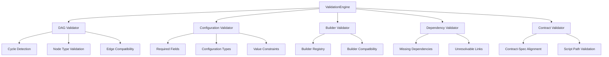

---
tags:
  - design
  - implementation
  - pipeline_api
  - validation
keywords:
  - validation engine
  - dynamic template
  - configuration validation
  - builder validation
  - error reporting
  - DAG validation
  - dependency validation
topics:
  - pipeline validation
  - error handling
  - configuration management
  - quality assurance
language: python
date of note: 2025-07-31
---

# Validation Engine

## Overview

The ValidationEngine is a specialized component in the pipeline architecture that provides comprehensive validation and error detection for pipeline configurations, step builders, and dependency relationships. It serves as the quality assurance layer in the [Dynamic Template](dynamic_template.md) system, ensuring that pipelines are well-formed, complete, and executable before resources are allocated.

## Purpose

The ValidationEngine serves several critical purposes:

1. **Configuration Completeness**: Ensure all DAG nodes have corresponding configurations
2. **Builder Availability**: Verify all configurations have matching step builders
3. **Dependency Resolution**: Check for missing or invalid dependencies
4. **Contract Validation**: Validate script contracts against implementations
5. **Comprehensive Error Reporting**: Generate detailed, actionable error messages
6. **Multi-level Validation**: Validate at the DAG, config, and builder levels
7. **Self-healing Recommendations**: Suggest fixes for common configuration issues

## Architecture

The ValidationEngine operates as a multi-tiered validation system with specialized validators for each concern:



## Implementation Details

### Core Validation Engine

The ValidationEngine provides a modular validation framework:

```python
class ValidationEngine:
    """
    Comprehensive validation engine for dynamic pipeline templates.
    
    This engine performs multi-level validation to ensure pipeline validity:
    - DAG validation (cycles, node types, edge compatibility)
    - Configuration validation (completeness, types, value constraints)
    - Builder validation (availability, compatibility)
    - Dependency validation (resolution, completeness)
    - Contract validation (alignment, script paths)
    """
    
    def __init__(
        self, 
        builder_registry: Optional[StepBuilderRegistry] = None,
        validation_level: ValidationLevel = ValidationLevel.STRICT
    ):
        """Initialize the validation engine."""
        self.builder_registry = builder_registry or StepBuilderRegistry()
        self.validation_level = validation_level
        self._validators = self._create_validators()
        self.validation_results = ValidationResults()
        
    def _create_validators(self) -> Dict[str, BaseValidator]:
        """Create all validators."""
        return {
            "dag": DAGValidator(),
            "config": ConfigurationValidator(),
            "builder": BuilderValidator(self.builder_registry),
            "dependency": DependencyValidator(),
            "contract": ContractValidator(),
        }
        
    def validate_pipeline(
        self,
        dag: PipelineDAG,
        config_map: Dict[str, BasePipelineConfig],
        fail_fast: bool = False
    ) -> ValidationResults:
        """
        Validate a complete pipeline configuration.
        
        This comprehensive validation covers:
        - DAG structure validation
        - Configuration completeness and correctness
        - Builder availability and compatibility
        - Dependency resolution and completeness
        - Contract validation and alignment
        
        Args:
            dag: Pipeline DAG defining the structure
            config_map: Mapping of node names to configuration objects
            fail_fast: If True, stops at the first error
            
        Returns:
            ValidationResults containing all validation results
        """
        self.validation_results = ValidationResults()
        
        # Phase 1: DAG Structure Validation
        self._validate_dag_structure(dag, fail_fast)
        if fail_fast and not self.validation_results.is_valid():
            return self.validation_results
            
        # Phase 2: Configuration Validation
        self._validate_configurations(dag, config_map, fail_fast)
        if fail_fast and not self.validation_results.is_valid():
            return self.validation_results
            
        # Phase 3: Builder Validation
        self._validate_builders(dag, config_map, fail_fast)
        if fail_fast and not self.validation_results.is_valid():
            return self.validation_results
            
        # Phase 4: Dependency Validation
        self._validate_dependencies(dag, config_map, fail_fast)
        if fail_fast and not self.validation_results.is_valid():
            return self.validation_results
            
        # Phase 5: Contract Validation
        self._validate_contracts(dag, config_map, fail_fast)
        
        return self.validation_results
        
    def _validate_dag_structure(self, dag: PipelineDAG, fail_fast: bool = False) -> None:
        """Validate DAG structure."""
        validator = self._validators["dag"]
        results = validator.validate(dag)
        self.validation_results.add_results(results)
    
    # Implementation for other validation methods...
```

### Validator Interface

Each specialized validator follows a common interface:

```python
class BaseValidator(ABC):
    """Base class for all validators."""
    
    @abstractmethod
    def validate(self, subject: Any) -> ValidationResults:
        """
        Validate the given subject.
        
        Args:
            subject: The object to validate
            
        Returns:
            ValidationResults with validation findings
        """
        pass
```

### DAG Validator

Validates pipeline DAG structure:

```python
class DAGValidator(BaseValidator):
    """Validator for DAG structure."""
    
    def validate(self, dag: PipelineDAG) -> ValidationResults:
        """Validate DAG structure."""
        results = ValidationResults()
        
        # Check for cycles
        if self._has_cycle(dag):
            results.add_error(
                code="DAG001",
                message="DAG contains cycles",
                location="dag",
                severity=Severity.ERROR
            )
        
        # Check for isolated nodes
        isolated = self._find_isolated_nodes(dag)
        if isolated:
            for node in isolated:
                results.add_error(
                    code="DAG002",
                    message=f"Isolated node '{node}' found in DAG",
                    location=f"dag.nodes.{node}",
                    severity=Severity.WARNING
                )
        
        # Check node type constraints
        for node_name, node in dag.nodes.items():
            if hasattr(node, 'node_type') and node.node_type == NodeType.SOURCE:
                dependencies = dag.get_dependencies(node_name)
                if dependencies:
                    results.add_error(
                        code="DAG003",
                        message=f"SOURCE node '{node_name}' cannot have dependencies",
                        location=f"dag.nodes.{node_name}",
                        severity=Severity.ERROR
                    )
            
            if hasattr(node, 'node_type') and node.node_type == NodeType.SINK:
                dependents = dag.get_dependents(node_name)
                if dependents:
                    results.add_error(
                        code="DAG004",
                        message=f"SINK node '{node_name}' cannot have dependents",
                        location=f"dag.nodes.{node_name}",
                        severity=Severity.ERROR
                    )
        
        return results
    
    def _has_cycle(self, dag: PipelineDAG) -> bool:
        """Check if DAG contains cycles."""
        # Implementation...
        
    def _find_isolated_nodes(self, dag: PipelineDAG) -> List[str]:
        """Find isolated nodes in DAG."""
        # Implementation...
```

### Configuration Validator

Validates pipeline configurations:

```python
class ConfigurationValidator(BaseValidator):
    """Validator for pipeline configurations."""
    
    def validate(self, data: Tuple[PipelineDAG, Dict[str, BasePipelineConfig]]) -> ValidationResults:
        """Validate configuration completeness and correctness."""
        dag, config_map = data
        results = ValidationResults()
        
        # Check configuration completeness (all nodes have configs)
        for node_name in dag.get_node_names():
            if node_name not in config_map:
                results.add_error(
                    code="CFG001",
                    message=f"Missing configuration for node '{node_name}'",
                    location=f"config_map.{node_name}",
                    suggestion=f"Add a configuration for '{node_name}' to the config_map",
                    severity=Severity.ERROR
                )
        
        # Validate individual configurations
        for node_name, config in config_map.items():
            # Check if node exists in DAG
            if node_name not in dag.get_node_names():
                results.add_error(
                    code="CFG002",
                    message=f"Configuration '{node_name}' has no corresponding DAG node",
                    location=f"config_map.{node_name}",
                    suggestion=f"Either remove this configuration or add a node '{node_name}' to the DAG",
                    severity=Severity.WARNING
                )
                continue
            
            # Validate configuration using Pydantic
            try:
                config_type = type(config)
                # Revalidate to ensure all constraints are checked
                config_type.model_validate(config.model_dump())
            except ValidationError as e:
                results.add_error(
                    code="CFG003",
                    message=f"Configuration validation failed for '{node_name}': {str(e)}",
                    location=f"config_map.{node_name}",
                    severity=Severity.ERROR
                )
            
            # Check job type consistency
            if hasattr(config, 'job_type') and config.job_type:
                if '_' in node_name:
                    node_parts = node_name.split('_')
                    if len(node_parts) >= 2 and node_parts[-1] != config.job_type:
                        results.add_error(
                            code="CFG004",
                            message=(f"Job type mismatch: Node name '{node_name}' suggests "
                                     f"job type '{node_parts[-1]}' but configuration has '{config.job_type}'"),
                            location=f"config_map.{node_name}.job_type",
                            suggestion=f"Change config job_type to '{node_parts[-1]}' or rename the node",
                            severity=Severity.WARNING
                        )
        
        return results
```

### Builder Validator

Validates step builder availability and compatibility:

```python
class BuilderValidator(BaseValidator):
    """Validator for step builders."""
    
    def __init__(self, builder_registry: StepBuilderRegistry):
        """Initialize with builder registry."""
        self.builder_registry = builder_registry
    
    def validate(self, data: Tuple[PipelineDAG, Dict[str, BasePipelineConfig]]) -> ValidationResults:
        """Validate builder availability and compatibility."""
        dag, config_map = data
        results = ValidationResults()
        
        for node_name, config in config_map.items():
            # Skip if node doesn't exist in DAG
            if node_name not in dag.get_node_names():
                continue
                
            # Check if a builder is available for this configuration
            try:
                builder_class = self.builder_registry.get_builder_for_config(config, node_name)
            except Exception as e:
                results.add_error(
                    code="BLD001",
                    message=f"No builder found for configuration '{node_name}': {str(e)}",
                    location=f"config_map.{node_name}",
                    suggestion="Check that the builder is registered in the step builder registry",
                    severity=Severity.ERROR
                )
                continue
                
            # Check if builder is compatible with configuration
            try:
                # Try to instantiate the builder
                builder = builder_class(config, None, None)
                
                # Check specification compatibility if both have specs
                if hasattr(builder, 'spec') and hasattr(config, 'spec'):
                    builder_spec = builder.spec
                    config_spec = config.spec
                    
                    if builder_spec and config_spec and builder_spec != config_spec:
                        results.add_error(
                            code="BLD002",
                            message=(f"Specification mismatch for '{node_name}': "
                                     f"Builder spec '{builder_spec}' != Config spec '{config_spec}'"),
                            location=f"config_map.{node_name}",
                            severity=Severity.WARNING
                        )
                        
            except Exception as e:
                results.add_error(
                    code="BLD003",
                    message=f"Builder instantiation failed for '{node_name}': {str(e)}",
                    location=f"config_map.{node_name}",
                    severity=Severity.ERROR
                )
        
        return results
```

### Dependency Validator

Validates step dependencies:

```python
class DependencyValidator(BaseValidator):
    """Validator for step dependencies."""
    
    def validate(self, data: Tuple[PipelineDAG, Dict[str, BasePipelineConfig]]) -> ValidationResults:
        """Validate dependency resolution and completeness."""
        dag, config_map = data
        results = ValidationResults()
        
        # Check for each node with dependencies
        for node_name in dag.get_node_names():
            # Skip if no configuration
            if node_name not in config_map:
                continue
                
            config = config_map[node_name]
            dependencies = dag.get_dependencies(node_name)
            
            # Skip if no dependencies
            if not dependencies:
                continue
                
            # If we have a specification, use it for validation
            if hasattr(config, 'spec') and config.spec:
                spec = config.spec
                if hasattr(spec, 'dependencies'):
                    required_deps = [
                        dep.logical_name for _, dep in spec.dependencies.items() 
                        if dep.required
                    ]
                    
                    # Check if all required dependencies are satisfied
                    for dep_name in required_deps:
                        # Try to find a dependency that can provide this logical name
                        found = False
                        for dep_node in dependencies:
                            if dep_node not in config_map:
                                continue
                                
                            dep_config = config_map[dep_node]
                            if self._can_provide(dep_config, dep_name):
                                found = True
                                break
                                
                        if not found:
                            results.add_error(
                                code="DEP001",
                                message=(f"Node '{node_name}' requires dependency '{dep_name}' "
                                         f"which is not satisfied by any of its dependencies"),
                                location=f"dag.edges.{node_name}",
                                suggestion="Add a dependency that can provide this output",
                                severity=Severity.ERROR
                            )
        
        return results
    
    def _can_provide(self, config: BasePipelineConfig, output_name: str) -> bool:
        """Check if configuration can provide the given output."""
        if not hasattr(config, 'spec') or not config.spec:
            # Can't determine without a specification
            return False
            
        spec = config.spec
        if not hasattr(spec, 'outputs'):
            return False
            
        # Check if any output matches the logical name
        for _, output in spec.outputs.items():
            if output.logical_name == output_name:
                return True
                
        return False
```

### Contract Validator

Validates script contracts:

```python
class ContractValidator(BaseValidator):
    """Validator for script contracts."""
    
    def validate(self, data: Tuple[PipelineDAG, Dict[str, BasePipelineConfig]]) -> ValidationResults:
        """Validate contract alignment and script paths."""
        dag, config_map = data
        results = ValidationResults()
        
        for node_name, config in config_map.items():
            # Skip if node doesn't exist in DAG
            if node_name not in dag.get_node_names():
                continue
                
            # Check if configuration has a script contract
            if not hasattr(config, 'script_contract') or not config.script_contract:
                continue
                
            contract = config.script_contract
            
            # Check if script exists
            if hasattr(contract, 'entry_point'):
                entry_point = contract.entry_point
                # Skip path validation if not in validation mode
                if os.getenv("MODS_SKIP_PATH_VALIDATION", "false").lower() == "true":
                    continue
                    
                # Check if script exists
                script_path = None
                if hasattr(config, 'get_script_path'):
                    try:
                        script_path = config.get_script_path()
                    except Exception:
                        script_path = None
                        
                if script_path is None:
                    # Try standard locations
                    for dir_path in ["src/pipeline_scripts", "src/dockers"]:
                        if os.path.exists(os.path.join(dir_path, entry_point)):
                            script_path = os.path.join(dir_path, entry_point)
                            break
                
                if not script_path or not os.path.exists(script_path):
                    results.add_error(
                        code="CNT001",
                        message=f"Script '{entry_point}' not found for '{node_name}'",
                        location=f"config_map.{node_name}.script_contract.entry_point",
                        suggestion="Check that the script exists at the expected location",
                        severity=Severity.ERROR
                    )
                    continue
                    
                # Check contract compliance if script exists
                if hasattr(contract, 'validate_implementation'):
                    try:
                        validation_result = contract.validate_implementation(script_path)
                        if not validation_result.is_valid:
                            for error in validation_result.errors:
                                results.add_error(
                                    code="CNT002",
                                    message=f"Contract validation failed for '{node_name}': {error}",
                                    location=f"config_map.{node_name}.script_contract",
                                    severity=Severity.ERROR
                                )
                    except Exception as e:
                        results.add_error(
                            code="CNT003",
                            message=f"Contract validation error for '{node_name}': {str(e)}",
                            location=f"config_map.{node_name}.script_contract",
                            severity=Severity.ERROR
                        )
        
        return results
```

### Validation Results

A structured representation of validation findings:

```python
class Severity(Enum):
    """Severity levels for validation findings."""
    ERROR = "error"
    WARNING = "warning"
    INFO = "info"

class ValidationFinding:
    """A single validation finding."""
    
    def __init__(
        self,
        code: str,
        message: str,
        location: str,
        severity: Severity = Severity.ERROR,
        suggestion: Optional[str] = None
    ):
        """Initialize validation finding."""
        self.code = code
        self.message = message
        self.location = location
        self.severity = severity
        self.suggestion = suggestion
        
    def __str__(self) -> str:
        """Convert to string representation."""
        result = f"[{self.code}] {self.severity.value.upper()}: {self.message} (at {self.location})"
        if self.suggestion:
            result += f"\n  Suggestion: {self.suggestion}"
        return result

class ValidationResults:
    """Collection of validation findings."""
    
    def __init__(self):
        """Initialize validation results."""
        self.errors = []
        self.warnings = []
        self.infos = []
        
    def add_error(self, code: str, message: str, location: str, 
                 severity: Severity = Severity.ERROR, suggestion: Optional[str] = None):
        """Add an error."""
        finding = ValidationFinding(code, message, location, severity, suggestion)
        if severity == Severity.ERROR:
            self.errors.append(finding)
        elif severity == Severity.WARNING:
            self.warnings.append(finding)
        else:
            self.infos.append(finding)
    
    def add_results(self, other: 'ValidationResults'):
        """Add results from another ValidationResults object."""
        self.errors.extend(other.errors)
        self.warnings.extend(other.warnings)
        self.infos.extend(other.infos)
        
    def is_valid(self) -> bool:
        """Check if validation passed (no errors)."""
        return len(self.errors) == 0
        
    def get_all_findings(self) -> List[ValidationFinding]:
        """Get all findings sorted by severity."""
        return self.errors + self.warnings + self.infos
        
    def get_summary(self) -> Dict[str, int]:
        """Get summary of findings by severity."""
        return {
            "errors": len(self.errors),
            "warnings": len(self.warnings),
            "infos": len(self.infos),
            "total": len(self.errors) + len(self.warnings) + len(self.infos)
        }
        
    def __str__(self) -> str:
        """Convert to string representation."""
        summary = self.get_summary()
        result = [f"Validation Results: {summary['errors']} errors, {summary['warnings']} warnings, {summary['infos']} infos"]
        
        if self.errors:
            result.append("\nERRORS:")
            for error in self.errors:
                result.append(f"  {error}")
                
        if self.warnings:
            result.append("\nWARNINGS:")
            for warning in self.warnings:
                result.append(f"  {warning}")
                
        if self.infos:
            result.append("\nINFOS:")
            for info in self.infos:
                result.append(f"  {info}")
                
        return "\n".join(result)
```

## Integration with Dynamic Template

The ValidationEngine is a key component of the [Dynamic Template](dynamic_template.md), ensuring that pipelines are valid before execution:

```python
class DynamicPipelineTemplate(PipelineTemplateBase):
    def __init__(
        self,
        dag: PipelineDAG,
        config_path: str,
        config_resolver: Optional[StepConfigResolver] = None,
        builder_registry: Optional[StepBuilderRegistry] = None,
        **kwargs
    ):
        """Initialize dynamic template."""
        self._dag = dag
        self._config_resolver = config_resolver or StepConfigResolver()
        self._builder_registry = builder_registry or StepBuilderRegistry()
        self._validation_engine = ValidationEngine(builder_registry=self._builder_registry)
        
        # Auto-detect required config classes based on DAG nodes
        self.CONFIG_CLASSES = self._detect_config_classes()
        
        super().__init__(config_path, **kwargs)
    
    def _validate_configuration(self) -> None:
        """Validate pipeline configuration using ValidationEngine."""
        # Create the config map
        config_map = self._create_config_map()
        
        # Validate using ValidationEngine
        validation_results = self._validation_engine.validate_pipeline(
            dag=self._dag,
            config_map=config_map,
            fail_fast=False
        )
        
        if not validation_results.is_valid():
            errors = [str(e) for e in validation_results.errors]
            error_message = "\n".join(errors)
            raise ValueError(f"Pipeline validation failed:\n{error_message}")
            
        # Log warnings
        if validation_results.warnings:
            warnings = [str(w) for w in validation_results.warnings]
            warning_message = "\n".join(warnings)
            logger.warning(f"Pipeline validation warnings:\n{warning_message}")
```

## Integration with Other Components

### Integration with Builder Registry

The ValidationEngine uses the [Step Builder Registry](step_builder_registry_design.md) to validate builder availability:

```python
# In ValidationEngine.__init__
self.builder_registry = builder_registry or StepBuilderRegistry()

# In BuilderValidator.validate
builder_class = self.builder_registry.get_builder_for_config(config, node_name)
```

### Integration with Step Config Resolver

The ValidationEngine complements the [Step Config Resolver](step_config_resolver.md) in the Dynamic Template:

```python
# In DynamicPipelineTemplate
self._config_resolver = config_resolver or StepConfigResolver()
self._validation_engine = ValidationEngine(builder_registry=self._builder_registry)

# First, resolve configurations
config_map = self._config_resolver.resolve_config_map(
    dag_nodes=self._dag.get_node_names(),
    available_configs=self.configs
)

# Then, validate the resolved configurations
validation_results = self._validation_engine.validate_pipeline(
    dag=self._dag,
    config_map=config_map
)
```

### Integration with Script Contracts

The ValidationEngine can validate script compliance using [Script Contracts](script_contract.md):

```python
# In ContractValidator.validate
if hasattr(contract, 'validate_implementation'):
    validation_result = contract.validate_implementation(script_path)
    if not validation_result.is_valid:
        for error in validation_result.errors:
            results.add_error(
                code="CNT002",
                message=f"Contract validation failed: {error}",
                location=f"config_map.{node_name}.script_contract",
                severity=Severity.ERROR
            )
```

## Error Handling and Reporting

### Comprehensive Error Messages

The ValidationEngine provides detailed, actionable error messages:

```
[DAG001] ERROR: DAG contains cycles (at dag)
[CFG001] ERROR: Missing configuration for node 'preprocessing' (at config_map.preprocessing)
  Suggestion: Add a configuration for 'preprocessing' to the config_map
[BLD001] ERROR: No builder found for configuration 'training' (at config_map.training)
  Suggestion: Check that the builder is registered in the step builder registry
[DEP001] ERROR: Node 'training' requires dependency 'training_data' which is not satisfied by any of its dependencies (at dag.edges.training)
  Suggestion: Add a dependency that can provide this output
[CNT001] ERROR: Script 'train.py' not found for 'training' (at config_map.training.script_contract.entry_point)
  Suggestion: Check that the script exists at the expected location
```

### Validation Summary

The ValidationEngine provides a summary of validation results:

```python
# Get summary of validation results
summary = validation_results.get_summary()
print(f"Validation complete: {summary['errors']} errors, {summary['warnings']} warnings, {summary['infos']} infos")

# Check if validation passed
if validation_results.is_valid():
    print("Validation passed!")
else:
    print("Validation failed!")
    print(validation_results)
```

## Use Cases

### 1. Pipeline Configuration Validation

```python
# Create validation engine
validation_engine = ValidationEngine(builder_registry)

# Validate pipeline configuration
validation_results = validation_engine.validate_pipeline(dag, config_map)

# Check if validation passed
if validation_results.is_valid():
    print("Pipeline configuration is valid!")
else:
    print("Pipeline configuration is invalid:")
    print(validation_results)
```

### 2. Interactive Validation with Suggestions

```python
# Validate pipeline configuration with suggestions
validation_results = validation_engine.validate_pipeline(dag, config_map)

# Check if validation passed
if not validation_results.is_valid():
    print("Pipeline configuration is invalid!")
    
    # Display errors with suggestions
    for error in validation_results.errors:
        print(f"ERROR: {error.message}")
        if error.suggestion:
            print(f"SUGGESTION: {error.suggestion}")
            
    # Ask user if they want to fix the errors
    if input("Do you want to fix these errors? [y/N] ").lower() == "y":
        # Implement automatic fixes based on suggestions
        # ...
```

### 3. Integration with Pipeline Builder UI

```python
# In a pipeline builder UI
def validate_pipeline_configuration(dag, config_map):
    """Validate pipeline configuration in the UI."""
    validation_engine = ValidationEngine()
    validation_results = validation_engine.validate_pipeline(dag, config_map)
    
    # Display validation results in the UI
    if validation_results.is_valid():
        ui.show_success_message("Pipeline configuration is valid!")
    else:
        # Show validation errors in the UI
        for error in validation_results.errors:
            ui.show_error(error.message, location=error.location, suggestion=error.suggestion)
            
        # Show validation warnings in the UI
        for warning in validation_results.warnings:
            ui.show_warning(warning.message, location=warning.location, suggestion=warning.suggestion)
```

## Benefits

1. **Comprehensive Validation**: Validates all aspects of pipeline configuration
2. **Early Error Detection**: Catches errors before pipeline execution
3. **Actionable Error Messages**: Provides detailed, actionable error messages
4. **Modular Architecture**: Validators can be used independently or together
5. **Self-healing Recommendations**: Suggests fixes for common configuration issues
6. **Integration Points**: Integrates with other pipeline components
7. **Extensibility**: New validators can be added to handle additional concerns

## Implementation Status

The ValidationEngine is fully implemented and integrated with the Dynamic Template. It provides comprehensive validation for:

1. **DAG Structure**: Cycles, isolated nodes, node type constraints
2. **Configurations**: Completeness, types, value constraints, job type consistency
3. **Builders**: Availability, compatibility, specification alignment
4. **Dependencies**: Resolution, completeness, required dependencies
5. **Contracts**: Alignment, script paths, contract compliance

## Future Enhancements

### Planned Improvements

1. **Interactive Validation**: Allow users to interactively fix validation errors
2. **Validation API**: Provide a REST API for validation services
3. **Validation Rules Engine**: Allow users to define custom validation rules
4. **Validation Reports**: Generate detailed validation reports with visualizations
5. **Auto-fix Capabilities**: Automatically fix common configuration issues

## References

- [Dynamic Template](dynamic_template.md) - Template system that uses the ValidationEngine
- [Step Config Resolver](step_config_resolver.md) - Resolver for mapping DAG nodes to configurations
- [Step Builder Registry](step_builder_registry_design.md) - Registry for mapping configurations to builders
- [Script Contract](script_contract.md) - Contract system for script validation
- [Pipeline DAG](pipeline_dag.md) - DAG structure used by pipeline templates
- [Pipeline Template Base](pipeline_template_base.md) - Base class for pipeline templates
